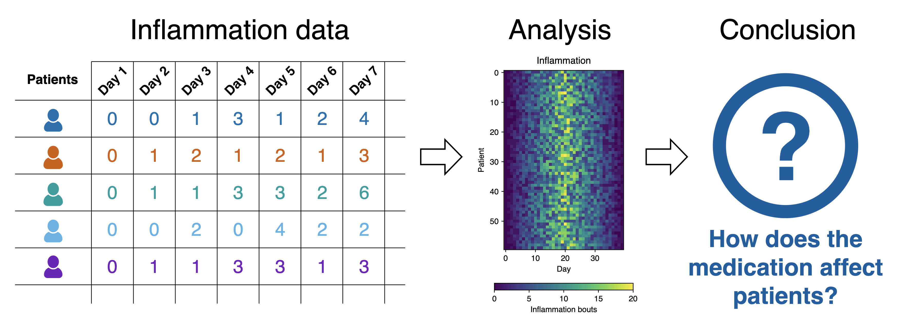
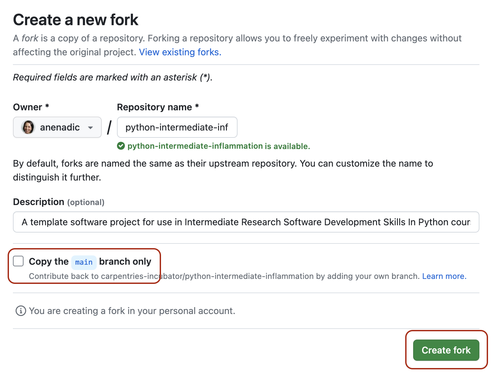
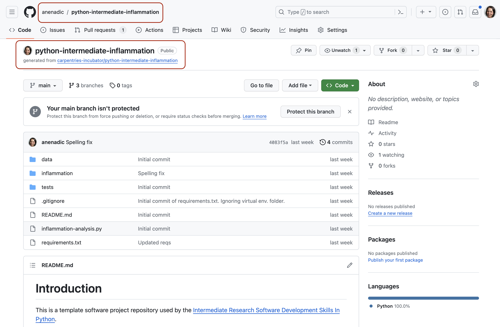
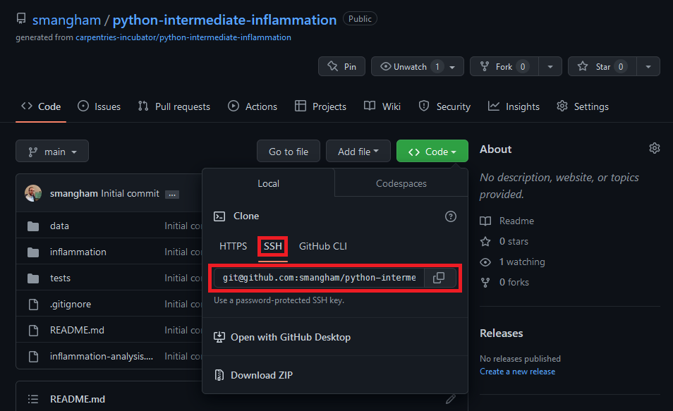

::::::::::::::::::::::::::::::::::::::: objectives

- Use Git to obtain a working copy of our software project from GitHub.
- Inspect the structure and architecture of our software project.
- Understand Model-View-Controller (MVC) architecture in software design and its use in our project.

::::::::::::::::::::::::::::::::::::::::::::::::::

:::::::::::::::::::::::::::::::::::::::: questions

- What is the design architecture of our example software project?
- Why is splitting code into smaller functional units (modules) good when designing software?

::::::::::::::::::::::::::::::::::::::::::::::::::

## Patient Inflammation Study Project

You have joined a software development team that has been working on the
[patient inflammation study project](https://github.com/carpentries-incubator/python-intermediate-inflammation)
developed in Python and stored on GitHub.
The project analyses the data to study the effect of a new treatment for arthritis
by analysing the inflammation levels in patients who have been given this treatment.
It reuses the inflammation datasets from the
[Software Carpentry Python novice lesson](https://swcarpentry.github.io/python-novice-inflammation/index.html).

{alt='Snapshot of the inflammation dataset' .image-with-shadow width="800px" }

<p style="text-align: center;">Inflammation study pipeline from the <a href="https://swcarpentry.github.io/python-novice-inflammation/fig/lesson-overview.svg">Software Carpentry Python novice lesson</a></p>

:::::::::::::::::::::::::::::::::::::::::  callout

## What Does Patient Inflammation Data Contain?

Each dataset records inflammation measurements from a separate clinical trial of the drug,
and each dataset contains information for 60 patients,
who had their inflammation levels recorded (in some arbitrary units of inflammation measurement) for 40 days whilst participating in the trial.
A snapshot of one of the data files is shown in the diagram above.

Each of the data files uses the popular
[comma-separated (CSV) format](https://en.wikipedia.org/wiki/Comma-separated_values)
to represent the data, where:

- each row holds inflammation measurements for a single patient
- each column represents a successive day in the trial
- each cell represents an inflammation reading on a given day for a patient
  

::::::::::::::::::::::::::::::::::::::::::::::::::

The project is not finished and contains some errors.
You will be working on your own and in collaboration with others
to fix and build on top of the existing code during the course.

## Downloading Our Software Project

To start working on the project, you will first create a fork of the software project repository
from GitHub within your own GitHub account
and then obtain a local copy of that project (from your GitHub) on your machine.

1. Make sure you have a GitHub account
  and that you have [set up SSH key pair for authentication with GitHub](../learners/setup.md#secure-access-to-github-using-git-from-command-line).
  
  ***Note:** while it is possible to use HTTPS with a personal access token for authentication
  with GitHub, the recommended and supported authentication method to use for this course
  is SSH with key pairs.*

2. Log into your GitHub account.

3. Go to the [software project repository](https://github.com/carpentries-incubator/python-intermediate-inflammation)
  in GitHub.
  
  {alt='Software project fork repository in GitHub' .image-with-shadow width="900px" }

4. Click the `Fork` button
  towards the top right of the repository's GitHub page to **create a fork** of the repository
  under your GitHub account.
  Remember, you will need to be signed into GitHub for the `Fork` button to work.
  
  ***Note:** each participant is creating their own fork of the project to work on.*
  
  ***Note 2:** we are creating a fork of the software project repository (instead of copying it
  from its template) because we want to preserve the history of all commits (with template copying
  you only get a snapshot of a repository at a given point in time).*

5. Make sure to select your personal account
  and set the name of the project to `python-intermediate-inflammation`
  (you can call it anything you like,
  but it may be easier for future group exercises if everyone uses the same name).
  Ensure that you **uncheck** the `Copy the main branch only` option.
  This guarantees you get all the branches from this repository needed for later exercises.
  
  {alt='Making a fork of the software project repository in GitHub' .image-with-shadow width="600px" }

6. Click the `Create fork` button
  and wait for GitHub to create the forked copy of the repository under your account.

7. Locate the forked repository under your own GitHub account.
  GitHub should redirect you there automatically after creating the fork.
  If this does not happen, click your user icon in the top right corner and select
  `Your Repositories` from the drop-down menu, then locate your newly created fork.
  
  {alt='View of your own fork of the software repository in GitHub' .image-with-shadow width="900px" }

:::::::::::::::::::::::::::::::::::::::  challenge

## Exercise: Obtain the Software Project Locally

Using the command line, clone the copied repository
from your GitHub account into the home directory on your computer using SSH.
Which command(s) would you use to get a detailed list of contents of the directory you have just cloned?

:::::::::::::::  solution

## Solution

1. Find the SSH URL of the software project repository to clone from your GitHub account.
  Make sure you do not clone the original repository but rather your own fork,
  as you should be able to push commits to it later on.
  Also make sure you select the **SSH** tab and not the **HTTPS** one.
  For this course, SSH is the preferred way of authenticating when sending your changes back to GitHub.
  If you have only authenticated through HTTPS in the past,
  please follow the guidance [at the top of this section](#downloading-our-software-project)
  to add an SSH key to your GitHub account.

{alt='URL to clone the repository in GitHub' .image-with-shadow width="800px" }

2. Make sure you are located in your home directory in the command line with:
  
  ```bash
  $ cd ~
  ```

3. From your home directory in the command line, do:
  
  ```bash
  $ git clone git@github.com:<YOUR_GITHUB_USERNAME>/python-intermediate-inflammation.git
  ```
  
  Make sure you are cloning your fork of the software project and not the original repository.

4. Navigate into the cloned repository folder in your command line with:
  
  ```bash
  $ cd python-intermediate-inflammation
  ```
  
  Note: If you have accidentally copied the **HTTPS** URL of your repository instead of the SSH one,
  you can easily fix that from your project folder in the command line with:
  
  ```bash
  $ git remote set-url origin git@github.com:<YOUR_GITHUB_USERNAME>/python-intermediate-inflammation.git
  ```

:::::::::::::::::::::::::

::::::::::::::::::::::::::::::::::::::::::::::::::

## Our Software Project's Structure

Let's inspect the content of the software project from the command line.
From the root directory of the project,
you can use the command `ls -l` to get a more detailed list of the contents.
You should see something similar to the following.

```bash
$ cd ~/python-intermediate-inflammation
$ ls -l
total 24
-rw-r--r--   1 carpentry  users  1055 20 Apr 15:41 README.md
drwxr-xr-x  18 carpentry  users   576 20 Apr 15:41 data
drwxr-xr-x   5 carpentry  users   160 20 Apr 15:41 inflammation
-rw-r--r--   1 carpentry  users  1122 20 Apr 15:41 inflammation-analysis.py
drwxr-xr-x   4 carpentry  users   128 20 Apr 15:41 tests
```

As can be seen from the above, our software project contains the `README` file
(that typically describes the project, its usage, installation, authors and how to contribute),
Python script `inflammation-analysis.py`,
and three directories -
`inflammation`, `data` and `tests`.

The Python script `inflammation-analysis.py` provides
the main entry point in the application,
and on closer inspection,
we can see that the `inflammation` directory contains two more Python scripts -
`views.py` and `models.py`.
We will have a more detailed look into these shortly.

```bash
$ ls -l inflammation
total 24
-rw-r--r--  1 alex  staff   71 29 Jun 09:59 __init__.py
-rw-r--r--  1 alex  staff  838 29 Jun 09:59 models.py
-rw-r--r--  1 alex  staff  649 25 Jun 13:13 views.py
```

Directory `data` contains several files with patients' daily inflammation information
(along with some other files):

```bash
$ ls -l data
total 264
-rw-r--r--  1 alex  staff   5365 25 Jun 13:13 inflammation-01.csv
-rw-r--r--  1 alex  staff   5314 25 Jun 13:13 inflammation-02.csv
-rw-r--r--  1 alex  staff   5127 25 Jun 13:13 inflammation-03.csv
-rw-r--r--  1 alex  staff   5367 25 Jun 13:13 inflammation-04.csv
-rw-r--r--  1 alex  staff   5345 25 Jun 13:13 inflammation-05.csv
-rw-r--r--  1 alex  staff   5330 25 Jun 13:13 inflammation-06.csv
-rw-r--r--  1 alex  staff   5342 25 Jun 13:13 inflammation-07.csv
-rw-r--r--  1 alex  staff   5127 25 Jun 13:13 inflammation-08.csv
-rw-r--r--  1 alex  staff   5327 25 Jun 13:13 inflammation-09.csv
-rw-r--r--  1 alex  staff   5342 25 Jun 13:13 inflammation-10.csv
-rw-r--r--  1 alex  staff   5127 25 Jun 13:13 inflammation-11.csv
-rw-r--r--  1 alex  staff   5340 25 Jun 13:13 inflammation-12.csv
-rw-r--r--  1 alex  staff  22554 25 Jun 13:13 python-novice-inflammation-data.zip
-rw-r--r--  1 alex  staff     12 25 Jun 13:13 small-01.csv
-rw-r--r--  1 alex  staff     15 25 Jun 13:13 small-02.csv
-rw-r--r--  1 alex  staff     12 25 Jun 13:13 small-03.csv
```

As [previously mentioned](#what-does-patient-inflammation-data-contain),
each of the inflammation data files contains separate trial data for 60 patients over 40 days.

:::::::::::::::::::::::::::::::::::::::  challenge

## Exercise: Have a Peek at the Data

Which command(s) would you use to list the contents or a first few
lines of `data/inflammation-01.csv` file?

:::::::::::::::  solution

## Solution

1. To list the entire content of a file from the project root do: `cat data/inflammation-01.csv`.
2. To list the first 5 lines of a file from the project root do:

```bash
head -n 5 data/inflammation-01.csv
```

```output
0,0,1,3,1,2,4,7,8,3,3,3,10,5,7,4,7,7,12,18,6,13,11,11,7,7,4,6,8,8,4,4,5,7,3,4,2,3,0,0
0,1,2,1,2,1,3,2,2,6,10,11,5,9,4,4,7,16,8,6,18,4,12,5,12,7,11,5,11,3,3,5,4,4,5,5,1,1,0,1
0,1,1,3,3,2,6,2,5,9,5,7,4,5,4,15,5,11,9,10,19,14,12,17,7,12,11,7,4,2,10,5,4,2,2,3,2,2,1,1
0,0,2,0,4,2,2,1,6,7,10,7,9,13,8,8,15,10,10,7,17,4,4,7,6,15,6,4,9,11,3,5,6,3,3,4,2,3,2,1
0,1,1,3,3,1,3,5,2,4,4,7,6,5,3,10,8,10,6,17,9,14,9,7,13,9,12,6,7,7,9,6,3,2,2,4,2,0,1,1
```

:::::::::::::::::::::::::

::::::::::::::::::::::::::::::::::::::::::::::::::

Directory `tests` contains several tests that have been implemented already.
We will be adding more tests during the course as our code grows.

```bash
$ ls -l tests
total 16
-rw-r--r--  1 alex  staff  941 18 Dec 11:42 test_models.py
-rw-r--r--  1 alex  staff  182 18 Dec 11:42 test_patient.py
```

An important thing to note here is that the structure of our project is not arbitrary.
One of the big differences between novice and intermediate software development is
planning the structure of your code.
This structure includes software components and behavioural interactions between them,
including how these components are laid out in a directory and file structure.
A novice will often make up the structure of their code as they go along.
However, for more advanced software development,
we need to plan and design this structure - called a *software architecture* - beforehand.

Let us have a quick look into what a software architecture is
and which architecture is used by our software project
before we start adding more code to it.

### Software Architecture

A software architecture is the fundamental structure of a software system
that is decided at the beginning of project development
based on its requirements and cannot be changed that easily once implemented.
It refers to a "bigger picture" of a software system
that describes high-level components (modules) of the system
and how they interact.

In software design and development,
large systems or programs are often decomposed into a set of smaller modules
each with a subset of functionality.
Typical examples of modules in programming are software libraries;
some software libraries, such as `numpy` and `matplotlib` in Python,
are bigger modules that contain several smaller sub-modules.
Another example of modules are classes in object-oriented programming languages.

:::::::::::::::::::::::::::::::::::::::::  callout

## Programming Modules and Interfaces

Although modules are self-contained and independent elements to a large extent
(they can depend on other modules),
there are well-defined ways of how they interact with one another.
These rules of interaction are called **programming interfaces** -
they define how other modules (clients) can use a particular module.
Typically, an interface to a module includes
rules on how a module can take input from
and how it gives output back to its clients.
A client can be a human, in which case we also call these user interfaces.
Even smaller functional units such as functions/methods have clearly defined interfaces -
a function/method's definition
(also known as a *signature*)
states what parameters it can take as input and what it returns as an output.

::::::::::::::::::::::::::::::::::::::::::::::::::

We are going to talk about software architecture and design a
bit more in [Section 3](30-section3-intro.md) - for now
it is sufficient to know that the way our software project's code is structured is intentional.

### Our Project's Architecture

Our software project uses the [Model-View-Controller (MVC) architecture](https://en.wikipedia.org/wiki/Model%E2%80%93view%E2%80%93controller).
MVC architecture divides the software logic into three interconnected modules:

- **Model** (data) - represents the data used by a program and contains operations/rules
  for manipulating and changing the data in the model (a database, a file, a single data object
  or a series of objects - for example a table representing patients' data).
- **View** (client interface) - provides means of displaying data to users/clients within an
  application (i.e. provides visualisation of the state of the model).
  For example, displaying a window with input fields and buttons (Graphical User Interface, GUI)
  or textual options within a command line (Command Line Interface, CLI) are examples of Views.
- **Controller** (processes that handle input/output and manipulate the data) -
  accepts input from the **View** and performs the corresponding action on the **Model**
  (changing the state of the model) and then updates the **View** accordingly.

In our project, `inflammation-analysis.py` is the **Controller** module
that performs basic statistical analysis over patient data
and provides the main entry point into the application.
The **View** and **Model** modules are contained in the files `views.py` and `models.py`, respectively,
and are conveniently named.
Data underlying the **Model** is contained within the directory `data` -
as we have seen already it contains several files with patients' daily inflammation information.

We will revisit the software architecture and MVC topics once again in later episodes
when we talk in more detail about [software architecture and design](32-software-architecture-design.md).
We now proceed to set up our virtual development environment
and start working with the code using a more convenient graphical tool -
[IDE PyCharm](https://www.jetbrains.com/pycharm/).


:::::::::::::::::::::::::::::::::::::::: keypoints

- Programming interfaces define how individual modules within a software application interact among themselves or how the application itself interacts with its users.
- MVC is a software design architecture which divides the application into three interconnected modules: Model (data), View (user interface), and Controller (input/output and data manipulation).
- The software project we use throughout this course is an example of an MVC application that manipulates patients’ inflammation data and performs basic statistical analysis using Python.

::::::::::::::::::::::::::::::::::::::::::::::::::


