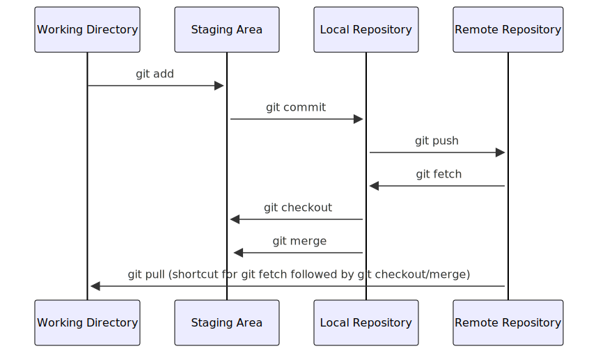
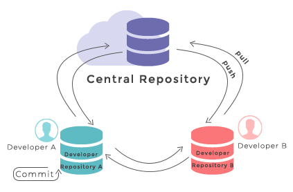
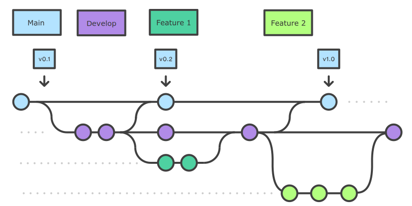
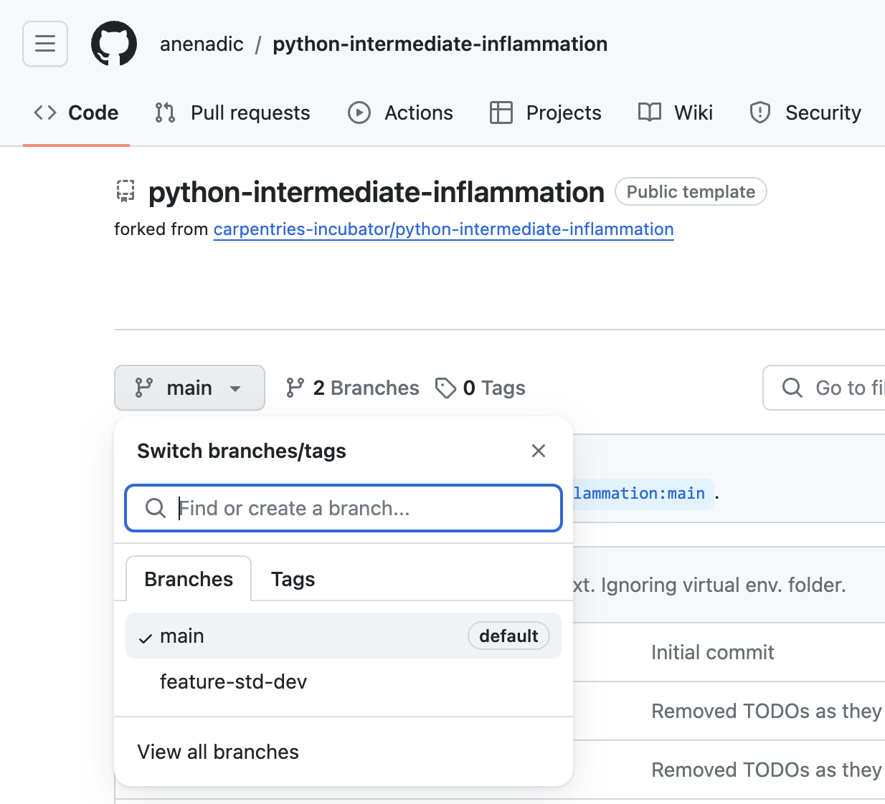
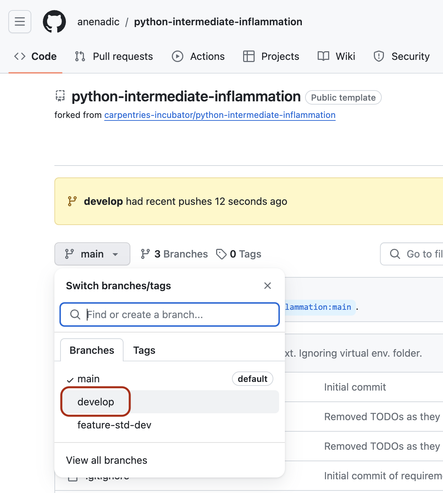

::::::::::::::::::::::::::::::::::::::: objectives

- Commit changes in a software project to a local repository and publish them in a remote repository on GitHub
- Create branches for managing different threads of code development
- Learn to use feature branch workflow to effectively collaborate with a team on a software project

::::::::::::::::::::::::::::::::::::::::::::::::::

:::::::::::::::::::::::::::::::::::::::: questions

- What are Git branches and why are they useful for code development?
- What are some best practices when developing software collaboratively using Git?

::::::::::::::::::::::::::::::::::::::::::::::::::

## Introduction

So far we have checked out our software project from GitHub
and used command line tools to configure a virtual environment for our project and run our code.
We have also familiarised ourselves with PyCharm -
a graphical tool we will use for code development, testing and debugging.
We are now going to start using another set of tools
from the collaborative code development toolbox -
namely, the version control system Git and code sharing platform GitHub.
These two will enable us to track changes to our code and share it with others.

You may recall that we have already made some changes to our project locally -
we created a virtual environment in the directory called "venv"
and exported it to the `requirements.txt` file.
We should now decide which of those changes we want to check in and share with others in our team.
This is a typical software development workflow -
you work locally on code,
test it to make sure it works correctly and as expected,
then record your changes using version control
and share your work with others via a shared and centrally backed-up repository.

Firstly, let us remind ourselves how to work with Git from the command line.

## Git Refresher

Git is a version control system for tracking changes in computer files
and coordinating work on those files among multiple people.
It is primarily used for source code management in software development
but it can be used to track changes in files in general -
it is particularly effective for tracking text-based files
(e.g. source code files, CSV, Markdown, HTML, CSS, Tex, etc. files).

Git has several important characteristics:

- support for non-linear development
  allowing you and your colleagues to work on different parts of a project concurrently,
- support for distributed development
  allowing for multiple people to be working on the same project
  (even the same file) at the same time,
- every change recorded by Git remains part of the project history
  and can be retrieved at a later date,
  so even if you make a mistake you can revert to a point before it.

The diagram below shows a typical software development lifecycle with Git
(in our case starting from making changes in a local branch that "tracks" a remote branch) and the commonly used commands to interact
with different parts of the Git infrastructure, including:

- **working directory** -
  a local directory (including any subdirectories) where your project files live
  and where you are currently working.
  It is also known as the "untracked" area of Git.
  Any changes to files will be marked by Git in the working directory.
  If you make changes to the working directory and do not explicitly tell Git to save them -
  you will likely lose those changes.
  Using `git add filename` command,
  you tell Git to start tracking changes to file `filename` within your working directory.
- **staging area (index)** -
  once you tell Git to start tracking changes to files
  (with `git add filename` command),
  Git saves those changes in the staging area on your local machine.
  Each subsequent change to the same file needs to be followed by another `git add filename` command
  to tell Git to update it in the staging area.
  To see what is in your working directory and staging area at any moment
  (i.e. what changes is Git tracking),
  run the command `git status`.
- **local repository** -
  stored within the `.git` directory of your project locally,
  this is where Git wraps together all your changes from the staging area
  and puts them using the `git commit` command.
  Each commit is a new, permanent snapshot (checkpoint, record) of your project in time,
  which you can share or revert to.
- **remote repository** -
  this is a version of your project that is hosted somewhere on the Internet
  (e.g., on GitHub, GitLab or somewhere else).
  While your project is nicely version-controlled in your local repository,
  and you have snapshots of its versions from the past,
  if your machine crashes - you still may lose all your work. Furthermore, you cannot
  share or collaborate on this local work with others easily.
  Working with a remote repository involves pushing your local changes remotely
  (using `git push`) and pulling other people's changes from a remote repository to
  your local copy (using `git fetch` or `git pull`) to keep the two in sync
  in order to collaborate (with a bonus that your work also gets backed up to another machine).
  Note that a common best practice when collaborating with others on a shared repository
  is to always do a `git pull` before a `git push`, to ensure you have any latest changes before you push your own.

<!--
Created with https://mermaid.live/edit#pako:eNqVkjFrwzAQhf-KuKmlKd01BAoZ2yUZumi5SmdbRPI58oliQv57JbuloSaFajqd3sd7x-kMlh2BhpFOmXpLO49twmh6Vc4bp6PvW7Xziaxwmh6324eDYFubz4lQq9aLQucW_fVTlb6wxaD2NPDoK77ILcfoZSF-Kyq1p8hCK2zIY7dAK8Ftr4bEdretVgPqOWBH9shZ_stFSi39EXFNfQ0WgrobO05ic4nM6Sd6uYXAH-TU-6Susz3NZvewgVJE9K7s8Fy9DUhHkQzoUjpqMAcxYPpLkWIWPky9BS0p0wby4FC-Vw66wTCWLrma-HX5F_P3uHwCS-vA3Q
sequenceDiagram
    Working Directory->>+Staging Area: git add
    Staging Area->>+Local Repository Branch: git commit
    Local Repository Branch->>+Remote Repository Branch: git push
    Remote Repository Branch->>+Local Repository Branch: git fetch
    Local Repository Branch->>+Working Directory:git merge
    Remote Repository Branch->>+Working Directory: git pull (shortcut for git fetch followed by git merge for a 'tracking branch')
-->

<!--
SVG of the diagram can be downloaded from:
https://mermaid.ink/svg/pako:eNqFksFuwyAMhl8FcemmdS_AodKm7rZe2sOkKRcXnAQNcEaMpqjquw-SZZtUReEE9vfbP5iL1GRQKtnjZ8KgcW-hieCrIPJ6o_hhQyP2NqJmisPjbvdwYmhK8CkiKNFYFmDMxP9PFfSVNDhxxI56W-TiOULQ7aTS5L3lSbgAlhpH9MS4VKRLfTuVWOJWfdTIul21cfMUqmg9xgbX-9-Kf8w7J-76liLrlI1Q_DOUT87RFxpxHsRvq5EBseEIeqx4Hnts7uVWZsCDNXmWl-Koktyix0qqvDVYQ3JcySpcMwqJ6TQELRXHhFuZOgM8j16qGlyfo2jKPQ7T_xi_yUy-jJlZ3UF4J5p112_HVM9r
-->

{alt='Development lifecycle with Git, containing Git commands add, commit, push, fetch, restore, merge and pull' .image-with-shadow width="600px"}

## Checking-in Changes to Our Project

Let us check-in the changes we have done to our project so far.
The first thing to do upon navigating into our software project's directory root
is to check the current status of our local working directory and repository.

```bash
$ git status
```

```output
On branch main
Your branch is up to date with 'origin/main'.

Untracked files:
  (use "git add <file>..." to include in what will be committed)
	requirements.txt
	venv/

nothing added to commit but untracked files present (use "git add" to track)
```

As expected,
Git is telling us that we have some untracked files -
`requirements.txt` and directory "venv" -
present in our working directory which we have not
staged nor committed to our local repository yet.
You do not want to commit the newly created directory "venv" and share it with others
because this directory is specific to your machine and setup only
(i.e. it contains local paths to libraries on your system
that most likely would not work on any other machine).
You do, however, want to share `requirements.txt` with your team
as this file can be used to replicate the virtual environment on your collaborators' systems.

To tell Git to intentionally ignore and not track certain files and directories,
you need to specify them in the `.gitignore` text file in the project root.
Our project already has `.gitignore`,
but in cases where you do not have it -
you can simply create it yourself.
In our case, we want to tell Git to ignore the "venv" directory
(and ".venv" as another naming convention for directories containing virtual environments)
and stop notifying us about it.
Edit your `.gitignore` file in PyCharm
and add a line containing "venv/" and another one containing ".venv/".
It does not matter much in this case where within the file you add these lines,
so let us do it at the end.
Your `.gitignore` should look something like this:

```output
# IDEs
.vscode/
.idea/

# Intermediate Coverage file
.coverage

# Output files
*.png

# Python runtime
*.pyc
*.egg-info
.pytest_cache

# Virtual environments
venv/
.venv/
```

You may notice that we are already not tracking certain files and directories
with useful comments about what exactly we are ignoring.
You may also notice that each line in `.gitignore` is actually a pattern,
so you can ignore multiple files that match a pattern
(e.g. "\*.png" will ignore all PNG files in the current directory).

If you run the `git status` command now,
you will notice that Git has cleverly understood that
you want to ignore changes to the "venv" directory so it is not warning us about it any more.
However, it has now detected a change to `.gitignore` file that needs to be committed.

```bash
$ git status
```

```output
On branch main
Your branch is up to date with 'origin/main'.

Changes not staged for commit:
  (use "git add <file>..." to update what will be committed)
  (use "git restore <file>..." to discard changes in working directory)
	modified:   .gitignore

Untracked files:
  (use "git add <file>..." to include in what will be committed)
	requirements.txt

no changes added to commit (use "git add" and/or "git commit -a")
```

To commit the changes `.gitignore` and `requirements.txt` to the local repository,
we first have to add these files to staging area to prepare them for committing.
We can do that at the same time as:

```bash
$ git add .gitignore requirements.txt
```

Now we can commit them to the local repository with:

```bash
$ git commit -m "Initial commit of requirements.txt. Ignoring virtual env. folder."
```

Remember to use meaningful messages for your commits.

So far we have been working in isolation -
all the changes we have done are still only stored locally on our individual machines.
In order to share our work with others,
we should push our changes to the remote repository on GitHub.
Before we push our changes however, we should first do a `git pull`.
This is considered best practice, since any changes made to the repository -
notably by other people -
may impact the changes we are about to push.
This could occur, for example,
by two collaborators making different changes to the same lines in a file.
By pulling first, we are made aware of any changes made by others,
in particular if there are any conflicts between their changes and ours.

```bash
$ git pull
```

Now we have ensured our repository is synchronised with the remote one,
we can now push our changes:

```bash
$ git push origin main
```

In the above command,
`origin` is an alias for the remote repository you used when cloning the project locally
(it is called that by convention and set up automatically by Git
when you run `git clone remote_url` command to replicate a remote repository locally);
`main` is the name of our main (and currently only) development branch.

:::::::::::::::::::::::::::::::::::::::::  callout

## GitHub Authentication/Authorisation Error

If, at this point (i.e. the first time you try to write to a remote repository on GitHub),
you get a warning/error that HTTPS access is deprecated, or a personal access token is required,
then you have cloned the repository using HTTPS and not SSH.
You should revisit the [instructions
on setting up your GitHub for SSH and key pair authentication](../learners/setup.md#secure-access-to-github-using-git-from-command-line)
and can fix this from the command line by
changing the remote repository's HTTPS URL to its SSH equivalent:

```bash
$ git remote set-url origin git@github.com:<YOUR_GITHUB_USERNAME>/python-intermediate-inflammation.git
```

::::::::::::::::::::::::::::::::::::::::::::::::::

:::::::::::::::::::::::::::::::::::::::::  callout

## Git Remotes

Note that systems like Git allow us to synchronise work between
any two or more copies of the same repository -
the ones that are not located on your machine are "Git remotes" for you.
In practice, though,
it is easiest to agree with your collaborators to use one copy as a central hub
(such as GitHub or GitLab), where everyone pushes their changes to.
This also avoid risks associated with keeping the "central copy" on someone's laptop.
You can have more than one remote configured for your local repository,
each of which generally is either read-only or read/write for you.
Collaborating with others involves
managing these remote repositories and pushing and pulling information
to and from them when you need to share work.

{alt='git-distributed' .image-with-shadow width="400px"}

<p style="text-align: center;">Git - distributed version control system<br> From <a href="https://www.w3docs.com/learn-git/git-repository.html" target="_blank">W3Docs</a> (freely available)</p>

::::::::::::::::::::::::::::::::::::::::::::::::::

## Git Branches

When we do `git status`,
Git also tells us that we are currently on the `main` branch of the project.
A branch is one version of your project (the files in your repository)
that can contain its own set of commits.
We can create a new branch,
make changes to the code which we then commit to the branch,
and, once we are happy with those changes,
merge them back to the main branch.
To see what other branches are available, do:

```bash
$ git branch
```

```output
* main
```

At the moment, there is only one branch (`main`)
and hence only one version of the code available.
When you create a Git repository for the first time,
by default you only get one version (i.e. branch) - `main`.
Let us have a look at why having different branches might be useful.

### Feature Branch Software Development Workflow

While it is technically OK to commit your changes directly to `main` branch,
and you may often find yourself doing so for some minor changes,
the best practice is to use a new branch for each separate and self-contained unit/piece of work
you want to add to the project.
This unit of work is also often called a *feature*
and the branch where you develop it is called a *feature branch*.
Each feature branch should have its own meaningful name -
indicating its purpose (e.g. "issue23-fix").
If we keep making changes and pushing them directly to `main` branch on GitHub,
then anyone who downloads our software from there will get all of our work in progress -
whether or not it is ready to use!
So, working on a separate branch for each feature you are adding is good for several reasons:

- it enables the main branch to remain stable
  while you and the team explore and test the new code on a feature branch,
- it enables you to keep the untested and not-yet-functional feature branch code
  under version control and backed up,
- you and other team members may work on several features
  at the same time independently from one another, and
- if you decide that the feature is not working or is no longer needed -
  you can easily and safely discard that branch without affecting the rest of the code.

Branches are commonly used as part of a feature-branch workflow, shown in the diagram below.

{alt='Git feature branch workflow diagram' .image-with-shadow width="800px"}

<p style="text-align: center;">Git feature branches<br>
Adapted from <a href="https://sillevl.gitbooks.io/git/content/collaboration/workflows/gitflow/" target="_blank">Git Tutorial by sillevl</a> (Creative Commons Attribution 4.0 International License)</p>

In the software development workflow,
we typically have a main branch which is the version of the code that is
tested, stable and reliable.
Then, we normally have a development branch
(called `develop` or `dev` by convention)
that we use for work-in-progress code.
As we work on adding new features to the code,
we create new feature branches that first get merged into `develop`
after a thorough testing process.
After even more testing - `develop` branch will get merged into `main`.
The points when feature branches are merged to `develop`,
and `develop` to `main`
depend entirely on the practice/strategy established in the team.
For example, for smaller projects
(e.g. if you are working alone on a project or in a very small team),
feature branches sometimes get directly merged into `main` upon testing,
skipping the `develop` branch step.
In other projects,
the merge into `main` happens only at the point of making a new software release.
Whichever is the case for you, a good rule of thumb is -
nothing that is broken should be in `main`.

### Creating Branches

Let us create a `develop` branch to work on:

```bash
$ git branch develop
```

This command does not give any output,
but if we run `git branch` again,
without giving it a new branch name, we can see the list of branches we have -
including the new one we have just made.

```bash
$ git branch
```

```output
    develop
  * main
```

The `*` indicates the currently active branch.
So how do we switch to our new branch?
We use the `git switch` command with the name of the branch:

```bash
$ git switch develop
```

```output
Switched to branch 'develop'
```

:::::::::::::::::::::::::::::::::::::::::  callout

## Create and Switch to Branch Shortcut

A shortcut to create a new branch and immediately switch to it:

```bash
$ git switch -c develop
```

::::::::::::::::::::::::::::::::::::::::::::::::::

### Updating Branches

If we start updating and committing files now,
the commits will happen on the `develop` branch
and will not affect the version of the code in `main`.
We add and commit things to `develop` branch in the same way as we do to `main`.

Let us make a small modification to `inflammation/models.py` in PyCharm,
and, say, change the spelling of "2d" to "2D" in docstrings for functions
`daily_mean()`,
`daily_max()` and
`daily_min()` to see updating branches in action.

If we do:

```bash
$ git status
```

```output
   On branch develop
   Changes not staged for commit:
     (use "git add <file>..." to update what will be committed)
     (use "git restore <file>..." to discard changes in working directory)

   	modified:   inflammation/models.py

   no changes added to commit (use "git add" and/or "git commit -a")
```

Git is telling us that we are on branch `develop`
and which tracked files have been modified in our working directory.

We can now `add` and `commit` the changes in the usual way.

```bash
$ git add inflammation/models.py
$ git commit -m "Spelling fix"
```

:::::::::::::::::::::::::::::::::::::::::  callout

## Currently Active Branch

Remember, `add` and `commit` commands always act on the currently active branch.
You have to be careful and aware of which branch you are working with at any given moment.
`git status` can help with that, and you will find yourself invoking it very often.


::::::::::::::::::::::::::::::::::::::::::::::::::

### Pushing New Branch Remotely

We push the contents of the `develop` branch to GitHub
in the same way as we pushed the `main` branch.
However, as we have just created this branch locally,
it still does not exist in our remote repository.
You can check that in GitHub by listing all branches.

{alt="Software project's main branch" .image-with-shadow width="600px"}

To push a new local branch remotely for the first time,
you could use the `-u` flag and the name of the branch you are creating and pushing to:

```bash
$ git push -u origin develop
```

:::::::::::::::::::::::::::::::::::::::::  callout

## Git Push With `-u` Flag

Using the `-u` switch with the `git push` command is a handy shortcut for:
(1) creating the new remote branch and
(2) setting your local branch to automatically track the remote one at the same time.
You need to use the `-u` switch only once to set up that association between
your branch and the remote one explicitly.
After that you could simply use `git push`
without specifying the remote repository, if you wished so.
We still prefer to explicitly state this information in commands.


::::::::::::::::::::::::::::::::::::::::::::::::::

Let us confirm that the new branch `develop` now exist remotely on GitHub too.
From the `Code` tab in your repository in GitHub,
click the branch dropdown menu (currently showing the default branch `main`).
You should see your `develop` branch in the list too.

{alt="Software project's develop branch" .image-with-shadow width="600px"}

You may also have noticed GitHub's notification about the latest push to your `develop` branch just
on top of the repository files and branches drop-down menu.

Now the others can check out the `develop` branch too and continue to develop code on it.

After the initial push of the new branch,
each next time we push to it in the usual manner (i.e. without the `-u` switch):

```bash
$ git push origin develop
```

:::::::::::::::::::::::::::::::::::::::::  callout

## What is the Relationship Between Originating and New Branches?

it is natural to think that new branches have a parent/child relationship
with their originating branch,
but in actual Git terms, branches themselves do not have parents
but single commits do.
Any commit can have zero parents (a root, or initial, commit),
one parent (a regular commit),
or multiple parents (a merge commit),
and using this structure, we can build
a 'view' of branches from a set of commits and their relationships.
A common way to look at it is that Git branches are really only
[lightweight, movable pointers to commits](https://git-scm.com/book/en/v2/Git-Branching-Branches-in-a-Nutshell).
So as a new commit is added to a branch,
the branch pointer is moved to the new commit.

What this means is that when you accomplish a merge between two branches,
Git is able to determine the common 'commit ancestor'
through the commits in a 'branch',
and use that common ancestor to
determine which commits need to be merged onto the destination branch.
It also means that, in theory, you could merge any branch with any other at any time...
although it may not make sense to do so!


::::::::::::::::::::::::::::::::::::::::::::::::::

### Merging Into Main Branch

Once you have tested your changes on the `develop` branch,
you will want to merge them onto the `main` branch.
To do so, make sure you have committed all your changes on the `develop` branch and then switch to `main`:

```bash
$ git switch main
```

```output
Switched to branch 'main'
Your branch is up to date with 'origin/main'.
```

To merge the `develop` branch on top of `main` do:

```bash
$ git merge develop
```

```output
Updating 05e1ffb..be60389
Fast-forward
 inflammation/models.py | 6 +++---
 1 files changed, 3 insertions(+), 3 deletions(-)
```

If there are no conflicts,
Git will merge the branches without complaining
and replay all commits from `develop` on top of the last commit from `main`.
If there are merge conflicts
(e.g. a team collaborator modified the same portion of the same file you are working on
and checked in their changes before you),
the particular files with conflicts will be marked
and you will need to resolve those conflicts
and commit the changes before attempting to merge again.
Since we have no conflicts, we can now push the `main` branch to the remote repository:

```bash
$ git push origin main
```

:::::::::::::::::::::::::::::::::::::::::  callout

## All Branches Are Equal

In Git, all branches are equal - there is nothing special about the `main` branch.
It is called that by convention and is created by default,
but it can also be called something else.
A good example is `gh-pages` branch
which is often the source branch for website projects hosted on GitHub
(rather than `main`).


::::::::::::::::::::::::::::::::::::::::::::::::::

:::::::::::::::::::::::::::::::::::::  testimonial

## Keeping Main Branch Stable

::::::::::::::::::::::::::::::::::::::::::::::::::

Good software development practice is to keep the `main` branch stable
while you and the team develop and test new functionalities on feature branches
(which can be done in parallel and independently by different team members).
The next step is to merge feature branches onto the `develop` branch,
where more testing can occur to verify that the new features
work well with the rest of the code (and not just in isolation).
We talk more about different types of code testing in one of the following episodes.


:::::::::::::::::::::::::::::::::::::::: keypoints

- A branch is one version of your project that can contain its own set of commits.
- Feature branches enable us to develop / explore / test new code features without affecting the stable `main` code.

::::::::::::::::::::::::::::::::::::::::::::::::::


