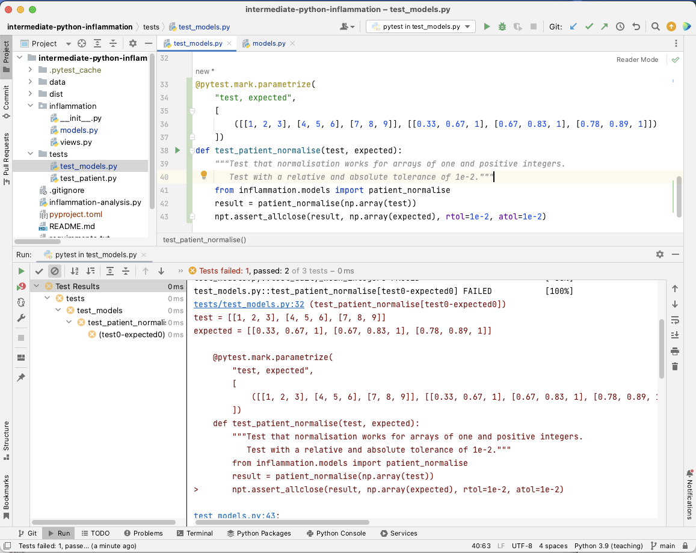

::::::::::::::::::::::::::::::::::::::: objectives

- Use a debugger to explore behaviour of a running program
- Describe and identify edge and corner test cases and explain why they are important
- Apply error handling and defensive programming techniques to improve robustness of a program
- Integrate linting tool style checking into a continuous integration job

::::::::::::::::::::::::::::::::::::::::::::::::::

:::::::::::::::::::::::::::::::::::::::: questions

- Once we know our program has errors, how can we locate them in the code?
- How can we make our programs more resilient to failure?

::::::::::::::::::::::::::::::::::::::::::::::::::

## Introduction

Unit testing can tell us something is wrong in our code
and give a rough idea of where the error is
by which test(s) are failing.
But it does not tell us exactly where the problem is (i.e. what line of code),
or how it came about.
To give us a better idea of what is going on, we can:

- output program state at various points,
  e.g. by using print statements to output the contents of variables,
- use a logging capability to output
  the state of everything as the program progresses, or
- look at intermediately generated files.

But such approaches are often time consuming
and sometimes not enough to fully pinpoint the issue.
In complex programs, like simulation codes,
we often need to get inside the code while it is running and explore.
This is where using a **debugger** can be useful.

## Setting the Scene

Let us add a new function called `patient_normalise()` to our inflammation example
to normalise a given inflammation data array so that all entries fall between 0 and 1.
(Make sure you create a new feature branch for this work off your `develop` branch.)
To normalise each patient's inflammation data
we need to divide it by the maximum inflammation experienced by that patient.
To do so, we can add the following code to `inflammation/models.py`:

```python
def patient_normalise(data):
    """Normalise patient data from a 2D inflammation data array."""
    max = np.max(data, axis=0)
    return data / max[:, np.newaxis]
```

***Note:** there are intentional mistakes in the above code,
which will be detected by further testing and code style checking below
so bear with us for the moment.*

In the code above, we first go row by row
and find the maximum inflammation value for each patient
and store these values in a 1-dimensional NumPy array `max`.
We then want to use NumPy's element-wise division,
to divide each value in every row of inflammation data
(belonging to the same patient)
by the maximum value for that patient stored in the 1D array `max`.
However, we cannot do that division automatically
as `data` is a 2D array (of shape `(60, 40)`)
and `max` is a 1D array (of shape `(60, )`),
which means that their shapes are not compatible.

{alt='NumPy arrays of incompatible shapes' .image-with-shadow width="800px"}

Hence, to make sure that we can perform this division and get the expected result,
we need to convert `max` to be a 2D array
by using the `newaxis` index operator to insert a new axis into `max`,
making it a 2D array of shape `(60, 1)`.

{alt="NumPy arrays' shapes after adding a new\_axis" .image-with-shadow width="800px"}

Now the division will give us the expected result.
Even though the shapes are not identical,
NumPy's automatic `broadcasting` (adjustment of shapes) will make sure that
the shape of the 2D `max` array is now "stretched" ("broadcast")
to match that of `data` - i.e. `(60, 40)`,
and element-wise division can be performed.

{alt="NumPy arrays' shapes after broadcasting" .image-with-shadow width="800px"}

:::::::::::::::::::::::::::::::::::::::::  callout

## Broadcasting

The term broadcasting describes how NumPy treats arrays with different shapes
during arithmetic operations.
Subject to certain constraints,
the smaller array is "broadcast" across the larger array
so that they have compatible shapes.
Be careful, though, to understand how the arrays get stretched
to avoid getting unexpected results.


::::::::::::::::::::::::::::::::::::::::::::::::::

Note there is an assumption in this calculation
that the minimum value we want is always zero.
This is a sensible assumption for this particular application,
since the zero value is a special case indicating that a patient
experienced no inflammation on a particular day.

Let us now add a new test in `tests/test_models.py`
to check that the normalisation function is correct for some test data.

```python
from inflammation.models import patient_normalise

@pytest.mark.parametrize(
    "test, expected",
    [
        ([[1, 2, 3], [4, 5, 6], [7, 8, 9]], [[0.33, 0.67, 1], [0.67, 0.83, 1], [0.78, 0.89, 1]])
    ])
def test_patient_normalise(test, expected):
    """Test normalisation works for arrays of one and positive integers.
       Test with a relative and absolute tolerance of 0.01."""

    result = patient_normalise(np.array(test))
    npt.assert_allclose(result, np.array(expected), rtol=1e-2, atol=1e-2)
```

Note that we are using the `assert_allclose()` Numpy testing function
instead of `assert_array_equal()`,
since it allows us to test against values that are **close** to each other.
This is very useful when we have numbers with arbitrary decimal places
and are only concerned with a certain degree of precision,
like the test case above.

:::::::::::::::::::::::::::::::::::::::::  callout

## Relative and absolute tolerance

**Relative tolerance** in unit testing means that the acceptable difference between the expected and actual results
depends on the size of the expected result itself. So, if your expected result is 100,
a relative tolerance of 0.1 (or 10%) means the actual result can be anywhere from 90 to 110 and still be considered correct.

**Absolute tolerance**, on the other hand,
sets a fixed allowable difference regardless of the magnitude of the expected result.
For example, if you set an absolute tolerance of 5,
it means the actual result can be within 5 units of the expected result,
regardless of whether the expected result is 10 or 1000.


::::::::::::::::::::::::::::::::::::::::::::::::::

Run the tests again using `python -m pytest tests/test_models.py`
and you will note that the new test is failing,
with an error message that does not give many clues as to what went wrong.

```output
E           AssertionError:
E           Not equal to tolerance rtol=0.01, atol=0.01
E
E           Mismatched elements: 6 / 9 (66.7%)
E           Max absolute difference: 0.57142857
E           Max relative difference: 0.57356077
E            x: array([[0.142857, 0.285714, 0.428571],
E                  [0.5     , 0.625   , 0.75    ],
E                  [0.777778, 0.888889, 1.      ]])
E            y: array([[0.33, 0.67, 1.  ],
E                  [0.67, 0.83, 1.  ],
E                  [0.78, 0.89, 1.  ]])

tests/test_models.py:53: AssertionError
```

Let us use a debugger at this point to see what is going on and why the function failed.

## Debugging in PyCharm

Think of debugging like performing exploratory surgery - on code!
Debuggers allow us to peer at the internal workings of a program,
such as variables and other state,
as it performs its functions.

### Running Tests Within PyCharm

Firstly, to make it easier to track what's going on,
we can set up PyCharm to run and debug our tests
instead of running them from the command line.
If you have not done so already,
you will first need to enable the Pytest framework in PyCharm.
You can do this by:

1. Select either `PyCharm` > `Preferences` (Mac) or `File` > `Settings` (Linux, Windows).
2. Then, in the preferences window that appears,
  select `Tools` -> `Python integrated tools` > from the left.
3. Under `Testing`, for `Default test runner` select `pytest`.
4. Select `OK`.

{alt='Setting up test framework in PyCharm' .image-with-shadow width="1000px"}

We can now run `pytest` over our tests in PyCharm,
similarly to how we ran our `inflammation-analysis.py` script before.
Right-click the `test_models.py` file
under the `tests` directory in the file navigation window on the left,
and select `Run 'pytest in test_model...'`.
You'll see the results of the tests appear in PyCharm in a bottom panel.
If you scroll down in that panel you should see
the failed `test_patient_normalise()` test result
looking something like the following:

{alt='Running pytest in PyCharm' .image-with-shadow width="1000px"}

We can also run our test functions individually.
First, let us check that our PyCharm running and testing configurations are correct.
Select `Run` > `Edit Configurations...` from the PyCharm menu,
and you should see something like the following:

{alt='Ensuring testing configurations in PyCharm are correct' .image-with-shadow width="800px"}

PyCharm allows us to configure multiple ways of running our code.
Looking at the figure above,
the first of these -
`inflammation-analysis` under `Python` -
was configured when we set up how to run our script from within PyCharm.
The second -
`pytest in test_models.py` under `Python tests` -
is our recent test configuration.
If you see just these, you are good to go.
We do not need any others,
so select any others you see and click the `-` button at the top to remove them.
This will avoid any confusion when running our tests separately.
Click `OK` when done.

:::::::::::::::::::::::::::::::::::::::::  callout

## Buffered Output

Whenever a Python program prints text to the terminal or to a file,
it first stores this text in an **output buffer**.
When the buffer becomes full or is **flushed**,
the contents of the buffer are written to
the terminal / file in one go and the buffer is cleared.
This is usually done to increase performance
by effectively converting multiple output operations into just one.
Printing text to the terminal is a relatively slow operation,
so in some cases this can make quite a big difference
to the total execution time of a program.

However, using buffered output can make debugging more difficult,
as we can no longer be quite sure when a log message will be displayed.
In order to make debugging simpler,
PyCharm automatically adds the environment variable `PYTHONUNBUFFERED`
we see in the screenshot above,
which disables output buffering.


::::::::::::::::::::::::::::::::::::::::::::::::::

Now, if you select the green arrow next to a test function
in our `test_models.py` script in PyCharm,
and select `Run 'pytest in test_model...'`,
we can run just that test:

{alt='Running a single test in PyCharm' .image-with-shadow width="800px"}

Click on the "run" button next to `test_patient_normalise`,
and you will be able to see that PyCharm runs just that test function,
and we see the same `AssertionError` that we saw before.

### Running the Debugger

Now we want to use the debugger to investigate
what is happening inside the `patient_normalise` function.
To do this we will add a *breakpoint* in the code.
A breakpoint will pause execution at that point allowing us to explore the state of the program.

To set a breakpoint, navigate to the `models.py` file
and move your mouse to the `return` statement of the `patient_normalise` function.
Click to just to the right of the line number for that line
and a small red dot will appear,
indicating that you have placed a breakpoint on that line.

{alt='Setting a breakpoint in PyCharm' .image-with-shadow width="600px"}

Now if you select the green arrow next to the `test_patient_normalise` function
and instead select `Debug 'pytest in test_model...'`,
you will notice that execution will be paused
at the `return` statement of `patient_normalise`.
In the debug panel that appears below,
we can now investigate the exact state of the program
prior to it executing this line of code.

In the debug panel below,
in the `Debugger` tab you will be able to see
two sections that looks something like the following:

{alt='Debugging in PyCharm' .image-with-shadow width="1000px"}

- The `Frames` section on the left,
  which shows the **call stack**
  (the chain of functions that have been executed to lead to this point).
  We can traverse this chain of functions if we wish,
  to observe the state of each function.
- The `Variables` section on the right,
  which displays the local and global variables currently in memory.
  You will be able to see the `data` array
  that is input to the `patient_normalise` function,
  as well as the `max` local array
  that was created to hold the maximum inflammation values for each patient.

We also have the ability run any Python code we wish at this point
to explore the state of the program even further!
This is useful if you want to view a particular combination of variables,
or perhaps a single element or slice of an array to see what went wrong.
Select the `Console` tab in the panel (next to the `Debugger` tab),
and you'll be presented with a Python prompt.
Try putting in the expression `max[:, np.newaxis]` into the console,
and you will be able to see the column vector that we are dividing `data` by
in the return line of the function.

{alt='Debugging in PyCharm' .image-with-shadow width="1000px"}

Now, looking at the `max` variable,
we can see that something looks wrong,
as the maximum values for each patient do not correspond to the `data` array.
Recall that the input `data` array we are using for the function is

```python
  [[1, 2, 3],
   [4, 5, 6],
   [7, 8, 9]]
```

So the maximum inflammation for each patient should be `[3, 6, 9]`,
whereas the debugger shows `[7, 8, 9]`.
You can see that the latter corresponds exactly to the last column of `data`,
and we can immediately conclude that
we took the maximum along the wrong axis of `data`.
Now we have our answer,
stop the debugging process by selecting
the red square at the top right of the main PyCharm window.

So to fix the `patient_normalise` function in `models.py`,
change `axis=0` in the first line of the function to `axis=1`.
With this fix in place,
running all the tests again should result in all tests passing.
Navigate back to `test_models.py` in PyCharm,
right click `test_models.py`
and select `Run 'pytest in test_model...'`.
You should be rewarded with:

{alt='All tests in PyCharm are successful' .image-with-shadow width="1000px"}

:::::::::::::::::::::::::::::::::::::::::  callout

## NumPy Axis

Getting the axes right in NumPy is not trivial -
the [following tutorial](https://www.sharpsightlabs.com/blog/numpy-axes-explained/#:~:text=NumPy%20axes%20are%20the%20directions,along%20the%20rows%20and%20columns)
offers a good explanation on how axes work when applying NumPy functions to arrays.


::::::::::::::::::::::::::::::::::::::::::::::::::

:::::::::::::::::::::::::::::::::::::::::  callout

## Debugging Outside of an IDE

It is worth being aware of the fact that you do not need to use an IDE to debug code,
although it does certainly make it easier!
The Python standard library comes with a command-line capable debugger built in, called [pdb](https://docs.python.org/3/library/pdb.html).
The easiest way to use it is to put one of these lines
anywhere in your code you would like the debugger to stop:
`import pdb; pdb.set_trace()` or `breakpoint()`.
Then you are able to run your Python program from the command line like you normally would,
but instead of completing or erroring out,
a different prompt for the debugger will come up in your terminal.
The debugger has its own commands that you can read about in
[the documentation for pdb](https://docs.python.org/3/library/pdb.html#debugger-commands).


::::::::::::::::::::::::::::::::::::::::::::::::::

## Corner or Edge Cases

The test case that we have currently written for `patient_normalise`
is parameterised with a fairly standard data array.
However, when writing your test cases,
it is important to consider parameterising them by unusual or extreme values,
in order to test all the edge or corner cases that your code could be exposed to in practice.
Generally speaking, it is at these extreme cases that you will find your code failing,
so it is beneficial to test them beforehand.

What is considered an "edge case" for a given component depends on
what that component is meant to do.
In the case of `patient_normalise` function, the goal is to normalise a numeric array of numbers.
For numerical values, extreme cases could be zeros,
very large or small values,
not-a-number (`NaN`) or infinity values.
Since we are specifically considering an *array* of values,
an edge case could be that all the numbers of the array are equal.

For all the given edge cases you might come up with,
you should also consider their likelihood of occurrence.
It is often too much effort to exhaustively test a given function against every possible input,
so you should prioritise edge cases that are likely to occur.
For our `patient_normalise` function, some common edge cases might be the occurrence of zeros,
and the case where all the values of the array are the same.

When you are considering edge cases to test for,
try also to think about what might break your code.
For `patient_normalise` we can see that there is a division by
the maximum inflammation value for each patient,
so this will clearly break if we are dividing by zero here,
resulting in `NaN` values in the normalised array.

With all this in mind,
let us add a few edge cases to our parametrisation of `test_patient_normalise`.
We will add two extra tests,
corresponding to an input array of all 0,
and an input array of all 1.

```python
@pytest.mark.parametrize(
    "test, expected",
    [
        ([[0, 0, 0], [0, 0, 0], [0, 0, 0]], [[0, 0, 0], [0, 0, 0], [0, 0, 0]]),
        ([[1, 1, 1], [1, 1, 1], [1, 1, 1]], [[1, 1, 1], [1, 1, 1], [1, 1, 1]]),
        ([[1, 2, 3], [4, 5, 6], [7, 8, 9]], [[0.33, 0.67, 1], [0.67, 0.83, 1], [0.78, 0.89, 1]]),
    ])
```

Running the tests now from the command line results in the following assertion error,
due to the division by zero as we predicted.

```output
E           AssertionError:
E           Not equal to tolerance rtol=0.01, atol=0.01
E
E           x and y nan location mismatch:
E            x: array([[nan, nan, nan],
E                  [nan, nan, nan],
E                  [nan, nan, nan]])
E            y: array([[0, 0, 0],
E                  [0, 0, 0],
E                  [0, 0, 0]])

tests/test_models.py:88: AssertionError
```

How can we fix this?
Luckily, there is a NumPy function that is useful here,
[`np.isnan()`](https://numpy.org/doc/stable/reference/generated/numpy.isnan.html),
which we can use to replace all the NaN's with our desired result,
which is 0.
We can also silence the run-time warning using
[`np.errstate`](https://numpy.org/doc/stable/reference/generated/numpy.errstate.html):

```python
...
def patient_normalise(data):
    """
    Normalise patient data from a 2D inflammation data array.

    NaN values are ignored, and normalised to 0.

    Negative values are rounded to 0.
    """
    max = np.nanmax(data, axis=1)
    with np.errstate(invalid='ignore', divide='ignore'):
        normalised = data / max[:, np.newaxis]
    normalised[np.isnan(normalised)] = 0
    normalised[normalised < 0] = 0
    return normalised
...
```

:::::::::::::::::::::::::::::::::::::::  challenge

## Exercise: Exploring Tests for Edge Cases

Think of some more suitable edge cases to test our `patient_normalise()` function
and add them to the parametrised tests.
After you have finished remember to commit your changes.

:::::::::::::::  solution

## Possible Solution

```python
from inflammation.models import patient_normalise

@pytest.mark.parametrize(
    "test, expected",
    [
        (
            [[0, 0, 0], [0, 0, 0], [0, 0, 0]],
            [[0, 0, 0], [0, 0, 0], [0, 0, 0]],
        ),
        (
            [[1, 1, 1], [1, 1, 1], [1, 1, 1]],
            [[1, 1, 1], [1, 1, 1], [1, 1, 1]],
        ),
        (
            [[float('nan'), 1, 1], [1, 1, 1], [1, 1, 1]],
            [[0, 1, 1], [1, 1, 1], [1, 1, 1]],
        ),
        (
            [[1, 2, 3], [4, 5, float('nan')], [7, 8, 9]],
            [[0.33, 0.67, 1], [0.8, 1, 0], [0.78, 0.89, 1]],
        ),
        (
            [[-1, 2, 3], [4, 5, 6], [7, 8, 9]],
            [[0, 0.67, 1], [0.67, 0.83, 1], [0.78, 0.89, 1]],
        ),
        (
            [[1, 2, 3], [4, 5, 6], [7, 8, 9]],
            [[0.33, 0.67, 1], [0.67, 0.83, 1], [0.78, 0.89, 1]],
        )
    ])
def test_patient_normalise(test, expected):
    """Test normalisation works for arrays of one and positive integers."""

    result = patient_normalise(np.array(test))
    npt.assert_allclose(result, np.array(expected), rtol=1e-2, atol=1e-2)
...
```

You could also, for example, test and handle the case of a whole row of NaNs.


:::::::::::::::::::::::::

::::::::::::::::::::::::::::::::::::::::::::::::::

## Defensive Programming

In the previous section, we made a few design choices for our `patient_normalise` function:

1. We are implicitly converting any `NaN` and negative values to 0,
2. Normalising a constant 0 array of inflammation results in an identical array of 0s,
3. We do not warn the user of any of these situations.

This could have be handled differently.
We might decide that we do not want to silently make these changes to the data,
but instead to explicitly check that the input data satisfies a given set of assumptions
(e.g. no negative values)
and raise an error if this is not the case.
Then we can proceed with the normalisation,
confident that our normalisation function will work correctly.

Checking that input to a function is valid via a set of preconditions
is one of the simplest forms of **defensive programming**
which is used as a way of avoiding potential errors.
Preconditions are checked at the beginning of the function
to make sure that all assumptions are satisfied.
These assumptions are often based on the *value* of the arguments, like we have already discussed.
However, in a dynamic language like Python
one of the more common preconditions is to check that the arguments of a function
are of the correct *type*.
Currently there is nothing stopping someone from calling `patient_normalise` with
a string, a dictionary, or another object that is not an `ndarray`.

As an example, let us change the behaviour of the `patient_normalise()` function
to raise an error on negative inflammation values.
Edit the `inflammation/models.py` file,
and add a precondition check to the beginning of the `patient_normalise()` function like so:

```python
...
    if np.any(data < 0):
        raise ValueError('Inflammation values should not be negative')
...
```

We can then modify our test function in `tests/test_models.py`
to check that the function raises the correct exception - a `ValueError` -
when input to the test contains negative values
(i.e. input case `[[-1, 2, 3], [4, 5, 6], [7, 8, 9]]`).
The [`ValueError`](https://docs.python.org/3/library/exceptions.html#ValueError) exception
is part of the standard Python library
and is used to indicate that the function received an argument of the right type,
but of an inappropriate value.

```python
from inflammation.models import patient_normalise

@pytest.mark.parametrize(
    "test, expected, expect_raises",
    [
        ... # previous test cases here, with None for expect_raises, except for the next one - add ValueError
        ... # as an expected exception (since it has a negative input value)
        (
            [[-1, 2, 3], [4, 5, 6], [7, 8, 9]],
            [[0, 0.67, 1], [0.67, 0.83, 1], [0.78, 0.89, 1]],
            ValueError,
        ),
        (
            [[1, 2, 3], [4, 5, 6], [7, 8, 9]],
            [[0.33, 0.67, 1], [0.67, 0.83, 1], [0.78, 0.89, 1]],
            None,
        ),
    ])
def test_patient_normalise(test, expected, expect_raises):
    """Test normalisation works for arrays of one and positive integers."""
        
    if expect_raises is not None:
        with pytest.raises(expect_raises):
            result = patient_normalise(np.array(test))
            npt.assert_allclose(result, np.array(expected), rtol=1e-2, atol=1e-2)
    else:
        result = patient_normalise(np.array(test))
        npt.assert_allclose(result, np.array(expected), rtol=1e-2, atol=1e-2)
```

Be sure to commit your changes so far and push them to GitHub.

:::::::::::::::::::::::::::::::::::::::  challenge

## Optional Exercise: Add a Precondition to Check the Correct Type and Shape of Data

Add preconditions to check that data is an `ndarray` object and that it is of the correct shape.
Add corresponding tests to check that the function raises the correct exception.
You will find the Python function
[`isinstance`](https://docs.python.org/3/library/functions.html#isinstance)
useful here, as well as the Python exception
[`TypeError`](https://docs.python.org/3/library/exceptions.html#TypeError).
Once you are done, commit your new files,
and push the new commits to your remote repository on GitHub.

:::::::::::::::  solution

## Solution

In `inflammation/models.py`:

```python
...
def patient_normalise(data):
    """
    Normalise patient data between 0 and 1 of a 2D inflammation data array.

    Any NaN values are ignored, and normalised to 0

    :param data: 2D array of inflammation data
    :type data: ndarray

    """
    if not isinstance(data, np.ndarray):
        raise TypeError('data input should be ndarray')
    if len(data.shape) != 2:
        raise ValueError('inflammation array should be 2-dimensional')
    if np.any(data < 0):
        raise ValueError('inflammation values should be non-negative')
    max = np.nanmax(data, axis=1)
    with np.errstate(invalid='ignore', divide='ignore'):
        normalised = data / max[:, np.newaxis]
    normalised[np.isnan(normalised)] = 0
    return normalised
...
```

In `test/test_models.py`:

```python
from inflammation.models import patient_normalise
...
@pytest.mark.parametrize(
    "test, expected, expect_raises",
    [
        ...
        (
            'hello',
            None,
            TypeError,
        ),
        (
            3,
            None,
            TypeError,
        ),
        (
            [[1, 2, 3], [4, 5, 6], [7, 8, 9]],
            [[0.33, 0.67, 1], [0.67, 0.83, 1], [0.78, 0.89, 1]],
            None,
        )
    ])
def test_patient_normalise(test, expected, expect_raises):
    """Test normalisation works for arrays of one and positive integers."""
    if isinstance(test, list):
        test = np.array(test)
    if expect_raises is not None:
        with pytest.raises(expect_raises):
          result = patient_normalise(test)
          npt.assert_allclose(result, np.array(expected), rtol=1e-2, atol=1e-2)

    else:
        result = patient_normalise(test)
        npt.assert_allclose(result, np.array(expected), rtol=1e-2, atol=1e-2)
...
```

Note the conversion from `list` to `np.array` has been moved
out of the call to `npt.assert_allclose()` within the test function,
and is now only applied to list items (rather than all items).
This allows for greater flexibility with our test inputs,
since this wouldn't work in the test case that uses a string.

:::::::::::::::::::::::::

::::::::::::::::::::::::::::::::::::::::::::::::::

If you do the challenge, again, be sure to commit your changes and push them to GitHub.

You should not take it too far by trying to code preconditions for every conceivable eventuality.
You should aim to strike a balance between
making sure you secure your function against incorrect use,
and writing an overly complicated and expensive function
that handles cases that are likely never going to occur.
For example, it would be sensible to validate the shape of your inflammation data array
when it is actually read from the csv file (in `load_csv`),
and therefore there is no reason to test this again in `patient_normalise`.
You can also decide against adding explicit preconditions in your code,
and instead state the assumptions and limitations of your code
for users of your code in the docstring
and rely on them to invoke your code correctly.
This approach is useful when explicitly checking the precondition is too costly.

## Improving Robustness with Automated Code Style Checks

Let us re-run Pylint over our project after having added some more code to it.
From the project root do:

```bash
$ pylint inflammation
```

You may see something like the following in Pylint's output:

```bash
************* Module inflammation.models
...
inflammation/models.py:60:4: W0622: Redefining built-in 'max' (redefined-builtin)
...
```

The above output indicates that by using the local variable called `max`
in the `patient_normalise` function,
we have redefined a built-in Python function called `max`.
This is not a good idea and may have some undesired effects
(e.g. if you redefine a built-in name in a global scope
you may cause yourself some trouble which may be difficult to trace).

:::::::::::::::::::::::::::::::::::::::  challenge

## Exercise: Fix Code Style Errors

Rename our local variable `max` to something else (e.g. call it `max_data`),
then rerun your tests and commit these latest changes and
push them to GitHub using our usual feature branch workflow.

::::::::::::::::::::::::::::::::::::::::::::::::::

It may be hard to remember to run linter tools every now and then.
Luckily, we can now add this Pylint execution to our continuous integration builds
as one of the extra tasks.
To add Pylint to our CI workflow,
we can add the following step to our `steps` in `.github/workflows/main.yml`:

```bash
...
    - name: Check style with Pylint
      run: |
        python3 -m pylint --fail-under=0 --reports=y inflammation
...
```

Note we need to add `--fail-under=0` otherwise
the builds will fail if we do not get a 'perfect' score of 10!
This seems unlikely, so let us be more pessimistic.
We have also added `--reports=y` which will give us a more detailed report of the code analysis.

Then we can just add this to our repo and trigger a build:

```bash
$ git add .github/workflows/main.yml
$ git commit -m "Add Pylint run to build"
$ git push origin test-suite
```

Then once complete, under the build(s) reports you should see
an entry with the output from Pylint as before,
but with an extended breakdown of the infractions by category
as well as other metrics for the code,
such as the number and line percentages of code, docstrings, comments, and empty lines.

So we specified a score of 0 as a minimum which is very low.
If we decide as a team on a suitable minimum score for our codebase,
we can specify this instead.
There are also ways to specify specific style rules that shouldn't be broken
which will cause Pylint to fail,
which could be even more useful if we want to mandate a consistent style.

We can specify overrides to Pylint's rules in a file called `.pylintrc`
which Pylint can helpfully generate for us.
In our repository root directory:

```bash
$ pylint --generate-rcfile > .pylintrc
```

Looking at this file, you'll see it is already pre-populated.
No behaviour is currently changed from the default by generating this file,
but we can amend it to suit our team's coding style.
For example, a typical rule to customise - favoured by many projects -
is the one involving line length.
You'll see it is set to 100, so let us set that to a more reasonable 120.
While we are at it, let us also set our `fail-under` in this file:

```bash
...
# Specify a score threshold to be exceeded before program exits with error.
fail-under=0
...
# Maximum number of characters on a single line.
max-line-length=120
...
```

do not forget to remove the `--fail-under` argument to Pytest
in our GitHub Actions configuration file too,
since we do not need it anymore.

Now when we run Pylint we will not be penalised for having a reasonable line length.
For some further hints and tips on how to approach using Pylint for a project,
see [this article](https://pythonspeed.com/articles/pylint/).

## Merging to `develop` Branch

Now we are happy with our test suite, we can merge this work
(which currently only exist on our `test-suite` branch)
with our parent `develop` branch.
Again, this reflects us working with impunity on a logical unit of work,
involving multiple commits,
on a separate feature branch until it is ready to be escalated to the `develop` branch.

Be sure to commit all your changes to `test-suite` and then merge to the
`develop` branch in the usual manner.

```bash
$ git switch develop
$ git merge test-suite
```

Then, assuming there are no conflicts,
we can push these changes back to the remote repository as we have done before:

```bash
$ git push origin develop
```

Now these changes have migrated to our parent `develop` branch,
`develop` will also inherit the configuration to run CI builds,
so these will run automatically on this branch as well.

This highlights a big benefit of CI when you perform merges (and apply pull requests).
As new branch code is merged into upstream branches like `develop` and `main`
these newly integrated code changes are automatically tested *together* with existing code -
which of course may also have been changed by other developers working on the code at the same time.


:::::::::::::::::::::::::::::::::::::::: keypoints

- Unit testing can show us what does not work, but does not help us locate problems in code.
- Use a **debugger** to help you locate problems in code.
- A **debugger** allows us to pause code execution and examine its state by adding **breakpoints** to lines in code.
- Use **preconditions** to ensure correct behaviour of code.
- Ensure that unit tests check for **edge** and **corner cases** too.
- Using linting tools to automatically flag suspicious programming language constructs and stylistic errors can help improve code robustness.

::::::::::::::::::::::::::::::::::::::::::::::::::


