::::::::::::::::::::::::::::::::::::::: objectives

- List the common aspects of software architecture and design.
- Describe the term technical debt and how it impacts software.
- Understand the goals and principles of designing 'good' software.
- Use a diagramming technique to describe a software architecture.
- What are the components of Model-View-Controller (MVC) architecture?
- Understand the use of common design patterns to improve the extensibility, reusability and overall quality of software.
- List some best practices when designing software.

::::::::::::::::::::::::::::::::::::::::::::::::::

:::::::::::::::::::::::::::::::::::::::: questions

- Why should we invest time in software design?
- What should we consider when designing software?
- What is software architecture?

::::::::::::::::::::::::::::::::::::::::::::::::::

## Introduction

Ideally, we should have at least a rough design of our software sketched out
before we write a single line of code.
This design should be based around the requirements and the structure of the problem we are trying
to solve: what are the concepts we need to represent in our code
and what are the relationships between them.
And importantly, who will be using our software and how will they interact with it.

As a piece of software grows,
it will reach a point where there is too much code for us to keep in mind at once.
At this point, it becomes particularly important to think of the overall design and
structure of our software, how should all the pieces of functionality fit together,
and how should we work towards fulfilling this overall design throughout development.
Even if you did not think about the design of your software from the very beginning -
it is not too late to start now.

It is not easy to come up with a complete definition for the term **software design**,
but some of the common aspects are:

- **Software architecture** -
  what components will the software have and how will they cooperate?
- **System architecture** -
  what other things will this software have to interact with and how will it do this?
- **UI/UX** (User Interface / User Experience) -
  how will users interact with the software?
- **Algorithm design** -
  what method are we going to use to solve the core research/business problem?

There is literature on each of the above software design aspects - we will not go into details of
them all here.
Instead, we will learn some techniques to structure our code better to satisfy some of the
requirements of 'good' software and revisit
our software's [MVC architecture](11-software-project.md)
in the context of software design.

## Poor Design Choices \& Technical Debt

When faced with a problem that you need to solve by writing code - it may be tempted to
skip the design phase and dive straight into coding.
What happens if you do not follow the good software design and development best practices?
It can lead to accumulated 'technical debt',
which (according to [Wikipedia](https://en.wikipedia.org/wiki/Technical_debt)),
is the "cost of additional rework caused by choosing an easy (limited) solution now
instead of using a better approach that would take longer".
The pressure to achieve project goals can sometimes lead to quick and easy solutions,
which make the software become
more messy, more complex, and more difficult to understand and maintain.
The extra effort required to make changes in the future is the interest paid on the (technical) debt.
It is natural for software to accrue some technical debt,
but it is important to pay off that debt during a maintenance phase -
simplifying, clarifying the code, making it easier to understand -
to keep these interest payments on making changes manageable.

There is only so much time available in a project.
How much effort should we spend on designing our code properly
and using good development practices?
The following [XKCD comic](https://xkcd.com/844/) summarises this tension:

{alt='Writing good code comic' .image-with-shadow width="400px" }

At an intermediate level there are a wealth of practices that *could* be used,
and applying suitable design and coding practices is what separates
an *intermediate developer* from someone who has just started coding.
The key for an intermediate developer is to balance these concerns
for each software project appropriately,
and employ design and development practices *enough* so that progress can be made.
It is very easy to under-design software,
but remember it is also possible to over-design software too.

## Good Software Design Goals

Aspirationally, what makes good code can be summarised in the following quote from the
[Intent HG blog](https://intenthq.com/blog/it-audience/what-is-good-code-a-scientific-definition/):

> *"Good code is written so that is readable, understandable,
> covered by automated tests, not over complicated
> and does well what is intended to do."*

Software has become a crucial aspect of reproducible research, as well as an asset that
can be reused or repurposed.
Thus, it is even more important to take time to design the software to be easily *modifiable* and
*extensible*, to save ourselves and our team a lot of time later on when we have
to fix a problem or the software's requirements change.

Satisfying the above properties will lead to an overall software design
goal of having *maintainable* code, which is:

- **Understandable** by developers who did not develop the code,
  by having a clear and well-considered high-level design (or *architecture*) that separates out the different components and aspects of its function logically
  and in a modular way, and having the interactions between these different parts clear, simple, and sufficiently high-level that they do not contravene this design. This is known as *separation of concerns*, and is a key principle in good software design.
  - Moving this forward into implementation, *understandable* would mean being consistent in coding style, using sensible naming conventions for functions, classes and variables, documenting and commenting code, having a simple control flow, and having small functions and methods focused on single tasks.
- **Adaptable** by designing the code to be easily modifiable and extensible to satisfy new requirements,
  by incorporating points in the modular design where new behaviour can be added in a clear and straightforward manner
  (e.g. as individual functions in existing modules, or perhaps at a higher-level as plugins).
  - In an implementation sense, this means writing low-coupled/decoupled code where each part of the code has a separate concern, and has the lowest possible dependency on other parts of the code.
    This makes it easier to test, update or replace.
- **Testable** by designing the code in a sufficiently modular way to make it easier to test the functionality within a modular design,
  either as a whole or in terms of its individual functions.
  - This would carry forward in an implementation sense in two ways. Firstly, having functions sufficiently small to be amenable to individual (ideally automated) test cases, e.g. by writing unit, regression tests to verify the code produces
    the expected outputs from controlled inputs and exhibits the expected behavior over time
    as the code changes.
    Secondly, at a higher-level in implementation, this would allow functional tests to be written to create tests to verify entire pathways through the code, from initial software input to testing eventual output.

Now that we know what goals we should aspire to, let us take a critical look at the code in our
software project and try to identify ways in which it can be improved.

Our software project contains a pre-existing branch `full-data-analysis` which contains code for a new feature of our
inflammation analysis software, which we will consider as a contribution by another developer.
Recall that you can see all your branches as follows:

```bash
$ git branch --all
```

Once you have saved and committed any current changes,
checkout this `full-data-analysis` branch:

```bash
git switch full-data-analysis
```

This new feature enables user to pass a new command-line parameter `--full-data-analysis` causing
the software to find the directory containing the first input data file (provided via command line
parameter `infiles`) and invoke the data analysis over all the data files in that directory.
This bit of functionality is handled by `inflammation-analysis.py` in the project root.

The new data analysis code is located in `compute_data.py` file within the `inflammation` directory
in a function called `analyse_data()`.
This function loads all the data files for a given a directory path, then
calculates and compares standard deviation across all the data by day and finaly plots a graph.

:::::::::::::::::::::::::::::::::::::::  challenge

## Exercise: Identify How Can Code be Improved?

Critically examine the code in `analyse_data()` function in `compute_data.py` file.

In what ways does this code not live up to the ideal properties of 'good' code?
Think about ways in which you find it hard to read and understand.
Think about the kinds of changes you might want to make to it, and what would
make those changes challenging.

:::::::::::::::  solution

## Solution

You may have found others, but here are some of the things that make the code
hard to read, test and maintain.

- **Hard to read:** everything is implemented in a single function.
  In order to understand it, you need to understand how file loading works at the same time as
  the analysis itself.
- **Hard to read:** using the `--full-data-analysis` flag changes the meaning of the `infiles` argument
  to indicate a single data directory, instead of a set of data files, which may cause confusion.
- **Hard to modify:** if you wanted to use the data for some other purpose and not just
  plotting the graph you would have to change the `analysis_data()` function.
- **Hard to modify or test:** it only analyses a set of CSV data files
  matching a very particular hardcoded `inflammation*.csv` pattern, which seems an unreasonable assumption.
  What if someone wanted to use files which do not match this naming convention?
- **Hard to modify:** it does not have any tests so we cannot be 100% confident the code does
  what it claims to do; any changes to the code may break something and it would be harder and
  more time-consuming to figure out what.

Make sure to keep the list you have created in the exercise above.
For the remainder of this section, we will work on improving this code.
At the end, we will revisit your list to check that you have learnt ways to address each of the
problems you had found.

There may be other things to improve with the code on this branch, e.g. how command line
parameters are being handled in `inflammation-analysis.py`, but we are focussing on
`analyse_data()` function for the time being.


:::::::::::::::::::::::::

::::::::::::::::::::::::::::::::::::::::::::::::::

## Software Architecture

A software architecture is the fundamental structure of a software system
that is typically decided at the beginning of project development
based on its requirements and is not that easy to change once implemented.
It refers to a "bigger picture" of a software system
that describes high-level components (modules) of the system, what their functionality/roles are
and how they interact.

The basic idea with software architecture design is that you draw boxes that will represent
different units of code, as well as other components of the system (such as users, databases, etc).
Then connect these boxes with lines where information or control will be exchanged.
These lines represent the interfaces in your system.

As well as helping to visualise the work, doing this sketch can troubleshoot potential issues.
For example, if there is a circular dependency between two sections of the design.
It can also help with estimating how long the work will take, as it forces you to consider all
the components that need to be made.

Diagrams are not flawless, but are a great starting point to break down the different
responsibilities and think about the kinds of information different parts of the system will need.

:::::::::::::::::::::::::::::::::::::::  challenge

## Exercise: Design a High-Level Architecture for a New Requirement

Sketch out an architectural design for a new feature requested by a user.

*"I want there to be a Google Drive folder such that when I upload new inflammation data to it,
the software automatically pulls it down and updates the analysis.
The new result should be added to a database with a timestamp.
An email should then be sent to a group mailing list notifying them of the change."*

You can  draw by hand on a piece of paper or whiteboard, or use an online drawing tool
such as [Excalidraw](https://excalidraw.com/).

:::::::::::::::  solution

## Solution

{alt='Diagram showing proposed architecture of the problem' width="600px" }


:::::::::::::::::::::::::

::::::::::::::::::::::::::::::::::::::::::::::::::

We have been developing our software using the **Model-View-Controller** (MVC) architecture,
but MVC is just one of the common [software architectural patterns](../learners/software-architecture-extra.md)
and is not the only choice we could have made.

### Model-View-Controller (MVC) Architecture

Recall that the MVC architecture divides the related program logic into three interconnected components or modules:

- **Model** (data)
- **View** (client interface), and
- **Controller** (processes that handle input/output and manipulate the data).

The *Model* represents the data used by a program and also contains operations/rules
for manipulating and changing the data in the model.
This may be a database, a file, a single data object or a series of objects -
for example a table representing patients' data.

The *View* is the means of displaying data to users/clients within an application
(i.e. provides visualisation of the state of the model).
For example, displaying a window with input fields and buttons (Graphical User Interface, GUI)
or textual options within a command line (Command Line Interface, CLI) are examples of Views.
They include anything that the user can see from the application.
While building GUIs is not the topic of this course,
we do cover building CLIs (handling command line arguments) in Python to a certain extent.

The *Controller* manipulates both the Model and the View.
It accepts input from the View
and performs the corresponding action on the Model (changing the state of the model)
and then updates the View accordingly.
For example, on user request,
Controller updates a picture on a user's GitHub profile
and then modifies the View by displaying the updated profile back to the user.

### Limitations to Architectural Design

There are limits to everything - and MVC architecture is no exception.
The Controller often transcends into the Model and View,
and a clear separation is sometimes difficult to maintain.
For example, the Command Line Interface provides both the View
(what user sees and how they interact with the command line)
and the Controller (invoking of a command) aspects of a CLI application.
In Web applications, Controller often manipulates the data (received from the Model)
before displaying it to the user or passing it from the user to the Model.

There are many variants of an MVC-like pattern
(such as [Model-View-Presenter](https://en.wikipedia.org/wiki/Model%E2%80%93view%E2%80%93presenter) (MVP),
[Model-View-Viewmodel](https://en.wikipedia.org/wiki/Model%E2%80%93view%E2%80%93viewmodel) (MVVM), etc.),
where the Controller role is handled slightly differently,
but in most cases, the distinction between these patterns is not particularly important.
What really matters is that we are making conscious decisions about the architecture of our software
that suit the way in which we expect to use it.
We should reuse and be consistent with these established ideas where we can,
but we do not need to stick to them exactly.

The key thing to take away is the distinction between the Model and the View code, while
the View and the Controller can be more or less coupled together (e.g. the code that specifies
there is a button on the screen, might be the same code that specifies what that button does).
The View may be hard to test, or use special libraries to draw the UI, but should not contain any
complex logic, and is really just a presentation layer on top of the Model.
The Model, conversely, should not care how the data is displayed.
For example, the View may present dates as "Monday 24th July 2023",
but the Model stores it using a `Date` object rather than its string representation.

:::::::::::::::::::::::::::::::::::::::::  callout

## Reusable "Patterns" of Architecture

[Architectural](https://www.redhat.com/architect/14-software-architecture-patterns) and
[programming patterns](https://refactoring.guru/design-patterns/catalog) are reusable templates for
software systems and code that provide solutions for some common software design challenges.
MVC is one architectural pattern.
Patterns are a useful starting point for how to design your software and also provide
a common vocabulary for discussing software designs with other developers.
They may not always provide a full design solution as some problems may require
a bespoke design that maps cleanly on to the specific problem you are trying to solve.


::::::::::::::::::::::::::::::::::::::::::::::::::

### Architectural Design Guidelines

Creating good software architecture is not about applying any rules or patterns blindly,
but instead practise and taking care to:

- Discuss design with your colleagues before writing the code.
- Separate different concerns into different sections of the code.
- Avoid duplication of code or data.
- Keep how much a person has to understand at once to a minimum.
- Try not to have too many abstractions (if you have to jump around a lot when reading the
  code that is a clue that your code may be too abstract).
- Think about how will your components interface other components and external systems.
- Not try to design a future-proof solution or to anticipate future requirements or adaptations
  of the software - design the simplest solution that solves the problem at hand.
- (When working on a less well-structured part of the code), start by refactoring it so that your
  change fits in cleanly.
- Try to leave the code in a better state that you found it.

## Techniques for Good Software Design

Once we have a good high-level architectural design,
it is important to follow this philosophy through to the process of developing the code itself,
and there are some key techniques to keep in mind that will help.

As we have discussed,
how code is structured is important for helping people who are developing and maintaining it
to understand and update it.
By breaking down our software into modular components with a single responsibility,
we avoid having to rewrite it all when requirements change.
This also means that these smaller components can be understood individually without having to understand
the entire codebase at once.
The following techniques build on this concept of modularity:

- *Abstraction* is the process of hiding the implementation details of a piece of
  code (typically behind an interface) - i.e. the details of *how* something works are hidden away,
  leaving code developers to deal only with *what* it does.
  This allows developers to work with the code at a higher level
  of abstraction, without needing to understand fully (or keep in mind) all the underlying
  details at any given time and thereby reducing the cognitive load when programming.
  Abstraction can be achieved through techniques such as *encapsulation*, *inheritance*, and
  *polymorphism*, which we will explore in the next episodes. There are other [abstraction techniques](https://en.wikipedia.org/wiki/Abstraction_\(computer_science\))
  available too.

- *Code decoupling* is a code design technique that involves breaking a (complex)
  software system into smaller, more manageable parts, and reducing the interdependence
  between these different parts of the system.
  This means that a change in one part of the code usually does not require a change in the other,
  thereby making its development more efficient and less error prone.

- *Code refactoring* is the process of improving the design of an existing code -
  changing the internal structure of code without changing its
  external behavior, with the goal of making the code more readable, maintainable, efficient or easier
  to test.
  This can include things such as renaming variables, reorganising
  functions to avoid code duplication and increase reuse, and simplifying conditional statements.

Writing good code is hard and takes practise.
You may also be faced with an existing piece of code that breaks some (or all) of the
good code principles, and your job will be to improve/refactor it so that it can evolve further.
We will now look into some examples of these techniques that can help us redesign our code
and incrementally improve its quality.


:::::::::::::::::::::::::::::::::::::::: keypoints

- 'Good' code is designed to be maintainable: readable by people who did not author the code, testable through a set of automated tests, adaptable to new requirements.
- Use abstraction and decoupling to logically separate the different aspects of your software within design as well as implementation.
- Use refactoring to improve existing code to improve its consistency internally and within its overall architecture.
- Include software design as a key stage in the lifecycle of your project so that development and maintenance becomes easier.

::::::::::::::::::::::::::::::::::::::::::::::::::


