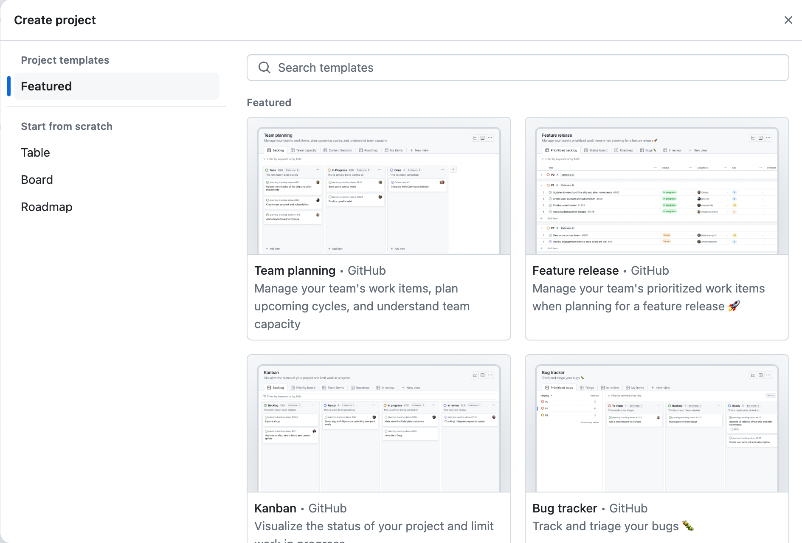

::::::::::::::::::::::::::::::::::::::: objectives

- Register and track progress on issues with the code in our project repository
- Describe some different types of issues we can have with software
- Manage communications on software development activities within the team using GitHub's notification system **Mentions**
- Use GitHub's **Project Boards** and **Milestones** for software project management, planning sprints and releases

::::::::::::::::::::::::::::::::::::::::::::::::::

:::::::::::::::::::::::::::::::::::::::: questions

- How can we keep track of identified issues and the list of tasks the team has to do?
- How can we communicate within a team on code-related issues and share responsibilities?
- How can we plan, prioritise and manage tasks for future development?

::::::::::::::::::::::::::::::::::::::::::::::::::

## Introduction

Developing software is a project and, like most projects, it consists of multiple tasks.
Keeping track of identified issues with the software,
the list of tasks the team has to do, progress on each,
prioritising tasks for future development,
planning sprints and releases, etc.,
can quickly become a non-trivial task in itself.
Without a good team project management process and framework,
it can be hard to keep track of what's done, or what needs doing,
and particularly difficult to convey that to others
in the team or share the responsibilities.

::: callout

### Activate your virtual environment
If it is not already active, make sure to activate your virtual environment, called `venv`,
from the root of the software project directory:

```bash
$ source venv/bin/activate # Mac or Linux
$ source venv/Scripts/activate # Windows
(venv) $
```
:::

## Using GitHub to Manage Issues With Software

As a piece of software is used,
bugs and other issues will inevitably come to light - nothing is perfect!
If you work on your code with collaborators,
or have non-developer users,
it can be helpful to have a single shared record of
all the problems people have found with the code,
not only to keep track of them for you to work on later,
but to avoid people emailing you to report a bug that you already know about!

GitHub provides **Issues** -
a framework for managing bug reports, feature requests, and lists of future work.

Go back to the home page for your `python-intermediate-inflammation` repository in GitHub,
and click on the `Issues` tab.
You should see a page listing the open issues on your repository -
currently there should be none.
If you do not see the `Issues` tab, you must first enable it in the settings of your repository:
go to the `Settings` tab, scroll down to the `Features` section and activate the checkmark on `Issues`.

{alt='List of project issues in GitHub' .image-with-shadow width="1000px"}

Let us go through the process of creating a new issue.
Start by clicking the `New issue` button.

{alt='Creating a new issue in GitHub' .image-with-shadow width="1000px"}

When you create an issue, you can add a range of details to them.
They can be *assigned to a specific developer* for example -
this can be a helpful way to know who, if anyone, is currently working to fix the issue,
or a way to assign responsibility to someone to deal with it.

They can also be assigned a *label*.
The labels available for issues can be customised,
and given a colour,
allowing you to see at a glance the state of your code's issues.
The [default labels available in GitHub](https://docs.github.com/en/issues/using-labels-and-milestones-to-track-work/managing-labels) include:

- `bug` - indicates an unexpected problem or unintended behavior
- `documentation` - indicates a need for improvements or additions to documentation
- `duplicate` - indicates similar or already reported issues, pull requests, or discussions
- `enhancement` - indicates new feature requests,
  or if they are created by a developer, indicate planned new features
- `good first issue` - indicates a good issue for first-time contributors
- `help wanted` - indicates that a maintainer wants help on an issue or pull request
- `invalid` - indicates that an issue, pull request, or discussion is no longer relevant
- `question` - indicates that an issue, pull request, or discussion needs more information
- `wontfix` - indicates that work will not continue on an issue, pull request, or discussion

You can also create your own custom labels to help with classifying issues.
There are no rules really about naming the labels -
use whatever makes sense for your project.
Some conventional custom labels include:
`status:in progress` (to indicate that someone started working on the issue),
`status:blocked` (to indicate that the progress on addressing issue is
blocked by another issue or activity), etc.

As well as highlighting problems,
the `bug` label can make code much more usable by
allowing users to find out if anyone has had the same problem before,
and also how to fix (or work around) it on their end.
Enabling users to solve their own problems can save you a lot of time.
In general, a good bug report should contain only one bug,
specific details of the environment in which the issue appeared
(e.g. operating system or browser, version of the software and its dependencies),
and sufficiently clear and concise steps that allow a developer to reproduce the bug themselves.
They should also be clear on what the bug reporter considers factual
("I did this and this happened")
and speculation
("I think it was caused by this").
If an error report was generated from the software itself,
it is a very good idea to include that in the issue.

The `enhancement` label is a great way to communicate your future priorities
to your collaborators but also to yourself -
it's far too easy to leave a software project for a few months to work on something else,
only to come back and forget the improvements you were going to make.
If you have other users for your code,
they can use the label to request new features,
or changes to the way the code operates.
It's generally worth paying attention to these suggestions,
especially if you spend more time developing than running the code.
It can be very easy to end up with quirky behaviour
because of off-the-cuff choices during development.
Extra pairs of eyes can point out ways the code can be made more accessible -
the easier the code is to use, the more widely it will be adopted
and the greater impact it will have.

One interesting label is `wontfix`,
which indicates that an issue simply will not be worked on for whatever reason.
Maybe the bug it reports is outside of the use case of the software,
or the feature it requests simply is not a priority.
This can make it clear you have thought about an issue and dismissed it.

:::::::::::::::::::::::::::::::::::::::::  callout

## Locking and Pinning Issues

The **Lock conversation** and **Pin issue** buttons are both available
from individual issue pages.
Locking conversations allows you to block future comments on the issue,
e.g. if the conversation around the issue is not constructive
or violates your team's code of conduct.
Pinning issues allows you to pin up to three issues to the top of the issues page,
e.g. to emphasise their importance.


::::::::::::::::::::::::::::::::::::::::::::::::::

:::::::::::::::::::::::::::::::::::::  testimonial

## Manage Issues With Your Code Openly

Having open, publicly-visible lists of the limitations and problems with your code
is incredibly helpful.
Even if some issues end up languishing unfixed for years,
letting users know about them can save them a huge amount of work
attempting to fix what turns out to be an unfixable problem on their end.
It can also help you see at a glance what state your code is in,
making it easier to prioritise future work!


::::::::::::::::::::::::::::::::::::::::::::::::::

:::::::::::::::::::::::::::::::::::::::  challenge

## Exercise: Our First Issue!

Individually, with a critical eye,
think of an aspect of the code you have developed so far that needs improvement.
It could be a bug, for example,
or a documentation issue with your README,
a missing LICENSE file,
or an enhancement.
In GitHub, enter the details of the issue and select `Submit new issue`.
Add a label to your issue, if appropriate.

:::::::::::::::  solution

## Solution

For example, "Add a licence file" could be a good first issue, with a label `documentation`.


:::::::::::::::::::::::::

::::::::::::::::::::::::::::::::::::::::::::::::::

### Issue (and Pull Request) Templates

GitHub also allows you to set up issue and pull request templates for your software project.
Such templates provide a structure for the issue/pull request descriptions,
and/or prompt issue reporters and collaborators to fill in answers to pre-set questions.
They can help contributors raise issues or submit pull requests
in a way that is clear, helpful and provides enough information for maintainers to act upon
(without going back and forth to extract it).
GitHub provides a range of default templates,
but you can also [write your own](https://docs.github.com/en/communities/using-templates-to-encourage-useful-issues-and-pull-requests/configuring-issue-templates-for-your-repository).

## Using GitHub's Notifications \& Referencing System to Communicate

GitHub implements a comprehensive
[notifications system](https://docs.github.com/en/account-and-profile/managing-subscriptions-and-notifications-on-github/setting-up-notifications/configuring-notifications)
to keep the team up-to-date with activities in your code repository
and notify you when something happens or changes in your software project.
You can choose whether to watch or unwatch an individual repository,
or can choose to only be notified of certain event types
such as updates to issues, pull requests, direct mentions, etc.
GitHub also provides an additional useful notification feature for collaborative work - **Mentions**.
In addition to referencing team members
(which will result in an appropriate notification),
GitHub allows us to reference issues, pull requests and comments from one another -
providing a useful way of connecting things and conversations in your project.

### Referencing Team Members Using Mentions

The mention system notifies team members when somebody else references them
in an issue, comment or pull request -
you can use this to notify people when you want to check a detail with them,
or let them know something has been fixed or changed
(much easier than writing out all the same information again in an email).

You can use the mention system to link to/notify an individual GitHub account
or a whole team for notifying multiple people.
Typing <kbd>@</kbd> in GitHub will bring up a list of
all accounts and teams linked to the repository that can be "mentioned".
People will then receive notifications based on their preferred notification methods -
e.g. via email or GitHub's User Interface.

### Referencing Issues, Pull Requests and Comments

GitHub also lets you mention/reference one issue or pull request from another
(and people "watching" these will be notified of any such updates).
Whilst writing the description of an issue, or commenting on one,
if you type <kbd>\#</kbd> you should see
a list of the issues and pull requests on the repository.
They are coloured green if they are open, or white if they are closed.
Continue typing the issue number, and the list will narrow down,
then you can hit <kbd>Return</kbd> to select the entry and link the two.
For example, if you realise that several of your bugs have common roots,
or that one enhancement cannot be implemented before you have finished another,
you can use the mention system to indicate the depending issue(s).
This is a simple way to add much more information to your issues.

While not strictly notifying anyone,
GitHub lets you also reference individual comments and commits.
If you click the `...` button on a comment,
from the drop down list you can select to `Copy link`
(which is a URL that points to that comment that can be pasted elsewhere)
or to `Reference [a comment] in a new issue`
(which opens a new issue and references the comment by its URL).
Within a text box for comments, issue and pull request descriptions,
you can reference a commit by pasting its long, unique identifier
(or its first few digits which uniquely identify it)
and GitHub will render it nicely using the identifier's short form
and link to the commit in question.

{alt='Referencing comments and commits in GitHub' .image-with-shadow width="700px"}

:::::::::::::::::::::::::::::::::::::::  challenge

## Exercise: Our First Mention/Reference!

Add a mention to one of your team members using the `@` notation
in a comment within an issue or a pull request in your repository -
e.g. to  ask them a question or a clarification on something or to do some additional work.

Alternatively, add another issue to your repository
and reference the issue you created in the previous exercise
using the  `#` notation.

::::::::::::::::::::::::::::::::::::::::::::::::::

:::::::::::::::::::::::::::::::::::::::::  callout

## You Are Also a User of Your Code

This section focuses a lot on how issues and mentions can help
communicate the current state of the code to others
and document what conversations were held around particular issues.
As a sole developer, and possibly also the only user of the code,
you might be tempted to not bother with recording issues, comments and new features
as you do not need to communicate the information to anyone else.

Unfortunately, human memory is not infallible!
After spending six months on a different topic,
it is inevitable you'll forget some of the plans you had and problems you faced.
Not documenting these things can lead to you having to
re-learn things you already put the effort into discovering before.
Also, if others are brought on to the project at a later date,
the software's existing issues and potential new features are already in place to build upon.


::::::::::::::::::::::::::::::::::::::::::::::::::

## Software Project Management in GitHub

Managing issues within your software project is one aspect of project management but it gives a relative flat
representation of tasks and may not be as suitable for higher-level project management such as
prioritising tasks for future development, planning sprints and releases. Luckily,
GitHub provides two project management tools for this purpose - **Projects** and **Milestones**.

Both GitHub Projects and Milestones provide [agile development and project management systems](https://www.atlassian.com/agile)
and ways of organising issues into smaller "sub-projects" (i.e.
smaller than the "project" represented by the whole repository).
Projects provide a way of visualising and organising work which is not time-bound and is on a higher level (e.g. more suitable for
project management tasks). Milestones are typically used to
organise lower-level tasks that have deadlines and progress of which needs to be closely tracked
(e.g. release and version management). The main difference is that Milestones are a repository-level feature
(i.e. they belong and are managed from a single repository), whereas projects are account-level and can manage tasks
across many repositories under the same user or organisational account.

How you organise and partition your project work and which tool you want to use
to track progress (if at all) is up to you and the size of your project. For example, you could create a project per
milestone or have several milestones in a single project, or split milestones into shorter sprints.
We will use Milestones soon to organise work on a mini sprint within our team -
for now, we will have a brief look at Projects.

### Projects

A GitHub Project uses a "project board" consisting of columns and cards to keep track of tasks
(although GitHub now also provides a table view over a project's tasks).
You break down your project into smaller sub-projects,
which in turn are split into tasks which you write on cards,
then move the cards between columns that describe the status of each task.
Cards are usually small, descriptive and self-contained tasks that build on each other.
Breaking a project down into clearly-defined tasks makes it a lot easier to manage.
GitHub project boards interact and integrate with the other features of the site
such as issues and pull requests -
cards can be added to track the progress of such tasks
and automatically moved between columns based on their progress or status.

GitHub projects are "an adaptable, flexible tool for planning and tracking work on GitHub" -
they now provide interchangeable spreadsheet, task-board, or roadmap views of your project
that integrates with your issues and pull requests on GitHub to help you
plan and track your work effectively.
We recommend you to have a look at [GitHub's documentation on Projects](https://docs.github.com/en/issues/planning-and-tracking-with-projects/learning-about-projects/about-projects)
and see if they are suitable for your software development workflow.

:::::::::::::::::::::::::::::::::::::::::  callout

## GitHub Projects are a Cross-Repository Management Tool

[Project in GitHub](https://docs.github.com/en/issues/planning-and-tracking-with-projects/learning-about-projects/about-projects)
are created on a user or organisation level,
i.e. they can span all repositories owned by a user or organisation in GitHub
and are not a repository-level feature any more.
A project can integrate your issues and pull requests on GitHub from multiple repositories
to help you plan and track your team's work effectively.


::::::::::::::::::::::::::::::::::::::::::::::::::

Let us have a quick look at how Projects are created in GitHub - we will not use them much in
this course but it is good to be aware of how to make use of them when suitable.

1. From your GitHub account's home page (not your repository's home page!),
  select the "Projects" tab, then click the `New project` button on the right.
  
  {alt='Adding a new project board in GitHub' .image-with-shadow width="800px"}

2. In the "Create project" pop-up window, you can either start from one of the featured existing
  project templates or create your project from scratch using one of the three standard project
  types/views that you customise yourself:
  
  - Table - a spreadsheet-style table to filter, sort and group your issues and pull requests.
  - Board - a "cards on a board" view of the project, with issues and pull requests being
    spread across customizable columns as cards on kanban board
  - Roadmap - suitable for a high-level visualisation of your project over time.
    {alt='Selecting a project board template in GitHub' .image-with-shadow width="800px"}
    Regardless of which project type/view you select, you can easily switch to a different
    project layout later on.

3. For example, select the "Board" type for the project, fill in the name of your project
  (e.g. "Inflammation project - release v0.1"), and select `Create project`.

4. After it is created, you should also populate the description of the project from the project's Settings,
  which can be found by clicking the `...` button in the top right corner of the project.
  {alt='Project board setting in GitHub' .image-with-shadow width="800px"}
  {alt='Adding project description and metadata in GitHub' .image-with-shadow width="800px"}
  After adding a description, select `Save`.

5. GitHub's default card board template contains
  the following three columns with pretty self-explanatory names:
  
  - `To Do`
  - `In Progress`
  - `Done`
  
  {alt='Default card board in GitHub' .image-with-shadow width="800px"}
  
  You can add or remove columns from your project board to suit your use case.
  One commonly seen extra column is `On hold` or `Waiting` -
  if you have tasks that get held up by waiting on other people
  (e.g. to respond to your questions)
  then moving them to a separate column makes their current state clearer.
  Another way to organise your table is to have a column for each quarter of the year -
  it is up to you to decide how you want to view your project's activities.
  
  To add a new column,
  press the `+` button on the right;
  to remove a column select the `...` button in the top right corner of the column itself
  and then the `Delete column` option.

6. You can now add new items (cards) to columns by pressing
  the `+ Add item` button at the bottom of each column (see the previous image) -
  a text box to add a card will appear.
  Cards can be simple textual notes
  which you type into the text box and pres `Enter` when finished.
  Cards can also be (links to) existing issues and pull requests,
  which can be filtered out from the text box by pressing `#`
  (to activate GitHub's referencing mechanism)
  and selecting the repository
  and an issue or pull request from that repository that you want to add.
  
  {alt='Adding issues and notes to a project board in GitHub' .image-with-shadow width="800px"}
  
  Notes contain task descriptions and can have detailed content like checklists.
  In some cases, e.g. if a note becomes too complex,
  you may want to convert it into an issue so you can add labels,
  assign them to team members
  or write more detailed comments
  (for that, use the `Convert to issue` option from the `...` menu on the card itself).
  
  {alt='Converting a task to issue' .image-with-shadow width="800px"}

7. In addition to creating new tasks as notes and converting them to issues -
  you can add an existing issue or pull request (from any repository visible to you)
  as a task on a column by pasting its URL into the `Add item` field
  and pressing the `Enter` key.

8. You can drag a task/card from `Todo` to `In Progress` column to indicate that you are working on it
  or to the `Done` column to indicate that it has been completed.
  Issues and pull requests on cards will automatically be moved to the `Done` column for you
  when you close the issue or merge the pull request -
  which is very convenient and can save you some project management time.

9. Finally, you can change the way you view your project by adding another view.
  For example, we can add a Table view to our Board view by clicking the `New button`
  and selecting it from the drop down menu.
  {alt='Add another project view' .image-with-shadow width="800px"}

:::::::::::::::::::::::::::::::::::::::  challenge

## Exercise: Working With Projects

Spend a few minutes planning what you want to do with your project as a bigger chunk of work
(you can continue working on the first release of your software if you like)
and play around with your project board to manage tasks around the project:

- practice adding and removing columns,
- practice adding different types of cards
  (notes and from already existing open issues and/or unmerged pull requests),
- practice turing cards into issues and closing issues, etc.

Make sure to add a certain number of issues to your repository
to be able to use in your project board.

::::::::::::::::::::::::::::::::::::::::::::::::::

:::::::::::::::::::::::::::::::::::::::::  callout

## Prioritisation With Project Boards

Once your project board has a large number of cards on it,
you might want to begin priorisiting them.
Not all tasks are going to be equally important,
and some will require others to be completed before they can even be begun.
Common methods of prioritisation include:

- **Vertical position**:
  the vertical arrangement of cards in a column implicitly represents their importance.
  High-priority issues go to the top of `To Do`,
  whilst tasks that depend on others go beneath them.
  This is the easiest one to implement,
  though you have to remember to correctly place cards when you add them.
- **Priority columns**: instead of a single `To Do` column,
  you can have two or more, for example -
  `To Do: Low Priority` and `To Do: High Priority`.
  When adding a card, you pick which is the appropriate column for it.
  You can even add a `Triage` column for newly-added issues
  that you've not yet had time to classify.
  This format works well for project boards devoted to bugs.
- **Labels**: if you convert each card into an issue,
  then you can label them with their priority -
  remember GitHub lets you create custom labels and set their colours.
  Label colours can provide a very visually clear indication of issue priority
  but require more administrative work on the project,
  as each card has to be an issue to be assigned a label.
  If you choose this route for issue prioritisation -
  be aware of accessibility issues for colour-blind people when picking colours.

::::::::::::::::::::::::::::::::::::::::::::::::::


:::::::::::::::::::::::::::::::::::::::: keypoints

- We should use GitHub's **Issues** to keep track of software problems and other requests for change - even if we are the only developer and user.
- GitHub’s **Mentions** play an important part in communicating between collaborators and is used as a way of alerting team members of activities and referencing one issue/pull requests/comment/commit from another.
- Without a good project and issue management framework, it can be hard to keep track of what’s done, or what needs doing, and particularly difficult to convey that to others in the team or sharing the responsibilities.

::::::::::::::::::::::::::::::::::::::::::::::::::


