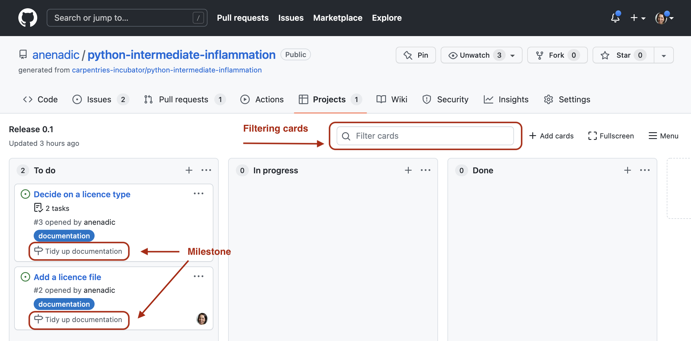

::::::::::::::::::::::::::::::::::::::: objectives

- Prioritise and work on externally registered issues
- Respond to submitted issue reports and provide feedback
- Explain the importance of software support and choosing a suitable level of support

::::::::::::::::::::::::::::::::::::::::::::::::::

:::::::::::::::::::::::::::::::::::::::: questions

- How should we handle feedback on our software?
- How, and to what extent, should we provide support to our users?

::::::::::::::::::::::::::::::::::::::::::::::::::

## Introduction

When a software project has been around for even just a short amount of time,
you'll likely discover many aspects that can be improved.
These can come from issues that have been registered via collaborators or users,
but also those you are aware of internally,
which should also be registered as issues.
When starting a new software project,
you'll also have to determine how you'll handle all the requirements.
But which ones should you work on first,
which are the most important and why,
and how should you organise all this work?

Software has a fundamental role to play in doing science,
but unfortunately software development is often
given short shrift in academia when it comes to prioritising effort.
There are also many other draws on our time
in addition to the research, development, and writing of publications that we do,
which makes it all the more important to prioritise our time for development effectively.

In this lesson we will be looking at prioritising work we need to do
and what we can use from the agile perspective of project management
to help us do this in our software projects.

## Estimation as a Foundation for Prioritisation

For simplicity, we will refer to our issues as *requirements*,
since that's essentially what they are -
new requirements for our software to fulfil.

But before we can prioritise our requirements,
there are some things we need to find out.

Firstly, we need to know:

- *The period of time we have to resolve these requirements* -
  e.g. before the next software release, pivotal demonstration,
  or other deadlines requiring their completion.
  This is known as a **timebox**.
  This might be a week or two, but for agile, this should not be longer than a month.
  Longer deadlines with more complex requirements may be split into a number of timeboxes.
- *How much overall effort we have available* -
- i.e. who will be involved and how much of their time we will have during this period.

We also need estimates for how long each requirement will take to resolve,
since we cannot meaningfully prioritise requirements without
knowing what the effort tradeoffs will be.
Even if we know how important each requirement is,
how would we even know if completing the project is possible?
Or if we do not know how long it will take
to deliver those requirements we deem to be critical to the success of a project,
how can we know if we can include other less important ones?

It is often not the reality,
but estimation should ideally be done by the people likely to do the actual work
(i.e. the Research Software Engineers, researchers, or developers).
It shouldn't be done by project managers or PIs
simply because they are not best placed to estimate,
and those doing the work are the ones who are effectively committing to these figures.

:::::::::::::::::::::::::::::::::::::::::  callout

## Why is it so Difficult to Estimate?

Estimation is a very valuable skill to learn, and one that is often difficult.
Lack of experience in estimation can play a part,
but a number of psychological causes can also contribute.
One of these is [Dunning-Kruger](https://en.wikipedia.org/wiki/Dunning%E2%80%93Kruger_effect),
a type of cognitive bias in which people tend to overestimate their abilities,
whilst in opposition to this is [imposter syndrome](https://en.wikipedia.org/wiki/Impostor_syndrome),
where due to a lack of confidence people underestimate their abilities.
The key message here is to be honest about what you can do,
and find out as much information that is reasonably appropriate before arriving at an estimate.

More experience in estimation will also help to reduce these effects.
So keep estimating!

::::::::::::::::::::::::::::::::::::::::::::::::::

An effective way of helping to make your estimates more accurate is to do it as a team.
Other members can ask prudent questions that may not have been considered,
and bring in other sanity checks and their own development experience.
Just talking things through can help uncover other complexities and pitfalls,
and raise crucial questions to clarify ambiguities.

:::::::::::::::::::::::::::::::::::::::::  callout

## Where to Record Effort Estimates?

There is no dedicated place to record the effort estimate on an issue in current GitHub's interface.
Therefore, you can agree on a convention within your team on how to record this information -
e.g. you can add the effort in person/days in the issue title.
Recording estimates within comments on an issue may not be the best idea
as it may get lost among other comments.
Another place where you can record estimates for your issues is on project boards -
there is no default field for this but you can create a custom numeric field
and use it to assign effort estimates
(note that you cannot sum them yet in the current GitHub's interface).

::::::::::::::::::::::::::::::::::::::::::::::::::

:::::::::::::::::::::::::::::::::::::::  challenge

## Exercise: Estimate!

As a team
go through the issues that your partner team has registered with your software repository,
and quickly estimate how long each issue will take to resolve in minutes.
Do this by blind consensus first,
each anonymously submitting an estimate,
and then briefly discuss your rationale and decide on a final estimate.
Make sure these are honest estimates,
and you are able to complete them in the allotted time!

::::::::::::::::::::::::::::::::::::::::::::::::::

## Using MoSCoW to Prioritise Work

Now we have our estimates we can decide
how important each requirement is to the success of the project.
This should be decided by the project stakeholders;
those - or their representatives -
who have a stake in the success of the project
and are either directly affected or affected by the project,
e.g. Principle Investigators,
researchers,
Research Software Engineers,
collaborators, etc.

To prioritise these requirements we can use a method called **MoSCoW**,
a way to reach a common understanding with stakeholders
on the importance of successfully delivering each requirement for a timebox.
MoSCoW is an acronym that stands for
**Must have**,
**Should have**,
**Could have**,
and **Won't have**.
Each requirement is discussed by the stakeholder group and falls into one of these categories:

- *Must Have* (MH) -
  these requirements are critical to the current timebox for it to succeed.
  Even the inability to deliver just one of these would
  cause the project to be considered a failure.
- *Should Have* (SH) -
  these are important requirements but not *necessary* for delivery in the timebox.
  They may be as *important* as Must Haves,
  but there may be other ways to achieve them
  or perhaps they can be held back for a future development timebox.
- *Could Have* (CH) -
  these are desirable but not necessary,
  and each of these will be included in this timebox if it can be achieved.
- *Won't Have* (WH) -
  these are agreed to be out of scope for this timebox,
  perhaps because they are the least important or not critical for this phase of development.

In typical use, the ratio to aim for of requirements to the MH/SH/CH categories is
60%/20%/20% for a particular timebox.
Importantly, the division is by the requirement *estimates*,
not by number of requirements,
so 60% means 60% of the overall estimated effort for requirements are Must Haves.

Why is this important?
Because it gives you a unique degree of control of your project for each time period.
It awards you 40% of flexibility with allocating your effort
depending on what's critical and how things progress.
This effectively forces a tradeoff between the effort available and critical objectives,
maintaining a significant safety margin.
The idea is that as a project progresses,
even if it becomes clear that you are only able to
deliver the Must Haves for a particular time period,
you have still delivered it *successfully*.

### GitHub's Milestones

Once we have decided on those we will work on (i.e. not Won't Haves),
we can (optionally) use a GitHub's **Milestone** to organise them for a particular timebox.
Remember, a milestone is a collection of issues to be worked on in a given period (or timebox).
We can create a new one by selecting `Issues` on our repository,
then `Milestones` to display any existing milestones,
then clicking the "New milestone" button to the right.

{alt='Milestones in GitHub' .image-with-shadow width="1000px"}

{alt='Create a milestone in GitHub' .image-with-shadow width="1000px"}

We add in a title,
a completion date (i.e. the end of this timebox),
and any description for the milestone.

{alt='Create a milestone in GitHub' .image-with-shadow width="800px"}

Once created, we can view our issues
and assign them to our milestone from the `Issues` page or from an individual issue page.

{alt='Milestones in GitHub' .image-with-shadow width="1000px"}

Let us now use Milestones to plan and prioritise our team's next sprint.

:::::::::::::::::::::::::::::::::::::::  challenge

## Exercise: Prioritise!

Put your stakeholder hats on, and as a team apply MoSCoW to the repository issues
to determine how you will prioritise effort to resolve them in the allotted time.
Try to stick to the 60/20/20 rule,
and assign all issues you will be working on (i.e. not `Won't Haves`) to a new milestone,
e.g. "Tidy up documentation" or "version 0.1".

::::::::::::::::::::::::::::::::::::::::::::::::::

<!--
:::::::::::::::::::::::::::::::::::::::::  callout

## Milestones in Project Boards

Milestones are also visible on project boards.
If an issue or pull request belongs to a milestone,
the name of the milestone will be displayed on the project card.
You can add or remove an issue or pull request from milestones using the details sidebar,
and filter your project cards by milestones using the search bar.

{alt='Milestones in Project Boards' .image-with-shadow width="900px"}
::::::::::::::::::::::::::::::::::::::::::::::::::
-->

## Using Sprints to Organise and Work on Issues

A sprint is an activity applied to a timebox,
where development is undertaken on the agreed prioritised work for the period.
In a typical sprint, there are daily meetings called **scrum meetings**
which check on how work is progressing,
and serves to highlight any blockers and challenges to meeting the sprint goal.

:::::::::::::::::::::::::::::::::::::::  challenge

## Exercise: Conduct a Mini Mini-Sprint

For the remaining time in this course,
assign repository issues to team members and work on resolving them as per your MoSCoW breakdown.
Once an issue has been resolved, notable progress made, or an impasse has been reached,
provide concise feedback on the repository issue.
Be sure to add the other team members to the chosen repository so they have access to it.
You can grant `Write` access to others on a GitHub repository
via the `Settings` tab for a repository, then selecting `Collaborators`,
where you can invite other GitHub users to your repository with specific permissions.

Time: however long is left

::::::::::::::::::::::::::::::::::::::::::::::::::

Depending on how many issues were registered on your repository,
it is likely you will not have resolved all the issues in this first milestone.
Of course, in reality, a sprint would be over a much longer period of time.
In any event, as the development progresses into future sprints
any unresolved issues can be reconsidered and prioritised for another milestone,
which are then taken forward, and so on.
This process of receiving new requirements, prioritisation,
and working on them is naturally continuous -
with the benefit that at key stages
you are repeatedly **re-evaluating what is important and needs to be worked on**
which helps to ensure real concrete progress against project goals and requirements
which may change over time.

:::::::::::::::::::::::::::::::::::::::::  callout

## Project Boards For Planning Sprints

Remember, you can use project boards for higher-level project management -
e.g. planning several sprints in advance
(and use milestones for tracking progress on individual sprints).

::::::::::::::::::::::::::::::::::::::::::::::::::

:::::::::::::::::::::::::::::::::::::::: keypoints

- Prioritisation is a key tool in academia where research goals can change and software development is often given short shrift.
- In order to prioritise things to do we must first estimate the effort required to do them.
- For accurate effort estimation, it should be done by the people who will *actually do the work*.
- Aim to reduce cognitive biases in effort estimation by being honest about your abilities.
- Ask other team members - or do estimation as a team - to help make accurate estimates.
- MoSCoW is a useful technique for prioritising work to help ensure projects deliver successfully.
- Aim for a 60%/20%/20% ratio of Must Haves/Should Haves/Could Haves for requirements within a timebox.

::::::::::::::::::::::::::::::::::::::::::::::::::

