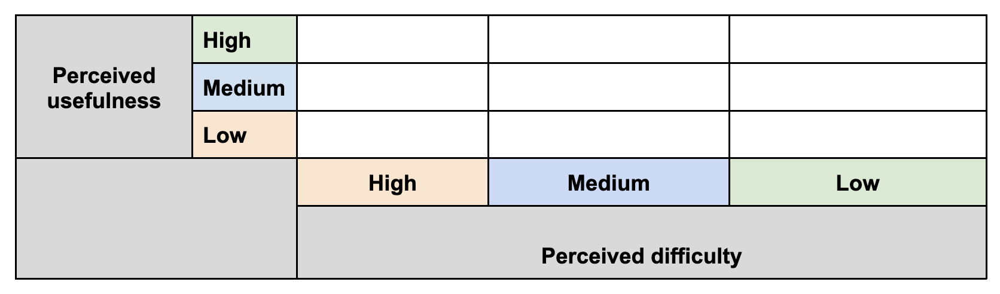
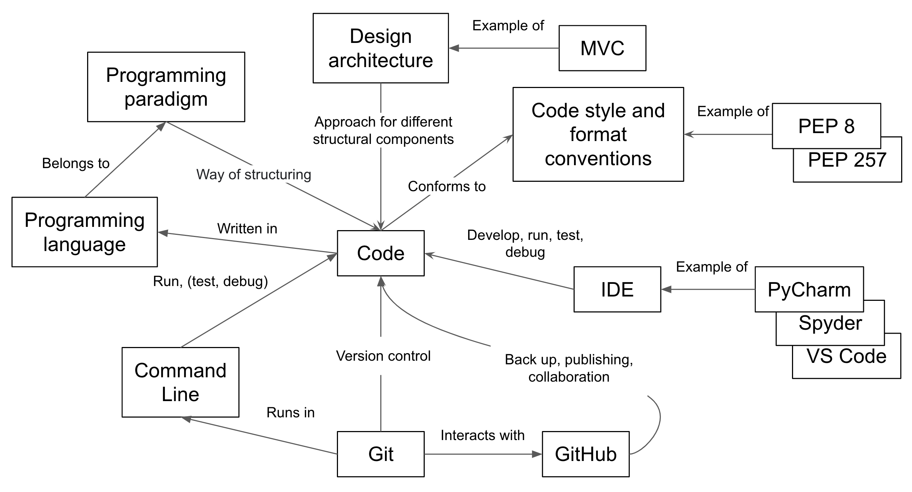
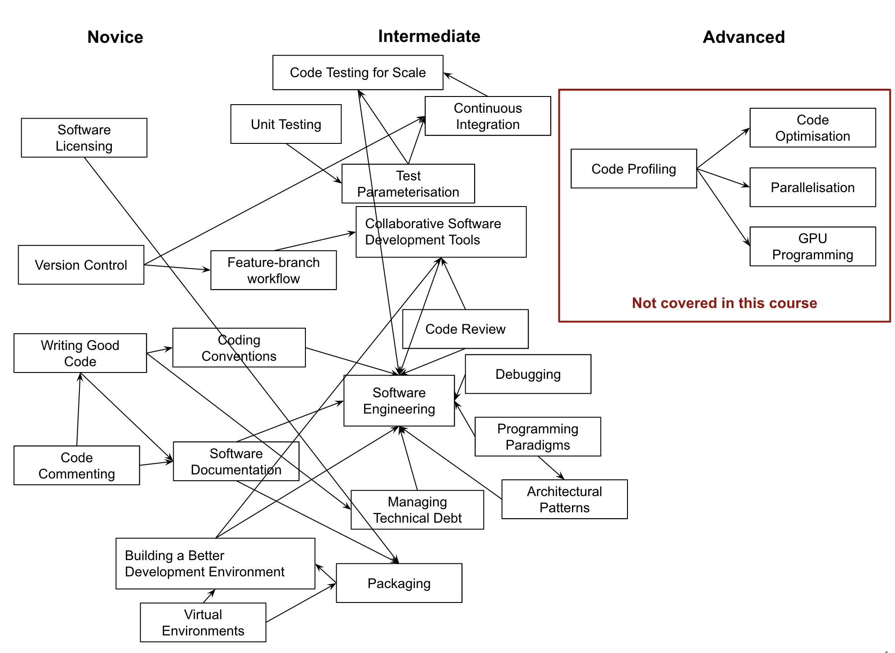

::::::::::::::::::::::::::::::::::::::: objectives

- Put the course in context with future learning.

::::::::::::::::::::::::::::::::::::::::::::::::::

:::::::::::::::::::::::::::::::::::::::: questions

- Looking back at what was covered and how different pieces fit together
- Where are some advanced topics and further reading available?

::::::::::::::::::::::::::::::::::::::::::::::::::

<!--
Examples of 'good' code best practices (from Steve's slides):
Correct – does what it's intended to do
Readable – remember WORM (Write Once Read Many)
Testable – "if it's not tested it's broken"
Documented – not what/how but why/because
Robust and reliable
Maintainable – by you and others six months from now
Extensible, flexible + reusable - trade off
Efficient, performant + scalable - trade off
Secure
Discoverable – others can understand quickly + easily
Simple – modular
Pick the properties that are relevant to your project -
e.g. trade off between time, efficiency and performance,
the levels of software reusability - this will dictate practices and the level of development.
This can lead to a discussion.
Reiterate some of the key messages.
-->

## Summary

As part of this course we have looked at a core set of
established, intermediate-level software development tools and best practices
for working as part of a team.
The course teaches a selected subset of skills that have been tried and tested
in collaborative research software development environments,
although not an all-encompassing set of every skill you might need
(check some [further reading](.#further-resources)).
It will provide you with a solid basis for writing industry-grade code,
which relies on the same best practices taught in this course:

- Collaborative techniques and tools play an important part
  of research software development in teams,
  but also have benefits in solo development.
  We have looked at the benefits of a well-considered development environment,
  using practices, tools and infrastructure
  to help us write code more effectively in collaboration with others.
- We have looked at the importance of being able to
  verify the correctness of software and automation,
  and how we can leverage techniques and infrastructure
  to automate and scale tasks such as testing to save us time -
  but automation has a role beyond simply testing:
  what else can you automate that would save you even more time?
  Once found, we have also examined how to locate faults in our software.
- We have gone beyond procedural programming and explored different software design paradigms,
  such as object-oriented and functional styles of programming.
  We have contrasted their pros, cons, and the situations in which they work best,
  and how separation of concerns through modularity and architectural design
  can help shape good software.
- As an intermediate developer,
  aspects other than technical skills become important,
  particularly in development teams.
  We have looked at the importance of good,
  consistent practices for team working,
  and the importance of having a self-critical mindset when developing software,
  and ways to manage feedback effectively and efficiently.

:::::::::::::::::::::::::::::::::::::::  challenge

## Reflection Exercise: Putting the Pieces Together

As a group, reflect on the concepts
(e.g. tools, techniques and practices)
covered throughout the course,
how they relate to one another,
how they fit together in a bigger picture or skill learning pathways
and in which order you need to learn them.

:::::::::::::::  solution

## Solution

One way to think about these concepts is to
make a list and try to organise them along two axes -
'perceived usefulness of a concept' versus
'perceived difficulty or time needed to master a concept',
as shown in the table below
(for the exercise, you can make your own copy of the
[template table](https://docs.google.com/document/d/1NdE6PjqxjSsf1K4ofkCoWc2GA3sY2RIsjRg8BghTXas/edit?usp=sharing)
for the purpose of this exercise).
You then may think in which order you want to learn the skills
and how much effort they require -
e.g. start with those that are more useful but, for the time being,
hold off those that are not too useful to you and take loads of time to master.
You will likely want to focus on the concepts in the top right corner of the table first,
but investing time to master more difficult concepts may pay off in the long run
by saving you time and effort and helping reduce technical debt.

{alt='Usefulness versus time to master grid' .image-with-shadow width="800px"}

Another way you can organise the concepts is using a
[concept map](https://en.wikipedia.org/wiki/Concept_map)
(a directed graph depicting suggested relationships between concepts)
or any other diagram/visual aid of your choice.
Below are some example views of tools and techniques covered in the course using concept maps.
Your views may differ but that is not to say that either view is right or wrong.
This exercise is meant to get you to reflect on what was covered in the course
and hopefully to reinforce the ideas and concepts you learned.

{alt='Overview of tools and techniques covered in the course' .image-with-shadow width="800px"}

A different concept map tries to organise concepts/skills based on their level of difficulty
(novice, intermediate and advanced, and in-between!)
and tries to show which skills are prerequisite for others
and in which order you should consider learning skills.

{alt='Overview of topics covered in the course based on level of difficulty' .image-with-shadow width="800px"}

:::::::::::::::::::::::::

::::::::::::::::::::::::::::::::::::::::::::::::::

## Further Resources

Below are some additional resources to help you continue learning:

- [Additional episode on persisting data](../learners/persistence.md)
- [Additional episode on databases](../learners/databases.md)
- [Additional episode on software architecture](../learners/software-architecture-extra.md)
- [Additional episode on programming paradigms](../learners/programming-paradigms.md)
- [CodeRefinery lessons][coderefinery-lessons] on writing software for open and reproducible research
- [Python documentation][python-documentation]
- [GitHub Actions documentation][github-actions]

:::::::::::::::::::::::::::::::::::::::: keypoints

- Collaborative techniques and tools play an important part of research software development in teams.

::::::::::::::::::::::::::::::::::::::::::::::::::

