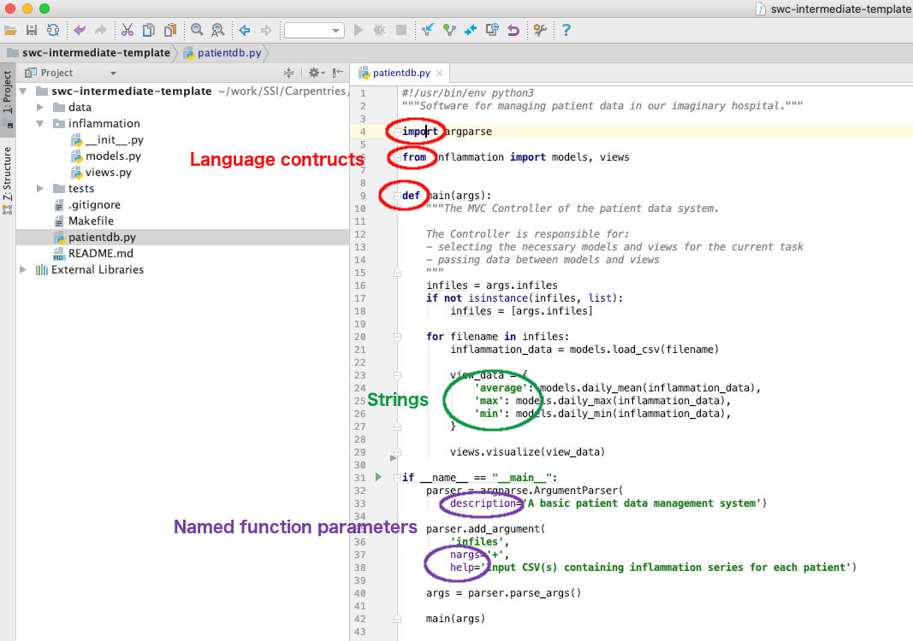
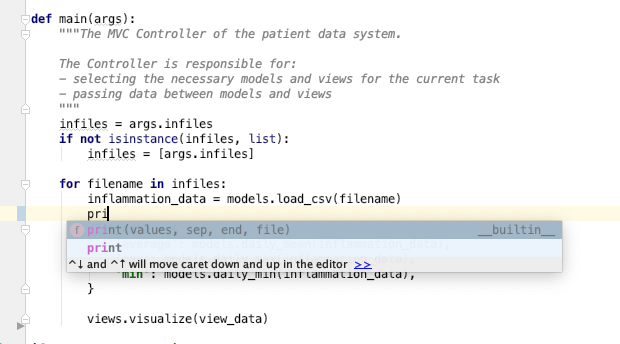
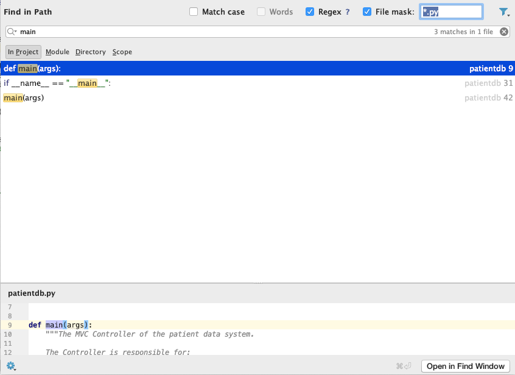
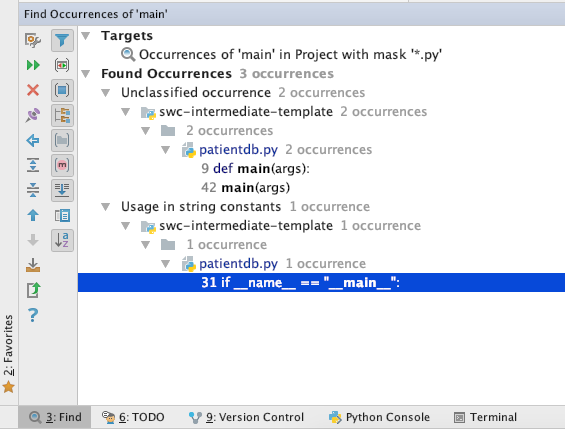
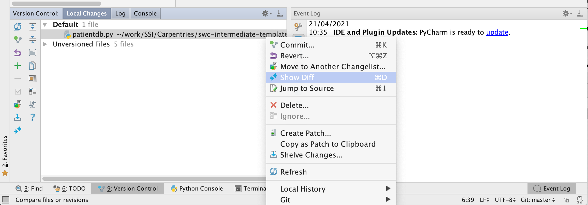

## Introduction to Integrated Development Environments
An integrated development environment (IDE) is a software application that provides comprehensive facilities for 
software development. An IDE normally consists of at least a source code editor, build automation tools and a debugger. 
The boundaries between modern IDEs and other aspects of the broader software development process are often blurred as 
nowadays IDEs also offer version control support, tools to construct graphical user interfaces (GUI) and web browser
integration for web app development, source code inspection for dependencies and many other useful functionalities. The
following is a list of most commonly seen IDE features:

- Syntax highlighting - to show the language constructs, keywords and the syntax errors with visually distinct colors 
and font effects,
- Code completion - to speed up programming by offering a set of possible code options,
- Code refactoring - for automated rewriting of the code to help clarity or to conform to coding styles/conventions,
- Version control - to interact with source code repositories,
- Debugging - for setting breakpoints in the code editor, step-by-step execution of code and inspection of variables,
- Code search - finding package, class, function and variable declarations, their usages and referencing,
- Visual programming - to create new applications by moving programming, building blocks, or code nodes to create 
flowcharts or structure diagrams that are then compiled or interpreted,
- Language and file format support - support for multiple programming languages and file formats - for example HTML, 
Markdown, XML, JSON, CSV, images, etc.

IDEs are extremely useful and modern software development would be very hard without them. There is a number of IDEs 
available for Python development, a good overview is available from the 
[Python Project Wiki](https://wiki.python.org/moin/IntegratedDevelopmentEnvironments). In addition to IDEs, 
there is also a number of code editors that have 
Python support. Code editors can be as simple as a text editor with syntax highlighting and code formatting capabilities
(e.g. GNU EMACS, Vi/Vim, Atom). Most good code editors can also execute code and control a 
debugger, and some can also interact with a version control system. Compared to an IDE, a good dedicated code 
editor is usually smaller and quicker, but often less feature rich. You will have to decide which one is the best for 
you but for the purpose of this workshop we will learn how to use [PyCharm](https://www.jetbrains.com/pycharm/) - 
a free, open source Python IDE.

## Using PyCharm IDE For Python Software Development

### Opening a software project in PyCharm
If you have not PyCharm running yet, start it up now. You can skip the initial configuration steps which just go through 
selecting a theme and other aspects. You should be presented with a dialog box that asks you what you want to do, 
e.g. `Create New Project`, `Open`, or `Check out from Version Control`.

Select `Open` and find the software project repository you cloned earlier, and select the `swc-intermediate-template` 
directory. This directory is now the current working directory for PyCharm, so when we run scripts from PyCharm, 
this is the directory they will run from.

PyCharm will show you a 'Tip of the Day' window which you can safely ignore by selecting `Close`. 
You will notice the IDE shows you a project/file navigator window on the left hand side, to traverse and select the files 
(and any subdirectories) within the working directory, and an editor window on the right.

### Useful PyCharm Features 

#### Syntax highlighting
Syntax highlighting is a feature that displays source code terms in different colors and fonts according to the syntax 
category the highlighted term belongs to. It also makes syntax errors visually distinct. Highlighting does not affect 
the meaning of the code itself - is intended only for human readers and makes reading code and finding errors easier.

#### Code completion
As you start typing code, PyCharm will offer to complete some of the code for you in a form of an auto completion popup. 
This is a context-aware code completion feature that speeds up the process of coding (e.g. reducing typos and other 
common mistakes) by offering available variable 
names, functions from available packages, parameters of functions, hints related to syntax errors, etc.

#### Code search 
You can search for a text string within a project, use different scopes to narrow your search process, exclude certain 
items from your search, find usages and occurrences. To find the search string in a project:

1. From the main menu, select `Edit | Find | Find in Path ...`.
2. Type your search string in the search field of the popup. Alternatively, in the editor, highlight the string you 
want to find and press `Command-Shift-F` (on Mac) or `Control-Shift-F` (on Windows). PyCharm places the highlighted 
string into the search field of the popup.
     
     If you need, specify the additional options in the popup.
     PyCharm will list the search strings and all the files that contain them.
3. Check the results in the preview area of the dialog where you can replace the search string or select another string,
or press `Command-Shift-F` (on Mac) or `Control-Shift-F` (on Windows) again to start a new search.
4. To see the list of occurrences in a separate tool window, click `Open in Find Window` button in the bottom right 
corner. Use this window and its options to group the results, preview them, and work with them further.
 

#### Version control
PyCharm supports a directory-based versioning model, which means that each project directory can be 
associated with a different version control system. Our project was already under `git` version control and PyCharm 
recognised it. It is also possible to add an unversioned project directory to version control directly from PyCharm. 

For the purposes of this workshop, we will do all our version control commands from the shell terminal but it is worth 
noting that PyCharm offers a comprehensive **subset** of `git` commands (i.e. it is possible to perform a set of common 
`git` commands from PyCharm but not all). A very useful version control feature in PyCharm is graphically comparing 
changes you made locally with the same repository version, a different commit version or a version in a different 
branch - this is something that cannot be done equally well from a text-based shell terminal. 

You can get full 
[documentation on PyCharm build-in version control](https://www.jetbrains.com/help/pycharm/version-control-integration.html) online.

### Configuring PyCharm with Anaconda
Our software project already contains some Python code (scripts). However, before we can run it, we need to configure 
PyCharm so that it knows where the Python interpreter, which we want to use to run the code, is located. 
In our case, this is the Python interpreter that is supplied within the Anaconda distribution. However, you may have 
various Python distributions and versions installed on your system so you have to be careful here to select the one you
want to use. To do this:

- Select either `PyCharm` > `Preferences` (Mac) or `File` > `Settings` (Linux, Windows).
- Then, in the preferences window that appears, select `Project: swc-intermediate-template` > 
`Project Interpreter` from the left. You'll 
see a number of Python packages displayed as a list, and importantly above that, the current Python interpreter that is 
being used. This is likely the default version of Python installed on your system, e.g. `Python 2.7 /usr/bin/python2.7` 
or `Python 3.7 /usr/bin/python3.7`, which we don't want to use.
- Select the cog-like button in the top right, then `Add Local...`. An `Add Local Python Interpreter` window will appear.
- Select `Conda Environment` from the list on the left so it will use Anaconda, and ensure that `New environment` is 
selected. Enter `/Users/<USERNAME>/anaconda/envs/patient` (Mac) or TODO (Windows) or TODO (Linux) in the `Location` 
field, then select `Make available to all projects` so we can use it with other projects later.
- Select `OK` in the `Add Python Interpreter` window. Back in the `Preferences` window, you should select 
`Python 3.6 (patient)` or similar from the `Project Interpreter` dropdown list.
- Select `OK` in the `Preferences` window.

It may take a few minutes for PyCharm to read and familiarise itself with the Anaconda installation you've configured 
(you may see `n processes running` in the bar at the bottom of the PyCharm IDE while it does this).

Now we've told PyCharm about the new interpreter, we can configure it for our project:

- To add a new configuration - select `Run` > `Edit Configurations...` (Mac) or TODO (Windows) or TODO (Linux) from the top menu.
- Select `+` button from the top left to add a configuration, selecting `Python` from the drop down list. You should see 
`Python 3.6 (patient)` or similar in the `Python interpreter` field in the window. For `Script path`, select the folder 
button and find and select `patientdb.py`. This tells PyCharm which script to run. 
You can even give this configuration a name at the top of the window if you like - let's name it `patient`.
- Select `OK` to confirm these settings.

> ## Virtual Environments
>
> By configuring the Python interpreter to use in PyCharm, we have created a new Python configuration within which our 
> code will can run. These configurations are commonly known as *virtual environments*, and we will cover them in more detail in the 
> [next episode](../03-virtual-environments/index.html).
{: .callout}

Once done, you're ready to run your script!

### Running Scripts From PyCharm
Right-click the `patientdb.py` file in the PyCharm project/file navigator on the left, and select `Run 'patient'`. 
The script will run in a terminal window at the bottom of the IDE window and display something like:

(TODO: my first running of the sctipt gave an error `ModuleNotFoundError: No module named 'numpy'` so I had to go back 
to Configuration and install it. The the same happened for `matplotlib`. 
This will probably be the case with participants too. I wonder why numpy in not installed by default?)
~~~
/Users/alex/anaconda/envs/patient/bin/python /Users/alex/swc-intermediate-template/patientdb.py
usage: patientdb.py [-h] infiles [infiles ...]
patientdb.py: error: the following arguments are required: infiles

Process finished with exit code 2
~~~
{: .output}

Here, we can see that a new shell has been created that uses the Anaconda interpreter 
`/Users/alex/anaconda/envs/patient/bin/python` from the virtual environment `patient` we just created in PyCharm to run our 
script located at `/Users/alex/swc-intermediate-template/patientdb.py`. The script is currently throwing an error - 
`patientdb.py: error: the following arguments are required: infiles`. 
Do not worry about it for now, we will learn how to fix the errors and write test 
to detect errors over the course of the workshop.



