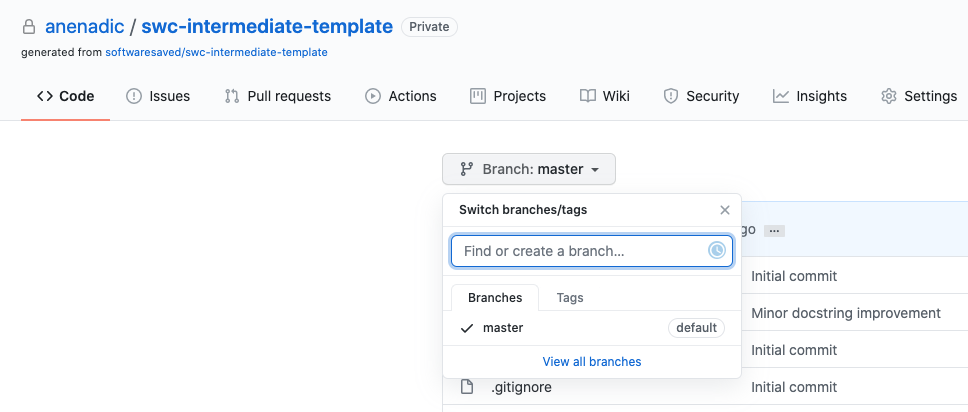
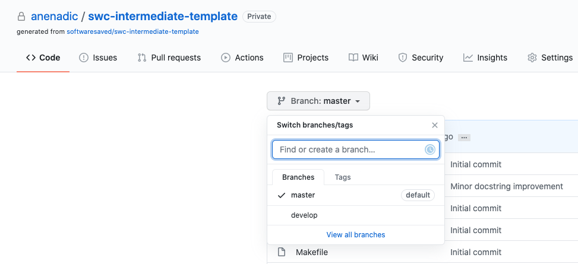

## Introduction
So far we have checked out our software project from GitHub, learned how to configure and use PyCharm for Python
code development, and some Python coding conventions for writing clean and clear code. We have also made some
changes to our code and now we want to check those changes in and share them with others in our team via GitHub by using 
version control system Git. This is a typical software development workflow - you work locally on code, test it to make sure
it works correctly and as expected, then record your changes using version control and share your work with others via a shared and centrally backed-up repository. 

Let's remind ourselves how to work with Git from the command line.

## Git Refresher

Diagram: Git lifecycle, https://www.pngwing.com/en/free-png-sazxf

The first thing to do upon navigating into our software project's directory is to check the current status of our local repository.

~~~
$ git status
~~~
{: .language-bash}

~~~
On branch master
Changes not staged for commit:
  (use "git add <file>..." to update what will be committed)
  (use "git checkout -- <file>..." to discard changes in working directory)

	modified:   inflammation/models.py
	modified:   patientdb.py

Untracked files:
  (use "git add <file>..." to include in what will be committed)

	.idea/

no changes added to commit (use "git add" and/or "git commit -a")
~~~
{: .output}

As expected, git is telling us we have made changes to `patientdb.py` and `inflammation/models.py` files in our working
directory but that we have not staged nor committed those changes to our local repository yet.
And, of course, we have not pushed the changes to the remote repository. It is also telling us a bit about files that
we are not tracking (i.e. files ignored by git) - in this case `.idea/` folder where PyCharm saves its project data.
Do not worry if ignored files differ on your machine.

To commit to the local repository, we first have add the files to staging area (i.e. index) to prepare them for
committing:

~~~
$ git add patient.db inflammation/models.py
~~~
{: .language-bash}

Then we can commit them to the local repository with:

~~~
$ git commit -m "Coding style improvements"
~~~
{: .language-bash}

Remember to use meaningful messages for your commits.

So far we have been working in isolation - all the changes we have done are still only stored locally on our individual
machines. In order to share our work with others - we should push our changes to the remote repository on GitHub.

~~~
$ git push origin master
~~~
{: .language-bash}

Remember, systems like Git allow us to synchronise work between any two copies of the same repository. In practice,
though, it is easiest to use one copy as a central hub where everyone pushes their changes to,
and to keep it on the Web rather than on someone’s laptop.

Diagram: Git - distributed version control system, https://www.w3docs.com/learn-git/git-repository.html

## Git Branches
When we do `git status` git also tells us that we are currently on the `master` branch of the project.
A branch is one version of your project (the files in your repository) that can contain its own set of commits.
We can create a new branch, make changes to the code that we then commit to the branch, and when we are are happy with
those changes, merge them back to the main branch. To see what other branches are available, do:

~~~
$ git branch
~~~
{: .language-bash}

At the moment, there's only one branch (`master`) and hence only one version of the code available. When you create a
git repository for the first time, by default you only get one version (i.e. branch) - `master`. Let's have a look at
why having different branches is so useful.

### Feature branch software development workflow
While it is technically OK to commit our changes directly to `master` branch, and you may often find yourself doing so
for some minor changes, the best practice is to use a new branch for each separate and self-contained
unit/piece of work you want to
add to the project. This unit of work is also often called a *feature* and the branch where you develop it is called a
*feature branch*. Each feature branch should have its own meaningful name - indicating its purpose (e.g. "issue23-fix",
"python3.8"). If we keep making changes
and pushing them directly to `master` branch on GitHub, then anyone who downloads our software from there will get all of our
work in progress - whether or not it's ready to use! So, working on a separate branch for each feature you are adding is
good for several reasons:

* it enables the master branch to remain stable while you and the team explore and test the new code on a feature
branch,
* it enables you to keep the untested and not-yet-functional feature branch code under version control and
backed up,
* you and other team members may work on several features at the same time independently from one another,
* if you decide that the feature is not working or is no longer needed - you can easily and safely discard that
branch without affecting the rest of the code.

Branches are commonly used as part of a feature-branch workflow, shown in diagram below.

In the software development workflow, we typically have a main (`master`) branch which is the version of the code that
is tested, stable and reliable. Then, we normally have a development (`develop`) branch that we use for work-in-progress
code. As we work on adding new features to the code, we can create new feature branches that first get merged into
`develop`, and then once thoroughly tested - can get merged into `master`. For smaller projects (e.g. if you are
working alone on a project), it may be enough to
merge a feature branch directly into `master` upon testing, skipping the `develop` branch step.

### Creating Branches
Let's create a `develop` branch to work on:
~~~
$ git branch develop
~~~
{: .language-bash}

This command does not give any output, but if we run `git branch` again, without giving it a new branch name, we can see
the list of branches we have - including the new one we have just made.
~~~
$ git branch
~~~
{: .language-bash}
~~~
    develop
  * master
~~~
{: .output}

The * indicates the currently active branch. So how do we switch to our new branch? We use `git checkout` again,
but this time with the name of the branch instead of the name of a file:
~~~
$ git checkout develop
~~~
{: .language-bash}

~~~
Switched to branch 'develop'
~~~
 {: .output}

> ## Create and Switch to Branch Shortcut
> A shortcut to create a new branch and immediately switch to it:
> ~~~
> $ git checkout -b develop
> ~~~
> {: .language-bash}
>
{: .callout}

### Updating Branches
If we start updating files now, the modifications will happen on the `develop` branch and will not affect the version
of the code in `master`. We add and commit things to `develop` branch in the same way as to `master`.

For example, let's make a small modification to `inflammation/models.py` and, say, change the spelling of "2d" to
"2D" in docstrings for functions `daily_mean()`, `daily_max()` and `daily_min()`.
TODO - think of a nice and more useful modification at this point, if possible.

If we do:

~~~
$ git status
~~~
{: .language-bash}
~~~
   On branch develop
   Changes not staged for commit:
     (use "git add <file>..." to update what will be committed)
     (use "git checkout -- <file>..." to discard changes in working directory)

   	modified:   inflammation/models.py

   no changes added to commit (use "git add" and/or "git commit -a")
~~~
{: .output}
git is telling us that we are on branch `develop`, which tracked files have been modified in our working directory
and the state of our branch
("up to date with 'origin/develop'", as we have not committed anything to our local repository yet).

We can now `add` and `commit` the changes in the usual way.

~~~
$ git add inflammation/models.py
$ git commit -m "Spelling fix"
~~~
{: .language-bash}

> ## Currently Active Branch
> Remember, `add` and `commit` commands always act on the currently active branch. You have to be careful and aware which
> branch you are working with at any given moment. `git status` can help with that, and you fill find yourself invoking
> it very often.
{: .callout}

### Pushing New Branch Remotely
We push the contents of the `develop` branch to GitHub in the same way as we pushed the `master`. However, as we have
just created this branch locally, it still does not exist in our remote repository. You can check that in GitHub by
listing all branches.

To push a new local branch remotely for the first time, we have to use the `-u` switch and the name of the branch you
are creating and pushing to:

~~~
$ git push -u origin develop
~~~
{: .language-bash}

Let's confirm that the new branch `develop` now exist remotely on GitHub too. From the `< > Code` tab in your 
repository in GitHub, click the branch dropdown menu (currently showing the default branch `master`). You should
see your `develop` branch in the list too.

Now the others can check out the `develop` branch too and continue to develop code on it.

After the initial push of the new
branch, each next time we push to it in the usual manner (i.e. without the `-u` switch):

~~~
$ git push origin develop
~~~
{: .language-bash}

### Merging Into Master Branch
Once you have tested your changes on the `develop` branch, you will want to merge them onto the main `master` branch.
To do so, make sure you have all your changes committed and switch to `master`:

~~~
$ git checkout master
~~~
{: .language-bash}
~~~
Switched to branch 'master'
Your branch is up to date with 'origin/master'.
~~~
{: .output}

To merge `develop branch` on top of `master` do:

~~~
$ git merge develop
~~~
{: .language-bash}
~~~
Updating 05e1ffb..be60389
Fast-forward
 inflammation/models.py | 6 +++---
 1 files changed, 3 insertions(+), 3 deletions(-)
~~~
{: .output}

If there are no conflicts, Git will merge the branches without complaining and replay all commits from
`develop` on top of the last commit from `master`. If there are merge conflicts (e.g. a team collaborator modified the same 
portion of the same file you are working on and checked in their changes before you), the particular files with conflicts 
will be marked and you will need to resolve those conflicts and commit the changes before attempting to merge again. 
Since we have no conflicts, we can now push `master` to remote repository:

~~~
git push origin master
~~~
{: .language-bash}

> ## All Branches Are Equal
> In Git, all branches are equal - there is nothing special about the `master` branch. It is called
> like that by convention and is created by default, but it can also be called something else. A good example is
> `gh-pages` branch which is the main branch for website projects hosted on GitHub (rather than `master`, which can
> be safely deleted for such projects).
{: .callout}

> ## Keeping Master Branch Stable
Good software development practice is to keep the `master` branch stable while you and the team develop and test
new functionalities on feature branches (which can be done in parallel and independently). The next step is to merge
features branches onto the `develop` branch, where more testing can occur to verify that the new features work
well with the rest of the code (and not just in isolation). We talk more about different types of code testing in the
next episode.
{: .testimonial}



