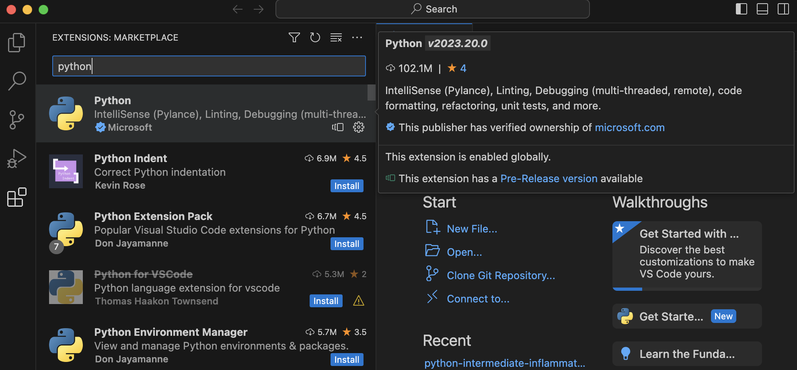

## Introduction
As we have seen in the previous episode -
even a simple software project is typically split into smaller functional units and modules,
which are kept in separate files and subdirectories.
As your code starts to grow and becomes more complex,
it will involve many different files and various external libraries.
You will need an application to help you manage all the complexities of,
and provide you with some useful (visual) facilities for,
the software development process.
Such clever and useful graphical software development applications are called
Integrated Development Environments (IDEs).

## Integrated Development Environments
An IDE normally consists of at least a source code editor,
build automation tools
and a debugger.
The boundaries between modern IDEs and other aspects of the broader software development process
are often blurred.
Nowadays IDEs also offer version control support,
tools to construct graphical user interfaces (GUI)
and web browser integration for web app development,
source code inspection for dependencies and many other useful functionalities.
The following is a list of the most commonly seen IDE features:

- syntax highlighting -
  to show the language constructs, keywords and the syntax errors
  with visually distinct colours and font effects
- code completion -
  to speed up programming by offering a set of possible (syntactically correct) code options
- code search -
  finding package, class, function and variable declarations, their usages and referencing
- version control support -
  to interact with source code repositories
- debugging -
  for setting breakpoints in the code editor,
  step-by-step execution of code and inspection of variables

IDEs are extremely useful and modern software development would be very hard without them.
There are a number of IDEs available for Python development;
a good overview is available from the
[Python Project Wiki](https://wiki.python.org/moin/IntegratedDevelopmentEnvironments).
In addition to IDEs, there are also a number of code editors that have Python support.
Code editors can be as simple as a text editor
with syntax highlighting and code formatting capabilities
(e.g., GNU EMACS, Vi/Vim).
Most good code editors can also execute code and control a debugger,
and some can also interact with a version control system.
Compared to an IDE, a good dedicated code editor is usually smaller and quicker,
but often less feature-rich.
You will have to decide which one is the best for you -
in this course we will learn how to use [VS Code](https://code.visualstudio.com/),
a free multi-language (including Python) IDE.
Some popular alternatives for Python include
free and open source IDE [Spyder](https://www.spyder-ide.org/)
and JetBrain's free and open source [PyCharm](https://www.jetbrains.com/pycharm/).

> ## Using PyCharm for This Course
> If you want to use PyCharm as your IDE for this course, you can use the
> [IDE episode of the original course](https://carpentries-incubator.github.io/python-intermediate-development/13-ides/index.html)
> to help you set up. The instructions for VS Code in the course will not apply to you verbatim but there 
> is an equivalent functionality in PyCharm for each of the actions we ask you to do in VS Code.
{: .callout}

## Using the VS Code IDE

Let's open our project in VS Code now and familiarise ourselves with some commonly used features.

### Opening a Software Project
If you don't have VS Code running yet, start it up now.
An interactive **Welcome** page will appear,
which allows you to configure your development environment's themes and other aspects,
but can skip these steps for now, by clicking on `Mark Done` near the bottom of that page.
The **Welcome** page will now ask you what you want to do,
e.g. open a `New File`, `Open File` to select an existing one, `Open Folder` or `Clone a Git Repository`.

Select `Open Folder` and find the software project directory
`python-intermediate-rivercatchment` you cloned earlier.
This directory is now the current working directory for VS Code,
so when we run scripts from VS Code, this is the directory they will run from.
If VS Code asks you: `Do you trust the authors of the files in this folder?`,
select `Yes, I trust the authors`.

On the left side of the VS Code interface is the 'Activity Bar', which contains several tabs.
The top (default) tab is the `Explorer` view,
and is represented by an icon of a couple of sheets of paper.
This opens a project/file navigator window which can be used to traverse
and select the files (and any subdirectories) within the working directory,
and selected files are opened in an editor window on the right.
Further down the Activity Bar is the `Extensions` Tab,
represented by four squares, the top-right square not yet connected to the others.
We will use this to add the Python extension for VS Code.
Click on the `Extensions` tab and, in the search text box,
type Python. Select the `Python` extension, as shown in the following figure,
and click the blue `install` button.

{: .image-with-shadow width="1000px" }

At the bottom of the screen, you have a status bar which shows the current Git branch,
and typically the Virtual Environment being used by our project.
The latter isn't displayed here because we haven't set it yet, we'll do that soon.
Along the top, the menu bar has a variety of options,
for example opening a terminal (the command line within VS Code).
We will be using some of these in our upcoming episodes.

You can close the `Welcome` and any other open documents in the main editor window.
Now click on the `Explorer` tab on the left hand side.
Use this view to navigate to the `catchment-analysis.py` file and select it,
so that its contents are displayed in the editor window.

{: .image-with-shadow width="1000px" }

You may have noticed that the virtual environment (`venv`) that we created previously
(held in the `./venv` folder in our project directory)
is now showing on the bottom status bar, on the right hand side.
If this is the case, it shows that VS Code is using that environment as the interpreter.
In many cases, VS Code will have been able to locate this environment automatically,
and add it as the most likely option (as it is located within the current project directory).
But it is better to explicitly select an interpeter for your project,
to do this follow these steps:
1. Press `Command-Shift-P` (on Mac) or `Control-Shift-P` (on Windows or Linux) to bring up the VS Code Command Palette
2. Search for `Python: select interpreter` and select it
3. This will display a drop-down list of options, select `+ Enter interpreter path...`
4. Click on `Find...` and browse in the pop-up window to select the path to the `python` binary file held in the `./venv/bin/` directory. 

{: .image-with-shadow width="800px" }

To make working with Python virtual environments easier in VS Code
we will install another extension called `Python Environment Manager`.
Click on the Extensions tab and in the search edit box, type `Python Environment Manager`,
select the correct extension, and click the blue `install` button.
A new tab will appear at the bottom of the Activity Bar, as shown below:

{: .image-with-shadow width="800px" } 

You can navigate around the current venv environment or look at alternatives environments,
either within the current workspace or elsewhere on your computer (listed under "Global Environments").
Note that the external libraries we installed earlier are listed here, under "venv".
VS Code has recognised the virtual environment we created from the command line using `venv`,
and enables us to work with the installed libraries as we would from the command line.

Also note that, although the names are not the same -
this is one and the same virtual environment
and changes made to it in VS Code will be accessible from the command line and vice versa.
Let's see this in action through the following exercise.

> ## Exercise: Compare External Libraries in the Command Line and VS Code
> Can you recall two places where information about our project's dependencies
> can be found from the command line?
> Compare that information with the equivalent configuration in VS Code.
>
> Hint: We can use an argument to `pip`,
> or find the packages directly in a subdirectory of our virtual environment directory "venv".
>
>> ## Solution
>> From the previous episode,
>> you may remember that we can get the list of packages in the current virtual environment
>> using `pip`:
>> ~~~
>> (venv) $ python3 -m pip list
>> ~~~
>> {: .language-bash}
>> ~~~
>> Package         Version
>> --------------- -------
>> contourpy       1.0.5
>> cycler          0.11.0
>> fonttools       4.37.4
>> kiwisolver      1.4.4
>> matplotlib      3.6.1
>> numpy           1.23.4
>> packaging       21.3
>> pandas          1.5.0
>> Pillow          9.2.0
>> pip             21.3.1
>> pyparsing       3.0.9
>> python-dateutil 2.8.2
>> pytz            2022.5
>> setuptools      60.2.0
>> six             1.16.0
>> wheel           0.37.1
>> ~~~
>> {: .output}
>> However, `python3 -m pip list` shows all the packages in the virtual environment -
>> if we want to see only the list of packages that we installed,
>> we can use the `python3 -m pip freeze` command instead:
>> ~~~
>> (venv) $ python3 -m pip freeze
>> ~~~
>> {: .language-bash}
>> ~~~
>> contourpy==1.0.5
>> cycler==0.11.0
>> fonttools==4.37.4
>> kiwisolver==1.4.4
>> matplotlib==3.6.1
>> numpy==1.23.4
>> packaging==21.3
>> pandas==1.5.0
>> Pillow==9.2.0
>> pyparsing==3.0.9
>> python-dateutil==2.8.2
>> pytz==2022.5
>> six==1.16.0
>> ~~~
>> {: .output}
>> We see the `pip` package in `python3 -m pip list` but not in `python3 -m pip freeze` 
>> as we did not install it using `pip`.
>> Remember that we use `python3 -m pip freeze` to update our `requirements.txt` file,
>> to keep a list of the packages our virtual environment includes.
>> Python will not do this automatically;
>> we have to manually update the file when our requirements change using:
>> ~~~
>> python3 -m pip freeze > requirements.txt
>> ~~~
>> {: .language-bash}
>>
>> If we want, we can also see the list of packages directly in the following subdirectory of `venv`:
>> ~~~
>> (venv) $ ls -l venv/lib/python3.11/site-packages
>> ~~~
>> {: .language-bash}
>>
>> ~~~
total 88
drwxr-xr-x  105 alex  staff   3360 20 Nov 15:34 PIL
drwxr-xr-x    9 alex  staff    288 20 Nov 15:34 Pillow-10.1.0.dist-info
drwxr-xr-x    4 alex  staff    128 20 Nov 15:34 __pycache__
drwxr-xr-x    5 alex  staff    160 20 Nov 15:32 _distutils_hack
drwxr-xr-x   16 alex  staff    512 20 Nov 15:34 contourpy
drwxr-xr-x    7 alex  staff    224 20 Nov 15:34 contourpy-1.2.0.dist-info
drwxr-xr-x    5 alex  staff    160 20 Nov 15:34 cycler
drwxr-xr-x    8 alex  staff    256 20 Nov 15:34 cycler-0.12.1.dist-info
drwxr-xr-x   14 alex  staff    448 20 Nov 15:34 dateutil
-rw-r--r--    1 alex  staff    151 20 Nov 15:32 distutils-precedence.pth
drwxr-xr-x   33 alex  staff   1056 20 Nov 15:34 fontTools
drwxr-xr-x    9 alex  staff    288 20 Nov 15:34 fonttools-4.45.0.dist-info
drwxr-xr-x    8 alex  staff    256 20 Nov 15:34 kiwisolver
drwxr-xr-x    8 alex  staff    256 20 Nov 15:34 kiwisolver-1.4.5.dist-info
drwxr-xr-x  150 alex  staff   4800 20 Nov 15:34 matplotlib
drwxr-xr-x   20 alex  staff    640 20 Nov 15:34 matplotlib-3.8.2.dist-info
drwxr-xr-x    5 alex  staff    160 20 Nov 15:34 mpl_toolkits
drwxr-xr-x   43 alex  staff   1376 20 Nov 15:34 numpy
drwxr-xr-x    9 alex  staff    288 20 Nov 15:34 numpy-1.26.2.dist-info
drwxr-xr-x   18 alex  staff    576 20 Nov 15:34 packaging
drwxr-xr-x    9 alex  staff    288 20 Nov 15:34 packaging-23.2.dist-info
drwxr-xr-x    9 alex  staff    288 20 Nov 15:32 pip
drwxr-xr-x   10 alex  staff    320 20 Nov 15:33 pip-23.0.1.dist-info
drwxr-xr-x    6 alex  staff    192 20 Nov 15:32 pkg_resources
-rw-r--r--    1 alex  staff     90 20 Nov 15:34 pylab.py
drwxr-xr-x   15 alex  staff    480 20 Nov 15:34 pyparsing
drwxr-xr-x    7 alex  staff    224 20 Nov 15:34 pyparsing-3.1.1.dist-info
drwxr-xr-x    9 alex  staff    288 20 Nov 15:34 python_dateutil-2.8.2.dist-info
drwxr-xr-x   49 alex  staff   1568 20 Nov 15:32 setuptools
drwxr-xr-x   10 alex  staff    320 20 Nov 15:32 setuptools-67.6.1.dist-info
drwxr-xr-x    8 alex  staff    256 20 Nov 15:34 six-1.16.0.dist-info
-rw-r--r--    1 alex  staff  34549 20 Nov 15:34 six.py
>> ~~~
>> {: .output}
>>
>> Finally, if you look at both the contents of
>> `venv/lib/python3.11/site-packages` and `requirements.txt`
>> and compare that with the packages shown in VS Code's Python Interpreter Configuration -
>> you will see that they all contain equivalent information.
> {: .solution}
{: .challenge}

#### Adding an External Library
We have already added packages `numpy` and `matplotlib` to our virtual environment
from the command line in the previous episode,
so we are up-to-date with all external libraries we require at the moment.
However, we will need library `pytest` soon to implement tests for our code.
We will use this opportunity to install it from VS Code in order to see
an alternative way of doing this and how it propagates to the command line.

1. Select the Python tab in the Activity Bar on the left, as we did earlier.
2. Under our `venv` environment, hover over `Packages`
3. Select the magnifying glass icon (Install Package) 
4. In the window that appears, search for the name of the library (`pytest`),
   then click on this package in the list below to install it.
   {: .image-with-shadow width="800px" }

It may take a few minutes for VS Code to install it.
After it is done, the `pytest` library is added to our virtual environment.
You can also verify this from the command line by
listing the `venv/lib/python3.11/site-packages` subdirectory.
Note, however, that `requirements.txt` is not updated -
as we mentioned earlier this is something you have to do manually.
Let's do this as an exercise.

> ## Exercise: Update `requirements.txt` After Adding a New Dependency
> Export the newly updated virtual environment into `requirements.txt` file.
>> ## Solution
>> Let's verify first that the newly installed library `pytest` is appearing in our virtual environment
>> but not in `requirements.txt`. First, let's check the list of installed packages:
>> ~~~
>> (venv) $ python3 -m pip list
>> ~~~
>> {: .language-bash}
>> ~~~
>> Package         Version
>> --------------- -------
>> attrs           22.1.0
>> contourpy       1.0.5
>> cycler          0.11.0
>> fonttools       4.37.4
>> iniconfig       1.1.1
>> kiwisolver      1.4.4
>> matplotlib      3.6.1
>> numpy           1.23.4
>> packaging       21.3
>> pandas          1.5.0
>> Pillow          9.2.0
>> pip             21.3.1
>> pluggy          1.0.0
>> py              1.11.0
>> pyparsing       3.0.9
>> pytest          7.1.3
>> python-dateutil 2.8.2
>> pytz            2022.5
>> setuptools      60.2.0
>> six             1.16.0
>> tomli           2.0.1
>> wheel           0.37.1
>> ~~~
>> {: .output}
>> We can see the `pytest` library appearing in the listing above. However, if we do:
>>~~~
>>(venv) $ cat requirements.txt
>>~~~
>>{: .language-bash}
>>~~~
>> contourpy==1.0.5
>> cycler==0.11.0
>> fonttools==4.37.4
>> kiwisolver==1.4.4
>> matplotlib==3.6.1
>> numpy==1.23.4
>> packaging==21.3
>> pandas==1.5.0
>> Pillow==9.2.0
>> pyparsing==3.0.9
>> python-dateutil==2.8.2
>> pytz==2022.5
>> six==1.16.0
>>~~~
>>{: .output}
>> `pytest` is missing from `requirements.txt`. To add it, we need to update the file by repeating the command:
>> ~~~
>> (venv) $ python3 -m pip freeze > requirements.txt
>> ~~~
>> {: .language-bash}
>> `pytest` is now present in `requirements.txt`:
>>~~~
>> attrs==22.1.0
>> contourpy==1.0.5
>> cycler==0.11.0
>> fonttools==4.37.4
>> iniconfig==1.1.1
>> kiwisolver==1.4.4
>> matplotlib==3.6.1
>> numpy==1.23.4
>> packaging==21.3
>> pandas==1.5.0
>> Pillow==9.2.0
>> pluggy==1.0.0
>> py==1.11.0
>> pyparsing==3.0.9
>> pytest==7.1.3
>> python-dateutil==2.8.2
>> pytz==2022.5
>> six==1.16.0
>> tomli==2.0.1
>>~~~
>{: .solution}
{: .challenge}

#### Adding a Run Configuration for Our Project
By default, if you click on the run button on the Activity Bar (see figure below) 
VS Code will look in the `.vscode` folder for a `launch.json` file. This file would contain our run configurations and 
as you can see, if one is not found, you will be asked to create one.

{: .image-with-shadow width="1000px" }

Configurations are useful for running the code whilst editing and also
if we need to test different configurations as we code.
To do this we need to create some custom run configurations,
which can be done from the `Run and Debug` panel.

We are going to create two run configurations,
one for the current python file and the other for the `catchment-analysis` module:
1. Click on the `Run and Debug` tab in the Activity Bar on the left.
2. In the `Run and Debug` panel click on the `create a launch.json file` link.
3. This will open a search text box, from which select
`Python File: Debug the currently active Python File`
4. This will create a `launch.json` file, and open it in the editor window,
with a configuration for just python files
5. In that file, add a python module configuration,
so that the `configurations` section of the file looks like the code below.
6. Save the file.

```
"configurations": [
        {
            "name": "Python: Current File",
            "type": "python",
            "request": "launch",
            "program": "${file}",
            "console": "integratedTerminal",
            "justMyCode": true
        },
        {
            "name": "Python: Module",
            "type": "python",
            "request": "launch",
            "module": "catchment-analysis",
            "justMyCode": true
        }
    ]

```

Click again on the `Run and Debug` tab in the Activity Bar.
The `Run and Debug` panel should have changed,
and there will now be a Run symbol at the top of the panel.
When you click on the Run symbol there should be a drop-down list with two choices,
run `Python: Current File` or `Python: Module`,
with the latter being set to run the catchment-analysis.py script as a module.
You can edit the `launch.json` file further
by clicking on the `Settings` cog symbol next to the Run symbol.
This is useful for adding further configurations,
or to add arguments to be input when running the scripts.

Now you know how to configure and manipulate your environment in both tools
(command line and VS Code),
which is a useful parallel to be aware of.
Let's have a look at some other features afforded to us by VS Code.

### Syntax Highlighting
The first thing you may notice is that code is displayed using different colours.
Syntax highlighting is a feature that displays source code terms
in different colours and fonts according to the syntax category the highlighted term belongs to.
It also makes syntax errors visually distinct.
Highlighting does not affect the meaning of the code itself -
it's intended only for humans to make reading code and finding errors easier.

{: .image-with-shadow width="1000px" }

### Code Completion
As you start typing code,
VS Code will offer to complete some of the code for you in the form of an auto completion popup.
This is a context-aware code completion feature
that speeds up the process of coding
(e.g. reducing typos and other common mistakes)
by offering available variable names,
functions from available packages,
parameters of functions,
hints related to syntax errors,
etc.

{: .image-with-shadow width="600px" }

### Code Definition & Documentation References
You will often need code reference information to help you code.
VS Code shows this useful information,
such as definitions of symbols
(e.g. functions, parameters, classes, fields, and methods)
and documentation references ([*docstrings*](../15-coding-conventions/index.html#documentation-strings-aka-docstrings)
for any symbol created in accordance with [PEP-257](https://peps.python.org/pep-0257/))
by means of quick popups and inline tooltips.

For a selected piece of code, you can access the original source code using the `Go` menu.
You can also access various code reference information by right-clicking on the code,
then selecting the `Peek` submenu. This includes:
- Peek Definition -
  where and how symbols (functions, parameters, classes, fields, and methods) are defined
- Peek Type Definition -
  type definition of variables, fields or any other symbols
- Peek References -
  where this code is referenced elsewhere in the program.

{: .image-with-shadow width="1000px" }


### Code Search
You can search for a text string within a project,
use different scopes to narrow your search process,
use regular expressions for complex searches,
include/exclude certain files from your search, find usages and occurrences.
To find a search string in the whole project:

1. From the main menu,
   select `Edit | Find in Files ...`
2. Type your search string in the search field of the search panel.
   Alternatively, in the editor, highlight the string you want to find
   and press `Command-Shift-F` (on Mac) or `Control-Shift-F` (on Windows).
   VS Code places the highlighted string into the search field of the search panel.

    {: .image-with-shadow width="800px" }
    VS Code will list the search strings and all the files that contain them.
    You can also group the files by folder/sub-folder names.
3. Check the results in the preview area of the dialog where you can replace the search string
   or select another string,
   or press `Command-Shift-F` (on Mac) or `Control-Shift-F` (on Windows) again
   to start a new search.
4. To see the list of occurrences in a separate tab,
   click the `Open New Search Editor` button at the top of the search panel.
   The new find panel will appear as a new tab in the editor window;
   use this panel and its options to group the results, preview them,
   and work with them further.

    {: .image-with-shadow width="1000px" }

### Version Control
VS Code supports a directory-based versioning model,
which means that each project directory can be associated with a different version control system.
Our project was already under Git version control and VS Code recognised it.
It is also possible to add an unversioned project directory to version control directly from VS Code.

During this course,
we will do all our version control commands from the command line
but it is worth noting that VS Code supports a comprehensive subset of Git commands
(i.e. it is possible to perform a set of common Git commands from VS Code but not all).
A very useful version control feature in VS Code is
graphically comparing changes you made locally to a file
with the version of the file in a repository,
a different commit version
or a version in a different branch -
this is something that cannot be done equally well from the text-based command line.

You can get a full
[documentation on VS Code's built-in version control support](https://code.visualstudio.com/docs/sourcecontrol/overview)
online.

{: .image-with-shadow width="1000px" }

### Running Scripts in VS Code
We have configured our environment and explored some of the most commonly used VS Code features
and are now ready to run our script from VS Code!
To do so select the `catchment-analysis.py` file
in the VS Code project/file explorer, and select `Run`.
Or you can select the `Run and Debug` tab
and then select the `Run: Python Module` configuration
that we created earlier.

The script will run in a terminal window at the bottom of the IDE window and display something like:

~~~
/Users/alex/work/python-intermediate-rivercatchment/venv/bin/python /Users/alex/work/python-intermediate-rivercatchment/catchment-analysis.py
usage: catchment-analysis.py [-h] infiles [infiles ...]
catchment-analysis.py: error: the following arguments are required: infiles

Process finished with exit code 2
~~~
{: .output}

This is the same error we got when running the script from the command line.
We will get back to this error shortly -
for now, the good thing is that we managed to set up our project for development
both from the command line and VS Code and are getting the same outputs.
Before we move on to fixing errors and writing more code,
let's have a look at the last set of tools for collaborative code development
which we will be using in this course - Git and GitHub.


