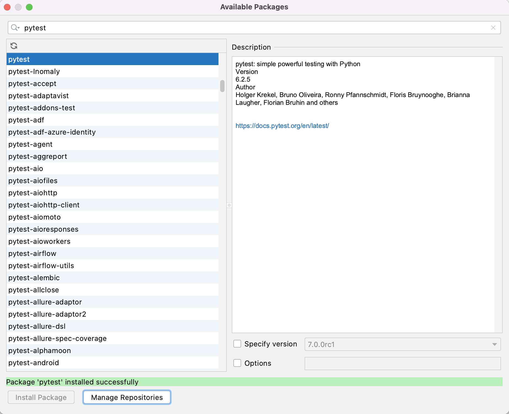
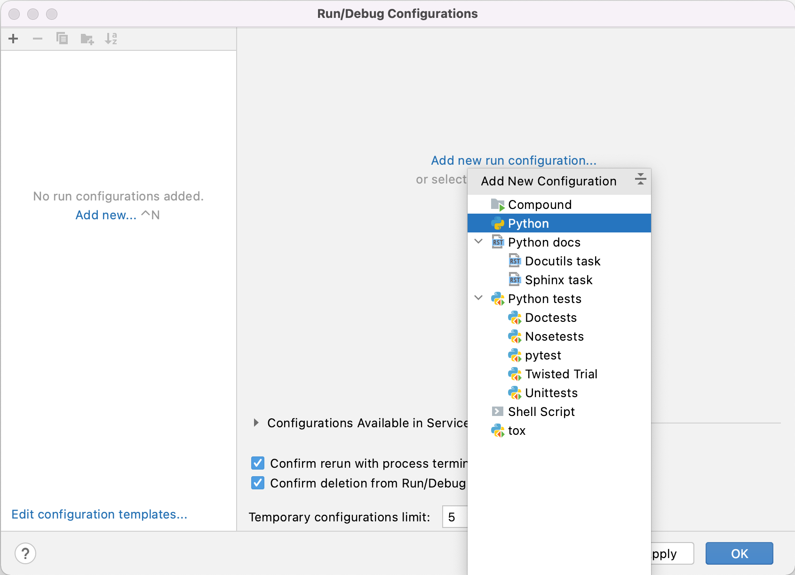
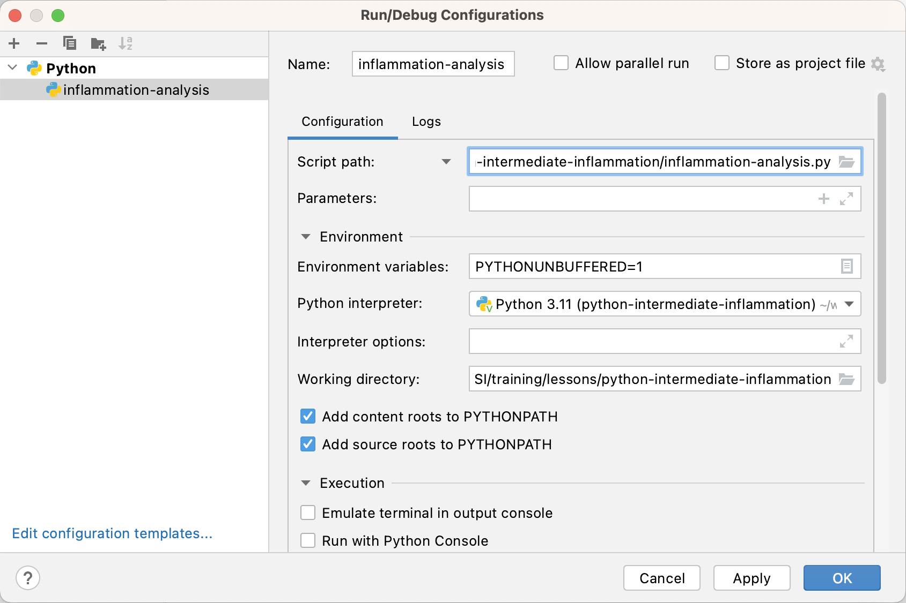

## Introduction
As we have seen in the
previous episode - even a simple software project is typically split into smaller functional units and modules which are kept in separate files and subdirectories.
As your code starts to grow and becomes more complex, it will involve many different files and various external libraries. You will need an application to help you manage all the complexities of, and provide you with some useful (visual)
facilities for, the software development process. Such clever and useful graphical
software development applications are called Integrated Development Environments (IDEs).

## Integrated Development Environments
An IDE normally consists of at least a source code editor, build automation tools and a debugger.
The boundaries between modern IDEs and other aspects of the broader software development process are often blurred as
nowadays IDEs also offer version control support, tools to construct graphical user interfaces (GUI) and web browser
integration for web app development, source code inspection for dependencies and many other useful functionalities. The
following is a list of the most commonly seen IDE features:

- syntax highlighting - to show the language constructs, keywords and the syntax errors with visually distinct colours
and font effects
- code completion - to speed up programming by offering a set of possible (syntactically correct) code options
- code search - finding package, class, function and variable declarations, their usages and referencing
- version control support - to interact with source code repositories
- debugging - for setting breakpoints in the code editor, step-by-step execution of code and inspection of variables

IDEs are extremely useful and modern software development would be very hard without them. There are a number of IDEs
available for Python development; a good overview is available from the
[Python Project Wiki](https://wiki.python.org/moin/IntegratedDevelopmentEnvironments). In addition to IDEs,
there are also a number of code editors that have
Python support. Code editors can be as simple as a text editor with syntax highlighting and code formatting capabilities
(e.g. GNU EMACS, Vi/Vim, Atom). Most good code editors can also execute code and control a
debugger, and some can also interact with a version control system. Compared to an IDE, a good dedicated code
editor is usually smaller and quicker, but often less feature-rich. You will have to decide which one is the best for
you - in this course we will learn how to use [PyCharm](https://www.jetbrains.com/pycharm/), a free,
open source Python IDE. Some popular alternatives include free and open source IDE [Spyder](https://www.spyder-ide.org/) and Microsoft's free [Visual Studio Code](https://code.visualstudio.com/).

## Using the PyCharm IDE

Let's open our project in PyCharm now and familiarise ourselves with some commonly used features.

### Opening a Software Project
If you don't have PyCharm running yet, start it up now. You can skip the initial configuration steps which just go through
selecting a theme and other aspects. You should be presented with a dialog box that asks you what you want to do,
e.g. `Create New Project`, `Open`, or `Check out from Version Control`.

Select `Open` and find the software project directory `python-intermediate-rivercatchment` you cloned earlier.
This directory is now the current working directory for PyCharm, so when we run scripts from PyCharm,
this is the directory they will run from.

PyCharm will show you a *'Tip of the Day'* window which you can safely ignore and close for now. You may also get a
warning *'No Python interpreter configured for the project'* - we [will deal with this](#configuring-pycharm-with-anaconda)
shortly after we familiarise ourselves with
the PyCharm environment.
You will notice the IDE shows you a project/file navigator window on the left hand side, to traverse and select the files
(and any subdirectories) within the working directory, and an editor window on the right. At the bottom, you would
typically have a panel for version control, terminal (the command line within PyCharm) and a TODO list.

{: .image-with-shadow width="1000px" }

Select the `catchment-analysis.py` file in the project navigator on the left so that its contents are
displayed in the editor window. You may notice a warning about the missing Python interpreter at the top of the editor panel showing `catchment-analysis.py` file - this is one of the first things you will have to configure for your project before you can do any work. 

{: .image-with-shadow width="800px" } 

You may take the shortcut and click on one of the offered options above but we want to take you through 
the whole process of setting up your environment in PyCharm as this is important conceptually. 

### Configuring a Virtual Environment in PyCharm
Before you can run the code from PyCharm, you need to explicitly specify the path to the Python
interpreter on your system. The same goes for any dependencies your code may have - you need to tell PyCharm
where to find them - much like we did from the command line in the previous episode. Luckily for us, we have already set up a virtual environment
for our project from the command line and PyCharm is clever enough to understand it.

#### Adding a Python Interpreter
1. Select either `PyCharm` > `Preferences` (Mac) or `File` > `Settings` (Linux, Windows).
2. In the preferences window that appears, select `Project: python-intermediate-rivercatchment` >
   `Python Interpreter` from the left. You'll
   see a number of Python packages displayed as a list, and importantly above that, the current Python interpreter that is
   being used. These may be blank or set to `<No interpreter>`, or possibly the default version of Python installed on your system, e.g. `Python 2.7 /usr/bin/python2.7`, which we do not want to use in this instance.
3. Select the cog-like button in the top right, then `Add Local...` (or `Add...` depending on your PyCharm version). An `Add Python Interpreter` window will appear.
4. Select `Virtualenv Environment` from the list on the left and ensure that `Existing environment` checkbox is
   selected within the popup window. In the `Interpreter` field point to the Python 3 executable inside 
   your virtual environment's `bin` directory (make sure you navigate to it and select it from the 
   file browser rather than just accept the default offered by PyCharm). Note that there is also an option to create a new virtual environment, 
   but we are not using that option as we want to reuse the one we created from the command line in 
   the previous episode.
   {: .image-with-shadow width="800px"}
5. Select `Make available to all projects` checkbox so we can also use this environment for other projects if we wish.
6. Select `OK` in the `Add Python Interpreter` window. Back in the `Preferences` window, you should select
   "Python 3.9 (python-intermediate-rivercatchment)" or similar (that you've just added) from the `Project Interpreter` drop-down list.

Note that a number of external libraries have magically appeared under the
"Python 3.9 (python-intermediate-rivercatchment)" interpreter, including `numpy` and `matplotlib`. PyCharm has recognised
the virtual environment we created from the command line using `venv` and has added these libraries
effectively replicating our virtual environment in PyCharm (referred to as "Python 3.9 (python-intermediate-rivercatchment)"). 

{: .image-with-shadow width="800px"}

Also note that, although the names are not the same - this is one and the same virtual environment and changes done to it in PyCharm will propagate to the command line and vice versa. Let's see this in 
action through the following exercise.

> ## Exercise: Compare External Libraries in the Command Line and PyCharm
>Can you recall two places where information about our project's dependencies
can be found from the command line? Compare that information with the equivalent configuration in PyCharm.
>
>Hint: We can use an argument to `pip`, or find the packages directly in a subdirectory
of our virtual environment directory "venv".
>
>> ## Solution
>> From the previous episode, you may remember that we can get the list of packages in the current virtual environment using the `pip3 list` command:
>> ~~~
>> (venv) $ pip3 list
>> ~~~
>> {: .language-bash}
>> ~~~
Package         Version
--------------- -------
contourpy       1.0.5
cycler          0.11.0
fonttools       4.37.4
kiwisolver      1.4.4
matplotlib      3.6.1
numpy           1.23.4
packaging       21.3
pandas          1.5.0
Pillow          9.2.0
pip             21.3.1
pyparsing       3.0.9
python-dateutil 2.8.2
pytz            2022.5
setuptools      60.2.0
six             1.16.0
wheel           0.37.1
>> ~~~
>> {: .output}
>> However, `pip3 list` shows all the packages in the virtual environment - if we want to see only the list of packages that we installed, we can use the `pip3 freeze` command instead:
>> ~~~
>> (venv) $ pip3 freeze
>> ~~~
>> {: .language-bash}
>> ~~~
contourpy==1.0.5
cycler==0.11.0
fonttools==4.37.4
kiwisolver==1.4.4
matplotlib==3.6.1
numpy==1.23.4
packaging==21.3
pandas==1.5.0
Pillow==9.2.0
pyparsing==3.0.9
python-dateutil==2.8.2
pytz==2022.5
six==1.16.0
>> ~~~
>> {: .output}
>> We see `pip` in `pip3 list` but not in `pip3 freeze` as we did not install it using `pip`. 
>> Remember that we use `pip3 freeze` to update our `requirements.txt` file, to keep a list of the packages our virtual environment includes. 
>> Python will not do this automatically; we have to manually update the file when our requirements change using:
>> ~~~
>> pip3 freeze > requirements.txt
>> ~~~
>> {: .language-bash}
>>
>> If we want, we can also see the list of packages directly in the following subdirectory of `venv`:
>>~~~
>>(venv) $ ls -l venv/lib/python3.9/site-packages
>>~~~
>>{: .language-bash}
>>
>>~~~
total 1088
drwxr-xr-x  103 alex  staff    3296 17 Nov 11:55 PIL
drwxr-xr-x    9 alex  staff     288 17 Nov 11:55 Pillow-8.4.0.dist-info
drwxr-xr-x    6 alex  staff     192 17 Nov 11:55 __pycache__
drwxr-xr-x    5 alex  staff     160 17 Nov 11:53 _distutils_hack
drwxr-xr-x    8 alex  staff     256 17 Nov 11:55 cycler-0.11.0.dist-info
-rw-r--r--    1 alex  staff   14519 17 Nov 11:55 cycler.py
drwxr-xr-x   14 alex  staff     448 17 Nov 11:55 dateutil
-rw-r--r--    1 alex  staff     152 17 Nov 11:53 distutils-precedence.pth
drwxr-xr-x   31 alex  staff     992 17 Nov 11:55 fontTools
drwxr-xr-x    9 alex  staff     288 17 Nov 11:55 fonttools-4.28.1.dist-info
drwxr-xr-x    8 alex  staff     256 17 Nov 11:55 kiwisolver-1.3.2.dist-info
-rwxr-xr-x    1 alex  staff  216968 17 Nov 11:55 kiwisolver.cpython-39-darwin.so
drwxr-xr-x   92 alex  staff    2944 17 Nov 11:55 matplotlib
-rw-r--r--    1 alex  staff     569 17 Nov 11:55 matplotlib-3.5.0-py3.9-nspkg.pth
drwxr-xr-x   20 alex  staff     640 17 Nov 11:55 matplotlib-3.5.0.dist-info
drwxr-xr-x    7 alex  staff     224 17 Nov 11:55 mpl_toolkits
drwxr-xr-x   39 alex  staff    1248 17 Nov 11:55 numpy
drwxr-xr-x   11 alex  staff     352 17 Nov 11:55 numpy-1.21.4.dist-info
drwxr-xr-x   15 alex  staff     480 17 Nov 11:55 packaging
drwxr-xr-x   10 alex  staff     320 17 Nov 11:55 packaging-21.2.dist-info
drwxr-xr-x    8 alex  staff     256 17 Nov 11:53 pip
drwxr-xr-x   10 alex  staff     320 17 Nov 11:53 pip-21.1.3.dist-info
drwxr-xr-x    7 alex  staff     224 17 Nov 11:53 pkg_resources
-rw-r--r--    1 alex  staff      90 17 Nov 11:55 pylab.py
drwxr-xr-x    8 alex  staff     256 17 Nov 11:55 pyparsing-2.4.7.dist-info
-rw-r--r--    1 alex  staff  273365 17 Nov 11:55 pyparsing.py
drwxr-xr-x    9 alex  staff     288 17 Nov 11:55 python_dateutil-2.8.2.dist-info
drwxr-xr-x   41 alex  staff    1312 17 Nov 11:53 setuptools
drwxr-xr-x   11 alex  staff     352 17 Nov 11:53 setuptools-57.0.0.dist-info
drwxr-xr-x   19 alex  staff     608 17 Nov 11:55 setuptools_scm
drwxr-xr-x   10 alex  staff     320 17 Nov 11:55 setuptools_scm-6.3.2.dist-info
drwxr-xr-x    8 alex  staff     256 17 Nov 11:55 six-1.16.0.dist-info
-rw-r--r--    1 alex  staff   34549 17 Nov 11:55 six.py
drwxr-xr-x    8 alex  staff     256 17 Nov 11:55 tomli
drwxr-xr-x    7 alex  staff     224 17 Nov 11:55 tomli-1.2.2.dist-info
>>~~~
>>{: .output}
>>
>> Finally, if you look at both the contents of `venv/lib/python3.9/site-packages` and `requirements.txt` and compare that with the packages shown in PyCharm's Python Interpreter Configuration - you will see that they all
>> contain equivalent information.
> {: .solution}
{: .challenge}

#### Adding an External Library
We have already added packages `numpy` and `matplotlib` to our virtual environment from the command line
in the previous episode, so we are up-to-date with all external libraries we require at the moment. However, we will need library `pytest` soon to implement tests for our code so will use this 
opportunity to install it from PyCharm in order to see an alternative
way of doing this and how it propagates to the command line.

1. Select either `PyCharm` > `Preferences` (Mac) or `File` > `Settings` (Linux, Windows).
2. In the preferences window that appears, select `Project: python-intermediate-rivercatchment` >
   `Project Interpreter` from the left.
3. Select the `+` icon at the top of the window. In the window that appears, search for the name of the library (`pytest`), select it from the list, then select `Install Package`.
   {: .image-with-shadow width="800px" }
4. Select `OK` in the `Preferences` window.

It may take a few minutes for PyCharm to install it. After it is done, the `pytest` library is added to our
virtual environment. You can also verify this from the command line by listing the `venv/lib/python3.9/site-packages` subdirectory. Note, however, that `requirements.txt` is not updated - as we mentioned earlier this is something you have to do manually. Let's do this as an exercise.

>## Exercise: Update `requirements.txt` After Adding a New Dependency
Export the newly updated virtual environment into `requirements.txt` file.
>>## Solution
>>Let's verify first that the newly installed library `pytest` is appearing in our virtual environment
>>but not in `requirements.txt`. First, let's check the list of installed packages:
>> ~~~
>> (venv) $ pip3 list
>> ~~~
>> {: .language-bash}
>> ~~~
Package         Version
--------------- -------
attrs           22.1.0
contourpy       1.0.5
cycler          0.11.0
fonttools       4.37.4
iniconfig       1.1.1
kiwisolver      1.4.4
matplotlib      3.6.1
numpy           1.23.4
packaging       21.3
pandas          1.5.0
Pillow          9.2.0
pip             21.3.1
pluggy          1.0.0
py              1.11.0
pyparsing       3.0.9
pytest          7.1.3
python-dateutil 2.8.2
pytz            2022.5
setuptools      60.2.0
six             1.16.0
tomli           2.0.1
wheel           0.37.1
>> ~~~
>> {: .output}
>> We can see the `pytest` library appearing in the listing above. However, if we do:
>>~~~
>>(venv) $ cat requirements.txt
>>~~~
>>{: .language-bash}
>>~~~
contourpy==1.0.5
cycler==0.11.0
fonttools==4.37.4
kiwisolver==1.4.4
matplotlib==3.6.1
numpy==1.23.4
packaging==21.3
pandas==1.5.0
Pillow==9.2.0
pyparsing==3.0.9
python-dateutil==2.8.2
pytz==2022.5
six==1.16.0
>>~~~
>>{: .output}
>> `pytest` is missing from `requirements.txt`. To add it, we need to update the file by repeating the command:
>>~~~
>>(venv) $ pip3 freeze > requirements.txt
>>~~~
>>{: .language-bash}   
>> `pytest` is now present in `requirements.txt`:
>>~~~
attrs==22.1.0
contourpy==1.0.5
cycler==0.11.0
fonttools==4.37.4
iniconfig==1.1.1
kiwisolver==1.4.4
matplotlib==3.6.1
numpy==1.23.4
packaging==21.3
pandas==1.5.0
Pillow==9.2.0
pluggy==1.0.0
py==1.11.0
pyparsing==3.0.9
pytest==7.1.3
python-dateutil==2.8.2
pytz==2022.5
six==1.16.0
tomli==2.0.1
>>~~~
>{: .solution}
{: .challenge}

#### Adding a Run Configuration for Our Project
Having configured a virtual environment, we now need to tell PyCharm to use it for our project. This is done by adding a **Run Configuration** to a project:

1. To add a new configuration for a project - select `Run` > `Edit Configurations...` from the top menu.
2. Select `Add new run configuration...` then `Python`.
   {: .image-with-shadow width="800px" }
3. In the new popup window, in the `Script path` field select the folder
   button and find and select `catchment-analysis.py`. This tells PyCharm which script to run (i.e. what the main entry point to our application is).
   {: .image-with-shadow width="800px" }
4. In the same window, select "Python 3.9 (python-intermediate-rivercatchment)" (i.e. the virtual environment and interpreter you configured earlier in this episode) in the `Python interpreter` field.
5. You can give this run configuration a name at the top of the window if you like - e.g. let's name it `catchment analysis`.
6. You can optionally configure run parameters and environment variables in the same window - we do not need this at the moment.
7. Select `Apply` to confirm these settings.

> ## Virtual Environments & Run Configurations in PyCharm
>
> We configured the Python interpreter to use for our project by pointing PyCharm to the
> virtual environment we created from the command line (which also includes external libraries
> our code needs to run).
> Recall that you can create several virtual environments based on the same Python interpreter but with
different external libraries - this is helpful when you need to develop different types of applications.
> For example, you can create one virtual environment based on Python 3.9 to develop Django Web applications and another virtual environment based on the same Python 3.9 to work with scientific libraries.
>
> **Run Configurations** in PyCharm are named sets of startup properties that define what to execute and what parameters (i.e. what additional configuration options) to use on top of virtual environments.
> You can vary these configurations each time your code is executed, which is particularly useful for running, debugging and testing your code.
{: .callout}

Now you know how to configure and manipulate your environment in both tools (command line and PyCharm), 
which is a useful parallel to be aware of. Let's have a look at some other features afforded to us by 
PyCharm.

### Syntax Highlighting
The first thing you may notice is that code is displayed using different colours.
Syntax highlighting is a feature that displays source code terms in different colours and fonts according to the syntax
category the highlighted term belongs to. It also makes syntax errors visually distinct. Highlighting does not affect
the meaning of the code itself - it's intended only for humans to make reading code and finding errors easier.

{: .image-with-shadow width="1000px" }

### Code Completion
As you start typing code, PyCharm will offer to complete some of the code for you in the form of an auto completion popup.
This is a context-aware code completion feature that speeds up the process of coding (e.g. reducing typos and other
common mistakes) by offering available variable
names, functions from available packages, parameters of functions, hints related to syntax errors, etc.

{: .image-with-shadow width="600px" }

### Code Definition & Documentation References
You will often need code reference information to help you code. PyCharm shows this useful information, such as definitions of symbols (e.g. functions, parameters, classes, fields, and methods) and documentation references by means of quick popups and inline tooltips.

For a selected piece of code, you can access various code reference information from the `View` menu (or via various keyboard shortcuts), including:
- Quick Definition - where and how symbols (functions, parameters, classes, fields, and methods) are defined
- Quick Type Definition - type definition of variables, fields or any other symbols
- Quick Documentation - inline documentation (*docstrings*) for any symbol created in accordance with [PEP-257](../15-coding-conventions/index.html#documentation-strings-aka-docstrings))
- Parameter Info - the names of parameters in method and function calls
- Type Info - type of an expression

{: .image-with-shadow width="1000px" }

### Code Search
You can search for a text string within a project, use different scopes to narrow your search process, use regular expressions
for complex searches, include/exclude certain files from your search, find usages and occurrences. To find a search string
in the whole project:

1. From the main menu, select `Edit | Find | Find in Path ...` (or `Edit | Find | Find in Files...` depending on your version of PyCharm).
2. Type your search string in the search field of the popup. Alternatively, in the editor, highlight the string you
want to find and press `Command-Shift-F` (on Mac) or `Control-Shift-F` (on Windows). PyCharm places the highlighted
string into the search field of the popup.

    {: .image-with-shadow width="800px" } 
    If you need, specify the additional options in the popup. PyCharm will list the search strings and all the files that contain them.
3. Check the results in the preview area of the dialog where you can replace the search string or select another string,
or press `Command-Shift-F` (on Mac) or `Control-Shift-F` (on Windows) again to start a new search.
4. To see the list of occurrences in a separate panel, click the `Open in Find Window` button in the bottom right
corner. The find panel will appear at the bottom of the main window; use this panel and its options to group the results, preview them, and work with them further.

    {: .image-with-shadow width="1000px" }

### Version Control
PyCharm supports a directory-based versioning model, which means that each project directory can be
associated with a different version control system. Our project was already under Git version control and PyCharm
recognised it. It is also possible to add an unversioned project directory to version control directly from PyCharm.

During this course, we will do all our version control commands from the command line but it is worth
noting that PyCharm supports a comprehensive subset of Git commands (i.e. it is possible to perform a set of common
Git commands from PyCharm but not all). A very useful version control feature in PyCharm is graphically comparing
changes you made locally to a file with the version of the file in a repository, 
a different commit version or a version in a different
branch - this is something that cannot be done equally well from the text-based command line.

You can get a full
[documentation on PyCharm's built-in version control support](https://www.jetbrains.com/help/pycharm/version-control-integration.html) online.

{: .image-with-shadow width="1000px" }

### Running Scripts in PyCharm
We have configured our environment and explored some of the most commonly used PyCharm features and are now ready to run our script from PyCharm! To do so, right-click the `catchment-analysis.py` file in the PyCharm project/file navigator on the left, and select `Run 'catchment analysis'` (i.e. the Run Configuration we created earlier).

{: .image-with-shadow width="800px" }

The script will run in a terminal window at the bottom of the IDE window and display something like:

~~~
/Users/alex/work/python-intermediate-rivercatchment/venv/bin/python /Users/alex/work/python-intermediate-rivercatchment/catchment-analysis.py
usage: catchment-analysis.py [-h] infiles [infiles ...]
catchment-analysis.py: error: the following arguments are required: infiles

Process finished with exit code 2
~~~
{: .output}

This is the same error we got when running the script from the command line. We will get back to this error
shortly - for now, the good thing is that we managed to set up our project for development both from the
command line and PyCharm and are getting the same outputs.
Before we move on to fixing errors and writing more code, let's have a look at the last set of tools for collaborative
code development which we will be using in this course - Git and GitHub.



