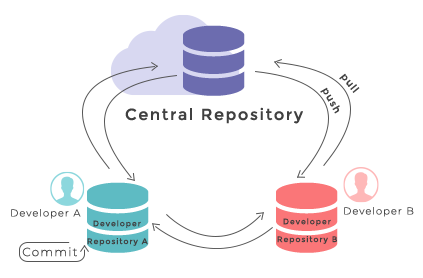
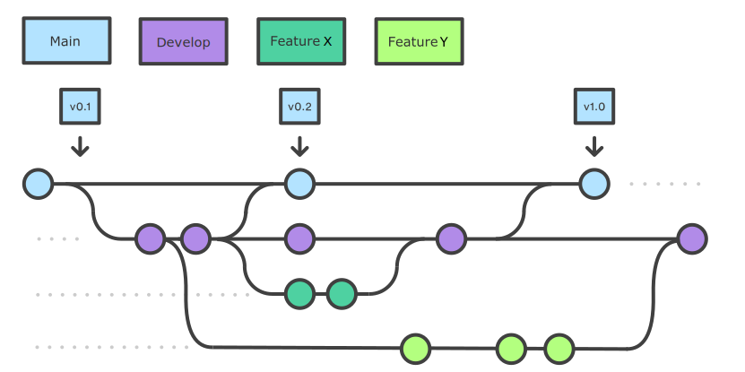

## Introduction
Here we will learn how to use the feature branch workflow to effectively collaborate with a team on a software project.

Firstly, let's remind ourselves how to work with Git from the command line.

## Git Refresher
Git is a version control system for tracking changes in computer files and coordinating work on those files among 
multiple people. It is primarily used for source code management in software development but it can be used to
track changes in files in general - it is particularly effective for tracking text-based files (e.g. source code files, 
CSV, Markdown, HTML, CSS, Tex, etc. files).

Git has several important characteristics:
- support for non-linear development allowing you and your colleagues to work on different parts of a project concurrently,
- support for distributed development allowing for multiple people to be working on the same project (even the same file) at the same time,
- every change recorded by Git remains part of the project history and can be retrieved at a later date, so even
if you make a mistake you can revert to a point before it.

The diagram below shows a typical software development lifecycle with Git and the commonly used commands to interact
with different parts of Git infrastructure, such as:
- **working directory** - a directory (including any subdirectories) where your project files live and where you are currently working. 
It is also known as the “untracked” area of Git. Any changes to files will be marked by Git in the working directory. 
If you make changes to the working directory and do not explicitly tell Git to save them - you will likely lose those 
changes. Using `git add filename` command, you tell Git to start tracking changes to file `filename` within your 
working directory.
- **staging area (index)** - once you tell Git to start tracking changes to files (with `git add filename` command), 
Git saves those changes in the staging area. Each subsequent change to the same file needs to be followed by 
another `git add filename` command to tell Git to update it in the staging area. To see what is in your working 
directory and staging area at any moment (i.e. what changes is Git tracking), run the command `git status`.
- **local repository** - stored within the `.git` directory of your project, this is where Git wraps together all your 
changes from the staging area and puts them using the `git commit` command. Each commit is a new, permanent snapshot 
(checkpoint, record) of your project in time, which you can share or revert back to.
- **remote repository** - this is a version of your project that is hosted somewhere on the Internet (e.g. on Bitbucket, GitHub, 
GitLab or somewhere else). While your project is nicely version-controlled in your local repository, and you have
snapshots of its versions from the past, if your machine crashes - you still may lose all your work.
Working with a remote
repository involves pushing your changes and pulling other people's changes to keep your local repository in sync
in order to collaborate with others and to backup your work on a different machine.

{: .image-with-shadow width="600px"}

Software development lifecycle with Git from <a href="https://www.pngwing.com/en/free-png-sazxf" target="_blank">PNGWing</a> 
 (licenced for non-commercial reuse)

## Checking-in Changes to Our Project
First make sure that you have some changes in your project. 
Update the `README.md` file, for example add a small description of how users can run your program.

Check the status:
~~~
$ git status
~~~
{: .language-bash}

~~~
On branch main
Your branch is up to date with 'origin/main'.

Changes not staged for commit:
  (use "git add <file>..." to update what will be committed)
  (use "git restore <file>..." to discard changes in working directory)
	modified:   README.md

no changes added to commit (use "git add" and/or "git commit -a")
~~~
{: .output}

As expected, Git is telling us that we have some changes present in our working
directory which we have not staged nor committed to our local repository yet.

To commit the changes in `README.md` to the local repository, we first have to add these files to 
staging area to prepare them for committing. We can do that at the same time as:

~~~
$ git add README.md
~~~
{: .language-bash}

Now we can commit them to the local repository with:

~~~
$ git commit -m "Initial commit of README.md."
~~~
{: .language-bash}

Remember to use meaningful messages for your commits.

So far we have been working in isolation - all the changes we have done are still only stored locally on our individual
machines. In order to share our work with others, we should push our changes to the remote repository on Bitbucket. 
Before we push our changes however, we should first do a `git pull`. 
This is considered best practice, since any changes made to the repository - notably by other people - may impact the changes we are about to push. 
This could occur, for example, by two collaborators making different changes to the same lines in a file. By pulling first, 
we are made aware of any changes made by others, in particular if there are any conflicts between their changes and ours.

~~~
$ git pull
~~~
{: .language-bash}

Now we've ensured our repository is synchronised with the remote one, we can now push our changes.
So, when you run the command below:

~~~
$ git push origin main
~~~
{: .language-bash}

> ## Authentication Errors
>
> If you get a warning that HTTPS access is deprecated, or a token is required, then you
> accidentally cloned the repository using HTTPS and not SSH. You can fix this from the command line
> by resetting the remote repository URL setting on your local repo:
> 
> ~~~
> $ git remote set-url origin <YOUR_PROJECT_SSH_URL>
> ~~~
> {: .language-bash}
{: .caution}

In the above command,
`origin` is an alias for the remote repository you used when cloning the project locally (it is called that
by convention and set up automatically by Git when you run `git clone remote_url` command to replicate a remote
repository locally); `main` is the name of our
main (and currently only) development branch.

>## Git Remotes
> Note that systems like Git allow us to synchronise work between any two or more copies of the same repository - 
> the ones that are not located on your machine are "Git remotes" for you. In practice,
> though, it is easiest to agree with your collaborators to use one copy as a central hub (such as Bitbucket), where everyone pushes their
> changes to. This also avoid risks associated with keeping the "central copy" on someone’s laptop. 
> You can have more than one remote configured
> for your local repository, each of which generally is either read-only or read/write for you. Collaborating
> with others involves managing these remote repositories and pushing and pulling information to and from
> them when you need to share work.
>
> {: .image-with-shadow width="400px"}
> 
Git - distributed version control system  From <a href="https://www.w3docs.com/learn-git/git-repository.html" target="_blank">W3Docs</a> (freely available)

{: .callout}

## Git Branches
When we do `git status`, Git also tells us that we are currently on the `main` branch of the project.
A branch is one version of your project (the files in your repository) that can contain its own set of commits.
We can create a new branch, make changes to the code which we then commit to the branch, and, once we are happy
with those changes, merge them back to the main branch. To see what other branches are available, do:

~~~
$ git branch
~~~
{: .language-bash}
~~~
* main
~~~
{: .output}

At the moment, there's only one branch (`main`) and hence only one version of the code available. When you create a
Git repository for the first time, by default you only get one version (i.e. branch) - `main`. Let's have a look at
why having different branches might be useful.

### Feature Branch Software Development Workflow
While it is technically OK to commit your changes directly to `main` branch, and you may often find yourself doing so
for some minor changes, the best practice is to use a new branch for each separate and self-contained
unit/piece of work you want to
add to the project. This unit of work is also often called a *feature* and the branch where you develop it is called a
*feature branch*. Each feature branch should have its own meaningful name - indicating its purpose (e.g. "issue23-fix"). If we keep making changes
and pushing them directly to `main` branch on Bitbucket, then anyone who downloads our software from there will get all of our
work in progress - whether or not it's ready to use! So, working on a separate branch for each feature you are adding is
good for several reasons:

* it enables the main branch to remain stable while you and the team explore and test the new code on a feature
branch,
* it enables you to keep the untested and not-yet-functional feature branch code under version control and
backed up,
* you and other team members may work on several features at the same time independently from one another,
* if you decide that the feature is not working or is no longer needed - you can easily and safely discard that
branch without affecting the rest of the code.

Branches are commonly used as part of a feature-branch workflow, shown in the diagram below.

{: .image-with-shadow width="800px"}

Git feature branches 
Adapted from <a href="https://sillevl.gitbooks.io/git/content/collaboration/workflows/gitflow/" target="_blank">Git Tutorial by sillevl</a> (Creative Commons Attribution 4.0 International License)

In the software development workflow, we typically have a main branch which is the version of the code that
is tested, stable and reliable. Then, we normally have a development branch
(called `develop` or `dev` by convention) that we use for work-in-progress
code. As we work on adding new features to the code, we create new feature branches that first get merged into
`develop` after a thorough testing process. After even more testing - `develop` branch will get merged into `main`. 
The points when feature branches are merged to `develop`, and `develop` to `main` 
depend entirely on the practice/strategy established in the team. For example, for smaller projects (e.g. if you are
working alone on a project or in a very small team), feature branches sometimes get directly merged into `main` upon testing,
skipping the `develop` branch step. In other projects, the merge into `main` happens only at the point of making a new 
software release. Whichever is the case for you, a good rule of thumb is - nothing that is broken should be in `main`.

### Creating Branches
Let's create a `develop` branch to work on:
~~~
$ git branch develop
~~~
{: .language-bash}

This command does not give any output, but if we run `git branch` again, without giving it a new branch name, we can see
the list of branches we have - including the new one we have just made.
~~~
$ git branch
~~~
{: .language-bash}
~~~
    develop
  * main
~~~
{: .output}

The `*` indicates the currently active branch. So how do we switch to our new branch? We use the `git checkout`
command with the name of the branch:
~~~
$ git checkout develop
~~~
{: .language-bash}

~~~
Switched to branch 'develop'
~~~
 {: .output}

> ## Create and Switch to Branch Shortcut
> A shortcut to create a new branch and immediately switch to it:
> ~~~
> $ git checkout -b develop
> ~~~
> {: .language-bash}
>
{: .callout}

### Updating Branches
If we start updating and committing files now, the commits will happen on the `develop` branch and will not affect 
the version of the code in `main`. We add and commit things to `develop` branch in the same way as we do to `main`.

Let's make a small modification to `inflammation/models.py`, and, say, change the spelling of "2d" to
"2D" in docstrings for functions `daily_mean()`, `daily_max()` and `daily_min()`.

If we do:

~~~
$ git status
~~~
{: .language-bash}
~~~
   On branch develop
   Changes not staged for commit:
     (use "git add <file>..." to update what will be committed)
     (use "git checkout -- <file>..." to discard changes in working directory)

   	modified:   inflammation/models.py

   no changes added to commit (use "git add" and/or "git commit -a")
~~~
{: .output}
Git is telling us that we are on branch `develop` and which tracked files have been modified in our working directory.

We can now `add` and `commit` the changes in the usual way.

~~~
$ git add inflammation/models.py
$ git commit -m "Spelling fix"
~~~
{: .language-bash}

> ## Currently Active Branch
> Remember, `add` and `commit` commands always act on the currently active branch. You have to be careful and aware of which
> branch you are working with at any given moment. `git status` can help with that, and you will find yourself invoking
> it very often.
{: .callout}

### Pushing New Branch Remotely
We push the contents of the `develop` branch to Bitbucket in the same way as we pushed the `main` branch. However, as we have
just created this branch locally, it still does not exist in our remote repository.

To push a new local branch remotely for the first time, you could use the `-u` switch and the name of the branch you
are creating and pushing to:

~~~
$ git push -u origin develop
~~~
{: .language-bash}

> ## Git Push With `-u` Switch
>Using the `-u` switch with the `git push` command is a handy shortcut for: (1) creating the new remote branch and
>(2) setting your local branch to automatically track the remote one at the same time.
>You need to use the `-u` switch only once to set up that association between your branch and the remote one explicitly.
> After that you could simply use `git push` without specifying the remote repository, if you wished so. We still prefer
>to explicitly state this information in commands.
{: .callout}

Let's confirm that the new branch `develop` now exist remotely on Bitbucket too. Click 'Branches' in the left navigation bar:

Now the others can check out the `develop` branch too and continue to develop code on it.

After the initial push of the new
branch, each next time we push to it in the usual manner (i.e. without the `-u` switch):

~~~
$ git push origin develop
~~~
{: .language-bash}

> ## What is the Relationship Between Originating and New Branches?
>
> It's natural to think that new branches have a parent/child relationship with their originating branch, but in actual
> Git terms, branches themselves do not have parents but single commits do. Any commit can have zero parents
> (a root, or initial, commit), one parent (a regular commit), or multiple parents (a merge commit), and using this 
> structure, we can build a 'view' of branches from a set of commits and their relationships. A common way to look at it
> is that Git branches are really only [lightweight, movable pointers to commits](https://git-scm.com/book/en/v2/Git-Branching-Branches-in-a-Nutshell).
> So as a new commit is added to a branch, the branch pointer is moved to the new commit.
> 
> What this means is that when you accomplish a merge between two branches, Git is able to determine the common 'commit ancestor' through 
> the commits in a 'branch', and use that common ancestor to determine which commits need to be merged onto the destination
> branch. It also means that, in theory, you could merge any branch with any other at any time... although it may not
> make sense to do so!
{: .callout}

### Merging Into Main Branch
Once you have tested your changes on the `develop` branch, you will want to merge them onto the `main` branch.
To do so, make sure you have all your changes committed and switch to `main`:

~~~
$ git checkout main
~~~
{: .language-bash}
~~~
Switched to branch 'main'
Your branch is up to date with 'origin/main'.
~~~
{: .output}

To merge the `develop` branch on top of `main` do:

~~~
$ git merge develop
~~~
{: .language-bash}
~~~
Updating 05e1ffb..be60389
Fast-forward
 inflammation/models.py | 6 +++---
 1 files changed, 3 insertions(+), 3 deletions(-)
~~~
{: .output}

If there are no conflicts, Git will merge the branches without complaining and replay all commits from
`develop` on top of the last commit from `main`. If there are merge conflicts (e.g. a team collaborator modified the same
portion of the same file you are working on and checked in their changes before you), the particular files with conflicts
will be marked and you will need to resolve those conflicts and commit the changes before attempting to merge again.
Since we have no conflicts, we can now push the `main` branch to the remote repository:

~~~
git push origin main
~~~
{: .language-bash}

> ## All Branches Are Equal
> In Git, all branches are equal - there is nothing special about the `main` branch. It is called
> that by convention and is created by default, but it can also be called something else. A good example is
> `gh-pages` branch which is the main branch for website projects hosted on Bitbucket (rather than `main`, which can
> be safely deleted for such projects).
{: .callout}

> ## Keeping Main Branch Stable
Good software development practice is to keep the `main` branch stable while you and the team develop and test
new functionalities on feature branches (which can be done in parallel and independently by different team
members). The next step is to merge
feature branches onto the `develop` branch, where more testing can occur to verify that the new features work
well with the rest of the code (and not just in isolation). We talk more about different types of code testing in one
of the following episodes.
{: .testimonial}


