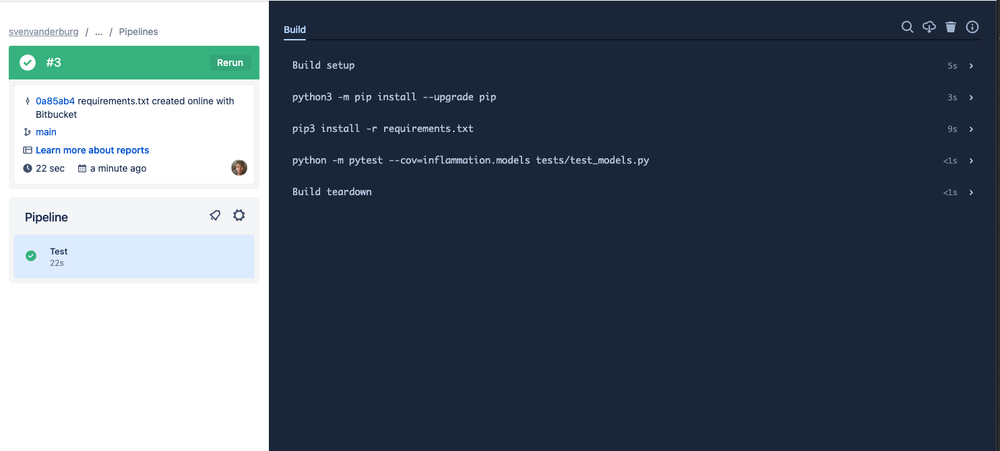

## Introduction

So far we've been manually running our tests as we require. Once we've made a change, or added a new feature with accompanying tests, we can re-run our tests, giving ourselves (and others who wish to run them) increased confidence that everything is working as expected. Now we're going to take further advantage of automation in a way that helps testing scale across a development team with very little overhead, using **Continuous Integration**.

## What is Continuous Integration?

The automated testing we've done so far only takes into account the state of the repository we have on our own machines. In a software project involving multiple developers working and pushing changes on a repository, it would be great to know holistically how all these changes are affecting our codebase without everyone having to pull down all the changes and test them. If we also take into account the testing required on different target user platforms for our software and the changes being made to many repository branches, the effort required to conduct testing at this scale can quickly become intractable for a research project to sustain.

Continuous Integration (CI) aims to reduce this burden by further automation, and automation - wherever possible - helps us to reduce errors and makes predictable processes more efficient. The idea is that when a new change is committed to a repository, CI clones the repository, builds it if necessary, and runs any tests. Once complete, it presents a report to let you see what happened.

There are many CI infrastructures and services, free and paid for, and subject to change as they evolve their features. We'll be looking at [BitBucket Pipelines](https://bitbucket.org/product/nl/features/pipelines) - which unsurprisingly is available as part of BitBucket.

## Continuous Integration with BitBucket Pipelines
### A Quick Look at YAML

YAML is a text format used by BitBucket Pipeline files. It is also increasingly used for configuration files and storing other types of data, so it's worth taking a bit of time looking into this file format.

[YAML](https://www.commonwl.org/user_guide/yaml/) (a recursive acronym which stands for "YAML Ain't Markup Language") is a language designed to be human readable. 
The three basic things you need to know about YAML to get started with BitBucket Pipelines are key-value pairs, arrays, and maps.

So firstly, YAML files are essentially made up of **key-value** pairs, in the form `key: value`, for example:

~~~
name: Kilimanjaro
height_metres: 5892
first_scaled_by: Hans Meyer
~~~
{: .language-yaml}

In general, you don't need quotes for strings, but you can use them when you want to explicitly distinguish between numbers and strings, e.g. `height_metres: "5892"` would be a string, but in the above example it is an integer. It turns out Hans Meyer isn't the only first ascender of Kilimanjaro, so one way to add this person as another value to this key is by using YAML **arrays**, like this:

~~~
first_scaled_by:
  - Hans Meyer
  - Ludwig Purtscheller
~~~
{: .language-yaml}

An alternative to this format for arrays is the following, which would have the same meaning:

~~~
first_scaled_by: [Hans Meyer, Ludwig Purtscheller]
~~~
{: .language-yaml}

If we wanted to express more information for one of these values we could use a feature known as **maps** (dictionaries/hashes), 
which allow us to define nested, hierarchical data structures, e.g.

~~~
...
height:
  value: 5892
  unit: metres
  measured:
    year: 2008
    by: Kilimanjaro 2008 Precise Height Measurement Expedition
...
~~~
{: .language-yaml}

So here, `height` itself is made up of three keys `value`, `unit`, and `measured`, with the last of these being another nested key with the keys `year` and `by`. Note the convention of using two spaces for tabs, instead of Python's four.

We can also combine maps and arrays to describe more complex data. Let's say we want to add more detail to our list of initial ascenders:

~~~
...
first_scaled_by:
  - name: Hans Meyer
    date_of_birth: 22-03-1858
    nationality: German
  - name: Ludwig Purtscheller
    date_of_birth: 22-03-1858
    nationality: Austrian
~~~
{: .language-yaml}

So here we have a YAML array of our two mountaineers, each with additional keys offering more information. As we'll see shortly, BitBucket Pipelines will use all of these.

### Defining Our Pipeline

With a BitBucket repository there's a way we can set up CI to run our tests automatically when we commit changes. 
Let's do this now by adding a new file to our repository whilst on the `test-suite` branch.

So let's add a new YAML file called `bitbucket-pipelines.yml` (note it's extension is `.yml` without the `a`) within the root of the repository:

~~~
image: python:3.9

pipelines:
  default:
    - step:
        name: Build and test
        caches:
          - pip
        script:
           - python3 -m pip install --upgrade pip
           - pip3 install -r requirements.txt
           - python -m pytest --cov=inflammation.models tests/test_models.py
~~~
{: .language-yaml}
The Pipeline runs on a specific `image`. In this case `python:3.9`. You can configure this to have any operating system and python version.

The Pipeline is made of a single `step` named `Build and test`, and we could define any number of jobs after this one if we wanted.

Next, we define what our build job will do.

Lastly, we define the steps that our job will undertake in turn, to set up the job's environment and run our tests. 
You can think of the job's environment initially as a blank slate: much like a freshly installed machine (albeit virtual) with very little installed on it, \
we need to prepare it with what it needs to be able to run our tests. Each of these steps are:

- **Install latest version of pip, dependencies, and our inflammation package:** In order to locally install our `inflammation` package it's good practice to upgrade the version of pip that is present first, then we use pip to install our package dependencies. Once installed, we can use `pip3 install -e .` as before to install our own package. We use `run` here to run theses commands in the CI shell environment
- **Test with PyTest:** lastly, we run `python -m pytest`, with the same arguments we used manually before

### Triggering a Build on BitBucket Pipelines
Now if we commit and push this change a CI run will be triggered:

~~~
$ git add bitbucket-pipelines.yml
$ git commit -m "Add BitBucket configuration"
$ git push
~~~
{: .language-bash}

Since we are only committing the BitBucket configuration file to the `test-suite` branch for the moment, only the contents of this branch will be used for CI. 
We can pass this file upstream into other branches (i.e. via merges) when we're happy it works, which will then allow the process to run automatically on these other branches. 
This again highlights the usefulness of the feature-branch model - we can work in isolation on a feature until it's ready to be passed upstream without disrupting development on other branches, and in the case of CI, we're starting to see its scaling benefits across a larger scale development team working across potentially many branches.

### Checking Build Progress and Reports

Handily, we can see the progress of the build from our repository on BitBucket by looking at `Pipelines`.

You'll see a list of commits for this branch, and likely see a blue 'in progress' marker next to the latest commit.
meaning the build is still in progress. This is a useful view, as over time, it will give you a history of commits, who did them, and whether the commit resulted in a successful build or not.

Hopefully after a while, the marker will turn into a green tick indicating a successful build. Clicking it gives you even more information about the build, and a complete log of the build and its output.

The logs are actually truncated; selecting the arrows next to the entries - which are the `name` labels we specified in the `bitbucket-pipelines.yml` file - will expand them with more detail, including the output from the actions performed.

## Merging Back to `develop` Branch

Now we're happy with our test suite, we can merge this work (which currently only exist on our `test-suite` branch) with our parent `develop` branch. Again, this reflects us working with impunity on a logical unit of work, involving multiple commits, on a separate feature branch until it's ready to be escalated to the `develop` branch:

~~~
$ git checkout develop
$ git merge test-suite
~~~
{: .language-bash}

Then, assuming no conflicts we can push these changes back to the remote repository as we've done before:

~~~
$ git push origin develop
~~~
{: .language-bash}

Now these changes have migrated to our parent `develop` branch, `develop` will also inherit the configuration to run CI builds, so these will run automatically on this branch as well.

This highlights a big benefit of CI when you perform merges (and apply pull requests). As new branch code is merged into upstream branches like `develop` and `main` these newly integrated code changes are automatically tested *together* with existing code - which of course may also have changed in the meantime!


 
