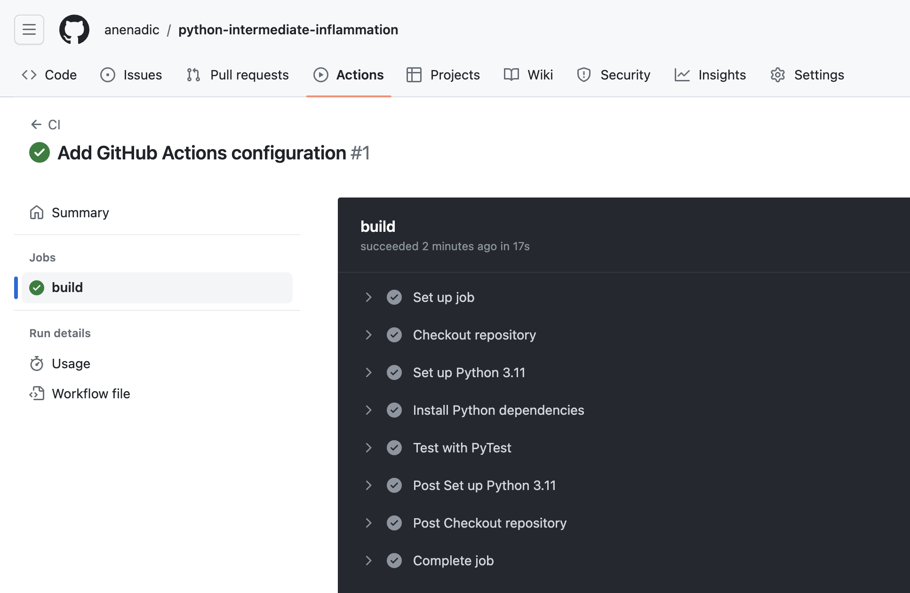

## Introduction

So far we have been manually running our tests as we require.
Once we have made a change,
or added a new feature with accompanying tests,
we can re-run our tests,
giving ourselves (and others who wish to run them)
increased confidence that everything is working as expected.
Now we are going to take further advantage of automation
in a way that helps testing scale across a development team with very little overhead,
using **Continuous Integration**.

## What is Continuous Integration?

The automated testing we have done so far only takes into account
the state of the repository we have on our own machines.
In a software project involving multiple developers working and pushing changes on a repository,
it would be great to know holistically how all these changes are affecting our codebase
without everyone having to pull down all the changes and test them.
If we also take into account the testing required on different target user platforms
for our software and the changes being made to many repository branches,
the effort required to conduct testing at this scale
can quickly become intractable for a research project to sustain.

Continuous Integration (CI) aims to reduce this burden by further automation,
and automation - wherever possible - helps us to reduce errors
and makes predictable processes more efficient.
The idea is that when a new change is committed to a repository,
CI clones the repository,
builds it if necessary,
and runs any tests.
Once complete, it presents a report to let you see what happened.

There are many CI infrastructures and services,
free and paid for,
and subject to change as they evolve their features.
We will be looking at [GitLab CI/CD](https://about.gitlab.com/topics/ci-cd/) -
which unsurprisingly is available as part of GitLab.

## Continuous Integration with GitLab CI/CD

### A Quick Look at YAML

YAML is a text format used for the `.gitlab-ci.yml` file, with which you configure GitLab CI/CD.
It is also increasingly used for configuration files and storing other types of data,
so it is worth taking a bit of time looking into this file format.

[YAML](https://www.commonwl.org/user_guide/yaml/)
(a recursive acronym which stands for "YAML Ain't Markup Language")
is a language designed to be human readable.
A few basic things you need to know about YAML to get started with GitLab CI/CD are
key-value pairs, arrays, maps and multi-line strings.

So firstly, YAML files are essentially made up of **key-value** pairs,
in the form `key: value`, for example:

~~~
name: Kilimanjaro
height_metres: 5892
first_scaled_by: Hans Meyer
~~~
{: .language-yaml}

In general, you do not need quotes for strings,
but you can use them when you want to explicitly distinguish between numbers and strings,
e.g. `height_metres: "5892"` would be a string,
but in the above example it is an integer.
It turns out Hans Meyer is not the only first ascender of Kilimanjaro,
so one way to add this person as another value to this key is by using YAML **arrays**,
like this:

~~~
first_scaled_by:
- Hans Meyer
- Ludwig Purtscheller
~~~
{: .language-yaml}

An alternative to this format for arrays is the following, which would have the same meaning:

~~~
first_scaled_by: [Hans Meyer, Ludwig Purtscheller]
~~~
{: .language-yaml}

If we wanted to express more information for one of these values
we could use a feature known as **maps** (dictionaries/hashes),
which allow us to define nested, hierarchical data structures, e.g.

~~~
...
height:
  value: 5892
  unit: metres
  measured:
    year: 2008
    by: Kilimanjaro 2008 Precise Height Measurement Expedition
...
~~~
{: .language-yaml}

So here, `height` itself is made up of three keys `value`, `unit`, and `measured`,
with the last of these being another nested key with the keys `year` and `by`.
Note the convention of using two spaces for tabs, instead of Python's four.

We can also combine maps and arrays to describe more complex data.
Let us say we want to add more detail to our list of initial ascenders:

~~~
...
first_scaled_by:
- name: Hans Meyer
  date_of_birth: 22-03-1858
  nationality: German
- name: Ludwig Purtscheller
  date_of_birth: 22-03-1858
  nationality: Austrian
~~~
{: .language-yaml}

So here we have a YAML array of our two mountaineers,
each with additional keys offering more information.

GitLab CI/CD also makes use of `|` symbol to indicate a multi-line string
that preserves new lines. For example:

~~~
shakespeare_couplet: |
  Good night, good night. Parting is such sweet sorrow
  That I shall say good night till it be morrow.
~~~
{: .language-yaml}

They key `shakespeare_couplet` would hold the full two line string,
preserving the new line after sorrow.

As we will see shortly, the `.gitlab-ci.yml` will use all of these.

### Defining Our Workflow

With a GitLab project there is a way we can set up CI
to run our tests automatically when we commit changes.
Let us do this now by adding a new file to our repository whilst on the `test-suite` branch.

Let us add a new YAML file called `.gitlab-ci.yml`
(note its extension is `.yml` without the `a`) with this content:

~~~
image: python:3.11

before_script:
    - python3 -m pip install --upgrade pip
    - python3 -m pip install -r requirements.txt

test:
  script:
    # Run PyTest with coverage
    - python3 -m pytest --cov=inflammation.models tests/test_models.py
~~~
{: .language-yaml}

The `image: python:3.11` indicates the docker image that will be used to run our pipeline. 
In this case the default python docker image with Python version 3.11.

The `before_script` ensures the project has all required dependencies installed, preparing the environment for testing.

The `test` job executes tests and generates a coverage report, 
verifying that the code is functioning correctly with the required test coverage.

### Triggering a Build on GitLab CI/CD

Now if we commit and push this change a CI run will be triggered:

~~~
$ git add .gitlab-ci.yml
$ git commit -m "Add GitLab CI/CD pipeline"
$ git push origin test-suite
~~~
{: .language-bash}

Since we are only committing the GitLab CI/CD configuration file
to the `test-suite` branch for the moment,
only the contents of this branch will be used for CI.
We can pass this file upstream into other branches (i.e. via merges) when we are happy it works,
which will then allow the process to run automatically on these other branches.
This again highlights the usefulness of the feature-branch model -
we can work in isolation on a feature until it is ready to be passed upstream
without disrupting development on other branches,
and in the case of CI,
we are starting to see its scaling benefits across a larger scale development team
working across potentially many branches.

### Checking Build Progress and Reports

Handily, we can see the progress of the build from our project on GitLAb
by `Jobs` from the `Build` menu on the left sidebar. The `Build` menu has a small rocket icon next to it.

You will see a list of Jobs and likely see a marker indicating that it is still in progress.

{: .image-with-shadow width="1000px"}

Hopefully after a while, the marker will turn into a green tick indicating a successful build.
Clicking it gives you even more information about the build and its output

{: .image-with-shadow width="1000px"}

### GitLab runners
This job ran on something that is called a `runner`. 
A runner is a small virtual machine that can run GitLab CI/CD pipelines.
The instructors have set these up for you in the workshop GitLab group.
You should talk to your system administrator to setup dedicated runners for you.

You can also use gitlab.com's runners for free if you provide your credit/debit card details,
read more [here](https://about.gitlab.com/pricing/#why-do-i-need-to-enter-credit-debit-card-details-for-free-compute-minutes)


