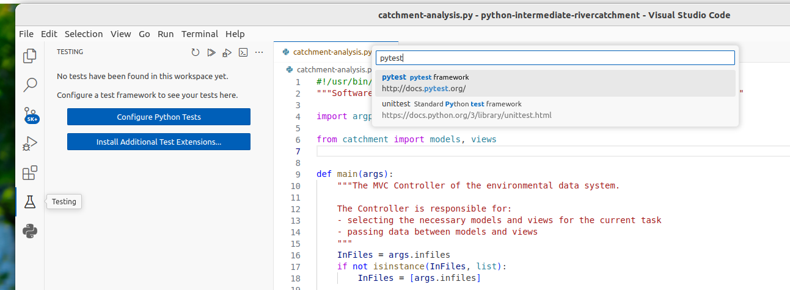
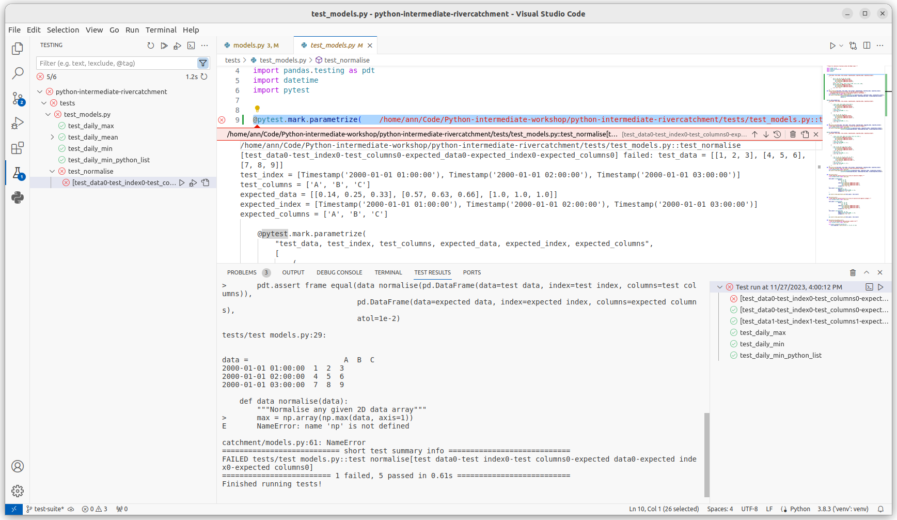
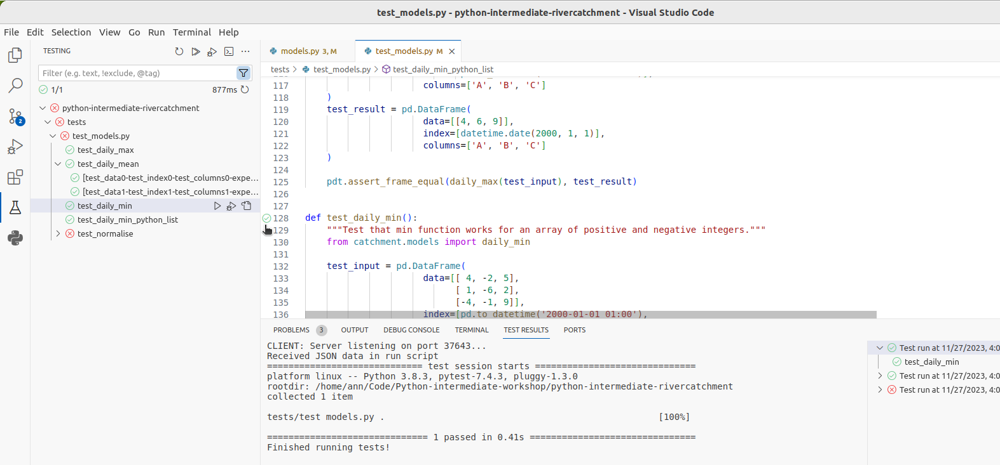
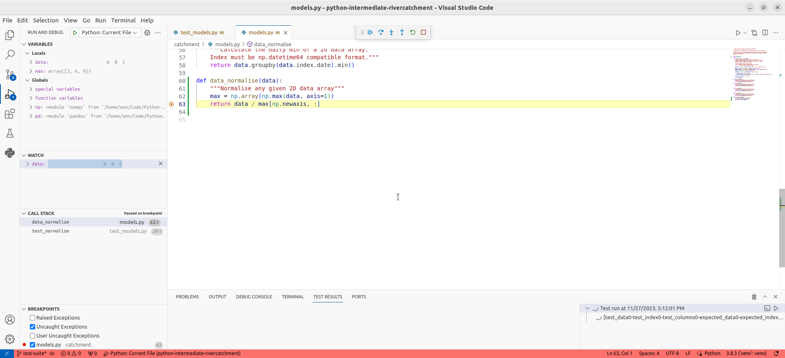
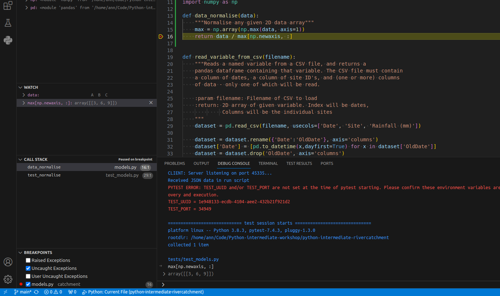
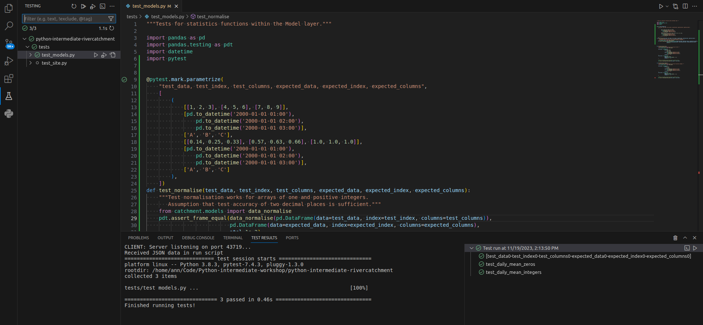

## Introduction

Unit testing can tell us something is wrong in our code
and give a rough idea of where the error is
by which test(s) are failing.
But it does not tell us exactly where the problem is (i.e. what line of code),
or how it came about.
To give us a better idea of what is going on, we can:

 - output program state at various points,
   e.g. by using print statements to output the contents of variables,
- use a logging capability to output
  the state of everything as the program progresses, or
- look at intermediately generated files.

But such approaches are often time consuming
and sometimes not enough to fully pinpoint the issue.
In complex programs, like simulation codes,
we often need to get inside the code while it is running and explore.
This is where using a **debugger** can be useful.

## Setting the Scene

Let us add a new function called `data_normalise()` to our catchment example
to normalise a given measurement data array so that all entries fall between 0 and 1.
(Make sure you create a new feature branch for this work off your `develop` branch.) 
To normalise each set of measurement data
we need to divide it by the maximum measurement value taken.
To do so, we can add the following code to `catchment/models.py`:

~~~
import numpy as np
...
def data_normalise(data):
    """Normalise any given 2D data array"""
    max = np.array(np.max(data, axis=1))
    return data / max[np.newaxis, :]
~~~
{: .language-python}

***Note:** there are intentional mistakes in the above code,
which will be detected by further testing and code style checking below
so bear with us for the moment.*

For this work we will make use of the NumPy library.
Pandas dataframes are built on top of NumPy arrays,
which means that we can make use of the NumPy toolkit for 
manipulating Pandas data if we find that this would be
more appropriate than using a Pandas tool.

In the code above, we first go column by column
and find the maximum data value for each measurement site
and store these values in a 1-dimensional NumPy array `max`.
We then want to use NumPy's element-wise division,
to divide each value in every column of measurement data
(belonging to the same site)
by the maximum value for that site stored in the 1D array `max`.
However, we cannot do that division automatically
as `data` is a 2D array (of shape `(2976, 2)`)
and `max` is a 1D array (of shape `(, 2)`),
which means that their shapes are not compatible.

{: .image-with-shadow width="800px"}

Hence, to make sure that we can perform this division and get the expected result,
we need to convert `max` to be a 2D array 
by using the `newaxis` index operator to insert a new axis into `max`,
making it a 2D array of shape `(1, 2)`.

{: .image-with-shadow width="800px"}

Now the division will give us the expected result.
Even though the shapes are not identical,
NumPy's automatic `broadcasting` (adjustment of shapes) will make sure that
the shape of the 2D `max` array is now "stretched" ("broadcast")
to match that of `data` - i.e. `(2976, 2)`,
and element-wise division can be performed.

{: .image-with-shadow width="800px"}

> ## Broadcasting
>
> The term broadcasting describes how NumPy treats arrays with different shapes
> during arithmetic operations.
> Subject to certain constraints,
> the smaller array is “broadcast” across the larger array
> so that they have compatible shapes.
> Be careful, though, to understand how the arrays get stretched
> to avoid getting unexpected results.
{: .callout}

Note there is an assumption in this calculation
that the minimum value we want is always zero.
This is a sensible assumption for this particular application,
since the zero value is a special case indicating that a patient
experienced no inflammation on a particular day.

Let us now add a new test in `tests/test_models.py`
to check that the normalisation function is correct for some test data.

~~~
@pytest.mark.parametrize(
    "test_data, test_index, test_columns, expected_data, expected_index, expected_columns",
    [
        (
            [[1, 2, 3], [4, 5, 6], [7, 8, 9]],
            [pd.to_datetime('2000-01-01 01:00'),
                pd.to_datetime('2000-01-01 02:00'),
                pd.to_datetime('2000-01-01 03:00')],
            ['A', 'B', 'C'],
            [[0.14, 0.25, 0.33], [0.57, 0.63, 0.66], [1.0, 1.0, 1.0]],
            [pd.to_datetime('2000-01-01 01:00'),
                pd.to_datetime('2000-01-01 02:00'),
                pd.to_datetime('2000-01-01 03:00')],
            ['A', 'B', 'C']
        ),
    ])
def test_normalise(test_data, test_index, test_columns, expected_data, expected_index, expected_columns):
    """Test normalisation works for arrays of one and positive integers.
       Assumption that test accuracy of two decimal places is sufficient."""
    from catchment.models import data_normalise
    pdt.assert_frame_equal(data_normalise(pd.DataFrame(data=test_data, index=test_index, columns=test_columns)),
                           pd.DataFrame(data=expected_data, index=expected_index, columns=expected_columns),
                           atol=1e-2)
~~~
{: .language-python}

Note another assumption made here that a test accuracy of two decimal places is sufficient -
so we state this explicitly by setting the absolute tolerance of the tests using `atol=1e-2`,
and have rounded our expected values up accordingly.
The `assert_frame_equal` Pandas testing function allows
the setting of absolute (`atol`) and relative (`rtol`) tolerances
to enable testing against values that are *almost* equal:
very useful when we have numbers with arbitrary decimal places
and are only concerned with a certain degree of precision,
like the test case above.

Run the tests again using `python -m pytest tests/test_models.py`
and you will note that the new test is failing,
with an error message that does not give many clues as to what went wrong.

~~~
tests/test_models.py:142: 
_ _ _ _ _ _ _ _ _ _ _ _ _ _ _ _ _ _ _ _ _ _ _ _ _ _ _ _ _ _ _ _ _ _ _ _ _ _ _ _ _ _ _ _ _ _ _ _ _ _ _ _ _ _ _ _ _ _ _ _ _ _ _ _ _ _ _ _ _ _ _ _ _ _ _ _ _ _ _ _ _ _ 
pandas/_libs/testing.pyx:52: in pandas._libs.testing.assert_almost_equal
    ???
_ _ _ _ _ _ _ _ _ _ _ _ _ _ _ _ _ _ _ _ _ _ _ _ _ _ _ _ _ _ _ _ _ _ _ _ _ _ _ _ _ _ _ _ _ _ _ _ _ _ _ _ _ _ _ _ _ _ _ _ _ _ _ _ _ _ _ _ _ _ _ _ _ _ _ _ _ _ _ _ _ _ 

>   ???
E   AssertionError: DataFrame.iloc[:, 0] (column name="A") are different
E   
E   DataFrame.iloc[:, 0] (column name="A") values are different (100.0 %)
E   [index]: [2000-01-01T01:00:00.000000000, 2000-01-01T02:00:00.000000000, 2000-01-01T03:00:00.000000000]
E   [left]:  [0.3333333333333333, 1.3333333333333333, 2.3333333333333335]
E   [right]: [0.14, 0.57, 1.0]
~~~
{: .output}

Let us use a debugger at this point to see what is going on and why the function failed.

## Debugging in VS Code

Think of debugging like performing exploratory surgery - on code!
Debuggers allow us to peer at the internal workings of a program,
such as variables and other state,
as it performs its functions.

### Running Tests Within VS Code

Firstly, to make it easier to track what's going on,
we can set up VS Code to run and debug our tests
instead of running them from the command line.
If you have not done so already,
you will first need to enable the Pytest framework in VS Code.
You can do this by:

1. In VS Code, select the 'Testing' tab on the vertical bar on the left hand side (icon resembles a chemistry flask). 
2. Then, in the edit box that appears at the top of the edit window,
   type `pytest` and select `pytest pytest framework` from the drop-down list.
3. You will then be asked for the root directory of your tests, so select the `tests` folder in our project.
4. The left hand panel will then display the `tests` folder with each of the files it contains.

{: .image-with-shadow width="1000px"}

We can now run `pytest` over our tests in VS Code,
similarly to how we ran our `catchment-analysis.py` script before.
Right-click the `test_models.py` file
under the `tests` directory in the file navigation window on the left,
and select `Run test`.
You'll see the results of the tests appear in VS Code in a bottom panel.
If you scroll down in that panel you should see
the failed `test_normalise()` test result
looking something like the following:

{: .image-with-shadow width="1000px"}

We can also run our test functions individually.

If you click on the green check next to a test function
in our `test_models.py` script in VS Code,
(or right click it and select `Run test`),
we can run just that test:

{: .image-with-shadow width="800px"}

Click on the "run" button next to `test_normalise`,
and you will be able to see that VS Code runs just that test function,
and we see the same `AssertionError` that we saw before.

### Running the Debugger

Now we want to use the debugger to investigate
what is happening inside the `data_normalise` function.
To do this we will add a *breakpoint* in the code.
A breakpoint will pause execution at that point allowing us to explore the state of the program.

To set a breakpoint, navigate to the `models.py` file
and move your mouse to the `return` statement of the `data_normalise` function.
Click on just to the right of the line number for that line
and a small red dot will appear,
indicating that you have placed a breakpoint on that line.

{: .image-with-shadow width="600px"}

Now if you find test_models.py and find green check marker for the test_normalise function 
(in VS Code this appears next to the decorator function 
@pytest.mark.parameterize that we recently added to test_normalise).
Right click on that arrow and select `Debug Test` from the drop down menu.
You will notice that execution will be paused
at the `return` statement of `data_normalise`.
In the debug panel that appears below,
we can now investigate the exact state of the program
prior to it executing this line of code.

In the debug panel on the left hand side,
you will be able to see
three sections that looks something like the following:

{: .image-with-shadow width="1000px"}

- The `Variables` section at the top,
  which displays the local and global variables currently in memory.
  You will be able to see the `data` array
  that is input to the `data_normalise` function,
  as well as the `max` local array
  that was created to hold the maximum inflammation values for each patient.
- The `Watch` section in the middle where we can add/remove expressions that we need to evaluate.
- The `Call Stack` section at the bottom,
  which shows the **call stack**
  (the chain of functions that have been executed to lead to this point).
  We can traverse this chain of functions if we wish,
  to observe the state of each function.
  
We also have the ability run any Python code we wish at this point
to explore the state of the program even further!
This is useful if you want to view a particular combination of variables,
or perhaps a single element or slice of an array to see what went wrong.

Select the `Debug Console` tab in the bottom panel,
and you'll be presented with a Python prompt.
Try putting in the expression `max[np.newaxis, :]` into the console,
and you will be able to see the row vector that we are dividing `data` by
in the return line of the function.

{: .image-with-shadow width="1000px"}

Now, looking at the `max` variable,
we can see that something looks wrong,
as the maximum values for each patient do not correspond to the `data` array.
Recall that the input `data` array we are using for the function is

~~~
  [[1, 2, 3],
   [4, 5, 6],
   [7, 8, 9]]
~~~
{: .language-python}

So the maximum value for each measurement set (column) should be `[7, 8, 9]`,
whereas the debugger shows `[3, 6, 9]`.
You can see that the latter corresponds exactly to the last row of `data`,
and we can immediately conclude that
we took the maximum along the wrong axis of `data`.
Now we have our answer,
stop the debugging process by selecting
the red square at the top centre of the main VS Code editor window.

So to fix the `data_normalise` function in `models.py`,
change `axis=1` in the first line of the function to `axis=0`.
With this fix in place,
running all the tests again should result in all tests passing.
Navigate back to the `Testing` tab (chemistry flask icon) on the left hand vertical bar and click on
the arrow next to `test_models.py`
You should be rewarded with:

{: .image-with-shadow width="1000px"}

> ## NumPy Axis
> Getting the axes right in NumPy is not trivial -
> the [following tutorial](https://www.sharpsightlabs.com/blog/numpy-axes-explained/#:~:text=NumPy%20axes%20are%20the%20directions,along%20the%20rows%20and%20columns)
> offers a good explanation on how axes work when applying NumPy functions to arrays.
{: .callout}

## NumPy vs Pandas: Reducing Test Complexity

So far we have used Pandas testing functions, because the functions we have been testing
make use of Pandas Dataframe functionality. However, even though we will be using the 
`data_normalise` function on Pandas dataframes, the function itself does not actually 
require Pandas functionality. The test above demonstrates that the `data_normalise` 
function does not change the input dataframe in any unexpected way; the returned Dataframe 
has the same indices and columns as the input Dataframe. Because we know this, we can 
simplify the rest of our tests for this function, by using NumPy arrays and testing 
functions, instead of the Pandas equivalents. Reducing complexity like this, where you 
can, helps you understand what is being tested, and avoid possible confusions.

Before we carry on with new tests, we will reproduce the test above using NumPy, so that you can compare the two testing frameworks. Add an `import` statement for `numpy.testing`, and the test `test_numpy_normalise`, as shown below, to your `test_models.py` script. Then run the test to confirm it works as expected.
~~~
import numpy.testing as npt
...
@pytest.mark.parametrize(
    "test, expected",
    [
        (
            [[1, 2, 3], [4, 5, 6], [7, 8, 9]],
            [[0.14, 0.25, 0.33], [0.57, 0.63, 0.66], [1.0, 1.0, 1.0]]
        )
    ])
def test_numpy_normalise(test, expected):
    """Test normalisation works for numpy arrays"""
    from catchment.models import data_normalise
    npt.assert_almost_equal(data_normalise(np.array(test)), np.array(expected), decimal=2)
~~~
{: .language-python}

Note here that we are using the Numpy testing function `npt.assert_almost_equal`, which allows us to set a relevant test accuracy, using `decimal=2`. This is equivalent to the `atol=1e-2` tolerance setting that we used for the equivalent Pandas test `pdt.assert_frame_equal`. Numpy also has a testing function `npt.assert_array_equal`, which tests for exact array matches. The functionality of this test is closely replicated by the default tolerance settings in `pd.assert_frame_equal` (`atol=1e-8` and `rtol=1e-5`), and can be fully replicated by setting the option `check_exact=True` when using this function.  

## Corner or Edge Cases

The test case that we have currently written for `data_normalise`
is parameterised with a fairly standard data array.
However, when writing your test cases,
it is important to consider parameterising them by unusual or extreme values,
in order to test all the edge or corner cases that your code could be exposed to in practice.
Generally speaking, it is at these extreme cases that you will find your code failing,
so it's beneficial to test them beforehand.

What is considered an "edge case" for a given component depends on
what that component is meant to do.
In the case of `data_normalise` function, the goal is to normalise a numeric array of numbers.
For numerical values, extreme cases could be zeros,
very large or small values,
not-a-number (`NaN`) or infinity values.
Since we are specifically considering an *array* of values,
an edge case could be that all the numbers of the array are equal.

For all the given edge cases you might come up with,
you should also consider their likelihood of occurrence.
It is often too much effort to exhaustively test a given function against every possible input,
so you should prioritise edge cases that are likely to occur.
For our `data_normalise` function, some common edge cases might be the occurrence of zeros,
and the case where all the values of the array are the same.

When you are considering edge cases to test for,
try also to think about what might break your code.
For `data_normalise` we can see that there is a division by
the maximum measurement value for each site,
so this will clearly break if we are dividing by zero here,
resulting in `NaN` values in the normalised array.

With all this in mind,
let us add a few edge cases to our parametrisation of `test_numpy_normalise`.
We will add two extra tests,
corresponding to an input array of all 0,
and an input array of all 1.

~~~
@pytest.mark.parametrize(
    "test, expected",
    [
        (
            [[0.0, 0.0, 0.0], [0.0, 0.0, 0.0], [0.0, 0.0, 0.0]],
            [[0.0, 0.0, 0.0], [0.0, 0.0, 0.0], [0.0, 0.0, 0.0]]
        ),
        (
            [[1.0, 1.0, 1.0], [1.0, 1.0, 1.0], [1.0, 1.0, 1.0]],
            [[1.0, 1.0, 1.0], [1.0, 1.0, 1.0], [1.0, 1.0, 1.0]]
        ),
        (
            [[1, 2, 3], [4, 5, 6], [7, 8, 9]],
            [[0.14, 0.25, 0.33], [0.57, 0.63, 0.66], [1.0, 1.0, 1.0]]
        )
    ])
def test_numpy_normalise(test, expected):
    """Test normalisation works for numpy arrays"""
    from catchment.models import data_normalise
    npt.assert_almost_equal(data_normalise(np.array(test)), np.array(expected), decimal=2)
~~~
{: .language-python}

Running the tests now from the command line results in the following assertion error,
due to the division by zero as we predicted.

~~~
E       AssertionError: 
E       Arrays are not almost equal to 2 decimals
E       
E       x and y nan location mismatch:
E        x: array([[nan, nan, nan],
E              [nan, nan, nan],
E              [nan, nan, nan]])
E        y: array([[0., 0., 0.],
E              [0., 0., 0.],
E              [0., 0., 0.]])

tests/test_models.py:160: AssertionError
~~~
{: .output}

How can we fix this?
Luckily, there is a NumPy function that is useful here,
[`np.isnan()`](https://numpy.org/doc/stable/reference/generated/numpy.isnan.html),
which we can use to replace all the NaN's with our desired result,
which is 0.
We can also silence the run-time warning using
[`np.errstate`](https://numpy.org/doc/stable/reference/generated/numpy.errstate.html):

~~~
...
def data_normalise(data):
    """
    Normalise any given 2D data array

    NaN values are replaced with a value of 0
    """
    max = np.array(np.max(data, axis=0))
    with np.errstate(invalid='ignore', divide='ignore'):
        normalised = data / max[np.newaxis, :]
    normalised[np.isnan(normalised)] = 0.0
    return normalised
...
~~~
{: .language-python}

> ## Exercise: Exploring Tests for Edge Cases
>
> Think of some more suitable edge cases to test our `data_normalise()` function
> and add them to the parametrised tests.
> Remember to build tests for the functionality we want from the function -
> it does not matter at the moment if some of the tests fail.
> After you have finished remember to commit your changes.
>
> > ## Possible Solution
> > ~~~
> > @pytest.mark.parametrize(
> >     "test, expected",
> >     [
> >         (
> >             [[0, 0, 0], [0, 0, 0], [0, 0, 0]],
> >             [[0, 0, 0], [0, 0, 0], [0, 0, 0]],
> >         ),
> >         (
> >             [[1, 1, 1], [1, 1, 1], [1, 1, 1]],
> >             [[1, 1, 1], [1, 1, 1], [1, 1, 1]],
> >         ),
> >         (
> >             [[float('nan'), 1, 1], [1, 1, 1], [1, 1, 1]],
> >             [[0, 1, 1], [1, 1, 1], [1, 1, 1]],
> >         ),
> >         (
> >             [[1, 2, 3], [4, 5, float('nan')], [7, 8, 9]],
> >             [[0.14, 0.25, 0.33], [0.57, 0.63, 0.0], [1.0, 1.0, 1.0]],
> >         ),
> >         (
> >             [[-1, 2, 3], [4, 5, 6], [7, 8, 9]],
> >             [[0.0, 0.67, 1], [0.67, 0.83, 1], [0.78, 0.89, 1]],
> >         ),
> >         (
> >             [[1, 2, 3], [4, 5, 6], [7, 8, 9]],
> >             [[0.33, 0.67, 1], [0.67, 0.83, 1], [0.78, 0.89, 1]],
> >         )
> >     ])
> > def test_numpy_normalise(test, expected):
> >     """Test normalisation works for numpy arrays of one and positive integers."""
> >     from catchment.models import data_normalise
> >     npt.assert_almost_equal(data_normalise(np.array(test)), np.array(expected), decimal=2)
> > ...
> > ~~~
> > {: .language-python}
> >
> > You could also, for example, test and handle the case of a whole row of NaNs.
> {: .solution}
>
{: .challenge}

## Defensive Programming

In the previous section, we made a few design choices for our `data_normalise` function:

1. We are implicitly converting any `NaN`,
2. Normalising a constant 0 array of inflammation results in an identical array of 0s,
3. We don't warn the user of any of these situations.

This could have be handled differently.
We might decide that we do not want to silently make these changes to the data,
but instead to explicitly check that the input data satisfies a given set of assumptions
(e.g. no strings)
and raise an error if this is not the case.
Then we can proceed with the normalisation,
confident that our normalisation function will work correctly.

Checking that input to a function is valid via a set of preconditions
is one of the simplest forms of **defensive programming**
which is used as a way of avoiding potential errors.
Preconditions are checked at the beginning of the function
to make sure that all assumptions are satisfied.
These assumptions are often based on the *value* of the arguments, like we have already discussed.
However, in a dynamic language like Python
one of the more common preconditions is to check that the arguments of a function
are of the correct *type*.
Currently there is nothing stopping someone from calling `data_normalise` with
a string, a dictionary, or another object that is not a `pandas.DataFrame` or `numpy.ndarray`.

As an example, let us change the behaviour of the `data_normalise()` function
to raise an error on negative inflammation values.
Edit the `catchment/models.py` file,
and add a precondition check to the beginning of the `data_normalise()` function like so:

~~~
...
    if np.any(data < 0):
        raise ValueError('Measurement values should not be negative')
...
~~~
{: .language-python}

We can then modify our test function in `tests/test_models.py`
to check that the function raises the correct exception - a `ValueError` -
when input to the test contains negative values
(i.e. input case `[[-1, 2, 3], [4, 5, 6], [7, 8, 9]]`).
The [`ValueError`](https://docs.python.org/3/library/exceptions.html#ValueError) exception
is part of the standard Python library
and is used to indicate that the function received an argument of the right type,
but of an inappropriate value.

~~~
@pytest.mark.parametrize(
    "test, expected, expect_raises",
    [
        ... # previous test cases here, with None for expect_raises, except for the next one - add ValueError
        ... # as an expected exception (since it has a negative input value)
        (
            [[-1, 2, 3], [4, 5, 6], [7, 8, 9]],
            [[0, 0.67, 1], [0.67, 0.83, 1], [0.78, 0.89, 1]],
            ValueError,
        ),
        (
            [[1, 2, 3], [4, 5, 6], [7, 8, 9]],
            [[0.33, 0.67, 1], [0.67, 0.83, 1], [0.78, 0.89, 1]],
            None,
        ),
    ])
def test_normalise(test, expected, expect_raises):
    """Test normalisation works for arrays of one and positive integers."""
    from catchment.models import data_normalise
    if expect_raises is not None:
        with pytest.raises(expect_raises):
            npt.assert_almost_equal(data_normalise(np.array(test)), np.array(expected), decimal=2)
    else:
        npt.assert_almost_equal(data_normalise(np.array(test)), np.array(expected), decimal=2)
~~~
{: .language-python}

Be sure to commit your changes so far and push them to GitHub.

> ## Optional Exercise: Add a Precondition to Check the Correct Type and Shape of Data
>
> Add preconditions to check that data is a `DataFrame` or `ndarray` object and that it is of the correct shape.
> Add corresponding tests to check that the function raises the correct exception.
> You will find the Python function
> [`isinstance`](https://docs.python.org/3/library/functions.html#isinstance)
> useful here, as well as the Python exception
> [`TypeError`](https://docs.python.org/3/library/exceptions.html#TypeError).
> Once you are done, commit your new files,
> and push the new commits to your remote repository on GitHub.
>
> > ## Solution
> >
> > In `inflammation/models.py`:
> >
> > ~~~
> > ...
> > def data_normalise(data):
> >     """
> >     Normalise any given 2D data array
> >     
> >     NaN values are replaced with a value of 0
> >     
> >     :param data: 2D array of inflammation data
> >     :type data: ndarray
> >
> >     """
> >     if not isinstance(data, np.ndarray) or not isinstance(data, pd.DataFrame):
> >         raise TypeError('data input should be DataFrame or ndarray')
> >     if len(data.shape) != 2:
> >         raise ValueError('data array should be 2-dimensional')
> >     if np.any(data < 0):
> >         raise ValueError('Measurement values should be non-negative')
> >     max = np.nanmax(data, axis=0)
> >     with np.errstate(invalid='ignore', divide='ignore'):
> >         normalised = data / max[np.newaxis, :]
> >     normalised[np.isnan(normalised)] = 0
> >     return normalised
> > ...
> > ~~~
> >
> > In `test/test_models.py`:
> >
> > ~~~
> > ...
> > @pytest.mark.parametrize(
> >     "test, expected, expect_raises",
> >     [
> >         ...
> >         (
> >             'hello',
> >             None,
> >             TypeError,
> >         ),
> >         (
> >             3,
> >             None,
> >             TypeError,
> >         ),
> >         (
> >             [[1, 2, 3], [4, 5, 6], [7, 8, 9]],
> >             [[0.33, 0.67, 1], [0.67, 0.83, 1], [0.78, 0.89, 1]],
> >             None,
> >         )
> >     ])
> > def test_data_normalise(test, expected, expect_raises):
> >     """Test normalisation works for arrays of one and positive integers."""
> >     from catchment.models import data_normalise
> >     if isinstance(test, list):
> >         test = np.array(test)
> >     if expect_raises is not None:
> >         with pytest.raises(expect_raises):
> >             npt.assert_almost_equal(data_normalise(test), np.array(expected), decimal=2)
> >     else:
> >         npt.assert_almost_equal(data_normalise(test), np.array(expected), decimal=2)
> > ...
> > ~~~
> >
> > Note the conversion from `list` to `np.array` has been moved
> > out of the call to `npt.assert_almost_equal()` within the test function,
> > and is now only applied to list items (rather than all items).
> > This allows for greater flexibility with our test inputs,
> > since this wouldn't work in the test case that uses a string.
> >
> > {: .language-python}
> {: .solution}
>
{: .challenge}

If you do the challenge, again, be sure to commit your changes and push them to GitHub.

You should not take it too far by trying to code preconditions for every conceivable eventuality.
You should aim to strike a balance between
making sure you secure your function against incorrect use,
and writing an overly complicated and expensive function
that handles cases that are likely never going to occur.
For example, it would be sensible to validate the shape of your measurement data array
when it is actually read from the csv file (in `load_csv`),
and therefore there is no reason to test this again in `data_normalise`.
You can also decide against adding explicit preconditions in your code,
and instead state the assumptions and limitations of your code
for users of your code in the docstring
and rely on them to invoke your code correctly.
This approach is useful when explicitly checking the precondition is too costly.

## Improving Robustness with Automated Code Style Checks

Let's re-run Pylint over our project after having added some more code to it.
From the project root do:

~~~
$ pylint catchment
~~~
{: .language-bash}

You may see something like the following in Pylint's output:

~~~
************* Module catchment.models
...
catchment/models.py:60:4: W0622: Redefining built-in 'max' (redefined-builtin)
...
~~~
{: .language-bash}

The above output indicates that by using the local variable called `max`
in the `data_normalise` function, 
we have redefined a built-in Python function called `max`.
This isn't a good idea and may have some undesired effects
(e.g. if you redefine a built-in name in a global scope
you may cause yourself some trouble which may be difficult to trace).

> ## Exercise: Fix Code Style Errors
>
> Rename our local variable `max` to something else (e.g. call it `max`), then rerun your tests and 
> commit these latest changes and 
> push them to GitHub using our usual feature branch workflow. Make sure your `develop` and `main` branches are up to date.
{: .challenge}

It may be hard to remember to run linter tools every now and then.
Luckily, we can now add this Pylint execution to our continuous integration builds
as one of the extra tasks.
Since we're adding an extra feature to our CI workflow,
let's start this from a new feature branch from the `develop` branch:

~~~
$ git switch -c pylint-ci develop # note a shorthand for creating a branch from another and switching to it
~~~
{: .language-bash}

Then to add Pylint to our CI workflow,
we can add the following step to our `steps` in `.github/workflows/main.yml`:

~~~
...
    - name: Check style with Pylint
      run: |
        python3 -m pylint --fail-under=0 --reports=y catchment
...
~~~
{: .language-bash}

Note we need to add `--fail-under=0` otherwise
the builds will fail if we don't get a 'perfect' score of 10!
This seems unlikely, so let's be more pessimistic.
We've also added `--reports=y` which will give us a more detailed report of the code analysis.

Then we can just add this to our repo and trigger a build:

~~~
$ git add .github/workflows/main.yml
$ git commit -m "Add Pylint run to build"
$ git push
~~~
{: .language-bash}

Then once complete, under the build(s) reports you should see
an entry with the output from Pylint as before,
but with an extended breakdown of the infractions by category
as well as other metrics for the code,
such as the number and line percentages of code, docstrings, comments, and empty lines.

So we specified a score of 0 as a minimum which is very low.
If we decide as a team on a suitable minimum score for our codebase,
we can specify this instead.
There are also ways to specify specific style rules that shouldn't be broken
which will cause Pylint to fail,
which could be even more useful if we want to mandate a consistent style.

We can specify overrides to Pylint's rules in a file called `.pylintrc`
which Pylint can helpfully generate for us.
In our repository root directory:

~~~
$ pylint --generate-rcfile > .pylintrc
~~~
{: .language-bash}

Looking at this file, you'll see it's already pre-populated.
No behaviour is currently changed from the default by generating this file,
but we can amend it to suit our team's coding style.
For example, a typical rule to customise - favoured by many projects -
is the one involving line length.
You'll see it's set to 100, so let's set that to a more reasonable 120.
While we're at it, let's also set our `fail-under` in this file:

~~~
...
# Specify a score threshold to be exceeded before program exits with error.
fail-under=0
...
# Maximum number of characters on a single line.
max-line-length=120
...
~~~
{: .language-bash}

Don't forget to remove the `--fail-under` argument to Pytest
in our GitHub Actions configuration file too,
since we don't need it anymore.

Now when we run Pylint we won't be penalised for having a reasonable line length.
For some further hints and tips on how to approach using Pylint for a project,
see [this article](https://pythonspeed.com/articles/pylint/).

Before moving on, be sure to commit all your changes
and then merge to the `develop` and `main` branches in the usual manner,
and push them all to GitHub.


