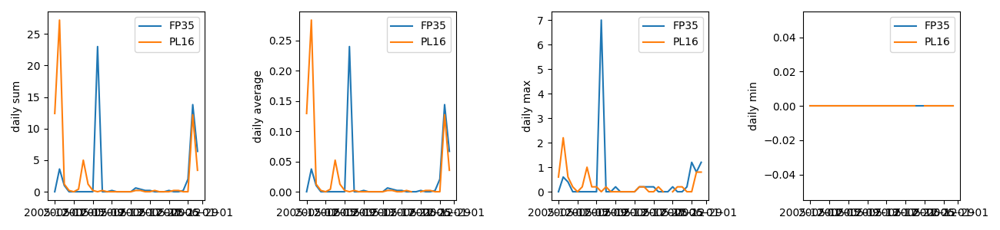
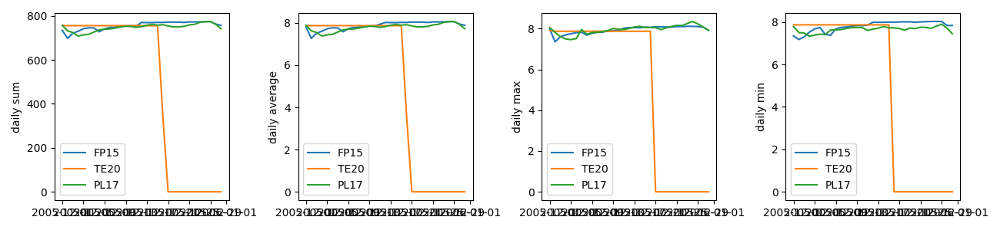

As we have seen, we have different programming paradigms that are suitable for different problems and affect the 
structure of our code. In programming languages that support multiple paradigms, such as Python, we have the luxury of 
using elements of different paradigms paradigms and we, as software designers and programmers, can 
decide how to use those elements in different architectural components of our software. Let's now circle back to the 
architecture of our software for one final look. 

## MVC Revisited

We've been developing our software using the **Model-View-Controller** (MVC) architecture so far, but, as we have seen, MVC is just one of the common architectural patterns and is not the only choice we could have made.

There are many variants of an MVC-like pattern (such as [Model-View-Presenter](https://en.wikipedia.org/wiki/Model%E2%80%93view%E2%80%93presenter) (MVP), [Model-View-Viewmodel](https://en.wikipedia.org/wiki/Model%E2%80%93view%E2%80%93viewmodel) (MVVM), etc.), but in most cases, the distinction between these patterns isn't particularly important.
What really matters is that we are making decisions about the architecture of our software that suit the way in which we expect to use it.
We should reuse these established ideas where we can, but we don't need to stick to them exactly.

In this episode we'll be taking our Object Oriented code from the previous episode and integrating it into our existing MVC pattern. But first we will explain some features of the Controller (`catchment-analysis.py`) file.

### Controller file structure

You will have noticed already that structure of the `catchment-analysis.py` file follows this pattern:
~~~
# import modules

def main():
    # perform some actions

if __name__ == "__main__":
    # perform some actions before main()
    main()
~~~
{: .language-python}
In this pattern the actions performed by the script are contained within the `main` function (which does not need to be called `main`, but using this convention helps others in understanding your code). The `main` function is then called within the `if` statement `__name__ == "__main__"`, after some other actions have been performed (usually the parsing of command-line arguments, which will be explained below). `__name__` is a special dunder variable which is set, along with a number of other special dunder variables, by the python interpreter before the execution of any code in the source file. What value is given by the interpreter to `__name__` is determined by the manner in which it is loaded.

If we run the source file directly using the Python interpreter, e.g.:
~~~
python catchment-analysis.py
~~~
{: .language-bash}
then the interpreter will assign the hard-coded string `"__main__"` to the `__name__` variable:
~~~
__name__ = "__main__"
...
# rest of your code
~~~
{: .language-python}

However, if your source file is imported by another Python script, e.g:
~~~
import catchment-analysis
~~~
{: .language-python}
then the interpreter will assign the name `"catchment-analysis"` from the import statement to the `__name__` variable:
~~~
__name__ = "catchment-analysis"
...
# rest of your code
~~~
{: .language-python}

Because of this behaviour of the interpreter, we can put any code that should only be executed when running the script directly within the `if __name__ == "__main__":` structure, allowing the rest of the code within the script to be safely imported by another script if we so wish.

While it may not seem very useful to have your controller script importable by another script, there are a number of situations in which you would want to do this:
- for testing of your code, you can have your testing framework import the main script, and run special test functions which then call the `main` function directly;
- where you want to not only be able to run your script from the command-line, but also provide a programmer-friendly application programming interface (API) for advanced users.

### Passing Command-line Options to Controller

The standard python library for reading command line arguments passed to a script is [`argparse`](https://docs.python.org/3/library/argparse.html). This module reads arguments passed by the system, and enables the automatic generation of help and usage messages. These include, as we saw at the start of this course, the generation of helpful error messages when users give the program invalid arguments. 

The basic usage of `argparse` can be seen in the `catchment-analysis.py` script. First we import the library:
~~~
import argparse
~~~
{: .language-python}

We then initialise the argument parser class, passing an (optional) description of the program:
~~~
parser = argparse.ArgumentParser(
    description='A basic environmental data management system')
~~~
{: .language-python}

Once the parser has been initialised we can add the arguments that we want argparse to look out for. In our basic case, we want only the names of the file(s) to process: 
~~~
parser.add_argument(
    'infiles',
    nargs='+',
    help='Input CSV(s) containing measurement data')
~~~
{: .language-python}
Here we have defined what the argument will be called (`'infiles'`) when it is read in; the number of arguments to be expected (`nargs='+'`, where `'+'` indicates that there should be 1 or more arguments passed); and a help string for the user (`help='Input CSV(s) containing measurement data'`).

You can add as many arguments as you wish, and these can be either mandatory (as the one above) or optional. Most of the complexity in using `argparse` is in adding the correct argument options, and we will explain how to do this in more detail below.

Finally we parse the arguments passed to the script using:
~~~
args = parser.parse_args()
~~~
{: .language-python}
This returns an object (that we've called `arg`) containing all the arguments requested. These can be accessed using the names that we have defined for each argument, e.g. `args.infiles` would return the filenames that have been input.

The help for the script can be accessed using the `-h` or `--help` optional argument (which `argparse` includes by default):
~~~
python catchment-analysis.py --help
~~~
{: .language-bash}
~~~
usage: catchment-analysis.py [-h] infiles [infiles ...]

A basic environmental data management system

positional arguments:
  infiles     Input CSV(s) containing measurement data

optional arguments:
  -h, --help  show this help message and exit
~~~
{: .output}
The help page starts with the command line usage, illustrating what inputs can be given (any within `[]` brackets are optional). It then lists the **positional** and **optional** arguments, giving as detailed a description of each as you have added to the `add_argument()` command. 
Positional arguments are arguments that need to be included in the proper position or order when calling the script.

Note that optional arguments are indicated by `-` or `--`, followed by the argument name. Positional arguments are simply inferred by their position. It is possible to have multiple positional arguments, but usually this is only practical where all (or all but one) positional arguments contains a clearly defined number of elements. If more than one option can have an indeterminate number of entries, then it is better to create them as 'optional' arguments. These can be made a required input though, by setting `required = True` within the `add_argument()` command. 

> ## Positional and Optional Argument Order
>
> The usage section of the help page above shows the optional arguments going before the
> positional arguments. This is the customary way to present options, but is not mandatory. Instead there are two rules which must be followed for these arguments:
>  1. Positional and optional arguments must each be given all together, and not inter-mixed. For example, the order can be either `optional - positional` or `positional - optional`, but not `optional - positional - optional`.
>  2. Positional arguments must be given in the order that they are shown in the usage section of the help page. 
{: .callout}

Now that you have some familiarity with `argparse`, we will demonstrate below how you can use this to add extra functionality to your controller.

### Choosing the Measurement Dataseries

Up until now we have only read the rainfall data from our `data/rain_data_2015-12.csv` file. But what if we want to read the river measurement data too? We can, simply, change the file that we are reading, by passing a different file name. But when we do this with the river data we get the following error:
~~~
python catchment-analysis.py data/river_data_2015-12.csv
~~~
{: .language-bash}
~~~
Traceback (most recent call last):
  File "/Users/mbessdl2/work/manchester/Course_Material/Intermediate_Programming_Skills/python-intermediate-rivercatchment-template/catchment-analysis.py", line 39, in <module>
    main(args)
  File "/Users/mbessdl2/work/manchester/Course_Material/Intermediate_Programming_Skills/python-intermediate-rivercatchment-template/catchment-analysis.py", line 22, in main
    measurement_data = models.read_variable_from_csv(filename)
  File "/Users/mbessdl2/work/manchester/Course_Material/Intermediate_Programming_Skills/python-intermediate-rivercatchment-template/catchment/models.py", line 22, in read_variable_from_csv
    dataset = pd.read_csv(filename, usecols=['Date', 'Site', 'Rainfall (mm)'])
...
ValueError: Usecols do not match columns, columns expected but not found: ['Rainfall (mm)']
~~~
{: .output}

This error message tells us that the pandas `read_csv` function has failed to find one of the columns that are listed to be read. We would not expect a column called `'Rainfall (mm)'` in the river data file, so we need to make the `read_variable_from_csv` more flexible, so that it can read any defined measurement dataset.

The first step is to add an argument to our command line interface, so that users can specify the measurement dataset. This can be done by adding the following argument to your `catchment-analysis.py` script:
~~~
    parser.add_argument(
        '-m', '--measurements',
        help = 'Name of measurement data series to load',
        required = True)
~~~
{: .language-python}
Here we have defined the name of the argument (`--measurements`), as well as a short name (`-m`) for lazy users to use. Note that the short name is preceded by a single dash (`-`), while the full name is preceded by two dashes (`--`). We provide a `help` string for the user, and finally we set `required = True`, so that the end user must define which data series they want to read.

Once this is added, then your help message should look like this:
~~~
python catchment-analysis.py --help
~~~
{: .language-bash} 
~~~
usage: catchment-analysis.py [-h] -m MEASUREMENTS infiles [infiles ...]

A basic environmental data management system

positional arguments:
  infiles               Input CSV(s) containing measurement data

optional arguments:
  -h, --help            show this help message and exit
  -m MEASUREMENTS, --measurements MEASUREMENTS
                        Name of measurement data series to use
~~~
{: .output}

> ## Optional vs Required Arguments, and Argument Groups
> You will note that the `--measurements` argument is still listed as an optional 
> argument. This is because the two basic option groups in `argparse` are positional and 
> optional. In the usage section the `--measurements` option is listed without `[]` brackets, indicating 
> that it is an expected argument, but still this is not very clear for end users.
> 
> To make the help clearer we can add an extra argument group, and assign `--measurements` to this:
> ~~~
> ...
>     req_group = parser.add_argument_group('required arguments')
> ...
>     req_group.add_argument(
>         '-m', '--measurements',
>         help = 'Name of measurement data series to load',
>         required = True)
> ...
> ~~~
> {: .language-python}
> This will return the following help message:
> ~~~
> python catchment-analysis.py --help
> ~~~
> {: .language-bash} 
> ~~~
> usage: catchment-analysis.py [-h] -m MEASUREMENTS infiles [infiles ...]
> 
> A basic environmental data management system
> 
> positional arguments:
>   infiles               Input CSV(s) containing measurement data
> 
> optional arguments:
>   -h, --help            show this help message and exit
> 
> required arguments:
>   -m MEASUREMENTS, --measurements MEASUREMENTS
>                         Name of measurement data series to use
> ~~~
> {: .output}
> This solution is not perfect, because the positional arguments are also required,
> but it will at least help end users distinguish between optional and required flagged arguments.
{: .callout}

> ## Default Argument Number and Type
> `argparse` will, by default, assume that each argument added will take a single value, 
> and will be a string (`type = str`). If you want to change this for any argument you 
> should explicitly set `type` and `nargs`.
>
> Note also, that the returned object will be a single item unless `nargs` has been set,
> in which case a list of items is returned (even if `nargs = 1` is used).
{: .callout}

#### Controller and Model Adaption

The new measurement string needs to be passed to the `read_variable_from_csv` function, and applied appropriately within that function. First we add a `measurements` argument to the `read_variable_from_csv` function in `catchment/models.py` (remembering to update the function docstring at the same time):
~~~
# catchment/models.py
...
def read_variable_from_csv(filename, measurement):
    """Reads a named variable from a CSV file, and returns a
    pandas dataframe containing that variable. The CSV file must contain
    a column of dates, a column of site ID's, and (one or more) columns
    of data - only one of which will be read.

    :param filename: Filename of CSV to load
    :param measurement: Name of data column to be read
    :return: 2D array of given variable. Index will be dates,
             Columns will be the individual sites
    """
...
~~~
{: .language-python}
Following this we need to change two lines of code, the first being the CSV reading code, and the second being the code which reorganises the dataset before it is returned:
~~~
# catchment/models.py
...
def read_variable_from_csv(filename, measurement):
...
    dataset = pd.read_csv(filename, usecols=['Date', 'Site', measurement])
...
    for site in dataset['Site'].unique():
        newdataset[site] = dataset[dataset['Site'] == site].set_index('Date')[measurement]
...
~~~
{: .language-python}

Finally, within the `main` function of the controller we should add `args.measurements` as an argument:
~~~
# catchment-analysis.py
...
def main(args):
...
    for filename in in_files:
        measurement_data = models.read_variable_from_csv(filename, args.measurements)
...
~~~
{: .language-python}

You can now test your new code, to ensure it works as expected:
~~~
python catchment-analysis.py -m 'Rainfall (mm)' data/rain_data_2015-12.csv
~~~
{: .language-bash}
{: .image-with-shadow width="800px" }

~~~
python catchment-analysis.py -m 'pH continuous' data/river_data_2015-12.csv
~~~
{: .language-bash}
{: .image-with-shadow width="800px" }

Note that we have to use quotation marks to pass any strings which contain spaces or special characters, so that they are properly read by the parser.

### Adding a new View 

Now that we can select the data we require, let's add a view that allows us to see the data for a single site.
First, we need to add the code for the view itself and make sure our `Site` class has the necessary data - including the ability to pass a list of measurements to the `__init__` method.
Note that your Site class may look very different now, so adapt this example to fit what you have.

~~~ python
# file: catchment/views.py

...

def display_measurement_record(site):
    """Display each dataset for a single site."""
    print(site.name)
    for measurement in site.measurements:
        print(site.measurements[measurement].series)
~~~
{: .language-python}

~~~ python
# file: catchment/models.py

...

class MeasurementSeries:
    def __init__(self, series, name, units):
        self.series = series
        self.name = name
        self.units = units
        self.series.name = self.name
    
    def add_measurement(self, data):
        self.series = pd.concat([self.series,data])
        self.series.name = self.name
    
    def __str__(self):
        if self.units:
            return f"{self.name} ({self.units})"
        else:
            return self.name

class Location:
    def __init__(self, name):
        self.name = name

    def __str__(self):
        return self.name

class Site(Location):
    def __init__(self,name):
        super().__init__(name)
        self.measurements = {}
    
    def add_measurement(self, measurement_id, data, units=None):    
        if measurement_id in self.measurements.keys():
            self.measurements[measurement_id].add_measurement(data)
    
        else:
            self.measurements[measurement_id] = MeasurementSeries(data, measurement_id, units)
    
    @property
    def last_measurements(self):
        return pd.concat(
            [self.measurements[key].series[-1:] for key in self.measurements.keys()],
            axis=1).sort_index()

~~~
{: .language-python}

Now we need to make sure people can call this view - that means connecting it to the controller and ensuring that there's a way to request this view when running the program.

#### Adapting the Controller

The changes we need to make here are that the `main` function needs to be able to direct us to the view we've requested - and we need to add to the command line interface - the controller - the necessary data to drive the new view.

As the argument parsing routines are getting more involved, we have moved these into a 
single function (`parse_cli_arguments`), to make the script more readable.
~~~
# file: catchment-analysis.py

#!/usr/bin/env python3
"""Software for managing measurement data for our catchment project."""

import argparse

from catchment import models, views

def main(args):
    """The MVC Controller of the patient data system.

    The Controller is responsible for:
    - selecting the necessary models and views for the current task
    - passing data between models and views
    """
    infiles = args.infiles
    if not isinstance(infiles, list):
        infiles = [args.infiles]

    for filename in in_files:
        measurement_data = models.read_variable_from_csv(filename, arg.measurements)

        if args.view == 'visualize':
            view_data = {'daily sum': models.daily_total(measurement_data),
                         'daily average': models.daily_mean(measurement_data),
                         'daily max': models.daily_max(measurement_data),
                         'daily min': models.daily_min(measurement_data)}
        
            views.visualize(view_data)

        elif args.view == 'record':
            measurement_data = measurement_data[args.site]
            site = models.Site(args.site)
            site.add_measurement(arg.measurements, measurement_data)

            views.display_measurement_record(site)

def parse_cli_arguments():
    """Definitions and logic tests for the CLI argument parser"""
    
    parser = argparse.ArgumentParser(
        description='A basic environmental data management system')
    
    req_group = parser.add_argument_group('required arguments')

    parser.add_argument(
        'infiles',
        nargs = '+',
        help = 'Input CSV(s) containing measurement data')

    req_group.add_argument(
        '-m', '--measurements',
        help = 'Name of measurement data series to load',
        required = True)

    parser.add_argument(
        '--view',
        default = 'visualize',
        choices = ['visualize', 'record'],
        help = 'Which view should be used?')

    parser.add_argument(
        '--site',
        type = str,
        default = None,
        help = 'Which site should be displayed?')
    
    args = parser.parse_args()
    
    if args.view == 'record' and args.site is None:
        parser.error("'record' --view requires that --site is set")

    return args

if __name__ == "__main__":

    args = parse_cli_arguments()

    main(args)
~~~
{: .language-python}

We've added two options to our command line interface here: one to request a specific view (`--view`) and one for the site ID that we want to lookup (`--site`). Note that both are optional, but have `default` values if they are not set. For the view option, the default is for the graphic `visualize` view, and we have set a defined list of `choices` that users are allowed to specify. For the site option the default value is `None`. We have added an `if` statement after the arguments are parsed, but before calling the `main` function, to ensure that the site option is set if we are using the `record` view, which will return an error using the `parser.error` function:
~~~
python3 catchment-analysis.py --view record -m 'Rainfall (mm)' data/rain_data_2015-12.csv
~~~
{: .language-bash}
~~~
usage: catchment-analysis.py [-h] -m MEASUREMENTS [--view {visualize,record}] [--site SITE] infiles [infiles ...]
catchment-analysis.py: error: 'record' --view requires that --site is set
~~~
{: .output}
Because we used the `parser.error` function, the usage information for the command is given, followed by the error message that we have added.

We can now call our program with these extra arguments to see the record for a single site:

~~~
$ python3 catchment-analysis.py --view record --site FP35 -m 'Rainfall (mm)' data/rain_data_2015-12.csv
~~~
{: .language-bash}

~~~
FP35
2005-12-01 00:00:00    0.0
2005-12-01 00:15:00    0.0
2005-12-01 00:30:00    0.0
2005-12-01 00:45:00    0.0
2005-12-01 01:00:00    0.0
                      ... 
2005-12-31 22:45:00    0.2
2005-12-31 23:00:00    0.0
2005-12-31 23:15:00    0.2
2005-12-31 23:30:00    0.2
2005-12-31 23:45:00    0.0
Name: Rainfall, Length: 2976, dtype: float64
~~~
{: .output}

Above you have been shown a few features of `argparse`. For the full range of features see the [Python module documentation](https://docs.python.org/3/library/argparse.html?highlight=argparse#module-argparse).
Allowing the user to request a specific view like this is a similar model to that used by the popular Python library Click - if you find yourself needing to build more complex interfaces than this, Click would be a good choice.
You can find more information in [Click's documentation](https://click.palletsprojects.com/).

> ## Additional Material
>
> Now that we've covered the basics of different programming paradigms and how we can integrate them into our 
> multi-layer architecture, there are two optional extra episodes which you may find interesting.
>
> Both episodes cover the persistence layer of software architectures and methods of persistently storing data, but take different approaches.
> The episode on [persistence with JSON](/persistence) covers some more advanced concepts in Object Oriented Programming, while the episode on [databases](/databases) starts to build towards a true multilayer architecture, which would allow our software to handle much larger quantities of data.
{: .callout}

## Towards Collaborative Software Development

Having looked at some theoretical aspects of software design, we are now circling back to
implementing our software design and developing our software to satisfy the requirements collaboratively
in a team. At an intermediate level of software development, there is a wealth of practices that could be used, and applying suitable design and coding practices is what separates an intermediate developer from someone who has just started coding. The key for an intermediate developer is to balance these concerns for each software project appropriately, and employ design and development practices enough so that progress can be made.

One practice that should always be considered, and has been shown to be very effective in team-based
software development, is that of *code review*. Code reviews help to ensure the 'good' coding standards are achieved
and maintained within a team by having multiple people have a look and comment on key code changes to see how they fit
within the codebase. Such reviews check the correctness of the new code, test coverage, functionality changes,
and confirm that they follow the coding guides and best practices. Let's have look at some code review techniques
available to us.
