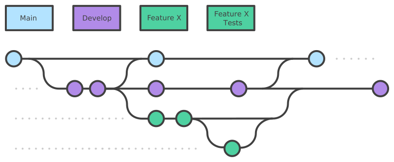
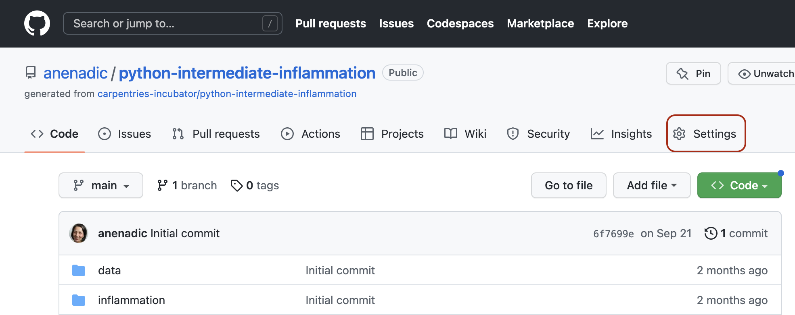
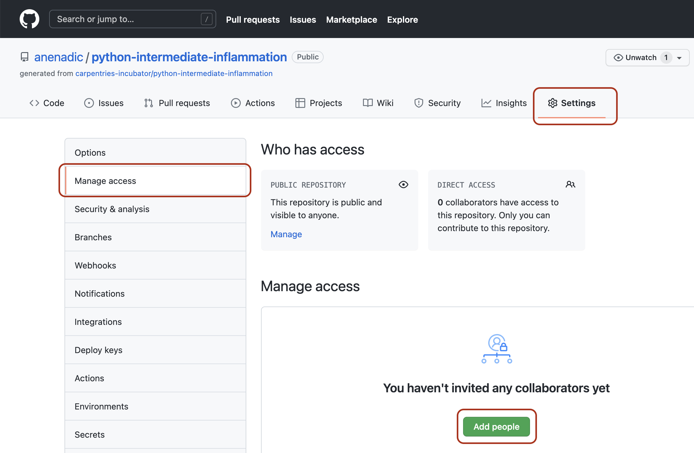
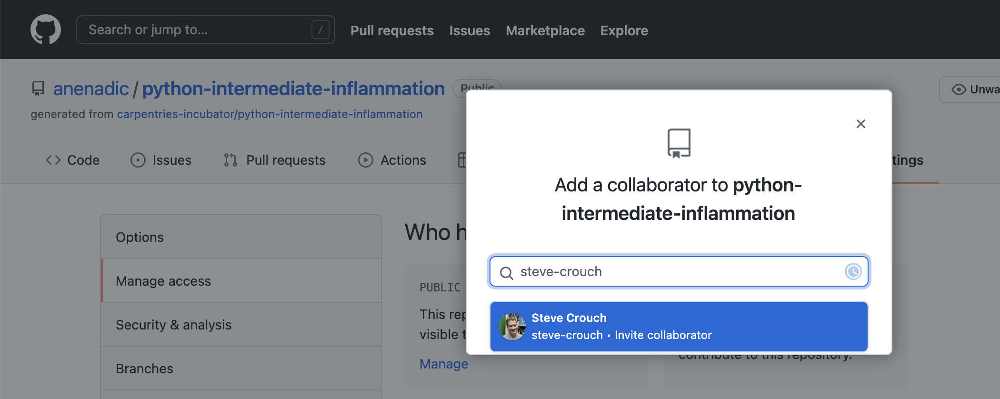
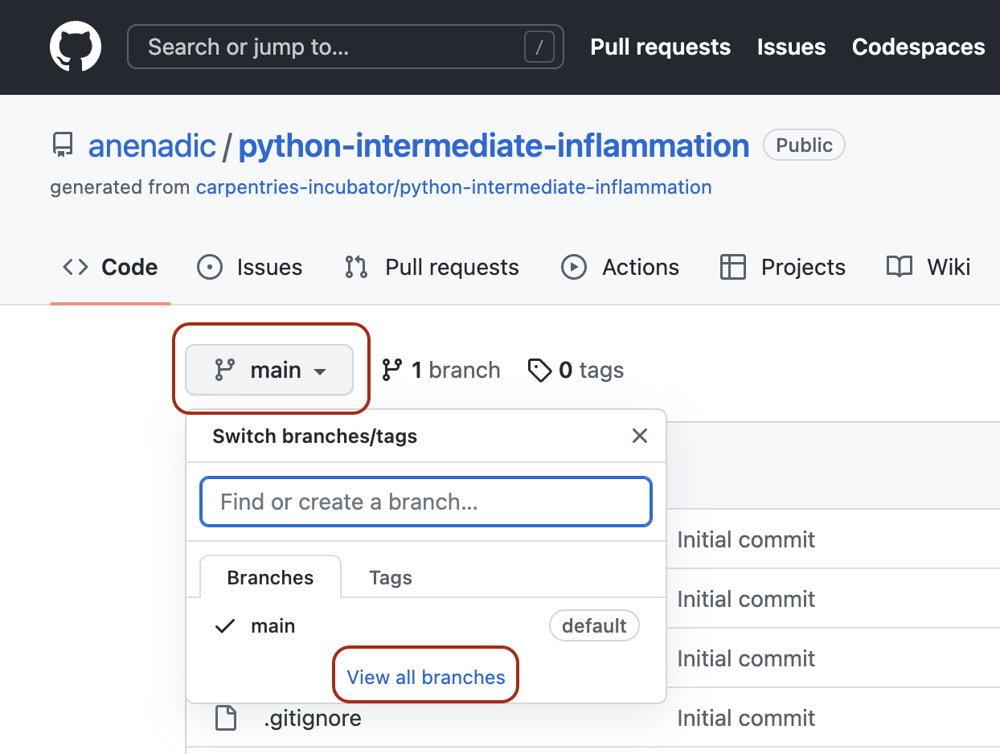
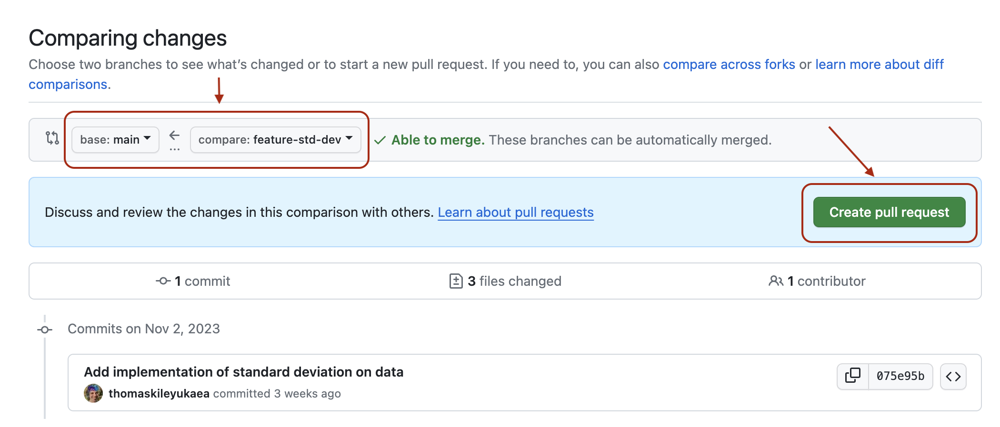
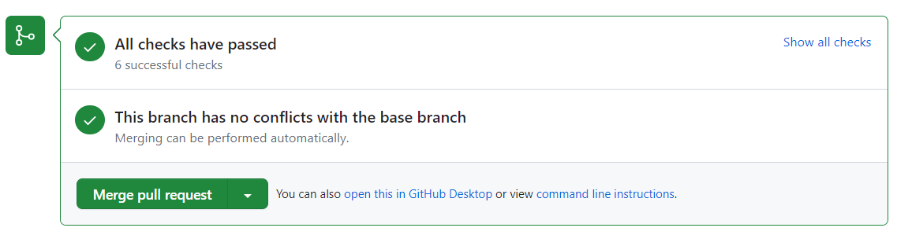

 
## Introduction

So far in this course we’ve focused on learning software design and (some) technical practices, tools 
and infrastructure that help the development of software in a team environment, but in an individual setting.
Despite developing tests to check our code - no one else from the team had a look at our code 
before we merged it into the main development stream. Software is often designed and built as part of a team, 
so in this episode we'll be looking at how to manage the process of team software development and improve our 
code by engaging in code review process with other team members.

> ## Collaborative Code Development Models
> The way your team provides contributions to the shared codebase depends on the type of development model you use in your project. 
Two commonly used models are:
- **fork and pull model** - where anyone can **fork** an existing repository (to create their copy of the project linked to 
the source) and push changes to their personal fork. 
A contributor can work independently on their own fork as they 
do not need permissions on the source repository to push modifications to a fork they own. 
The changes from contributors can then be **pulled** into the source repository by the project maintainer on request 
and after a code review process. This model is popular with open
source projects as it reduces the start up costs for new contributors and allows them to work
independently without upfront coordination with source project maintainers. So, for example, 
you may use this model when you are an 
external collaborator on a project rather than a core team member.
- **shared repository model** - where collaborators are granted push access to a single shared code repository. 
Even though collaborators have write access to the main 
development and production branches, the best practice of creating feature branches for new developments and 
when changes need to be made is still followed. This is to enable easier testing of the new code and 
initiate code review and general discussion about a set of changes before they are merged 
into the development branch. This model is more prevalent with teams and organisations 
collaborating on private projects.
{: .callout}
 
Regardless of the collaborative code development model you and your collaborators use - code reviews are one of the 
widely accepted best practices for software development in teams and something you should adopt in your development 
process too.

## Code Review

[Code review][code-review] is a software quality
assurance practice where one or several people from the team (different from the code's author) check the software by
viewing parts of its source code.

> ## Group Exercise: Advantages of Code Review
> Discuss as a group: what do you think are the reasons behind, and advantages of, code review?
>> ## Solution 
>> The purposes of code review include:
>> - improving internal code readability, understandability, quality and maintainability
>> - checking for coding standards compliance, code uniformity and consistency
>> - checking for test coverage and detecting bugs and code defects early
>> - detecting performance problems and identifying code optimisation points
>> - finding alternative/better solutions. 
>>
>> An effective code review prevents errors from creeping into your software by improving code quality at an early
stage of the software development process. It helps with learning, i.e. sharing knowledge about the codebase,
solution approaches, expectations regarding quality, coding standards, etc. Developers use code review feedback
from more senior developers to improve their own coding practices and expertise. Finally, it helps increase the sense of
collective code ownership and responsibility, which in turn helps increase the "bus factor" and reduce the risk resulting from
information and capabilities being held by a single person "responsible" for a certain part of the codebase and
not being shared among team members.
> {: .solution}
{: .challenge}

Code review is one of the most useful team code development practices - someone checks your design or code for errors,
they get to learn from your solution, having to
explain code to someone else clarifies your rationale and design decisions in your mind too, and collaboration
helps to improve the overall team software development process. It is universally applicable throughout
the software development cycle - from design to development to maintenance. According to Michael Fagan, the
author of the [code inspection technique](https://en.wikipedia.org/wiki/Fagan_inspection), rigorous inspections can
remove 60-90% of errors from the code even before the
first tests are run ([Fagan, 1976](https://doi.org/10.1147%2Fsj.153.0182)).
Furthermore, according to Fagan, the cost to remedy a defect in the early (design) stage is 10 to 100 times less
compared to fixing the same defect in the development and maintenance
stages, respectively. Since the cost of bug fixes grows in orders of magnitude throughout the software
lifecycle, it is far more efficient to find and fix defects as close as possible to the point where they were introduced.

There are several **code review techniques** with various degree of formality and the use of 
a technical infrastructure, including:

- **Over-the-shoulder code review** is the most common and informal of code review techniques and involves one or more team 
members standing over the code author's shoulder while the author walks the reviewers through a set of code changes.
- **Email pass-around code review** is another form of lightweight code review where the code author packages up a set 
of changes and files and sends them over to reviewers via email. Reviewers examine the files and differences against the
code base, ask questions and discuss with the author and other developers, and suggest changes over email. 
The difficult part of this process is the manual collection the files under review and noting differences.
- **Pair programming** is a code development process that incorporates continuous code review - two developers sit together
at a computer, but only one of them actively codes whereas the other provides real-time feedback. It is a
great way to inspect new code and train developers, especially if an experienced team member walks a younger
developer through the new code, providing explanations and suggestions through a conversation. It is conducted
in-person and synchronously but it can be time-consuming as the reviewer cannot do any other work during the
pair programming period.
- **Fagan code inspection** is a formal and heavyweight process of 
finding defects in specifications or designs during various phases of the software development process. There are 
several roles taken by different team members in a Fagan inspection and each inspection is a formal 7-step process 
with a predefined entry and exit criteria. See [Fagan inspection](https://en.wikipedia.org/wiki/Fagan_inspection) for 
full details on this method.
- **Tool-assisted code review** process uses a specialised tool to facilitate the process of code review, which typically
helps with the following tasks: (1) collecting and displaying the updated files and highlighting what has changed, (2) 
facilitating a conversation between team members (reviewers and developers), and (3) allowing code administrators and 
product managers a certain control and overview of the code development workflow. Modern tools may provide a handful 
of other functionalities too, such as metrics (e.g. inspection rate, defect rate, defect density).

Each of the above techniques have their pros and cons and varying degrees practicality - 
it is up to the team to decide which ones are most suitable for the project and when to use them.
We will have a look at the **tool-assisted code review process** using Bitbucket's built-in code review tool - **pull requests**. It is a lightweight tool, included with Bitbucket's core service for free and has gained 
popularity within the software development community in recent years.

## Code Reviews via Bitbucket's Pull Requests

Pull requests (also sometimes called 'merge requests') are fundamental to how teams review and improve code on Bitbucket (and similar code sharing platforms) -
they let you tell others about changes you've pushed to a branch in a repository on Bitbucket and that your 
code is ready for review. Once a pull request is opened, you can discuss and review the potential changes with others 
on the team and add follow-up commits based on the feedback before your changes are merged from your feature branch 
into the `develop` branch. The name 'pull request' suggests you are **requesting** the codebase 
moderators to **pull** your changes into the codebase. 

Such changes are normally done on a feature branch, to ensure that they are separate and self-contained and 
that the main branch only contains "production-ready" work and that the `develop` branch contains code that 
has already been extensively tested. You create a branch for your work
based on one of the existing branches (typically the `develop` branch but can be any other branch), 
do some commits on that branch, and, once you are ready to merge your changes, create a pull request to bring 
the changes back to the branch that you started from. In this 
context, the branch from which you branched off to do your work and where the changes should be applied 
back to is called the **destination branch**, while the feature branch that contains changes you would like to be applied
is the **source branch**.
 
How you create your feature branches and open pull requests in Bitbucket will depend on your collaborative code 
development model:

- In the shared repository model, in order to create a feature branch and open a 
pull request based on it you must have write access to the source repository or, for organisation-owned repositories, 
you must be a member of the organisation that owns the repository. Once you have access to the repository, you proceed 
to create a feature branch on that repository directly.
- In the fork and pull model, where you do not have write permissions to the source repository, you need to fork the
repository first before you create a feature branch (in your fork) to base your pull request on.

In both development models, it is recommended to create a feature branch for your work and 
the subsequent pull request, even though you can submit pull requests from any branch or commit. This is because, 
with a feature branch, you can push follow-up commits as a response to feedback and update your proposed changes within
a self-contained bundle. 
The only difference in creating a pull request between the two models is how you create the feature branch. 
In either model, once you are ready to merge your changes in - you will need to specify the destination branch and the source
branch. 
   
## Code Review and Pull Requests In Action

Let's see this in action - you and your fellow learners are going to be organised in small teams and assume to be 
collaborating in the shared repository model. You will be added as a collaborator to another team member's repository 
(which becomes the shared repository in this context) and, likewise, you will add other team members as collaborators 
on your repository. You can form teams of two and work on each other's repositories. If there are 3 members in 
your group you can go in a round robin fashion (the first team member does a pull request on the second member's 
repository and receives a pull request on their repository from the third team member). If you are going through the 
material on your own and do not have a collaborator, you can do pull requests on your own repository from one to 
another branch.

Recall [solution requirements SR1.1.1 and SR1.2.1](../31-software-requirements/index.html#solution-requirements) from an
earlier episode. Your team member has implemented one of them according to the specification (let's call it `feature-x`)
but tests are still missing. You are now tasked with implementing tests on top of 
that existing implementation to make sure the new feature indeed satisfies the requirements. You will propose 
changes to their repository (the shared repository in this context) via pull request 
(acting as the code author) and engage in code review with your team member (acting as a code reviewer). 
Similarly, you will receive a pull request on your repository from another team member, 
in which case the roles will be reversed.  TODO The following diagram depicts the branches that you should have in the repository.

{: .image-with-shadow width="800px"}

Adapted from <a href="https://sillevl.gitbooks.io/git/content/collaboration/workflows/gitflow/" target="_blank">Git Tutorial by sillevl</a> (Creative Commons Attribution 4.0 International License)

 

To achieve this, the following steps are needed.

#### Step 1: Adding Collaborators to a Shared Repository

You need to add the other team member(s) as collaborator(s) on your repository 
to enable them to create branches and pull requests. To do so, each repository owner needs to:

1. Head over to **Repository Settings** section of your software project's repository in Bitbucket.
2. Select **User and group access**.
3. Click on **Add members**.
4. Enter your collaborator's email address that they used to sign up with Bitbucket.
5. Give your collaborator **Read** access and click on **Confirm**.
6. Your collaborator will receive an email to confirm the invitation. They need to click on the **Accept my invitation** link in the email, and then **Accept invitation** in Bitbucket.


1. Head over to Settings section of your software project's repository in GitHub.
   {: .image-with-shadow width="900px"}
2. Select the **vertical** tab 'Collaborators' from the left and click the 'Add people' button.
   {: .image-with-shadow width="900px"}
3. Add your collaborator(s) by their GitHub username(s), full name(s) or email address(es).
   {: .image-with-shadow width="900px"}
4. Collaborator(s) will be notified of your invitation to join your repository based on their notification preferences.
5. Once they accept the invitation, they will have the collaborator-level access to your repository and will show up
in the list of your collaborators.


See the full details on [grant repository access to users and groups](https://support.atlassian.com/bitbucket-cloud/docs/grant-repository-access-to-users-and-groups/) 
to understand what collaborators will be able to do within your repository.

#### Step 2: Preparing Your Local Environment for a Pull Request

1. Obtain the Bitbucket URL of the shared repository you will be working on and clone it locally (make sure 
you do it outside your software repository's folder you have been working on so far). 
This will create a copy of the repository locally on your machine along with all of 
its (remote) branches.
    ~~~
    $ git clone <remote-repo-url>
    $ cd <remote-repo-name>
    ~~~
    {: .language-bash}
2. Check with the repository owner (your team member) which feature (SR1.1.1 or SR1.2.1) they implemented in 
the [previous exercise](/32-software-design/index.html#implement-requirements) and what is the name of the branch they worked on. 
Let's assume the name of the branch was `feature-x` (you should amend the branch name for your case accordingly).
3. Your task is to add tests for the code on `feature-x` branch. You should do so on a separate branch called `feature-x-tests`, which 
will branch off `feature-x`. This is to enable you later on to create a pull request from your `feature-x-tests` branch with your changes
that can then easily be reviewed and compared with `feature-x` by the team member who created it. 

    To do so, branch off a new local branch `feature-x-tests` from the remote `feature-x` branch (making sure you use the 
    branch names that match your case). Also note that, while we cay "remote" branch `feature-x` - you have actually 
    obtained it locally on your machine when you cloned the remote repository.
    ~~~
    $ git checkout -b feature-x-tests origin/feature-x
    ~~~
    {: .language-bash}
    
    You are now located in the new (local) `feature-x-tests` branch and are ready to start adding your code.

#### Step 3: Adding New Code 

> ## Exercise: Implement Tests for the New Feature
> Look back at the [solution requirements](/31-software-requirements/index.html#solution-requirements) (SR1.1.1 or SR1.2.1) for
> the feature that was implemented in your shared repository. Implement tests against the appropriate
> specification in your local feature branch.
> 
> *Note: Try not to not fall into the trap of writing the tests to test the existing code/implementation - you should
> write the tests to make sure the code satisfies the requirements regardless of the actual implementation. You can
> treat the implementation as a [closed box](https://en.wikipedia.org/wiki/Black-box_testing) - a typical approach 
> to software testing - as a way to make sure it is properly tested against its requirements without introducing 
> assumptions into the tests about its implementation.*
{: .challenge}

> ## Testing Based on Requirements
Tests should test functionality, which stem from the software requirements, rather than an implementation. Tests can 
be seen as a reflection of those requirements - checking if the requirements are satisfied.
{: .callout}

Remember to commit your new code to your branch `feature-x-tests`.

~~~
$ git add -A
$ git commit -m "Added tests for feature-x."
~~~
{: .language-bash}

#### Step 4: Submitting a Pull Request

When you have finished adding your tests and have committed the changes to your local `feature-x-tests`, 
and are ready for the others in the team to review them, you have to do the following:

1. Push your local feature branch `feature-x-tests` remotely to the shared repository.
    ~~~
    $ git push -u origin feature-x-tests
    ~~~
    {: .language-bash}
2. From the top menu of Bitbucket, select **Create** -> **Pull request**
3. Select the *source*- and the *destination branch*, e.g. `feature-x` and `feature-x-tests`, respectively. Recall that the *destination branch* is 
where you want your changes to be merged and the *source branch* contains your changes.
4. Add a description of the nature of the changes, and then create the pull request.
5. Your collaborator can find the pull request in the left menu under **Pull requests**.
6. At this point, the code review process is initiated.


1. Push your local feature branch `feature-x-tests` remotely to the shared repository.
    ~~~
    $ git push -u origin feature-x-tests
    ~~~
    {: .language-bash}
2. Head over to the remote repository in GitHub and locate your new (`feature-x-tests`) branch from the dropdown box on 
the Code tab (you can search for your branch or use the "View all branches" option).
   {: .image-with-shadow width="600px"}
3. Open a pull request by clicking "Compare & pull request" button.
   {: .image-with-shadow width="900px"}
4. Select the base and the head branch, e.g. `feature-x` and `feature-x-tests`, respectively. Recall that the base branch is 
where you want your changes to be merged and the head branch contains your changes.
5. Add a comment describing the nature of the changes, and then submit the pull request.
6. Repository moderator and other collaborators on the repository (code reviewers) will be notified of your pull request by GitHub.
7. At this point, the code review process is initiated.


You should receive a similar pull request from other team members on your repository.

#### Step 5: Code Review

1. The repository moderator/code reviewers reviews your changes and provides feedback to you 
in the form of comments.
2. Respond to their comments and do any subsequent commits, as requested by reviewers.
3. It may take a few rounds of exchanging comments and discussions until the team is ready to accept your changes. 

Perform the above actions on the pull request you received, this time acting as the moderator/code reviewer.

#### Step 6: Closing a Pull Request

1. Once the moderator approves your changes, either one of you can merge onto the base branch. Typically, it is 
the responsibility of the code's author to do the merge but this may differ from team to team.

   {: .image-with-shadow width="900px"}

2. Delete the merged branch to reduce the clutter in the repository.

Repeat the above actions for the pull request you received.

If the work on the feature branch is completed and it is sufficiently tested, the feature branch can now be merged 
into the `develop` branch.

## Best Practice for Code Review
        
There are multiple perspectives to a code review process - from general practices to technical details 
relating to different roles involved in the process. It is critical for the code's quality, stability and maintainability 
that the team decides on this process and sticks to it. Here are some examples of best practices for you to consider 
(also check these useful code review blogs from [Swarmia](https://www.swarmia.com/blog/a-complete-guide-to-code-reviews/?utm_term=code%20review&utm_campaign=Code+review+best+practices&utm_source=adwords&utm_medium=ppc&hsa_acc=6644081770&hsa_cam=14940336179&hsa_grp=131344939434&hsa_ad=552679672005&hsa_src=g&hsa_tgt=kwd-17740433&hsa_kw=code%20review&hsa_mt=b&hsa_net=adwords&hsa_ver=3&gclid=Cj0KCQiAw9qOBhC-ARIsAG-rdn7_nhMMyE7aeSzosRRqZ52vafBOyMrpL4Ypru0PHWK4Rl8QLIhkeA0aAsxqEALw_wcB) and [Smartbear](https://smartbear.com/learn/code-review/best-practices-for-peer-code-review/)):
   
1. Decide the focus of your code review process, e.g., consider some of the following:
   - code design and functionality - does the code fit in the overall design and does it do what was intended? 
   - code understandability and complexity - is the code readable and would another developer be able to understand it?
   - tests - does the code have automated tests?
   - naming - are names used for variables and functions descriptive, do they follow naming conventions?
   - comments and documentation - are there clear and useful comments that explain complex designs well and focus 
on the "why/because" rather than the "what/how"? 
2. Do not review code too quickly and do not review for too long in one sitting. According to
[“Best Kept Secrets of Peer Code Review” (Cohen, 2006)](https://archive.org/details/bestkeptsecretso00jaso) - the first hour of review 
matters the most as detection of defects significantly drops after this period. [Studies into code review](https://smartbear.com/resources/ebooks/the-state-of-code-review-2020-report/) 
also show that you should not review more than 400 lines of code at a time. Conducting more frequent shorter reviews 
seems to be more effective.
3. Decide on the level of depth for code reviews to maintain the balance between the creation time
and time spent reviewing code - e.g. reserve them for critical portions of code and avoid nit-picking on small 
details. Try using automated checks and linters when possible, e.g. for consistent usage of certain terminology across the code and code styles.
4. Communicate clearly and effectively - when reviewing code, be explicit about the action you request from the author.
5. Foster a positive feedback culture:
  - give feedback about the code, not about the author
  - accept that there are multiple correct solutions to a problem
  - sandwich criticism with positive comments and praise
7. Utilise multiple code review techniques - use email, pair programming, over-the-shoulder, team discussions and 
tool-assisted or any combination that works for your team. However, for the most effective and efficient code reviews, 
tool-assisted process is recommended.
9. From a more technical perspective: 
   - use a feature branch for pull requests as you can push follow-up commits if you need to update
         your proposed changes
   - avoid large pull requests as they are more difficult to review. You can refer to some [studies](https://jserd.springeropen.com/articles/10.1186/s40411-018-0058-0) and [Google recommendations](https://google.github.io/eng-practices/review/developer/small-cls.html) 
   as to what a "large pull request" is but be aware that it is not exact science.
   - don't force push to a pull request as it changes the repository history
         and can corrupt your pull request for other collaborators

> ## Exercise: Code Review in Your Own Working Environment
> 
> At the start of this episode we briefly looked at a number of techniques for doing code review, and as an example, went on to see how we can use Bitbucket Pull Requests to review team member code changes. Finally, we also looked at some best practices for doing code reviews in general.
> 
> Now think about how you typically develop code, and how you might institute code review practices within your own working environment. Write down briefly for your own reference (perhaps using bullet points) some answers to the following questions:
> 
> - Which 2 or 3 key circumstances would code review be most useful for you and your colleagues?
> - Referring to the first section of this episode above, which type of code review would be most useful for each circumstance (and would work best within your own working environment)?
> - Taking one of these circumstances where code review would be most beneficial, how would you organise such a code review, e.g.:
>   - Which aspects of the codebase would be the most useful to cover?
>   - How often would you do them?
>   - How long would the activity take?
>   - Who would ideally be involved?
>   - Any particular practices you would use?
{: .challenge}


