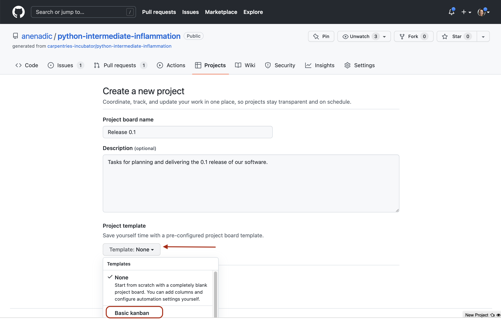

## Introduction

Developing software is a project and, like most projects, it consists of multiple tasks. Keeping track of identified issues 
with the software, the list of tasks the team has to do, progress on each, prioritising tasks for future development, 
planning sprints and releases, etc., can quickly become a non-trivial task in itself. 
Without a good team project management process and framework, 
it can be hard to keep track of what’s done, or what needs doing, and particularly difficult to convey that to others 
in the team or share the responsibilities.

## Using GitHub to Manage Issues With Software

As a piece of software is used, bugs and other issues will inevitably come to light - nothing is perfect! 
If you work on your code with collaborators, or have non-developer users, it can be helpful to have a single shared 
record of all the problems people have found with the code, not only to keep track of them for you to work on later, 
but to avoid the annoyance of people emailing you to report a bug that you already know about!

GitHub provides **Issues** - a framework for managing bug reports, feature requests, and lists of future work.

Go back to the home page for your `python-intermediate-inflammation` repository, and click on the Issues tab.
You should see a page listing the open issues on your repository, currently none.

{: .image-with-shadow width="1000px"}

Let's go through the process of creating a new issue. Start by clicking the `New issue` button.

{: .image-with-shadow width="1000px"}

When you create an issue, you can provide a range of details added to them. They can be *assigned to a specific developer* for example - this can be a helpful way to know who, if anyone, is currently working to fix an issue (or a way to assign responsibility to someone to deal with it!).

They can also be assigned a *label*. The labels available for issues can be customised, and given a colour, allowing you to see at a glance from the Issues page the state of your code. The default labels available in GitHub include:

- `bug` - indicates an unexpected problem or unintended behavior
- `documentation` - indicates a need for improvements or additions to documentation
- `duplicate` - indicates similar or already reported issues, pull requests, or discussions
- `enhancement` - indicates new feature requests, or if they are created by a developer, indicate planned new features
- `good first issue` - indicates a good issue for first-time contributors
- `help wanted` - indicates that a maintainer wants help on an issue or pull request
- `invalid` - indicates that an issue, pull request, or discussion is no longer relevant
- `question` - indicates that an issue, pull request, or discussion needs more information
- `wontfix` - indicates that work won't continue on an issue, pull request, or discussion

Check the [GitHub documentaiton on Issues](https://docs.github.com/en/issues/using-labels-and-milestones-to-track-work/managing-labels) for the full reference.
You can also create your own custom labels to help with classifying issues. There are no rules really about naming the labels - use whatever makes sense for your project. Some conventional custom labels include: `status:in progress` (to indicate that someone started working on the issue), `status:blocked` (to indicate that the progress on addressing issue is blocked by another issue or activity), etc.

As well as highlighting problems, the `bug` label can make code much more usable by allowing users to find out if anyone has had the same problem before, and also how to fix (or work around) it on their end. Enabling users to solve their own problems can save you a lot of time and stress! In general, a good bug report should contain only one bug, specific details of the environment in which the issue appeared (operating system or browser, version of the software and its dependencies), and sufficiently clear and concise steps that allow a developer to reproduce the bug themselves. They should also be clear on what the bug reporter considers factual ("I did this and this happened") and speculation ("I think it was caused by this"). If an error report was generated from the software itself, it's a very good idea to include that in the bug report.

The `enhancement` label is a great way to communicate your future priorities to your collaborators, and also your future self - it’s far too easy to leave a software project for a few months to write a paper, then come back and have forgotten the improvements you were going to make. If you have other users for your code, they can use the label to request new features, or changes to the way the code operates. It’s generally worth paying attention to these suggestions, especially if you spend more time developing than running the code. It can be very easy to end up with quirky behaviour because of off-the-cuff choices during development. Extra pairs of eyes can point out ways the code can be made more accessible, and the easier a code is to use, then the more widely it will be adopted and the greater its impact will be.

> ## Wontfix
>
> One interesting label is `wontfix`, which indicates that an issue simply won't be worked on for whatever reason. Maybe the bug it reports is outside of the use case of the software, or the feature it requests simply isn't a priority.
>
> The **Lock issue** and **Pin issue** buttons allow you to block future comments on an issue, and pin it to the top of the issues page. This can make it clear you've thought about an issue and dismissed it!
{: .callout}

> ## Manage Issues With Your Code Openly
> Having open, publicly-visible lists of the the limitations and problems with your code is incredibly helpful. Even if some issues end up languishing unfixed for years, letting users know about them can save them a huge amount of work attempting to fix what turns out to be an unfixable problem on their end. It can also help you see at a glance what state your code is in, making it easier to prioritise future work!
{: .testimonial}

> ## Our First Issue!
>
> Individually, with a critical eye, think of an aspect of the code you have developed so far that needs improvement. 
> It could be a bug, for example, or a documentation issue with your README, a missing LICENSE file, or an enhancement. 
> In GitHub, enter the details of the issue *with a suitable label* and select `Submit new issue`.
> 
> Do not forget to label your issue! 
> 
> Time: 10 mins
{: .challenge}

### Issue (and Pull Request) Templates
TODO: check with Steve and James if this mini section is needed - if there is too muc text we could cut this out.
GitHub allows you to set up issue and pull request templates for your software project. 
Such templates provide a structure for the issue/pull request descriptions, and/or prompt issue reporters and collaborators 
to fill in answers to pre-set questions. They can help contributors raise issues or submit pull requests in a way 
that is clear, helpful and provides enough information for maintainers to act upon 
(without going back and forth to extract it). GitHub provides a range of default templates, 
but you can also [write your own](https://docs.github.com/en/communities/using-templates-to-encourage-useful-issues-and-pull-requests/configuring-issue-templates-for-your-repository).

## Team Communication Using GitHub's Notifications

GitHub implements a comprehensive [notifications system](https://docs.github.com/en/account-and-profile/managing-subscriptions-and-notifications-on-github/setting-up-notifications/configuring-notifications) 
to keep the team up-to-date with activities in your code repository and notify you when something happens or changes 
in your software project. You can choose whether to watch or unwatch an individual repository,
or can choose to only be notified of certain event types such as updates to issues, pull requests, direct mentions, 
etc. GitHub also provides an additional useful notification feature for collaborative work - **Mentions**.

### GitHub's Mentions

The mention system notifies team members when somebody else references them in an issue,
comment or pull request - you can use this to notify people when you want to check a detail with them,
or let them know something has been fixed or changed (much easier than writing out all the same information
again in an email!). 

You can use the mention system to link to/notify an individual GitHub account or a whole team
for notifying multiple people. Typing <kbd>@</kbd> in GitHub will bring up a list of all accounts and teams linked
to the repository that can be "mentioned". People will then receive notifications based on their preferred notification
methods - e.g. via email or GitHub's User Interface.

GitHub also lets you mention/reference one issue or pull request from another (and people "watching" these will be notified
of any such updates). Whilst writing the description of an issue, or commenting on one,
if you type <kbd>#</kbd> you should see a list of the issues and pull requests on the repository.
They are coloured green if they're open, or white if they're closed. Continue typing the issue number, and
the list will narrow, then you can hit <kbd>Return</kbd> to select the entry and link the two. You can also
navigate the list with the <kbd>↑</kbd> and <kbd>↓</kbd> arrow keys. For example, if you realise that several of your bugs
have common roots, or that one enhancement can't be implemented before you've finished another, you can use the
mention system to indicate the depending issue(s). This is a simple way to add much more information to your issues.

While not strictly notifying anyone, GitHub lets you also reference individual comments and commits. If you click the
"..." button on a comment, from the drop down list you can select to 'Copy link' (which is a URL that points to that
comment that can be pasted elsewhere) or to 'Reference [a comment] in a new issue' (which opens a new issue and references
the comment by its URL). Within a text box for comments, issue and pull request descriptions, you can reference
a commit by pasting its long, unique identifier (or its first few digits which uniquely identify it)
and GitHub will render it nicely using the identifier's short form and link to the commit in question.

{: .image-with-shadow width="700px"}

> ## You Are A User
>
> This section focuses a lot on how issues can help communicate the current state of the code to others. As a sole developer, and possibly also the only user of the code too, you might be tempted to not bother with recording issues and features as you don't need to communicate the information to anyone else.
>
> Unfortunately, human memory isn't infallible! After spending six months writing your thesis, or a year working on a different sub-topic, it's inevitable you'll forget some of the plans you had and problems you faced. Not documenting these things can lead to you having to re-learn things you already put the effort into discovering before.
{: .callout}

## Software Project Management in GitHub
Managing issues within your software project is one aspect of project management but it gives a relative flat 
representation of tasks and may not be as suitable for higher-level project management such as 
prioritising tasks for future development, planning sprints and releases. Luckily, 
GitHub provides two project management tools for this purpose - **Milestones** and **Project Boards**.

Both Milestones and Project Boards implement an agile development and project management system. 
Milestones are good for [scrum-style project development and management](https://www.atlassian.com/agile/scrum) - 
i.e. timeboxed, structured iterations and working in short sprints on batches of issues. Project Boards implement 
a [Kanban methodology](https://www.atlassian.com/agile/kanban) - 
good for managing continuous delivery and steady flow of work in a project. 

Both Project Boards and Milestones are a way of organising issues into smaller "sub-projects" (i.e. 
smaller than the "project" represented by the whole repository). When should you use one over the other? 
Project Boards provide a way of visualising and organising the work on an higher level (e.g. more suitable for 
project management tasks) and are not timeboxed (i.e. time-bound). Milestones are a way to 
organise lower-level tasks that have deadlines and progress of which needs to be closely tracked 
(e.g. release and version management). How you organise and partition your project work is up to you and the size 
of your project. For example, you could create a project per 
milestone or have several milestones in a single project, or split milestones into shorter sprints. 
For a good description of differences between the two, have a look at [this answer on StackOverflow](https://stackoverflow.com/questions/39591795/what-is-the-difference-relationship-between-github-projects-and-milestones). 
We will see Milestones in action soon when we work with our team on a mini sprint - 
for now, let's have a brief look at Project Boards.

### Project Boards
A Project Board (or Kanban board, from the Japanese word for a card) uses columns and cards to keep track of tasks. 
You break down your project into smaller sub-projects, which in turn are split 
into tasks which you write on cards, then move the cards between columns that describe the status of each task. 
Cards are usually small, descriptive and self-contained tasks that build on each other. Breaking a project 
down into clearly-defined tasks makes it a lot easier to manage. GitHub project boards interact and integrate with 
the other features of the site such as issues and pull requests - cards can be added to track the progress of such 
tasks and automatically moved between columns based on their progress or status.

GitHub provides several template boards to get you started. Let's use a "Basic Kanban" template 
that by default contain the following three columns with pretty self-explanatory names:

- `To Do`
- `In Progress`
- `Done`

1. To do so, from the Project tab of your repository, select "Projects" on the left, then click the `New project` 
button on the right.

    {: .image-with-shadow width="1000px"}

2. In the form, populate the name and the description of the project - e.g. "Release 0.1" and "Tasks for planning 
and delivering 0.1 release of our software", respectively. From the template drop-down, select "Basic Kanban".

    {: .image-with-shadow width="1000px"}

    Note that, regardless of which board template you choose now, you can always add or remove columns from 
    your project board later on to suit your use case.
 
3. You can now add new notes or existing issues and pull requests 
(which can be seen and filtered on the right and drag-and-dropped) to create cards in your board. 
Notes on a project board serve as task reminders or to add information related to the project board.

    {: .image-with-shadow width="1000px"}

    Notes contain task descriptions and can have detailed content like checklists. In some cases, e.g. if a note becomes 
    too complex, you may want to convert it into an issue so you can add labels, assign them to team members or 
    write more detailed comments (for that, use the `Convert to issue`
    option from the `...` menu on the note). Sometimes, a card you thought was simple and self-contained might turn out to
    be a bigger task than you thought. In that case, it might be sensible to create new cards that reference the one 
    they broke off from (for that, use the `Copy card link` option from the `...` menu on the card).

You can drag a card to `In Progress` column to indicate that you are working on it. Issues and pull requests on cards 
will automatically be moved to the `Done` column for you when you close the issue or merge the pull request. 
One common extra column that is typically seen is `On hold` or `Waiting` (you can add additional columns yourself). 
If you have tasks that get held up by waiting on other people (e.g. to respond to your questions) then moving them 
to a separate column makes their current state clearer.

> ## Working With Project Boards
> Ideally, we'd have an exercise here. Or perhaps we can postpone for when more issues are added and/or more team work in involved.
> 
> An example exercise, for a want of a better one: Play around with a project board - practice with adding and closing 
> notes and cards, adding and removing columns, closing issues, etc.
> 
> 5 min
{: .challenge}

> ## Prioritisation With Project Boards
> Once your project board has a large number of cards on it, you might want to begin priorisiting them. 
Not all tasks are going to be equally important, and some will require others to be completed before they 
can even be begun. Common methods of prioritisation include:
- **Vertical position**: the vertical arrangement of cards in a column implicitly represents their importance. 
High-priority issues go to the top of `To Do`, whilst tasks that depend on others go beneath them. 
This is the easiest one to implement, though you have to remember to correctly place cards when you add them.
- **Priority columns**: instead of a single `To Do` column, you can have two or more, for example - 
`To Do: Low Priority` and `To Do: High Priority`. When adding a card, you pick which is the appropriate column for it. 
You can even add a `Triage` column for newly-added issues that you’ve not yet had time to classify. 
This format works well for project boards devoted to bugs.
- **Labels**: if you convert each card into an issue, then you can label them with their priority - remember GitHub 
lets you create custom labels and set their colours. Label colours can provide a very visually clear indication of 
issue priority but require more administrative work on the project, as each card has to be an issue to be assigned a 
label. If you choose this route for issue prioritisation - be aware of accessibility issues for colour-blind people 
when picking colours.
>
{: .callout}


