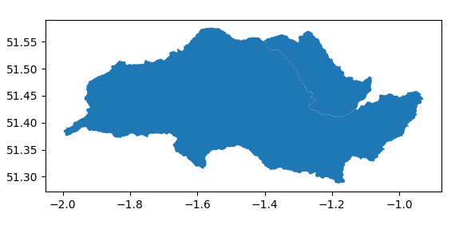

## Introduction

> ## Follow up from Section 3
> This episode could be read as a follow up from the end of [Section 3 on object oriented programming](../35-object-oriented-programming/index.html#geospatial-data).
{: .callout}

We have now seen how object-orientated programming can be used to group our Sites within 
the relevant Catchments. These relationships can be established using geospatial data,
which has been collected and documented for the LOCAR project. So in this episode we will
look at how you can work with this data.

Geospatial data is data which describes features or objects on the Earth's surface. It 
generally combines location information with attribute information for a given feature. 
The location information can either latitude and longitude, or grid references in a system 
such as the British Nation Grid. The attribute information can include descriptors, such 
as naming a town or village; characteristics, such as identifying a road as a motorway; 
and associated data, such as emissions data for factory, or measurement data for a 
research site.

There are two primary forms for geospatial data: vector data and raster data. Raster data 
is a gridded information, usually an array of equally sized cells. Vector data, which we 
will be dealing with below, uses points, lines, and polygons to represent features.

We will be using the [GeoPandas](https://geopandas.org/en/stable/index.html) library to work with this geospatial data. This library brings together a number of other python libraries used for working on geometric shapes, cartographic projections, and dataframes, to make working with geospatial data easier.

### Setup

First you will need to install GeoPandas and it's dependencies into your virtual 
environment. This can be done through Pycharm, or at the command line. 

On linux or OSX you should install the following 
packages:
~~~
(venv) $ pip3 install shapely pyproj rtree fiona geopandas
~~~
{: .language-bash}
On Windows you will need to replace `fiona` with the `pyogrio` library:
~~~
(venv) $ pip3 install shapely pyproj rtree pyogrio geopandas
~~~
{: .language-bash}
More information on installing GeoPandas and it's dependencies is available on their [install page](https://geopandas.org/en/stable/getting_started/install.html).

Once these packages are installed remember to update the project `requirements.txt` file:
~~~
(venv) $ pip3 freeze > requirements.txt
~~~
{: .language-bash}

## LOCAR Geospatial Data

Geospatial data for both the measurement sites and the three catchments for the LOCAR
project are included in the project dataset.

### Measurement Sites

Measurement site information is included in the file `data/LOCAR_Site_Information.csv`. You can use a text editor, or the bash `head` command, to examine the file:
~~~
head -5 data/LOCAR_Site_Information.csv
~~~
{: .language-bash}
~~~
Site Code,Site Name,Easting,Northing,LCWQ ,LCWQ Cont,RNWQ,RNGA,AWST,Latitude,Longitude
FP01,Bere Stream at Snatford Bridge,385575,92975,x,x,,,,50.736206,-2.205775
FP02,Bovington Stream at Blindmans Wood,384175,87800,x,x,,,,50.689632,-2.225391
FP04,CEH Winfrith,384175,87800,,,x,,x,50.689632,-2.225391
FP06,Devils Brook at Dewlish village,377800,98500,x,x,,,,50.785642,-2.316285
~~~
{: .output}
The site information is organised in a similar manner to the measurement data, with a 
`Site Code` identifying each Point location, along with a short site description, associated geographic information 
(both `Easting` and `Northing`, and `Latitude` and `Longitude`), and information about the 
measurements available at each site. The key for this information is given at the end of 
the file:
~~~
tail -11 data/LOCAR_Site_Information.csv
~~~
{: .language-bash}
~~~
,,,,,,,,,,
,,,,,,,,,,
Notes,,,,,,,,,,
,,,,,,,,,,
"If an 'x' appears in a cell, then data exist for that site for the instrument type described below",,,,,,,,,,
,,,,,,,,,,
LCWQ,LOCAR water quality sampling site,,,,,,,,,
LCWQ Cont,LOCAR water quality sampling site for continuously monitered determinands,,,,,,,,,
RNWQ,Rainwater collector for water quality samples,,,,,,,,,
RNGA,Rain Gauge,,,,,,,,,
AWST,Automatic Weather Station,,,,,,,,,
~~~
{: .output}

To load the site information in python we can use the `pandas.read_csv` function, as we do
for the measurement data. When doing this we make sure to skip the information at the end 
of the file (using `skipfooter=<number of lines of footer>`). The `Longitude` and 
`Latitude` information can be used to create geometric Points, using the 
`geopandas.points_from_xy` function. When we do this we also set the Coordinate Reference 
System (CRS) which is used by geopandas to ensure consistency between all the geospatial information supplied. In this case the CRS we require is the widely used [EPSG:4236](https://epsg.io/4326).
~~~
import pandas as pd
import geopandas as gpd
site_locations = pd.read_csv('data/LOCAR_Site_Information.csv', 
                             skipfooter=11, engine='python', 
                             usecols = ['Site Code', 'Longitude', 'Latitude'], 
                             index_col='Site Code')
site_geometry = gpd.points_from_xy(site_locations['Longitude'],
                                   site_locations['Latitude'], crs='EPSG:4326')
site_gdf = gpd.GeoDataFrame(site_locations, geometry=site_geometry)
site_gdf
site_gdf.crs
~~~
{: .language-python}
~~~
            Latitude  Longitude                   geometry
Site Code                                                 
FP01       50.736206  -2.205775  POINT (-2.20578 50.73621)
FP02       50.689632  -2.225391  POINT (-2.22539 50.68963)
FP04       50.689632  -2.225391  POINT (-2.22539 50.68963)
...
<Geographic 2D CRS: EPSG:4326>
Name: WGS 84
Axis Info [ellipsoidal]:
- Lat[north]: Geodetic latitude (degree)
- Lon[east]: Geodetic longitude (degree)
Area of Use:
- name: World.
- bounds: (-180.0, -90.0, 180.0, 90.0)
Datum: World Geodetic System 1984 ensemble
- Ellipsoid: WGS 84
- Prime Meridian: Greenwich
~~~
{: .output}
The `geometry` column contains Point objects which describe the location of the site. 
This is the information that we will use to determine if a site is within a catchment or 
not (we could, if we wished to, now delete the `Latitude` and `Longitude` columns, and 
no information would be lost).

> ## British National Grid
> The original location information is in Easting and Northing. These are coordinate 
> values for the British National Grid CRS ([EPSG:27700](https://epsg.io/27700)). We can
> load these instead using the following code:
> ~~~
> import pandas as pd
> import geopandas as gpd
> site_locations = pd.read_csv('data/LOCAR_Site_Information.csv', 
>                              skipfooter=11, engine='python', 
>                              usecols = ['Site Code', 'Easting', 'Northing'], 
>                              index_col='Site Code')
> site_geometry = gpd.points_from_xy(site_locations['Easting'],
>                                    site_locations['Northing'], crs='EPSG:27700')
> site_gdf = gpd.GeoDataFrame(site_locations, geometry=site_geometry)
> site_gdf
> site_gdf.crs
> ~~~
> {: .language-python}
> ~~~
>            Easting  Northing                       geometry
> Site Code                                                  
> FP01        385575     92975   POINT (385575.000 92975.000)
> FP02        384175     87800   POINT (384175.000 87800.000)
> FP04        384175     87800   POINT (384175.000 87800.000)
> ...
> <Derived Projected CRS: EPSG:27700>
> Name: OSGB36 / British National Grid
> Axis Info [cartesian]:
> - E[east]: Easting (metre)
> - N[north]: Northing (metre)
> Area of Use:
> - name: United Kingdom (UK) - offshore to boundary of UKCS within 49°45'N to 61°N and 9°W to 2°E; onshore Great Britain (England, Wales and Scotland). Isle of Man onshore.
> - bounds: (-9.0, 49.75, 2.01, 61.01)
> Coordinate Operation:
> - name: British National Grid
> - method: Transverse Mercator
> Datum: Ordnance Survey of Great Britain 1936
> - Ellipsoid: Airy 1830
> - Prime Meridian: Greenwich
> ~~~
> {: .output}
> To demonstrate that these are the same locations, we can use GeoPandas built in 
> `.to_crs()` function to convert from Eastings and Northings to Longitude and Latitude:
> ~~~
> site_gdf_ll = site_gdf.to_crs('EPSG:4326')
> site_gdf_ll
> site_gdf_ll.crs
> ~~~
> {: .language-python}
> ~~~
>            Easting  Northing                   geometry
> Site Code                                              
> FP01        385575     92975  POINT (-2.20578 50.73621)
> FP02        384175     87800  POINT (-2.22539 50.68963)
> FP04        384175     87800  POINT (-2.22539 50.68963)
> ...
> <Geographic 2D CRS: EPSG:4326>
> Name: WGS 84
> Axis Info [ellipsoidal]:
> - Lat[north]: Geodetic latitude (degree)
> - Lon[east]: Geodetic longitude (degree)
> Area of Use:
> - name: World.
> - bounds: (-180.0, -90.0, 180.0, 90.0)
> Datum: World Geodetic System 1984 ensemble
> - Ellipsoid: WGS 84
> - Prime Meridian: Greenwich
> ~~~
> {: .output}
{: .callout}

### River Catchment Areas

The three catchment areas are defined using vectors that map the boundary of the catchment area, which are provided within the `data/river_catchments` directory. These vectors are stored as shape files (`frome_piddle_catchment.shp`, `pang_lambourn_catchment.shp`, and `tern_catchment.shp`) with associated metadata (the `*.shx`, `*.dbf`, `*.prj` and `.cpg` files) defining information such as the units the vectors are in, and the spheroid that they are mapped onto. 

These shape files can be directly loaded into a GeoDataFrame, using the `.from_file()` in built function, which will load the metadata from the associated files at the same time.

~~~
import geopandas as gpd

FP_catchment = gpd.GeoDataFrame.from_file('data/river_catchments/frome_piddle_catchment.shp')
FP_catchment
FP_catchment.crs
~~~
{: .language-python}
~~~
  RBD_ID MNCAT_NAME  ...            OPCAT_NAME                                           geometry
0      8     Dorset  ...  Poole Harbour Rivers  MULTIPOLYGON (((-2.00568 50.72064, -2.00569 50...

[1 rows x 9 columns]
<Geographic 2D CRS: EPSG:4326>
Name: WGS 84
Axis Info [ellipsoidal]:
- Lat[north]: Geodetic latitude (degree)
- Lon[east]: Geodetic longitude (degree)
Area of Use:
- name: World.
- bounds: (-180.0, -90.0, 180.0, 90.0)
Datum: World Geodetic System 1984 ensemble
- Ellipsoid: WGS 84
- Prime Meridian: Greenwich
~~~
{: .output}

In this case the `geometry` column contains a single `MULTIPOLYGON` object, which 
describes the catchment area. And the CRS is `EPSG:4326`, as for the measurement site 
data.

Catchments can also be made up of a list of `POLYGON` objects and, due to the integration
of the Matplotlib libraries into Pandas, and so GeoPandas, can be plotted easily:
~~~
import geopandas as gpd
import matplotlib.pyplot as plt

PL_catchment = gpd.GeoDataFrame.from_file('data/river_catchments/pang_lambourn_catchment.shp')
PL_catchment
PL_catchment.plot()
plt.show()
~~~
{: .language-python}

~~~
  RBD_ID                  MNCAT_NAME RBD_NAME  ... version WB_NAME                                           geometry
0      6             Kennet and Trib   Thames  ...    None    None  POLYGON ((-1.16153 51.29329, -1.16124 51.29311...
1      6  Thames and Chilterns South   Thames  ...       2    Pang  POLYGON ((-1.27621 51.46040, -1.27687 51.46181...

[2 rows x 14 columns]
~~~
{: .output}

{: .image-with-shadow width="600px" }

## Matching Sites to Catchments

Regardless of the format of the catchment shape file, the process of finding which sites 
lie within a given catchment is much the same. This is performed using the `sjoin` 
function, which determines the spatial join of two GeoDataFrames, and is part of `geopandas.tools`.

For example:
~~~
import pandas as pd
import geopandas as gpd
from geopandas.tools import sjoin

site_locations = pd.read_csv('data/LOCAR_Site_Information.csv', 
                             skipfooter=11, engine='python', 
                             usecols = ['Site Code', 'Longitude', 'Latitude'], 
                             index_col='Site Code')
site_geometry = gpd.points_from_xy(site_locations['Longitude'],
                                   site_locations['Latitude'], crs='EPSG:4326')
site_gdf = gpd.GeoDataFrame(site_locations, geometry=site_geometry)

FP_catchment = gpd.GeoDataFrame.from_file('data/river_catchments/frome_piddle_catchment.shp')

FP_sites = sjoin(site_gdf, FP_catchment)

FP_sites

~~~
{: .language-python}
~~~
            Latitude  Longitude  ...                                            url            OPCAT_NAME
Site Code                        ...                                                                     
FP01       50.736206  -2.205775  ...  /catchment-planning/OperationalCatchment/3367  Poole Harbour Rivers
FP02       50.689632  -2.225391  ...  /catchment-planning/OperationalCatchment/3367  Poole Harbour Rivers
FP04       50.689632  -2.225391  ...  /catchment-planning/OperationalCatchment/3367  Poole Harbour Rivers
FP06       50.785642  -2.316285  ...  /catchment-planning/OperationalCatchment/3367  Poole Harbour Rivers
FP11       50.681153  -2.189257  ...  /catchment-planning/OperationalCatchment/3367  Poole Harbour Rivers
FP12       50.713169  -2.414234  ...  /catchment-planning/OperationalCatchment/3367  Poole Harbour Rivers
FP13       50.682513  -2.436258  ...  /catchment-planning/OperationalCatchment/3367  Poole Harbour Rivers
FP15       50.790237  -2.582322  ...  /catchment-planning/OperationalCatchment/3367  Poole Harbour Rivers
FP21       50.687986  -2.124167  ...  /catchment-planning/OperationalCatchment/3367  Poole Harbour Rivers
FP22       50.740380  -2.254687  ...  /catchment-planning/OperationalCatchment/3367  Poole Harbour Rivers
FP23       50.766948  -2.400530  ...  /catchment-planning/OperationalCatchment/3367  Poole Harbour Rivers
FP26       50.797487  -2.523172  ...  /catchment-planning/OperationalCatchment/3367  Poole Harbour Rivers
FP28       50.842314  -2.503080  ...  /catchment-planning/OperationalCatchment/3367  Poole Harbour Rivers
FP31       50.776554  -2.576125  ...  /catchment-planning/OperationalCatchment/3367  Poole Harbour Rivers
FP35       50.807863  -2.608797  ...  /catchment-planning/OperationalCatchment/3367  Poole Harbour Rivers

[15 rows x 12 columns]
~~~
{: .output}

The `sjoin` function, by default, retains the left index geometry column - which in this case comes from the measurement site GeoDataFrame. An `index_right` column is also created, to help with referencing back to that GeoDataFrame:
~~~
PL_catchment = gpd.GeoDataFrame.from_file('data/river_catchments/pang_lambourn_catchment.shp')

PL_sites = sjoin(site_gdf, PL_catchment)

PL_sites['index_right']
~~~
{: .language-python} 
~~~
Site Code
PL06    0
PL09    0
PL14    0
PL15    0
PL11    1
PL16    1
PL17    1
PL18    1
PL19    1
PL20    1
PL29    1
Name: index_right, dtype: int64
~~~
{: .output}

To check if a specific site is within a catchment we can compare only that site, and check 
the size of the returned GeoDataFrame:
~~~
def is_site_within_catchment(site_dataframe, catchment_dataframe):
    answer_dataframe = sjoin(site_dataframe, catchment_dataframe)
    if answer_dataframe.size:
        return True
    else:
        return False

is_site_within_catchment(site_gdf.loc[['FP23']],PL_catchment)
is_site_within_catchment(site_gdf.loc[['FP23']],FP_catchment)
~~~
{: .language-python}
~~~
False
True
~~~
{: .output}
Here we are making use of a feature of NumPy, on which Pandas and GeoPandas are built. 
Empty NumPy arrays will return a `.size` of 0, which equates to False in python.

It is important to note that `sjoin` only works with GeoDataFrames, and so we have to pass
the `.loc` function a list of index values, even if that list only contains one value, to 
ensure the correct object is generated:
~~~
type(site_gdf.loc['FP23'])
type(site_gdf.loc[['FP23']])
~~~
{: .language-python}
~~~
<class 'pandas.core.series.Series'>
<class 'geopandas.geodataframe.GeoDataFrame'>
~~~
{: .output}

> ## Exercise: A Model Site, Continued
>
> We are now going to add to the requirements for out `Site` and `Catchment` classes.
>
> For the `Site` class we will now specify:
>   - must have a `name` attribute
>   - must have a `location` attribute, containing a GeoDataFrame describing the location
>   - must have a dictionary of measurements at that site  
>
> For the `Catchment` class we will now specify:
>   - must have a `name` attribute
>   - must have an `area` attribute, containing a GeoDataFrame describing the area
>   - must have a dictionary of sites that are within this catchment area
>
> Again, try using Test Driven Development for any features you add: write the tests first, in `tests/tests_sites.py`, then add the feature.
>
> For the tests, note that `Point` and `Polygon` geometries can be created using the 
> relevant functions from the `shapely.geometry` library:
> ~~~
> import geopandas as gpd
> from shapely.geometry import Point, Polygon
>
> garea = gpd.GeoDataFrame(
>                 geometry = [Polygon([(0, 10), (10, 10), (10, 0), (0, 0)])],
>                 crs = 'EPSG:4326')
> gpoint = gpd.GeoDataFrame(geometry=[Point((5,5))],crs='EPSG:4326')
> ~~~
> {: .language-python}
> This simple polygon has been saved as a shapefile in `data/simple_shapefile/simple.shp`.
>
> And note that GeoPandas provides tests for geometries, such as `.geom_equals` and 
> `.geom_type`, which may be of use to you.
>
> > ## Solution
> > One example solution is shown below. You may start by writing some tests (that will initially fail), and then 
> > develop the code to satisfy the new requirements and pass the tests.
> > ~~~ python
> > # file: tests/test_sites.py   
> > """Tests for the Site model."""    
> > import geopandas as gpd
> > from shapely.geometry import Point
> > ...
> > def test_create_site_with_position():
> >     """Check a site is created correctly given a name."""
> >     from catchment.models import Site
> >     name = 'PL23'
> >     longitude = 5
> >     latitude = 5
> >     position = gpd.GeoDataFrame(geometry=[Point((longitude,latitude))],crs='EPSG:4326')
> >     p = Site(name = name, longitude = longitude, latitude = latitude)
> >     assert p.location.geom_equals(position)
> >
> > def test_create_catchment_with_shapefile():
> >     """Check a catchment is created correctly given a simple shapefile."""
> >     from catchment.models import Catchment
> >     name = 'Pang'
> >     shapefile = 'data/simple_shapefile/simple.shp'
> >     position = gpd.GeoDataFrame.read_file(shapefile)
> >     catchment = Catchment(name=name,shapefile=shapefile)
> >     assert catchment.area.geom_equals(position)
> > 
> > def test_site_in_catchment_added_correctly():
> >     """Check sites within catchment are being added correctly."""
> >     from catchment.models import Catchment, Site
> >     shapefile = 'data/simple_shapefile/simple.shp'
> >     catchment = Catchment(name='Pang',shapefile=shapefile)
> >     longitude = 5
> >     latitude = 5
> >     PL23 = Site("PL23", longitude=longitude, latitude=latitude)
> >     catchment.add_site(PL23)
> >     assert catchment.sites is not None
> >     assert len(catchment.sites) == 1
> >
> > def test_site_outside_catchment_excluded_correctly():
> >     """Check sites outside catchment are being excluded."""
> >     from catchment.models import Catchment, Site
> >     shapefile = 'data/simple_shapefile/simple.shp'
> >     catchment = Catchment(name='Pang',shapefile=shapefile)
> >     longitude = -5
> >     latitude = -5
> >     PL23 = Site("PL23", longitude=longitude, latitude=latitude)
> >     catchment.add_site(PL23)
> >     assert catchment.sites is None
> > ...
> > ~~~    
> > {: .language-python} 
> > 
> > Note that, in the example code here, we have chosen to create the GeoDataFrame objects
> > within the initialisation of the `Site` and `Catchment` objects. You could allow your
> > users to pass these instead - but in that case you would need more checks to ensure
> > the right object is passed by the user.
> > ~~~
> > # file: catchment/models.py
> > import geopandas as gpd
> > from geopandas.tools import sjoin
> > ...
> > class Location:
> >     """A Location."""
> >     def __init__(self, name):
> >         self.name = name
> >
> >     def __str__(self):
> >         return self.name
> >
> > class Site(Location):
> >     """A measurement site in the study."""
> >     def __init__(self, name, longitude = None, latitude = None):
> >         super().__init__(name)
> >         self.measurements = {}
> >         if longitude and latitude:
> >             self.location = gpd.GeoDataFrame(
> >                             geometry = gpd.points_from_xy([longitude], [latitude], crs='EPSG:4326')
> >                             )
> >
> >         else:
> >             self.location = gpd.GeoDataFrame()
> >
> >     def add_measurement(self, measurement_id, data, units=None):
> >         if measurement_id in self.measurements.keys():
> >             self.measurements[measurement_id].add_measurement(data)
> >     
> >         else:
> >             self.measurements[measurement_id] = MeasurementSet(data, measurement_id, units)
> >    
> >    @property
> >    def all_measurements(self):
> >        return pd.concat(
> >            [self.measurements[key].series for key in self.measurements.keys()],
> >            axis=1)
> >
> >
> > class Catchment(Location):
> >     """A catchment area in the study."""
> >     def __init__(self, name, shapefile = None):
> >         super().__init__(name)
> >         self.sites = {}
> >         if shapefile:
> >             self.area = gpd.read_file(shapefile)
> >         else:
> >             self.area = gpd.GeoDataFrame()
> >
> >
> >     def add_site(self, new_site):
> >         # Check to ensure site is within catchment, if both the catchment area 
> >         # and the location have been defined 
> >         if self.area.size and new_site.location.size and not sjoin(new_site.location,self.area).size:
> >             print(f'{new_site.name} not within {self.name} catchment')
> >             return        
> >
> >         # Basic check to see if the site has already been added to the catchment area 
> >         for site in self.sites:
> >             if site == new_site.name:
> >                 print(f'{new_site.name} has already been added to site list')
> >                 return
> >
> >         self.sites[new_site.name] = new_site
> > ...
> > ~~~    
> > {: .language-python} 
> {: .solution}
{: .challenge}


