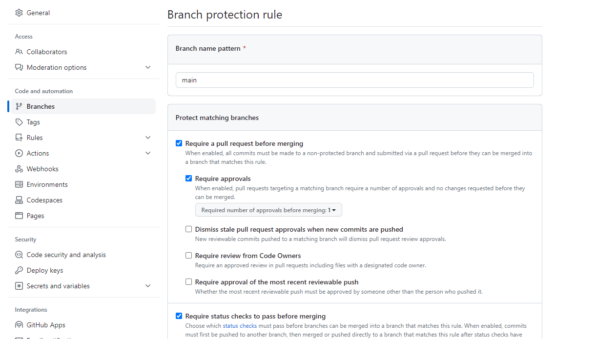

## Introduction

By default, any collaborator can push to any branch on a shared repository.
It is possible to prevent this by "protecting" the main branch.

This has a number of advantages:

* Avoids someone accidentally pushing work-in-progress changes to the branch
  that everyone else downloads.
* Ensures everyone follows a code review process.
* Ensures all changes are checked by continuous integration.

## How to protect the main branch

To protect the main branch in GitHub, go to the repository settings, select `Branches`.
Click `Add Rule`. Type in the name of your main branch (e.g. `main` and/or `develop`).
Tick the check box saying require pull requests. This will ensure all changes to the
branch are done via a pull request.

It is recommended to also tick `Require approvals`.

This means someone besides the person who raised the pull request will need to approve the change.

It is also recommended to tick `Require status checks before merging`.

This ensures that CI has run successfully before allowing the changes to be made.

Finally, it is recommended to tick `Do not allow bypassing the above settings`.

This means that administrators of the repository will have to follow the same process to.
If there becomes a need to push to the main branch, these settings can be changed
by administrators to allow this, setting this means that administrators cannot push by mistake
during the normal course of their work.

See [GitHubs documentation for more information about protecting branches](https://docs.github.com/en/repositories/configuring-branches-and-merges-in-your-repository/managing-protected-branches/managing-a-branch-protection-rule).
