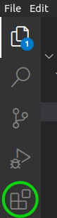
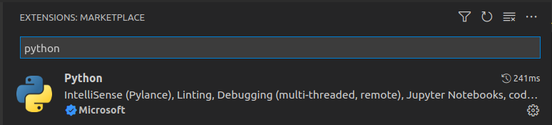
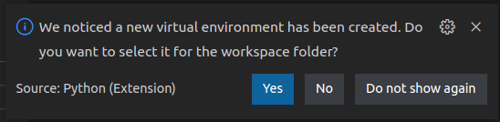
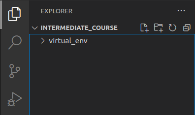
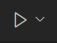
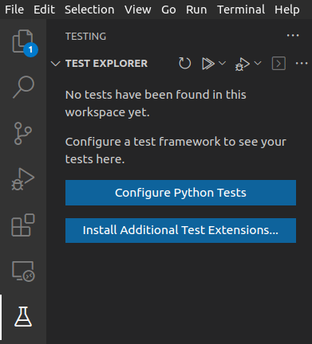
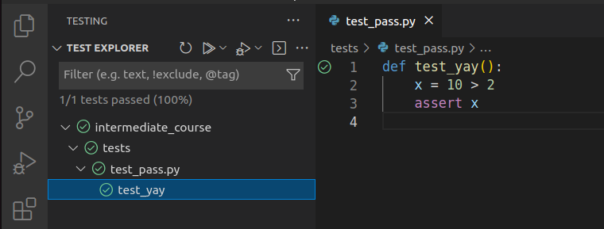

## Installation

VSCode is available from the project website [here](https://code.visualstudio.com/download). Users on Ubuntu can install the program via the package manager:

~~~
sudo apt install code
~~~
{: .language-bash}

### Extensions

As an IDE VSCode can be used for many programming languages provided the appropriate extensions have been installed. For this workshop we will require the Python extensions, to install extensions click the icon below in the sidebar:

Search "python" and select the result for the Intellisense extension created by Microsoft. Click "Install" to install the extension, you may be asked to also reload the window.

You are now ready to code!

## Using the VSCode IDE

Let's open our project in VSCode now and familiarise ourselves with some commonly used features.

### Opening a Software Project

Create a directory in a location of your choice which will be your main project folder.

If you don't have VSCode running yet, start it up now. Select `File` > `Open Folder` and navigate to the directory you created.

### Configuring a Virtual Environment in VSCode

As in the previous chapter, we now want to create a virtual environment we can work in. Go to `Terminal` > `New Terminal` to open a new terminal session within the project directory, and run the command to create a new environment:

~~~
python3 -m venv virtual_env
~~~
{: .language-bash}

this will create a new folder `virtual_env`. VSCode will notice the new environment and ask if you want to use it as the default Python interpreter for this project, click "Yes":

---
**Troubleshooting**

If the prompt did not appear, you can manually set the interpreter. Firstly navigate to the location of the `python` binary within the virtual environment using the file browser side bar (see below), this will be located at `<virtual environment directory>/bin/python`. Right click on the binary and select `Copy Path`.

Then using the keyboard shortcut `CTRL-SHIFT-P` to bring up the action menu, and searching for `Python: Select Interpreter`, clicking `Enter interpreter path...` and pasting the address followed by Enter.

---

You can verify the setup has worked correctly by creating an empty Python script in the project folder. Right click on the file explorer side bar and select `New File`, create a name for the file ensuring it ends in `.py`.

If everything is setup correctly you should see the interpreter stated in the blue information bar at the bottom of your VSCode window:

Right click the file you created and select `Delete` to remove it.

Any terminal you now open will start with the virtual environment already activated.

### Adding Dependencies

For this workshop you will need to install `pytest`, `numpy` and `matplotlib`, start a new terminal to activate the environment and run:

~~~
pip install numpy matplotlib
~~~
{: .language-bash}

---

**Troubleshooting**

If you are having issues with `pip` it may be your version is too old. Pip will usually inform you via a warning if a newer version is available, upgrade pip by running:

~~~
pip install --upgrade pip
~~~
{: .language-bash}

before installing packages.

---

## Running Scripts in VSCode

To run a script in VSCode, open the script by clicking on it and then either click the Play icon in the top right corner, or use the keyboard shortcut `CTRL-ALT-N`.

## Running Tests

In addition VSCode also allows you to run tests from a dedicated test viewer. Clicking the laboratory flask icon in the sidebar allows you to set up test exploration:

Click `Configure Python Tests`, select `pytest` as the test framework, and the `tests` directory as the directory for searching.

You should now be able to run tests individually using the test browser and selecting the test of interest.

### Running in Debug 

When clicking on a test you will see two icons, the ordinary Play icon, and an icon with a bug. The latter allows you to run the tests in debug mode useful for obtaining further information as to why a failure has occurred.