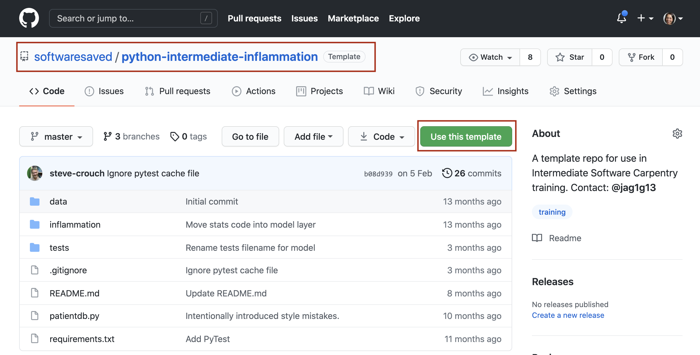
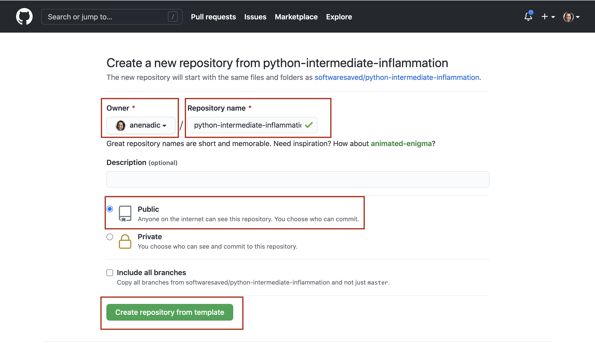
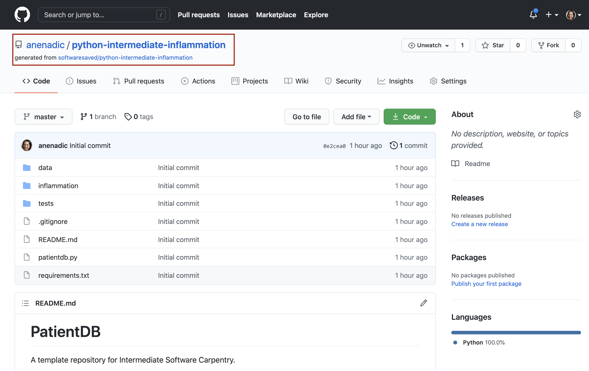

## Introduction
One of the first things to consider in software development is the design architecture of a software project. 
Hence, we start by looking into design architectures and, 
more specifically, the Model-View-Control design architecture used by the example software project we will be developing 
over the course of this workshop. There are other things to consider early on in software development - for example, 
[choosing a license](/32-preparing-software-reuse/index.html#choosing-an-open-source-licence) for your 
project or [writing documentation](/32-preparing-software-reuse/index.html#documenting-code-to-improve-reusability). 
For the purposes of this workshop we cover them later, but be aware that in the normal run of the things they should 
addressed early.

## Software Architectures
A software architecture is the fundamental structure of a software system that is decided at the beginning of 
software project development and cannot be changed that easily once implemented. It refers to a "bigger picture" of
a software system that describes high-level components (modules) of the system and how they interact.

In software design and development, large systems or programs are often decomposed into a set of smaller 
modules each with a subset of functionality. Typical examples of modules in programming are software libraries; 
some software libraries, such as `numpy` and `matplotlib` in Python, are bigger modules that contain several 
smaller sub-modules. Another examples of modules are classes in object-oriented programming languages. 

> ## Programming modules and interfaces
> Although modules are self-contained and independent elements to a large extent (they can depend on other modules), 
> there are well-defined ways of how they interact with one another. These rules of 
> interaction are called **programming interfaces** - they define how other modules (clients) 
> can use a particular module. Typically, an interface to a module includes rules on how a module can take input from 
> and how it gives output back to its clients. A client can be a human, in which case we also call these user 
> interfaces. Even smaller functional units such as functions/methods have clearly defined interfaces - a 
> function/method’s definition (also known as a *signature*) states what parameters it can take as input and what 
> it returns as an output. 
> 
{: .callout}  
        
## Model-View-Controller (MVC) Architecture
There are various software architectures around. Model–View–Controller (MVC) architecture is one way to define 
how the code is divided into smaller modules with well defined roles. Our example software project is utilising the MVC 
architecture so we will have a closer look at it here. MVC architecture divides the related program logic into three 
interconnected modules:

- **Model** (data)
- **View** (client interface),  and 
- **Controller** (processes that handle input/output and manipulate the data).

**Model** represents the data used by a program and also contains operations that act to change the data in the model. 
This may be a database, a file, or an object - for example a table representing patients data. 

**View** is the means of displaying data to users/clients within an application. For example, displaying a window with input fields and buttons (Graphical User Interface, GUI) or text within a command line shell (Command Line Interface, CLI) are examples of Views. They include anything that the user can see from the application. While building GUIs is not the topic of this workshop, we will cover building CLIs in Python in later episodes. 

**Controller** manipulates both the Model and the View. It accepts input from the View and performs the corresponding action on the Model and then updates the View accordingly. For example, on user request, Controller updates a picture on a user's GitHub profile and then modifies the View by displaying the updated profile back to the user.
      
Let's have a look at some MVC examples. 
       
> ## MVC application examples
> What MVC application examples do you know, either computational or in real life? This exercise can be done as 
>a group discussion.
> > ## Solution
> > #### Modern web and mobile applications
> > MVC architecture has become popular for designing web and mobile applications. Users interact with a web/mobile application by sending requests to it via web forms. Requests are processed by the 
> > Controller, which interacts with the Model to retrieve or update the underlying data. For example, the user may 
> > request to view its profile/account information or to update their personal details or password. 
> > Another typical example is adding a 
> > products into the shopping basket and then proceeding to the checkout to finalise the order. 
> > Forms to collect users inputs/requests together with 
> > the info returned and displayed to the user as a result represent the View.    
> > #### Ordering food in a restaurant 
[comment]: <> (People Couple Waiter photo, Public Domain, https://publicdomainvectors.org/en/free-clipart/Restaurant-order-vector-image/9341.html)  
[comment]: <> (Chef food preparation photo, Free for commercial use, DMCA, https://www.pxfuel.com/en/free-photo-emwgt)
> > When you go to a restaurant, the waiter comes to you to take your food order. The waiter doesn't know who you are 
> > and what you want, they just write down the detail of your order. Then, the waiter moves to the kitchen where 
> > the cook prepares your food based on the order passed to them by the waiter. 
> > The cook needs ingredients, which they source from the refrigerator (storage). When the food is ready, the cook 
> > hands it over to
> > the waiter, who brings the food to you. You do not know the details of how the food has been prepared. In this 
> > scenario, you provide the View, the waiter is the Controller, and the cook is the Model who manipulates the Data 
> > (food).  
> > 
> {: .solution}  
{: .challenge}       
       
> ## Separation of concerns
> Separation of concerns is important when designing software architectures in order to reduce its complexity 
> and there are different ways to achieve it.
> MVC architecture is one way, but other examples include Service-Oriented Architecture (SOA), 
> Client-Server architecture, N-tier architecture, etc. 
> However, there are limits to everything, and MVC architecture is no exception. Controller
> often transcends into Model and View and a clear separation is sometimes difficult to maintain.
>
{: .callout}
## Our Software Project
For the purpose of this workshop, we will be using the following [software project in Python](https://github.com/softwaresaved/python-intermediate-inflammation). 
It studies inflammation in patients who have been given a new treatment for arthritis and reuses the inflammation dataset from the [novice Software Carpentry Python lesson](https://swcarpentry.github.io/python-novice-inflammation/index.html). It is designed using the MVC principles 
but is not finished and we will be building on top of this project during the workshop.

To create your own copy of the software project repository from GitHub:

1. Log into your GitHub account and go to the [template repository URL](https://github.com/softwaresaved/python-intermediate-inflammation).

2. Click `Use this template` button towards the top right of the template repository's GitHub page to create a **copy** of 
the repository under your GitHub account. Note that each participant is creating their own copy to work on. Also, 
we are not forking the directory but creating a copy (remember - you can fork only once but can have multiple copies in GitHub). 
3. Make sure to select your personal account and set the name of the project to `python-intermediate-inflammation` (you can call it 
anything you like, but it may be easier if everyone uses the same name). Also set the new repository's visibility to 
'Public' - so it can be seen by other attendees  of the workshop and by third-party Continuous Integration (CI) services (to be covered later on in the lesson).

4. Click the `Create repository from template` button and wait for GitHub to import the copy of the repository under your account.
5. At this point GitHub may ask you to authenticate. If this happens and 
you do not have 2-Factor-Authentication (2FA) enabled in your 
GitHub account, you can just enter your password to proceed. If you are using 2FA, you may get a message: 
"Your old project requires credentials for read-only access. We will only temporarily store them for importing." and 
should use a pre-generated personal access token as your password here.
6. Locate the copied repository under your own GitHub account.

> ## Obtain the software project locally
> Using a command line shell, clone the copied repository from your GitHub account  into your computer.
> Which command(s) would you use to get a detailed list of contents of the directory you have just cloned?
> > ## Solution
> > 1. Find the URL of the software project repository to clone from your GitHub account. Make sure you do not clone the 
>original template repository but rather your own copy, as you should be able to push commits to it later on.
> > 2. Do:    
> > `$git clone https://github.com/<YOUR_GITHUB_USERNAME>/python-intermediate-inflammation` 
> > 3. Navigate into the cloned repository in your command line shell:    
> > `$cd python-intermediate-inflammation`
> > 4. List the contents of the directory:  
> > `$ls -l`  
> > Remember the `-l` flag of the `ls` command and also how to get help for commands in shell: `$man ls`.
> {: .solution}   
>
{: .challenge}       

Let’s inspect the software project. In your shell from the project root issue the command `$ls -l` to get the more detailed
listing of the contents of your project directory. You should see something similar to the following.
~~~
$ls -l
total 24
-rw-r--r--   1 user  staff   253 20 Apr 15:41 Makefile
-rw-r--r--   1 user  staff  1055 20 Apr 15:41 README.md
drwxr-xr-x  18 user  staff   576 20 Apr 15:41 data
drwxr-xr-x   5 user  staff   160 20 Apr 15:41 inflammation
-rw-r--r--   1 user  staff  1122 20 Apr 15:41 patientdb.py
drwxr-xr-x   4 user  staff   128 20 Apr 15:41 tests
~~~
{: .language-bash}

As already mentioned, the software project has the MVC architecture. Directory inflammation contains the View 
and Model modules in files `view.py` and `model.py`, respectively. Data underlying the Model is contained within 
directory called `data` - it contains several files with patients’ daily inflammation info. The data is stored in 
a series of comma-separated values (CSV) format files, where:

- each row holds information (including temperature measurements) for a single patient,
- columns represent successive days.

File `patientdb.py` is the Controller module that performs basic statistical analysis over data and provides the main 
entry point in the application too (as it contains the `main()` function). Directory tests contains several tests that 
have been implemented already, some of which are currently failing. These failing tests set out the requirements for 
the additional code to be implemented during the workshop.


