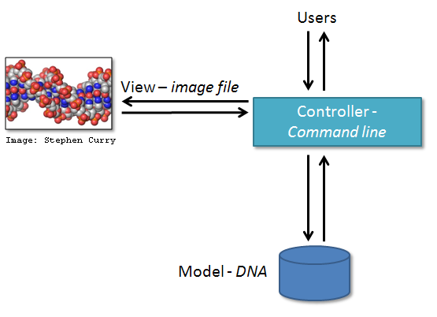

## Introduction
One of the big differences between novice and intermediate software development is planning the structure of your code.
A novice will often make up the structure of their code as they go along. However, for more advanced software development,
we need to plan this structure - called a *software architecture* - beforehand.
We’ll look into the Model-View-Controller architecture, one we’ll use in the example software
project we’ll develop over the course of this workshop.

## Software Architectures
A software architecture is the fundamental structure of a software system that is decided at the beginning of
software project development and cannot be changed that easily once implemented. It refers to a "bigger picture" of
a software system that describes high-level components (modules) of the system and how they interact.

In software design and development, large systems or programs are often decomposed into a set of smaller
modules each with a subset of functionality. Typical examples of modules in programming are software libraries;
some software libraries, such as `numpy` and `matplotlib` in Python, are bigger modules that contain several
smaller sub-modules. Another example of modules are classes in object-oriented programming languages.

> ## Programming modules and interfaces
> Although modules are self-contained and independent elements to a large extent (they can depend on other modules),
> there are well-defined ways of how they interact with one another. These rules of
> interaction are called **programming interfaces** - they define how other modules (clients)
> can use a particular module. Typically, an interface to a module includes rules on how a module can take input from
> and how it gives output back to its clients. A client can be a human, in which case we also call these user
> interfaces. Even smaller functional units such as functions/methods have clearly defined interfaces - a
> function/method’s definition (also known as a *signature*) states what parameters it can take as input and what
> it returns as an output.
>
{: .callout}

There are various software architectures around defining different ways of dividing the code into smaller modules
with well defined roles, for example:

- [Model–View–Controller (MVC) architecture](https://en.wikipedia.org/wiki/Model%E2%80%93view%E2%80%93controller), which we will look into in detail and use for our software project,
- [Service-Oriented Architecture (SOA)](https://en.wikipedia.org/wiki/Service-oriented_architecture), which separates code into distinct services,
accessible over a network by consumers (users or other services) that communicate with each other by passing data in a well-defined, shared format (protocol),
- [Client-Server architecture](https://en.wikipedia.org/wiki/Client%E2%80%93server_model), where clients request content or service from a server, initiating communication sessions with servers, which await incoming requests (e.g. email, network printing, the Internet),
- [Multilayer architecture](https://en.wikipedia.org/wiki/Multitier_architecture), is a type of architecture in which presentation, application processing and data management functions are split into distinct layers and may event be physically separated to run on separate machines - some more detail on this later in the course.

## Model-View-Controller (MVC) Architecture
MVC architecture divides the related program
logic into three interconnected modules:

- **Model** (data)
- **View** (client interface),  and
- **Controller** (processes that handle input/output and manipulate the data).

**Model** represents the data used by a program and also contains operations/rules for manipulating and changing the data
in the model.
This may be a database, a file, a single data object or a series of objects - for example a table representing
patients' data.

**View** is the means of displaying data to users/clients within an application (i.e. provides visualisation of the
state of the model).
For example, displaying a window with input fields and buttons (Graphical User Interface, GUI) or textual options
within a command line shell (Command Line Interface, CLI) are examples of Views.
They include anything that the user can see from the application. While building GUIs is not the topic of this workshop,
we will cover building CLIs in Python in later episodes.

**Controller** manipulates both the Model and the View. It accepts input from the View and performs the corresponding
action on the Model (changing the state of the model) and then updates the View accordingly. For example, on user
request, Controller updates a picture on a user's GitHub profile and then modifies the View by displaying the
updated profile back to the user.

Let's have a look at some MVC examples.

### MVC in Scientific Computing
MVC architecture can be [applied in scientific applications](https://www.software.ac.uk/developing-scientific-applications-using-model-view-controller-approach)
in the following manner. Model comprises those parts of the application that deal with some type of
scientific processing or manipulation of the data, e.g. numerical algorithm, simulation, DNA. View is
a visualisation, or format, of the output, e.g. graphical plot, diagram, chart, data table, file.
Controller is the part that ties the scientific processing and output parts together, mediating input and passing
it to the model or view, e.g. command line options, mouse clicks, input files.

For example, a simple DNA visualisation
program has a Controller which accepts command line parameters for the DNA visualisation from users,
the Controller then retrieves data from the DNA Model, and uses a single type of View to generate a
visualisation - in this case, the view creates a visualisation within a single image file.
{: width="400px"}
The above application can be extended by adding new visualisations or new input interfaces
(by writing a new View or a new Controller) without having to consider the inner workings of the Model. For example,
the above DNA program can be extended by adding another Controller
(a graphical interface which accepts user mouse clicks) and a different View
(rendering the visualisation to a displayed window).
{: width="400px"}
Image from https://www.software.ac.uk/developing-scientific-applications-using-model-view-controller-approach

### MVC in Modern Web/Mobile Applications
MVC architecture has become popular for designing web and mobile applications.
Users interact with a web/mobile application by sending various requests to it.
Forms to collect users inputs/requests together with
the info returned and displayed to the user as a result represent the View.
Requests are processed by the
Controller, which interacts with the Model to retrieve or update the underlying data. For example, a user may
request to view its profile. The Controller retrieves the account information for the user from the Model and passes it to
the View for rendering. The user may further interact with the application by asking it to update its personal information
or password. Controller verifies the correctness of the information (e.g. the password satisfies certain criteria,
postal address and phone number are in the correct format, etc.) and
passes it to the Model for permanent storage. The View is then updated accordingly and the user sees its updated account details.

### MVC in Real Life
[comment]: <> (People Couple Waiter photo, Public Domain, https://publicdomainvectors.org/en/free-clipart/Restaurant-order-vector-image/9341.html)
[comment]: <> (Chef food preparation photo, Free for commercial use, DMCA, https://www.pxfuel.com/en/free-photo-emwgt)
Here is a parallel to the MVC architecture from real life when ordering food in a restaurant. When you go to a restaurant, the waiter comes to you to take your food order. The waiter doesn't know who you are
and what you want, they just write down the detail of your order. Then, the waiter moves to the kitchen where
the cook prepares your food based on the order passed to them by the waiter.
The cook needs ingredients, which they source from the refrigerator (Data Storage). When the food is ready, the cook
hands it over to
the waiter, who brings the food to you. You do not know the details of how the food has been prepared. In this
scenario, the menu provides the View, the waiter is the Controller, and the cook is the Model who manipulates the Data
(food).

> ## Separation of Concerns
> Separation of concerns is important when designing software architectures in order to reduce the code's complexity.
> Note, however, there are limits to everything - and MVC architecture is no exception. Controller often transcends
> into Model and View and a clear separation is sometimes difficult to maintain. For example, Command Line Interface
> provides both the View (what user sees and how they interact with the shell) and the Controller (invoking of a command)
> aspects of a CLI application. In Web applications, Controller often manipulates the data (received from the Model)
> before displaying it to the user or passing it from the user to the Model.
>
{: .callout}

> ## MVC Application Examples From your Work
> Think of some other examples from your work or life where MVC architecture may be suitable or have a discussion
> with your fellow learners. Note that not everything fits into the MVC architecture but it is still good to think
> about how things could be split into smaller units. You can also have a look at this short
> [article on MVC from CodeAcademy](https://www.codecademy.com/articles/mvc).
{: .challenge}

## Our Software Project
For the purpose of this workshop, we will be using the following [software project in Python](https://github.com/softwaresaved/python-intermediate-inflammation).
It studies inflammation in patients who have been given a new treatment for arthritis and reuses the inflammation dataset from the [novice Software Carpentry Python lesson](https://swcarpentry.github.io/python-novice-inflammation/index.html). It is designed using the MVC principles
but is not finished and we will be building on top of this project during the workshop.

To create your own copy of the software project repository from GitHub:

1. Log into your GitHub account and go to the [template repository URL](https://github.com/softwaresaved/python-intermediate-inflammation).

2. Click `Use this template` button towards the top right of the template repository's GitHub page to create a **copy** of
the repository under your GitHub account. Note that each participant is creating their own copy to work on. Also,
we are not forking the directory but creating a copy (remember - you can fork only once but can have multiple copies in GitHub).
3. Make sure to select your personal account and set the name of the project to `python-intermediate-inflammation` (you can call it
anything you like, but it may be easier if everyone uses the same name). Also set the new repository's visibility to
'Public' - so it can be seen by other attendees  of the workshop and by third-party Continuous Integration (CI) services (to be covered later on in the lesson).

4. Click the `Create repository from template` button and wait for GitHub to import the copy of the repository under your account.
5. At this point GitHub may ask you to authenticate. If this happens and
you do not have 2-Factor-Authentication (2FA) enabled in your
GitHub account, you can just enter your password to proceed. If you are using 2FA, you may get a message:
"Your old project requires credentials for read-only access. We will only temporarily store them for importing." and
should use a pre-generated personal access token as your password here.
6. Locate the copied repository under your own GitHub account.

> ## Obtain the Software Project Locally
> Using a command line shell, clone the copied repository from your GitHub account  into your computer.
> Which command(s) would you use to get a detailed list of contents of the directory you have just cloned?
> > ## Solution
> > 1. Find the URL of the software project repository to clone from your GitHub account. Make sure you do not clone the
>original template repository but rather your own copy, as you should be able to push commits to it later on.
> > 2. Do:
> > `git clone https://github.com/<YOUR_GITHUB_USERNAME>/python-intermediate-inflammation`
> > 3. Navigate into the cloned repository in your command line shell:
> > `cd python-intermediate-inflammation`
> > 4. List the contents of the directory:
> > `ls -l`
> > Remember the `-l` flag of the `ls` command and also how to get help for commands in shell: `man ls`.
> {: .solution}
>
{: .challenge}

Let’s inspect the software project. In your shell, from the root directory of the project use the
command `ls -l` to get a more detailed list of the contents. You should see something similar to the following.

~~~
$ ls -l
total 24
-rw-r--r--   1 carpentry  users  1055 20 Apr 15:41 README.md
drwxr-xr-x  18 carpentry  users   576 20 Apr 15:41 data
drwxr-xr-x   5 carpentry  users   160 20 Apr 15:41 inflammation
-rw-r--r--   1 carpentry  users  1122 20 Apr 15:41 patientdb.py
drwxr-xr-x   4 carpentry  users   128 20 Apr 15:41 tests
~~~
{: .language-bash}

As we already mentioned, the software project uses the MVC architecture.
The inflammation directory contains the View and Model modules in the files `view.py` and `model.py`, respectively.
Data underlying the Model is contained within
directory called `data` - it contains several files with patients’ daily inflammation info. The data is stored in
a series of comma-separated values (CSV) format files, where:

- each row holds information (including temperature measurements) for a single patient,
- columns represent successive days.

The file `patientdb.py` is the Controller module that performs basic statistical analysis over data and provides the main
entry point in the application too (as it contains the `main()` function). Directory tests contains several tests that
have been implemented already, some of which are currently failing. These failing tests set out the requirements for
the additional code to be implemented during the workshop.


