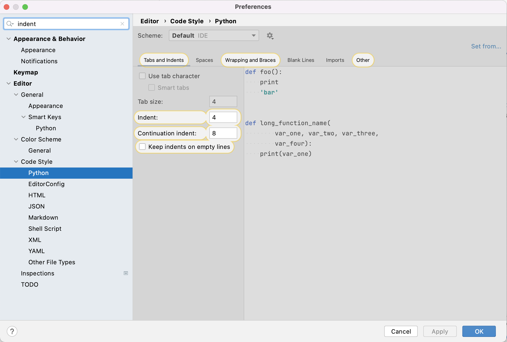

Now that we have an IDE, our virtual development environment set, and know how to manage packages, we are all set 
to start writing some code. Before we dive into it, it is worth spending some time learning a bit about Python 
coding style conventions. 

## Python Coding Style Guide
One of the most important things we can do to make sure our code is readable by others 
(and ourselves a 
few months down the line) is to make sure that it is descriptive, cleanly and consistently formatted and uses sensible, 
descriptive names for variable, function and module names. In order to help us format our code, we generally follow 
guidelines known as a style guide. A style guide is a set of conventions that we agree upon with our colleagues or 
community, to ensure that everyone contributing to the same project is producing code which looks similar in style. 
While a group of developers may choose the write and agree upon a new style guide unique to each project, 
in practice many programming languages have a single style guide which is 
adopted almost universally by the communities around the world. In Python, although we do have a choice of style guides 
available for Python, the [PEP8](https://www.python.org/dev/peps/pep-0008/) style guide is most commonly used. 
PEP here stands for Python Enhancement Proposals; PEPs are design documents for the Python community, typically 
specifications or conventions for how to do something in Python, a description of a new feature in Python, etc. 

>## Style consistency
One of the 
[key insights from Guido van Rossum](https://www.python.org/dev/peps/pep-0008/#a-foolish-consistency-is-the-hobgoblin-of-little-minds), 
one of the PEP8 authors, is that code is read much more often than it is 
written. Style guidelines are intended to improve the readability of code and make it consistent across the 
wide spectrum of Python code. Consistency with the style guide is important. Consistency within a project is more 
important. Consistency within one module or function is the most important. However, know when to be inconsistent -- 
sometimes style guide recommendations just are not applicable. When in doubt, use your best judgment. 
Look at other examples and decide what looks best. And don't hesitate to ask!
>
{: .callout}

As we have already covered in the [episode on IDEs](../02-ides/index.html), PyCharm highlights the language syntax and 
errors. PyCharm also gives us recommendations for formatting the code - these recommendations 
are mostly taken from the PEP8 style guide.

A full list of style guidelines is available from the [PEP8 website](https://www.python.org/dev/peps/pep-0008/); here we highlight a few.

### Indentation
Spaces are the preferred indentation method. The recommendation is to use 4 spaces per indentation level, 
so 4 spaces on level one, 8 spaces on level 2 and so on. 
Many people prefer the use of tabs to spaces to indent the code for many reasons (e.g. additional typing, easy to 
introduce an error by missing a single space character, etc.) and do not follow this guideline. Whether you decide to
follow this guideline or not, be consistent and follow the style already used in the project. 

>## Indentation in Python 2 vs Python 3
Python 2 allowed code 
indented with a mixture of tabs and spaces. Python 3 disallows mixing the use of tabs and spaces for indentation. 
Whichever you chose, be consistent throughout the project.
>
{: .callout}
 
PyCharm has built-in support for converting tab indentation to spaces "under the hood" for Python code in order to 
conform to PEP8. So, you can type a tab character and PyCharm will automatically convert it to 4 spaces. You can control 
the amount of spaces that PyCharm uses to replace one tab character or you can decide to keep the tab character 
altogether and prevent automatic conversion. You can modify these settings in PyCharm's 
`Preferences`>`Editor`>`Code Style`>`Python`. 

You can also tell the editor to show non-printable characters if you are ever unsure what character exactly is 
being used by selecting `View`>`Active Editor`>`Show whitespace`.

There are more complex rules on indenting single units of code that continue over several lines, e.g. function, 
list or dictionary definitions can all take more than one line. The preferred way of wrapping such long lines is by 
using Python's implied line continuation inside delimeters such as parentheses (`()`), brackets (`[]`) and braces 
(`{}`), or a hanging indent. 

 ~~~ 
# Add an extra level of indentation (extra 4 spaces) to distinguish arguments from the rest of the code that follows
def long_function_name(
        var_one, var_two, var_three,
        var_four):
    print(var_one)

# Aligned with opening delimiter
foo = long_function_name(var_one, var_two,
                         var_three, var_four)

# Use hanging indents to add an indentation level like paragraphs of text where all the lines in a paragraph are 
# indented except the first one
foo = long_function_name(
    var_one, var_two,
    var_three, var_four)   
       
# Using hanging indent again, but closing bracket aligned with the first non-blank character of the previous line
a_long_list = [
    [[1, 2, 3], [4, 5, 6], [7, 8, 9]], [[0.33, 0.66, 1], [0.66, 0.83, 1], [0.77, 0.88, 1]]
    ] 

# Using hanging indent again, but closing bracket aligned with the start of the multiline contruct
a_long_list2 = [
    1,
    2,
    3,
    # ... 
    79
]
 ~~~
{: .language-python} 

More details on good and bad practices for continuation lines can be found in 
[PEP8 guideline on indentation](https://www.python.org/dev/peps/pep-0008/#indentation).

### Maximum Line Length
All lines should be up to 80 characters long. For lines containing comments or docstrings (to be covered later), the 
line length limit should be 73. Some teams strongly prefer a longer line length, and seemed to have settled on the
length of 100. Long lines of code can be broken over multiple lines by wrapping expressions in delimiters, as 
mentioned above (the preferred method), or using a backslash (`\`) at the end of the line to indicate 
line continuation (the less preferred method).

### Should a Line Break Before or After a Binary Operator?
Lines should break before binary operators so that the operators do not get scattered across different columns 
on the screen. In the example below, the eye does not have to do the extra work to tell which items are added 
and which are subtracted:
~~~
# Correct - easy to match operators with operands
income = (gross_wages
          + taxable_interest
          + (dividends - qualified_dividends)
          - ira_deduction
          - student_loan_interest)      
 ~~~
{: .language-python} 
      
### Blank Lines
Top-level function and class definitions should be surrounded with two blank lines. Method definitions inside a class 
should be surrounded by a single blank line. You can use blank lines in functions, sparingly, to indicate logical sections.

### Whitespace in Expressions and Statements
Avoid extraneous whitespace in the following situations:
- immediately inside parentheses, brackets or braces
    ~~~
    # Correct:
    my_function(colour[1], {id: 2})   
  
    # Wrong:
    my_function( colour[ 1 ], { id: 2 } )
    ~~~
    {: .language-python} 
    
- Immediately before a comma, semicolon, or colon (unless doing slicing where the colon acts like a binary operator 
in which case it should should have equal amounts of whitespace on either side)
    ~~~
    # Correct:
    if x == 4: print x, y; x, y = y, x 
  
    # Wrong:
    if x == 4 : print x , y ; x , y = y , x
    ~~~
    {: .language-python} 

- Immediately before the open parenthesis that starts the argument list of a function call
    ~~~
    # Correct:
    my_function(1)         
  
    # Wrong:
    my_function (1)
    ~~~
    {: .language-python} 

- Immediately before the open parenthesis that starts an indexing or slicing
     ~~~
    # Correct:
    my_dct['key'] = my_lst[id]  
  
    # Wrong:
    my_dct ['key'] = my_lst [id]
     ~~~
     {: .language-python} 

- More than one space around an assignment (or other) operator to align it with another
     ~~~
    # Correct:
    x = 1
    y = 2
    student_loan_interest = 3      
  
    # Wrong:
    x                     = 1
    y                     = 2
    student_loan_interest = 3
     ~~~
     {: .language-python} 
     
- Avoid trailing whitespace anywhere - it is not necessary and can cause errors. For example, if you use
backslash (`\`) for continuation lines and have a space after it, the continuation line will not be 
interpreted correctly.
- Surround these binary operators with a single space on either side: assignment (=), 
augmented assignment (+=, -= etc.), comparisons (==, <, >, !=, <>, <=, >=, in, not in, is, is not), 
booleans (and, or, not).
- Don't use spaces around the = sign when used to indicate a keyword argument assignment or to indicate a 
default value for an unannotated function parameter
     ~~~
    # Correct use of spaces around = for variable assignment
    axis = 'x'
    angle = 90
    size = 450
    name = 'my_graph' 
  
    # Correct use of no spaces around = for keyword argument assignment in a function call
    my_function(
        1,
        2,
        axis=axis,
        angle=angle,
        size=size,
        name=name)
     ~~~
     {: .language-python} 

### String Quotes
In Python, single-quoted strings and double-quoted strings are the same. PEP8 does not make a recommendation for this 
apart from picking one rule and consistently sticking to it. When a string contains single or double quote characters, 
use the other one to avoid backslashes in the string as it improves readability.

### Naming Conventions
There are a lot of different naming styles in use, including:
- b (single lowercase letter)
- B (single uppercase letter)
- lowercase
- lower_case_with_underscores
- UPPERCASE
- UPPER_CASE_WITH_UNDERSCORES
- CapitalizedWords (or CamelCase) (note: When using acronyms in CapWords, capitalize all the letters of the acronym, 
e.g HTTPServerError)
- mixedCase (differs from CapitalizedWords by initial lowercase character!)
- Capitalized_Words_With_Underscores

As with other style guide recommendations - consistency is key. Pick one and stick to it, or follow the one already 
established if joining a project mid-way. Some things to be vary of when naming things in the code:
- Avoid using the characters 'l' (lowercase letter el), 'O' (uppercase letter oh), or 'I' (uppercase letter eye) 
as single character variable names. In some fonts, these characters are indistinguishable from the numerals 
one and zero. When tempted to use 'l', use 'L' instead.
- Avoid using non-ASCII (e.g. UNICODE) characters for identifiers
- You should try to use English words for identifiers whenever possible

A more detailed guide on 
[naming functions, modules, classes and variables](https://www.python.org/dev/peps/pep-0008/#package-and-module-names) 
is available from PEP8.

### Comments
Comments allow us to provide the reader with additional information on what the code does - reading and understanding 
source code is slow, laborious and can lead to misinterpretation, plus it is always a good idea to keep others in mind 
when writing code. A good rule of thumb is to assume that someone will *always* read your code at a later date, 
and this includes a future version of yourself. It can be easy to forget why you did something a particular way in six 
months' time. Write comments as complete sentences and in English unless you are 100% sure the code will never be read 
by people who don't speak your language.

Block comments generally apply to some (or all) code that follows them, and are indented to the same level as that 
code. Each line of a block comment starts with a `#` and a single space (unless it is indented text inside the comment).
~~~
def fahr_to_cels(fahr):
    # Block comment example: convert temperature in Fahrenheit to Celsius
    cels = (fahr + 32) * (5 / 9)
    return cels
~~~
{: .language-python}

An inline comment is a comment on the same line as a statement. Inline comments should be separated by at least two 
spaces from the statement. They should start with a `#` and a single space and should be used sparingly.
~~~
def fahr_to_cels(fahr):
    cels = (fahr + 32) * (5 / 9) # Inline comment example: convert temperature in Fahrenheit to Celsius
    return cels
~~~
{: .language-python}

Python doesn't have any multi-line comments, like you may have seen in other languages like C++ or Java. However, there
 are ways to do it using *docstrings* as we'll see in a moment. 

The reader should be able to understand a single function or method from its code and its comments, and should not have to look elsewhere in the code for clarification. The kind of things that need to be commented are:

- Why certain design or implementation decisions were adopted, especially in cases where the decision may seem counter-intuitive
- The names of any algorithms or design patterns that have been implemented
- The expected format of input files or database schemas

However, there are some restrictions. Comments that simply restate what the code does are redundant, and comments must be
 accurate and updated with the code, because an incorrect comment causes more confusion than no comment at all.

> ## Improved code style for our software project
Look at `patientdb.py` file in PyCharm and identify where the above guidelines have not been followed. Fix 
the discovered inconsistencies. 
> > ## Solution
> > There are a few things to fix here:
> >
> > 1.Line 23 in `patientdb.py` is too long and not very readable. A better style would be to use multiple lines and 
> > hanging indent, with the closing brace `}' aligned either with the first non-whitespace character of the last line of 
> > list or the first character of the line that starts the multiline construct or simply moved to the end of the 
> > previous line. All three acceptable modifications are shown below. 
> >
> > ~~~
> > view_data = {
> >     'average': models.daily_mean(inflammation_data), 
> >     'max': models.daily_max(inflammation_data), 
> >     'min': models.daily_min(inflammation_data)
> >     }
> > ~~~
> > {: .language-python}  
> >
> > ~~~
> > view_data = {
> >     'average': models.daily_mean(inflammation_data), 
> >     'max': models.daily_max(inflammation_data), 
> >     'min': models.daily_min(inflammation_data)
> > }
> > ~~~
> > {: .language-python}  
> >
> > ~~~
> > view_data = {
> >     'average': models.daily_mean(inflammation_data), 
> >     'max': models.daily_max(inflammation_data), 
> >     'min': models.daily_min(inflammation_data)}
> > ~~~
> > {: .language-python}  
> >
> > 2.There is an extra blank line on line 20 in `patientdb.py`. Normally, you should not use blank lines in the 
> > middle of the code unless you want to separate logical units - in which case only one blank like is used. 
> > Note how PyCharm is warning us by underlying the whole line.  
> >
> > 3.Only one blank line after the end of definition of function `main` and the rest of the code on line 30 in 
> > `patientdb.py` - should be two blank lines. Note how PyCharm is warning us by underlying the whole line.
> {: .solution}
{: .challenge}

### Documentation Strings aka Docstrings
If the first thing in a function is a string that is not assigned to a variable, that string is attached to the 
function as its documentation. Consider the following code implementing function for calculating the nth 
Fibonacci number:
~~~
def fibonacci(n):
    """Calculate the nth Fibonacci number.

    A recursive implementation of Fibonacci.

    :param n: integer
    :raises ValueError: raised if n is less than zero
    :returns: Fibonacci number
    """
    if n < 0:
        raise ValueError('Fibonacci is not defined for N < 0')
    if n == 0:
        return 0
    if n == 1:
        return 1

    return fibonacci(n - 1) + fibonacci(n - 2)
~~~
{: .language-python} 

Note here we are explicitly documenting our input variables, what is returned by the function, and also when the 
`ValueError` exception is raised. Along with a helpful description of what the function does, this information can 
act as a *contract* for readers to understand what to expect in terms of behaviour when using the function, 
as well as how to use it.

A comment string like this is called a *docstring*. We do not need to use triple quotes when we write one, but 
if we do, we can break the string across multiple lines. This also applies to Python modules, which are essentially 
files of Python functions, or methods within classes and docstrings are used to list them all. 

> ## Python PEP 257 - recommendations for docstrings
> PEP 257 is another one of Python Enhancement Proposals and this one deals with docstring conventions to 
>standardise how they are used. For example, on the subject of module-level docstrings, PEP 257 says:
>
> ~~~
> The docstring for a module should generally list the classes, exceptions and functions (and any other objects) that
> are exported by the module, with a one-line summary of each. (These summaries generally give less detail than the 
> summary line in the object's docstring.) The docstring for a package 
> (i.e., the docstring of the package's `__init__.py` module) should also list the modules and subpackages exported by 
> the package.
> ~~~
{: .callout}

So, at the beginning of a module file we can just add a docstring explaining the nature of a module. For example, if 
`fibonacci()` was included in a module with other functions, our module could have at the start of it:

~~~
"""A module for generating numerical sequences of numbers that occur in nature.

Functions:
  fibonacci - returns the Fibonacci number for a given integer
  golden_ratio - returns the golden ratio number to a given Fibonacci iteration
  ...
"""
...
~~~
{: .language-python}

Docstrings for a function or a module is returned when 
invoking `help` function and passing its name - for example from interactive `ipython` shell or from Jupyter Lab/Notebook 
or when rendering code documentation online (e.g. see [Python documentation](https://docs.python.org/3.7/library/index.html)).

~~~
help(fibonacci)
 ~~~
 {: .language-python}

> ## Fix the docstrings
> Look into `models.py` file and improve docstrings for functions `daily_mean` ,`daily_min`, `daily_max`.
> > ## Solution 
> > For example, the improved docstrings for the above functions would contain explanations for parameters and 
> > return values.
> > ~~~
> > def daily_mean(data):
> >        """Calculate the daily mean of a 2D inflammation data array for each day.
> >    
> >        :param data: A 2D data array containing inflammation data (each row contains measurments for a single day). 
> >        :returns: An array of mean values of measurements for each day. 
> >        """
> >        return np.mean(data, axis=0)
> >    ~~~
> > {: .language-python}  
> > ~~~
> > def daily_min(data):
> >        """Calculate the daily mean of a 2D inflammation data array for each day.
> >    
> >        :param data: A 2D data array containing inflammation data (each row contains measurments for a single day). 
> >        :returns: An array of min values of measurements for each day. 
> >        """
> >        return np.mean(data, axis=0)
> >    ~~~
> > {: .language-python}
> > ~~~
> > def daily_max(data):
> >        """Calculate the daily mean of a 2D inflammation data array for each day.
> >    
> >        :param data: A 2D data array containing inflammation data (each row contains measurments for a single day). 
> >        :returns: An array of max values of measurements for each day. 
> >        """
> >        return np.mean(data, axis=0)
> >    ~~~
> > {: .language-python}
> {: .solution}
{: .challenge}



