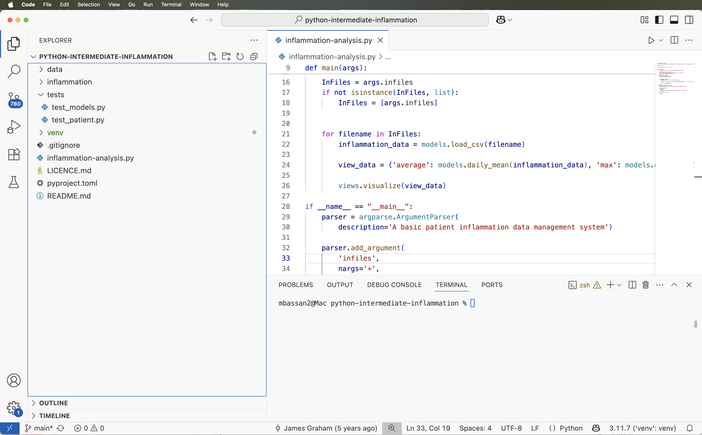

::::::::::::::::::::::::::::::::::::::: objectives

- Set up a (virtual) development environment in PyCharm
- Use PyCharm to run a Python script

::::::::::::::::::::::::::::::::::::::::::::::::::

:::::::::::::::::::::::::::::::::::::::: questions

- What are Integrated Development Environments (IDEs)?
- What are the advantages of using IDEs for software development?

::::::::::::::::::::::::::::::::::::::::::::::::::

## Introduction

As we have seen in the previous episode -
even a simple software project is typically split into smaller functional units and modules,
which are kept in separate files and subdirectories.
As your code starts to grow and becomes more complex,
it will involve many different files and various external libraries.
You will need an application to help you manage all the complexities of,
and provide you with some useful (visual) facilities for,
the software development process.
Such clever and useful graphical software development applications are called
Integrated Development Environments (IDEs).

## Integrated Development Environments

An IDE normally consists of at least a source code editor,
build automation tools
and a debugger.
The boundaries between modern IDEs and other aspects of the broader software development process
are often blurred.
Nowadays IDEs also offer version control support,
tools to construct graphical user interfaces (GUI)
and web browser integration for web app development,
source code inspection for dependencies and many other useful functionalities.
The following is a list of the most commonly seen IDE features:

- **syntax highlighting** -
  to show the language constructs, keywords and the syntax errors
  with visually distinct colours and font effects
- **code completion** -
  to speed up programming by offering a set of possible (syntactically correct) code options
- **code search** -
  finding package, class, function and variable declarations, their usages and referencing
- **version control support** -
  to interact with source code repositories
- **debugging support** -
  for setting breakpoints in the code editor,
  step-by-step execution of code and inspection of variables

IDEs are extremely useful and modern software development would be very hard without them.
There are a number of IDEs available for Python development;
a good overview is available from the
[Python Project Wiki](https://wiki.python.org/moin/IntegratedDevelopmentEnvironments).
In addition to IDEs, there are also a number of code editors that have Python support.
Code editors can be as simple as a text editor
with syntax highlighting and code formatting capabilities
(e.g., GNU EMACS, Vi/Vim).
Most good code editors can also execute code and control a debugger,
and some can also interact with a version control system.
Compared to an IDE, a good dedicated code editor is usually smaller and quicker,
but often less feature-rich.

You will have to decide which one is the best for you in your daily work. In this course you have 
the choice of using two free and open source IDEs - 
[PyCharm Community Edition from JetBrains](https://www.jetbrains.com/pycharm/) or [Microsoft's Visual Studio Code (VS Code)](https://code.visualstudio.com/).
A popular alternative to consider is free and open source [Spyder IDE](https://www.spyder-ide.org/) -  
we are not covering it here but it should be possible to switch.

### Starting With a Software Project

::::::::::::::::::::::::::::::::: group-tab 

### PyCharm

When you start PyCharm - you may be presented with a dialog box that asks you what you want to do,
e.g. `Create New Project`, `Open`, or `Check out from Version Control`.
If that is the case - select `Open` and find the software project directory
`python-intermediate-inflammation` you cloned earlier. Alternatively, do the same from the 
`File -> Open...` top menu.

This directory is now the current working directory for PyCharm,
so when we run scripts from PyCharm, this is the directory they will run from.

PyCharm may also show you a *'Tip of the Day'* window which you can safely ignore and close for now.
You may also get a warning *'No Python interpreter configured for the project'* -
we [will deal with this](#configuring-a-virtual-environment)
shortly after we familiarise ourselves with the PyCharm environment.
You will notice the IDE shows you a project/file navigator window on the left hand side,
to traverse and select the files (and any subdirectories) within the working directory,
and an editor window on the right.
At the bottom, you would typically have a panel for version control,
terminal (the command line within PyCharm) and a TODO list.

{alt='View of an opened project in PyCharm' .image-with-shadow width="1000px" }

Select the `inflammation-analysis.py` file in the project navigator on the left
so that its contents are displayed in the editor window.

You may notice a warning about the missing Python interpreter
at the top of the editor panel showing `inflammation-analysis.py` file -
this is one of the first things you will have to configure for your project
before you can do any work.

{alt='Missing Python Interpreter Warning in PyCharm' .image-with-shadow width="800px" }

You may take the shortcut and click on one of the offered options above
but we want to take you through the whole process of setting up your environment in PyCharm shortly
as this is important conceptually. If you do not see this warning - do not worry, it just means 
you may have configured this already on previous usages of PyCharm.

### VS Code

When you start VS Code, you may be presented with a "Welcome" page giving you shortcuts to commonly 
used actions - e.g. `New File...`, `Open...`, or `Clone Git repository...`, etc.

{alt='Welcome screen in VS Code' .image-with-shadow width="1000px" }

If that is the case - select `Open...` and find the software project directory
`python-intermediate-inflammation` you cloned earlier. Alternatively, do the same from the
`File -> Open...` top menu.

{alt='View of an opened project in VS Code' .image-with-shadow width="1000px" }

You’ll see some icons on the left side, which give you access to key feature of VS Code. 
Hovering your mouse over each one will show a tooltip that names that feature:

- Explorer - file navigator to view existing folders containing project files.
- Search - search capability enabling you to search for things in your project (and replace them with other text).
- Source control - this gives you access to source code control for your project, which includes Git version control functionality. 
This feature means you can do things like clone Git repositories (for example, from GitHub), add and commit files to a repository, things like that.
- Run and Debug - to run programs you write in a special way with a debugger, which allows you to check the state of your program as it is running, which is very useful and we’ll look into later.
- Extensions - which we’ll look into right now, to install extensions to VSCode to extend its functionality in some way.
- Testing - testing features for test discovery, test coverage, and running and debugging tests your code.
 
VS Code is a lightweight, general-purpose code editor designed to support a wide range of programming 
languages and development tasks. 
Its core "light" functionality is extended through a rich marketplace of 
extensions, allowing users to add language support, debugging tools, linters, formatters, and more. 
With extensions, VS Code can seamlessly handle languages (like Python, JavaScript, C++, Java, R, etc.), 
data formats (like JSON, YAML, CSV, etc.), and so on, making it a flexible choice for developers working across 
multiple technologies.

This means that VS Code will not support Python our of the box - it needs to be extended for Python development 
by installing extensions. You would need the following for this course:

- the official [Python extension by Microsoft](https://marketplace.visualstudio.com/items?itemName=ms-python.python) provides essential features 
such as syntax highlighting, IntelliSense (code completion), linting, debugging, and unit testing support. 
- [Pylance extension](https://marketplace.visualstudio.com/items?itemName=ms-python.vscode-pylance), now integrated in Python extension by Microsoft,
enhances performance and offers advanced type checking and code navigation. 
- [autoDocstring](https://marketplace.visualstudio.com/items?itemName=njpwerner.autodocstring) for Python docstring generation.

Developers can also integrate other extensions such as ,
[Black](https://marketplace.visualstudio.com/items?itemName=ms-python.black-formatter) or [autopep8](https://marketplace.visualstudio.com/items?itemName=ms-python.autopep8) 
for automatic code formatting, and many more. 
These extensions transform VS Code into a versatile and efficient Python development environment that 
suits everything from quick scripts to complex software projects.

We will install and make use of the **Python by Microsoft** and the **autoDocstring** extensions. 
You can do that from the Extensions tab (one of the vertical tabs to the left) by searching the 
extensions marketplace and installing the ones you need.

{alt='VS Code Extensions marketplace for searching and installing extensions' .image-with-shadow width="1000px" }

You should now be set up to run and develop Python code in VS Code.

:::::::::::::::::::::::::::::::::

### Configuring a Virtual Environment

Before you can run the code from an IDE,
you need to explicitly tell the IDE the path to the Python interpreter on your system.
The same goes for any dependencies your code may have (that form part of the virtual environment together with the Python interpreter) -
you need to tell the IDE where to find them, much like we did from the command line in the previous episode.

Luckily for us, we have already set up a virtual environment for our project
from the command line already and some IDEs are clever enough to understand it.

### Adding a Python Interpreter

::::::::::::::::::::::::::::::::: group-tab

### PyCharm

While PyCharm will recognise the virtual environment you already have, and the Python interpreter contained
in it, it is a good practice to tell your IDE which Python interpreter you want to use for which project.
This is because you may have multiple Python versions installed on your system and also because you may not have
set a virtual environment from command line so you should do if from the IDE instead.

1. Select either `PyCharm` > `Settings` (Mac) or `File` > `Settings` (Linux, Windows).
2. In the window that appears,
  select `Project: python-intermediate-inflammation` > `Python Interpreter` from the left.
  You'll see a number of Python packages displayed as a list, and importantly above that,
  the current Python interpreter that is being used.
  These may be blank or set to `<No interpreter>`,
  or possibly the default version of Python installed on your system,
  e.g. `Python 2.7 /usr/bin/python2.7`,
  which we do not want to use in this instance.
3. Select the cog-like button in the top right, then `Add...`
  (or `Add Local...` depending on your PyCharm version).
  An `Add Python Interpreter` window will appear.
4. Select `Virtualenv Environment` from the list on the left
  and ensure that `Existing environment` checkbox is selected within the popup window.
  In the `Interpreter` field point to the Python 3 executable inside
  your virtual environment's `bin` directory
  (make sure you navigate to it and select it from the file browser rather than
  just accept the default offered by PyCharm).
  Note that there is also an option to create a new virtual environment,
  but we are not using that option as we want to reuse the one we created
  from the command line in the previous episode.
  {alt='Configuring Python Interpreter in PyCharm' .image-with-shadow width="800px"}
5. Select `Make available to all projects` checkbox
  so we can also use this environment for other projects if we wish.
6. Select `OK` in the `Add Python Interpreter` window.
  Back in the `Preferences` window, you should select "Python 3.11 (python-intermediate-inflammation)"
  or similar (that you have just added) from the `Project Interpreter` drop-down list.

Note that a number of external libraries have magically appeared under the
"Python 3.11 (python-intermediate-inflammation)" interpreter,
including `numpy` and `matplotlib`.
PyCharm has recognised the virtual environment we created from the command line using `venv`
and has added these libraries effectively replicating our virtual environment in PyCharm
(referred to as "Python 3.11 (python-intermediate-inflammation)").

{alt='Packages Currently Installed in a Virtual Environment in PyCharm' .image-with-shadow width="800px"}

Also note that, although the names are not the same -
this is one and the same virtual environment
and changes done to it in PyCharm will propagate to the command line and vice versa.


### VS Code

As in the episode on virtual environments for software development, we want to create a virtual 
environment for our project to work in. From the top menu, select `Terminal > New Terminal` to open a 
new command line terminal for your project, and run the following command to activate your existing 
virtual environment in this terminal:

```bash
source ./venv/bin/activate
```

Technically, this should set the Python interpreter to be the one contained in your virtual environment. 
Still, it is a good idea to check and set the Python interpreter manually in VS Code to make sure things 
are configured correctly for your project. 

You can do than as follows:

- Navigate to the location of the Python binary within the virtual environment using the file browser. The Python binary will be located in <virtual environment directory>/bin/python3 within the project directory.

{alt='Select python interpreter in VS Code' .image-with-shadow width="800px"}

- Right-click on the binary and select Copy Path.
- Use the keyboard shortcut CTRL-SHIFT-P to bring up the VS Code Command Palette, then search for `Python: Select Interpreter`.
- Click `Enter interpreter path...`, paste the path you copied followed by Enter.

{alt='Set interpreter path in VS Code' .image-with-shadow width="800px"}

If everything is setup correctly, when you select a Python file in the file explorer you should see the interpreter and virtual environment stated in the information bar at the bottom of VS Code.
Any new terminal you open now will start with the activated virtual environment.

{alt='Showing interpreter status in VS Code status bar' .image-with-shadow width="800px"}

:::::::::::::::::::::::::::::::::


#### Adding an External Dependency from IDE

We have already added packages `numpy` and `matplotlib` to our virtual environment
from the command line in the previous episode,
so we are up-to-date with all external libraries we require at the moment.
However, we will need library `pytest` soon to implement tests for our code.
We will use this opportunity to install it from the IDE in order to see
an alternative way of doing this and how it propagates to the command line.

::::::::::::::::::::::::::::::::: group-tab

### PyCharm

1. Select either `PyCharm` > `Settings` (Mac) or `File` > `Settings` (Linux, Windows).
2. In the preferences window that appears,
  select `Project: python-intermediate-inflammation` > `Project Interpreter` from the left.
3. Select the `+` icon at the top of the window.
  In the window that appears, search for the name of the library (`pytest`),
  select it from the list,
  then select `Install Package`.
  Once it finishes installing, you can close that window.
  {alt='Installing a package in PyCharm' .image-with-shadow width="800px" }
4. Select `OK` in the `Preferences`/`Settings` window.

It may take a few minutes for PyCharm to install it.
After it is done, the `pytest` library is added to our virtual environment.
You can also verify this from the command line by
listing the `venv/lib/python3.11/site-packages` subdirectory.
Note, however, that `requirements.txt` is not updated -
as we mentioned earlier this is something you have to do manually.
Let us do this as an exercise.

### VS Code

In VS Code, there is no special graphical user interface to add external dependencies for a project - 
this is done from the terminal window as we did before (within the active virtual environment):

```bash
python3 -m pip install pytest
```

{alt='Installing a package in VS Code' .image-with-shadow width="800px" }

:::::::::::::::::::::::::::::::::


::: challenge

### Update Requirements File After Adding a New Dependency

Export the newly updated virtual environment into `requirements.txt` file.

:::: solution

Let us verify first that the newly installed library `pytest` is appearing in our virtual environment
but not in `requirements.txt`. First, let us check the list of installed packages:

```bash
(venv) $ python3 -m pip list
```

```output
Package         Version

***

contourpy       1.2.0
cycler          0.12.1
fonttools       4.45.0
iniconfig       2.0.0
kiwisolver      1.4.5
matplotlib      3.8.2
numpy           1.26.2
packaging       23.2
Pillow          10.1.0
pip             23.0.1
pluggy          1.3.0
pyparsing       3.1.1
pytest          7.4.3
python-dateutil 2.8.2
setuptools      67.6.1
six             1.16.0
```

We can see the `pytest` library appearing in the listing above. However, if we do:

```bash
(venv) $ cat requirements.txt

```

```output
contourpy==1.2.0
cycler==0.12.1
fonttools==4.45.0
kiwisolver==1.4.5
matplotlib==3.8.2
numpy==1.26.2
packaging==23.2
Pillow==10.1.0
pyparsing==3.1.1
python-dateutil==2.8.2
six==1.16.0
```

`pytest` is missing from `requirements.txt`. To add it, we need to update the file by repeating the command:

```bash
(venv) $ python3 -m pip freeze --exclude-editable > requirements.txt
```

`pytest` is now present in `requirements.txt`:

```output
contourpy==1.2.0
cycler==0.12.1
fonttools==4.45.0
iniconfig==2.0.0
kiwisolver==1.4.5
matplotlib==3.8.2
numpy==1.26.2
packaging==23.2
Pillow==10.1.0
pluggy==1.3.0
pyparsing==3.1.1
pytest==7.4.3
python-dateutil==2.8.2
six==1.16.0
```

::::

:::


#### Adding a Run Configuration for Our Project

::::::::::::::::::::::::::::::::: group-tab

### PyCharm

Having configured a virtual environment, we now need to tell PyCharm to use it for our project.
This is done by creating and adding a **Run Configuration** to a project.
Run Configurations in PyCharm are named sets of startup properties
that define which main Python script to execute and what (optional)
runtime parameters/environment variables (i.e. additional configuration options) to pass
and use on top of virtual environments.

1. To add a new Run Configuration for a project -
  select `Run` > `Edit Configurations...` from the top menu.
2. Select `Add new run configuration...` then `Python`.
  {alt='Adding a Run Configuration in PyCharm' .image-with-shadow width="800px" }
3. In the new popup window, in the `Script path` field select the folder button
  and find and select `inflammation-analysis.py`.
  This tells PyCharm which script to run (i.e. what the main entry point to our application is).
  {alt='Run Configuration Popup in PyCharm' .image-with-shadow width="800px" }
4. In the same window, select "Python 3.11 (python-intermediate-inflammation)"
  (i.e. the virtual environment and interpreter you configured earlier in this episode)
  in the `Python interpreter` field.
5. You can give this run configuration a name at the top of the window if you like -
  e.g. let us name it `inflammation analysis`.
6. You can optionally configure run parameters and environment variables in the same window -
  we do not need this at the moment.
7. Select `Apply` to confirm these settings.

We configured the Python interpreter to use for our project by pointing PyCharm
to the virtual environment we created from the command line
(which encapsulates a Python interpreter and external libraries our code needs to run).
Recall that you can create several virtual environments based on the same Python interpreter
but with different external libraries -
this is helpful when you need to develop different types of applications.
For example, you can create one virtual environment
based on Python 3.11 to develop Django Web applications
and another virtual environment
based on the same Python 3.11 to work with scientific libraries.

Run Configurations provided by PyCharm are one extra layer on top of virtual environments -
you can vary a run configuration each time your code is executed and
you can have separate configurations for running, debugging and testing your code.

### VS Code


:::::::::::::::::::::::::::::::::

Now you know how to configure and manipulate your environment in both tools
(command line and IDE),
which is a useful parallel to be aware of.
Let us have a look at some other features afforded to us by IDEs.

### Syntax Highlighting

The first thing you may notice is that code is displayed using different colours.
Syntax highlighting is a feature that displays source code terms
in different colours and fonts according to the syntax category the highlighted term belongs to.
It also makes syntax errors visually distinct.
Highlighting does not affect the meaning of the code itself -
it is intended only for humans to make reading code and finding errors easier.

::::::::::::::::::::::::::::::::: group-tab

### PyCharm

{alt='Syntax Highlighting Functionality in PyCharm' .image-with-shadow width="1000px" }

:::::::::::::::::::::::::::::::::

### Code Completion

As you start typing code, the IDE will offer to complete some of the code for you in the form of an auto completion popup.
This is a context-aware code completion feature that speeds up the process of coding (e.g. reducing typos and other common mistakes)
by offering available variable names, functions from available packages, parameters of functions, hints related to syntax errors, etc.

::::::::::::::::::::::::::::::::: group-tab

### PyCharm

{alt='Code Completion Functionality in PyCharm' .image-with-shadow width="600px" }

:::::::::::::::::::::::::::::::::

### Code Definition \& Documentation References

You will often need code reference information to help you code. The IDE shows this useful information,
such as definitions of symbols (e.g. functions, parameters, classes, fields, and methods)
and documentation references by means of quick popups and inline tooltips.

::::::::::::::::::::::::::::::::: group-tab

### PyCharm

For a selected piece of code, you can access various code reference information from the `View` menu
(or via various keyboard shortcuts), including:

- Quick Definition -
  where and how symbols (functions, parameters, classes, fields, and methods) are defined
- Quick Type Definition -
  type definition of variables, fields or any other symbols
- Quick Documentation -
  inline documentation ([*docstrings*](15-coding-conventions.md)
  for any symbol created in accordance with [PEP-257](https://peps.python.org/pep-0257/))
- Parameter Info -
  the names and expected types of parameters in method and function calls.
  Use this when cursor is on the argument of a function call.
- Type Info -
  type of an expression

{alt='Code References Functionality in PyCharm' .image-with-shadow width="1000px" }

:::::::::::::::::::::::::::::::::


#### Code Search

You can search for a text string within a project, use different scopes to narrow your search process,
use regular expressions for complex searches, include/exclude certain files from your search, find usages and occurrences.

::::::::::::::::::::::::::::::::: group-tab

### PyCharm

To find a search string in the whole project:

1. From the main menu,
   select `Edit | Find | Find in Path ...`
   (or `Edit | Find | Find in Files...` depending on your version of PyCharm).
2. Type your search string in the search field of the popup.
   Alternatively, in the editor, highlight the string you want to find
   and press `Command-Shift-F` (on Mac) or `Control-Shift-F` (on Windows).
   PyCharm places the highlighted string into the search field of the popup.
  
   {alt='Code Search Functionality in PyCharm' .image-with-shadow width="800px" }

   If you need, specify the additional options in the popup.
   PyCharm will list the search strings and all the files that contain them.
3. Check the results in the preview area of the dialog where you can replace the search string
   or select another string,
   or press `Command-Shift-F` (on Mac) or `Control-Shift-F` (on Windows) again
   to start a new search.
4. To see the list of occurrences in a separate panel,
   click the `Open in Find Window` button in the bottom right corner.
   The find panel will appear at the bottom of the main window;
   use this panel and its options to group the results, preview them,
   and work with them further.
  
   {alt='Code Search Functionality in PyCharm' .image-with-shadow width="1000px" }

:::::::::::::::::::::::::::::::::


### Version Control

::::::::::::::::::::::::::::::::: group-tab

### PyCharm

PyCharm supports a directory-based versioning model,
which means that each project directory can be associated with a different version control system.
Our project was already under Git version control and PyCharm recognised it.
It is also possible to add an unversioned project directory to version control directly from PyCharm.

During this course, we will do all our version control commands from the command line
but it is worth noting that PyCharm supports a comprehensive subset of Git commands
(i.e. it is possible to perform a set of common Git commands from PyCharm but not all).
A very useful version control feature in PyCharm is graphically comparing changes you made locally to a file
with the version of the file in a repository, a different commit version or a version in a different branch -
this is something that cannot be done equally well from the text-based command line.

You can get a full
[documentation on PyCharm's built-in version control support](https://www.jetbrains.com/help/pycharm/version-control-integration.html)
online.

{alt='Version Control Functionality in PyCharm' .image-with-shadow width="1000px" }

:::::::::::::::::::::::::::::::::


### Running Code from IDE

::::::::::::::::::::::::::::::::: group-tab

### PyCharm

We have configured our environment and explored some of the most commonly used PyCharm features
and are now ready to run our script from PyCharm!
To do so, right-click the `inflammation-analysis.py` file
in the PyCharm project/file navigator on the left,
and select `Run 'inflammation analysis'` (i.e. the Run Configuration we created earlier).

{alt='Running a script from PyCharm' .image-with-shadow width="800px" }

The script will run in a terminal window at the bottom of the IDE window and display something like:

```output
/Users/alex/work/python-intermediate-inflammation/venv/bin/python /Users/alex/work/python-intermediate-inflammation/inflammation-analysis.py
usage: inflammation-analysis.py [-h] infiles [infiles ...]
inflammation-analysis.py: error: the following arguments are required: infiles

Process finished with exit code 2
```

This is the same error we got when running the script from the command line.
We will get back to this error shortly -
for now, the good thing is that we managed to set up our project for development
both from the command line and PyCharm and are getting the same outputs.
Before we move on to fixing errors and writing more code,
Let us have a look at the last set of tools for collaborative code development
which we will be using in this course - Git and GitHub.

:::::::::::::::::::::::::::::::::


## Optional exercises

Checkout [this optional exercise](17-section1-optional-exercises.md)
to try out different IDEs and code editors.


:::::::::::::::::::::::::::::::::::::::: keypoints

- An IDE is an application that provides a comprehensive set of facilities for software development, including syntax highlighting, code search and completion, version control, testing and debugging.
- PyCharm recognises virtual environments configured from the command line using `venv` and `pip`.

::::::::::::::::::::::::::::::::::::::::::::::::::
