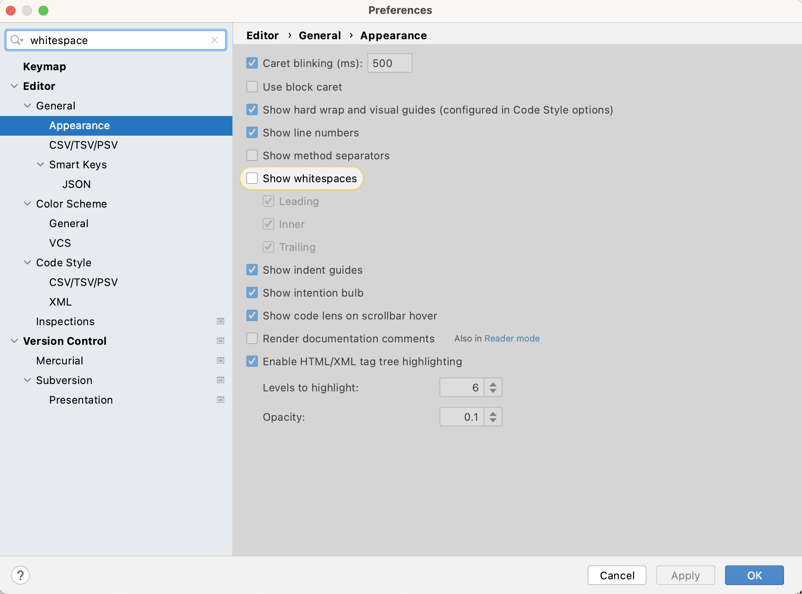

::::::::::::::::::::::::::::::::::::::: objectives

- Understand the benefits of following community coding conventions

::::::::::::::::::::::::::::::::::::::::::::::::::

:::::::::::::::::::::::::::::::::::::::: questions

- Why should you follow software code style conventions?
- Who is setting code style conventions?
- What code style conventions exist for Python?

::::::::::::::::::::::::::::::::::::::::::::::::::

## Introduction

We now have all the tools we need for software development and are raring to go.
But before you dive into writing some more code and sharing it with others,
ask yourself what kind of code should you be writing and publishing?
It may be worth spending some time learning a bit about Python coding style conventions
to make sure that your code is consistently formatted and readable by yourself and others.

> *"Any fool can write code that a computer can understand.
> Good programmers write code that humans can understand."*  
> 
> --- [Martin Fowler](https://en.wikiquote.org/wiki/Martin_Fowler), British software engineer, author and international speaker on software development

## Python Coding Style Guide

One of the most important things we can do to make sure our code is readable by other developers
(and ourselves a few months down the line)
is to make sure that it is descriptive,
cleanly and consistently formatted
and uses sensible, descriptive names for variable, function and module names.
In order to help us format our code, we generally follow guidelines known as a **style guide**.
A style guide is a set of conventions that we agree upon
with our colleagues or community,
to ensure that everyone contributing to the same project is
producing code which looks similar in style.
While a group of developers may choose to write
and agree upon a new style guide unique to each project,
in practice many programming languages have a single style guide
which is adopted almost universally by the communities around the world.
In Python, although we do have a choice of style guides available,
the [PEP 8](https://www.python.org/dev/peps/pep-0008/) style guide is most commonly used.
PEP here stands for Python Enhancement Proposals;
PEPs are design documents for the Python community,
typically specifications or conventions for how to do something in Python,
a description of a new feature in Python, etc.

:::::::::::::::::::::::::::::::::::::::::  callout

## Style consistency

One of the
[key insights from Guido van Rossum](https://www.python.org/dev/peps/pep-0008/#a-foolish-consistency-is-the-hobgoblin-of-little-minds),
the creator of the Python programming language and one of the PEP 8 authors,
is that code is read much more often than it is written.
Style guidelines are intended to improve the readability of code
and make it consistent across the wide spectrum of Python code.
Consistency with the style guide is important.
Consistency within a project is more important.
Consistency within one module or function is the most important.
However, know when to be inconsistent -
sometimes style guide recommendations are just not applicable.
When in doubt, use your best judgment.
Look at other examples and decide what looks best. And do not hesitate to ask!

::::::::::::::::::::::::::::::::::::::::::::::::::

As we have already covered in the
[episode on PyCharm IDE](13-ides.md),
PyCharm highlights the language constructs (reserved words)
and syntax errors to help us with coding.
PyCharm also gives us recommendations for formatting the code -
these recommendations are mostly taken from the PEP 8 style guide.

A full list of style guidelines for this style is available from the
[PEP 8 website](https://www.python.org/dev/peps/pep-0008/);
here we highlight a few.

### Indentation

Python is a kind of language that uses indentation as a way of grouping
statements that belong to a particular block of code.
Spaces are the recommended indentation method in Python code.
The guideline is to use 4 spaces per indentation level -
so 4 spaces on level one, 8 spaces on level two and so on.
Many people prefer the use of tabs to spaces to indent the code for many reasons
(e.g. additional typing,
easy to introduce an error by missing a single space character,
accessibility for individuals using screen readers, etc.)
and do not follow this guideline.
Whether you decide to follow this guideline or not,
be consistent and follow the style already used in the project.

:::::::::::::::::::::::::::::::::::::::::  callout

## Indentation in Python 2 vs Python 3

Python 2 allowed code indented with a mixture of tabs and spaces.
Python 3 disallows mixing the use of tabs and spaces for indentation.
Whichever you choose, be consistent throughout the project.


::::::::::::::::::::::::::::::::::::::::::::::::::

PyCharm has built-in support for converting tab indentation to spaces
"under the hood" for Python code in order to conform to PEP 8.
So, you can type a tab character and PyCharm will automatically convert it to 4 spaces.
You can control the amount of spaces that PyCharm uses to replace one tab character
or you can decide to keep the tab character altogether and prevent automatic conversion.
You can modify these settings in PyCharm's `Settings`\>`Editor`\>`Code Style`\>`Python`.

{alt='Python code indentation settings in PyCharm' .image-with-shadow width="800px"}

You can also tell the editor to show non-printable characters
if you are ever unsure what character exactly is being used
by selecting `Settings` > `Editor` > `General` > `Appearance` then checking "Show whitespaces" option.

{alt='Python code whitespace settings in PyCharm' .image-with-shadow width="800px"}

There are more complex rules on indenting single units of code that continue over several lines,
e.g. function, list or dictionary definitions can all take more than one line.
The preferred way of wrapping such long lines is
by using Python's implied line continuation inside delimiters such as
parentheses (`()`),
brackets (`[]`)
and braces (`{}`),
or a hanging indent.

```python
# Add an extra level of indentation (extra 4 spaces) to distinguish arguments from the rest of the code that follows
def long_function_name(
       var_one, var_two, var_three,
       var_four):
   print(var_one)


# Aligned with opening delimiter
foo = long_function_name(var_one, var_two,
                        var_three, var_four)

# Use hanging indents to add an indentation level like paragraphs of text where all the lines in a paragraph are
# indented except the first one
foo = long_function_name(
   var_one, var_two,
   var_three, var_four)

# Using hanging indent again, but closing bracket aligned with the first non-blank character of the previous line
a_long_list = [
   [[1, 2, 3], [4, 5, 6], [7, 8, 9]], [[0.33, 0.66, 1], [0.66, 0.83, 1], [0.77, 0.88, 1]]
   ]

# Using hanging indent again, but closing bracket aligned with the start of the multiline contruct
a_long_list2 = [
   1,
   2,
   3,
   # ...
   79
]
```

More details on good and bad practices for continuation lines can be found in
[PEP 8 guideline on indentation](https://www.python.org/dev/peps/pep-0008/#indentation).

### Maximum Line Length

All lines should be up to 80 characters long;
for lines containing comments or docstrings (to be covered later)
the line length limit should be 73 -
see [this discussion](https://stackoverflow.com/q/15438326)
for reasoning behind these numbers.
Some teams strongly prefer a longer line length,
and seemed to have settled on the length of 100.
Long lines of code can be broken over multiple lines
by wrapping expressions in delimiters,
as mentioned above (preferred method),
or using a backslash (`\`) at the end of the line
to indicate line continuation (slightly less preferred method).

```python
# Using delimiters ( ) to wrap a multi-line expression
if (a == True and
   b == False):

# Using a backslash (\) for line continuation
if a == True and \
   b == False:
```

### Should a Line Break Before or After a Binary Operator?

Lines should break before binary operators
so that the operators do not get scattered across different columns on the screen.
In the example below, the eye does not have to do the extra work to tell
which items are added and which are subtracted:

```python
# PEP 8 compliant - easy to match operators with operands
income = (gross_wages
          + taxable_interest
          + (dividends - qualified_dividends)
          - ira_deduction
          - student_loan_interest)
```

### Blank Lines

Top-level function and class definitions should be surrounded with two blank lines.
Method definitions inside a class should be surrounded by a single blank line.
You can use blank lines in functions, sparingly, to indicate logical sections.

### Whitespace in Expressions and Statements

Avoid extraneous whitespace in the following situations:

- immediately inside parentheses, brackets or braces
  
  ```python
  # PEP 8 compliant:
  my_function(colour[1], {id: 2})
  
  # Not PEP 8 compliant:
  my_function( colour[ 1 ], { id: 2 } )
  ```

- Immediately before a comma,
  semicolon,
  or colon
  (unless doing slicing where the colon acts like a binary operator
  in which case it should should have equal amounts of whitespace on either side)
  
  ```python
  # PEP 8 compliant:
  if x == 4: print(x, y); x, y = y, x
  
  # Not PEP 8 compliant:
  if x == 4 : print(x , y); x , y = y, x
  ```

- Immediately before the open parenthesis that starts the argument list of a function call
  
  ```python
  # PEP 8 compliant:
  my_function(1)
  
  # Not PEP 8 compliant:
  my_function (1)
  ```

- Immediately before the open parenthesis that starts an indexing or slicing
  
  ```python
  # PEP 8 compliant:
  my_dct['key'] = my_lst[id]
  first_char = my_str[:, 1]
  
  # Not PEP 8 compliant:
  my_dct ['key'] = my_lst [id]
  first_char = my_str [:, 1]
  ```

- More than one space around an assignment (or other) operator to align it with another
  
  ```python
  # PEP 8 compliant:
  x = 1
  y = 2
  student_loan_interest = 3
  
  # Not PEP 8 compliant:
  x                     = 1
  y                     = 2
  student_loan_interest = 3
  ```

- Avoid trailing whitespace anywhere - it is not necessary and can cause errors.
  For example, if you use backslash (`\`) for continuation lines
  and have a space after it,
  the continuation line will not be interpreted correctly.

- Surround these binary operators with a single space on either side:
  assignment (=),
  augmented assignment (+=, -= etc.),
  comparisons (==, \<, >, !=, \<>, \<=, >=, in, not in, is, is not),
  booleans (and, or, not).

- Do not use spaces around the = sign
  when used to indicate a keyword argument assignment
  or to indicate a default value for an unannotated function parameter
  
  ```python
  # PEP 8 compliant use of spaces around = for variable assignment
  axis = 'x'
  angle = 90
  size = 450
  name = 'my_graph'
  
  # PEP 8 compliant use of no spaces around = for keyword argument assignment in a function call
  my_function(
     1,
     2,
     axis=axis,
     angle=angle,
     size=size,
     name=name)
  ```

### String Quotes

In Python, single-quoted strings and double-quoted strings are the same.
PEP 8 does not make a recommendation for this
apart from picking one rule and consistently sticking to it.
When a string contains single or double quote characters,
use the other one to avoid backslashes in the string as it improves readability.

### Naming Conventions

There are a lot of different naming styles in use, including:

- lower\_case\_with\_underscores (or snake\_case)
- UPPER\_CASE\_WITH\_UNDERSCORES
- CapitalisedWords (or PascalCase) (note: when using acronyms in CapitalisedWords, capitalise all the letters of the acronym,
  e.g HTTPServerError)
- camelCase (differs from CapitalisedWords/PascalCase by the initial lowercase character)
- Capitalised\_Words\_With\_Underscores

As with other style guide recommendations - consistency is key.
Follow the one already established in the project, if there is one.
If there is not, follow any standard language style (such as
[PEP 8](https://www.python.org/dev/peps/pep-0008/) for Python).
Failing that, just pick one, document it and stick to it.

Some things to be wary of when naming things in the code:

- Avoid any names that could cause confusion (e.g. `l` (lower case L) is
  hard to distinguish from a `1` (one), `O` (uppercase o) from a `0` (zero),
  `I` (uppercase i) from `l` (lowercase L)).
- Avoid using non-ASCII (e.g. Unicode) characters for identifiers as these
  can trip up software that does not support Unicode.
- If your audience is international and English is the common language,
  try to use English words for identifiers and comments whenever possible
  but try to avoid abbreviations/local slang as they may not be understood by everyone.
  Also consider sticking with either 'American' or 'British' English spellings
  and try not to mix the two.

:::::::::::::::::::::::::::::::::::::::::  callout

## Function, Variable, Class, Module, Package Naming in Python

- Function and variable names should use lower\_case\_with\_underscores
- Avoid single character names in almost all instances.
- Variable names should tell you what they store, and not just the type (e.g. `name_of_patient` is better than `string`)
- Function names should tell you what the function does.
- Class names should use the CapitalisedWords convention.
- Modules should have short, all-lowercase names.
  Underscores can be used in the module name if it improves readability.
- Packages should also have short, all-lowercase names,
  although the use of underscores is discouraged.

A more detailed guide on
[naming functions, modules, classes and variables](https://www.python.org/dev/peps/pep-0008/#package-and-module-names)
is available from PEP 8.

::::::::::::::::::::::::::::::::::::::::::::::::::

### Comments

Comments allow us to provide the reader with additional information on what the code does -
reading and understanding source code is slow, laborious and can lead to misinterpretation,
plus it is always a good idea to keep others in mind when writing code.
A good rule of thumb is to assume that someone will *always* read your code at a later date,
and this includes a future version of yourself.
It can be easy to forget why you did something a particular way in six months' time.
Write comments as complete sentences and in English
unless you are 100% sure the code will never be read by people who do not speak your language.

:::::::::::::::::::::::::::::::::::::::::  callout

## The Good, the Bad, and the Ugly Comments

As a side reading, check out the
['Putting comments in code: the good, the bad, and the ugly' blogpost](https://medium.com/free-code-camp/code-comments-the-good-the-bad-and-the-ugly-be9cc65fbf83).
Remember - a comment should answer the 'why' question".
Occasionally the "what" question.
The "how" question should be answered by the code itself.


::::::::::::::::::::::::::::::::::::::::::::::::::

Block comments generally apply to some (or all) code that follows them,
and are indented to the same level as that code.
Each line of a block comment starts with a `#` and a single space
(unless it is indented text inside the comment).

```python
def fahr_to_cels(fahr):
    # Block comment example: convert temperature in Fahrenheit to Celsius
    cels = (fahr + 32) * (5 / 9)
    return cels
```

An inline comment is a comment on the same line as a statement.
Inline comments should be separated by at least two spaces from the statement.
They should start with a `#` and a single space and should be used sparingly.

```python
def fahr_to_cels(fahr):
    cels = (fahr + 32) * (5 / 9)  # Inline comment example: convert temperature in Fahrenheit to Celsius
    return cels
```

Python does not have any multi-line comments,
like you may have seen in other languages like C++ or Java.
However, there are ways to do it using *docstrings* as we will see in a moment.

The reader should be able to understand a single function or method
from its code and its comments,
and should not have to look elsewhere in the code for clarification.
The kind of things that need to be commented are:

- Why certain design or implementation decisions were adopted,
  especially in cases where the decision may seem counter-intuitive
- The names of any algorithms or design patterns that have been implemented
- The expected format of input files or database schemas

However, there are some restrictions.
Comments that simply restate what the code does are redundant,
and comments must be accurate and updated with the code,
because an incorrect comment causes more confusion than no comment at all.

:::::::::::::::::::::::::::::::::::::::  challenge

## Exercise: Improve Code Style of Our Project

let us look at improving the coding style of our project.
First, from the project root, use `git switch` to create a new feature branch called `style-fixes`
from our develop branch.
(Note that at this point `develop` and `main` branches
are pointing at the same commit so it does not really matter which one we are branching off -
in real collaborative software development environments, you'd likely be expected to branch off `develop`
as it would contain the latest code developed by your team.)

```bash
$ git switch develop
$ git switch -c style-fixes
```

Next look at the `inflammation-analysis.py` file in PyCharm
and identify where the above guidelines have not been followed.
Fix the discovered inconsistencies and commit them to the feature branch.

:::::::::::::::  solution

## Solution

Modify `inflammation-analysis.py` from PyCharm,
which is helpfully marking inconsistencies with coding guidelines by underlying them.
There are a few things to fix in `inflammation-analysis.py`, for example:

1. Line 30 in `inflammation-analysis.py` is too long and not very readable.
  A better style would be to use multiple lines and hanging indent,
  with the closing brace \`}' aligned either with
  the first non-whitespace character of the last line of list
  or the first character of the line that starts the multiline construct
  or simply moved to the end of the previous line.
  All three acceptable modifications are shown below.
  
  ```python
  # Using hanging indent, with the closing '}' aligned with the first non-blank character of the previous line
  view_data = {
      'average': models.daily_mean(inflammation_data),
      'max': models.daily_max(inflammation_data),
      'min': models.daily_min(inflammation_data)
      }
  ```
  
  ```python
  # Using hanging indent with the, closing '}' aligned with the start of the multiline contruct
  view_data = {
      'average': models.daily_mean(inflammation_data),
      'max': models.daily_max(inflammation_data),
      'min': models.daily_min(inflammation_data)
  }
  ```
  
  ```python
  # Using hanging indent where all the lines of the multiline contruct are indented except the first one
  view_data = {
      'average': models.daily_mean(inflammation_data),
      'max': models.daily_max(inflammation_data),
      'min': models.daily_min(inflammation_data)}
  ```

2. Variable 'InFiles' in `inflammation-analysis.py` uses CapitalisedWords naming convention
  which is recommended for class names but not variable names.
  By convention, variable names should be in lowercase with optional underscores
  so you should rename the variable 'InFiles' to, e.g., 'infiles' or 'in\_files'.

3. There are two blank lines starting from line 19 in `inflammation-analysis.py`.
  Normally, you should not use blank lines in the middle of the code
  unless you want to separate logical units -
  in which case only one blank line is used.
  Note how PyCharm is warning us by underlining the whole line below.

4. Only one blank line after the end of definition of function `main`
  and the rest of the code below line 27 in `inflammation-analysis.py` -
  should be two blank lines (PEP 8 recommends surrounding top-level function
  (and class) definitions with two blank lines).
  Note how PyCharm is warning us by underlining the whole line below.

Finally, let us add and commit our changes to the feature branch.
We will check the status of our working directory first.

```bash
$ git status
```

```output
On branch style-fixes
Changes not staged for commit:
(use "git add <file>..." to update what will be committed)
(use "git restore <file>..." to discard changes in working directory)
modified:   inflammation-analysis.py

no changes added to commit (use "git add" and/or "git commit -a")
```

Git tells us we are on branch `style-fixes`
and that we have unstaged and uncommited changes to `inflammation-analysis.py`.
let us commit them to the local repository.

```bash
$ git add inflammation-analysis.py
$ git commit -m "Code style fixes."
```

:::::::::::::::::::::::::

::::::::::::::::::::::::::::::::::::::::::::::::::

:::::::::::::::::::::::::::::::::::::::  challenge

## Optional Exercise: Improve Code Style of Your Other Python Projects

If you have another Python project, check to which extent it conforms to PEP 8 coding style.


::::::::::::::::::::::::::::::::::::::::::::::::::

### Documentation Strings aka Docstrings

If the first thing in a function is a string that is not assigned to a variable,
that string is attached to the function as its documentation.
Consider the following code implementing function
for calculating the nth Fibonacci number:

```python
def fibonacci(n):
    """Calculate the nth Fibonacci number.

    A recursive implementation of Fibonacci array elements.

    :param n: integer
    :raises ValueError: raised if n is less than zero
    :returns: Fibonacci number
    """
    if n < 0:
        raise ValueError('Fibonacci is not defined for N < 0')
    if n == 0:
        return 0
    if n == 1:
        return 1

    return fibonacci(n - 1) + fibonacci(n - 2)
```

Note here we are explicitly documenting our input variables,
what is returned by the function,
and also when the `ValueError` exception is raised.
Along with a helpful description of what the function does,
this information can act as a *contract* for readers to understand what to expect in terms of
behaviour when using the function,
as well as how to use it.

A special comment string like this is called a **docstring**.
We do not need to use triple quotes when writing one,
but if we do, we can break the text across multiple lines.
Docstrings can also be used at the start of a Python module
(a file containing a number of Python functions)
or at the start of a Python class
(containing a number of methods)
to list their contents as a reference.
You should not confuse docstrings with comments though -
docstrings are context-dependent and should only be used in specific locations
(e.g. at the top of a module and immediately after `class` and `def` keywords as mentioned).
Using triple quoted strings in locations where
they will not be interpreted as docstrings
or using triple quotes as a way to 'quickly' comment out an entire block of code
is considered bad practice.

In our example case, we used the
[Sphynx/ReadTheDocs docstring style](https://sphinx-rtd-tutorial.readthedocs.io/en/latest/docstrings.html)
formatting for the `param`, `raises` and `returns` - other docstring formats exist as well.

:::::::::::::::::::::::::::::::::::::::::  callout

## Python PEP 257 - Recommendations for Docstrings

[PEP 257](https://peps.python.org/pep-0257/)
is another one of Python Enhancement Proposals
and this one deals with docstring conventions to standardise how they are used.
For example, on the subject of module-level docstrings, PEP 257 says:

```
The docstring for a module should generally list
the classes,
exceptions
and functions
(and any other objects)
that are exported by the module, with a one-line summary of each.
(These summaries generally give less detail than the summary line in the object's docstring.)
The docstring for a package
(i.e., the docstring of the package's `__init__.py` module)
should also list the modules and subpackages exported by the package.
```

Note that `__init__.py` file used to be a required part of a package
(pre Python 3.3)
where a package was typically implemented as a directory containing
an `__init__.py` file which got implicitly executed when a package was imported.


::::::::::::::::::::::::::::::::::::::::::::::::::

So, at the beginning of a module file we can just add
a docstring explaining the nature of a module.
For example, if `fibonacci()` was included in a module with other functions,
our module could have at the start of it:

```python
"""A module for generating numerical sequences of numbers that occur in nature.

Functions:
  fibonacci - returns the Fibonacci number for a given integer
  golden_ratio - returns the golden ratio number to a given Fibonacci iteration
  ...
"""
...
```

The docstring for a function or a module
is returned when calling the `help` function and passing its name -
for example from the interactive Python console/terminal available from the command line
or when rendering code documentation online
(e.g. see [Python documentation](https://docs.python.org/3.11/library/index.html)).
PyCharm also displays the docstring for a function/module
in a little help popup window when using tab-completion.

```python
help(fibonacci)
```

:::::::::::::::::::::::::::::::::::::::  challenge

## Exercise: Fix the Docstrings

Look into `models.py` in PyCharm and improve docstrings for functions
`daily_mean` ,
`daily_min`,
`daily_max`.
Commit those changes to feature branch `style-fixes`.

:::::::::::::::  solution

## Solution

For example,
the improved docstrings for the above functions would contain explanations
for parameters and return values.

```python
def daily_mean(data):
   """Calculate the daily mean of a 2D inflammation data array for each day.

   :param data: A 2D data array with inflammation data (each row contains measurements for a single patient across all days).
   :returns: An array of mean values of measurements for each day.
   """
   return np.mean(data, axis=0)
```

```python
def daily_max(data):
   """Calculate the daily maximum of a 2D inflammation data array for each day.

   :param data: A 2D data array with inflammation data (each row contains measurements for a single patient across all days).
   :returns: An array of max values of measurements for each day.
   """
   return np.max(data, axis=0)
```

```python
def daily_min(data):
   """Calculate the daily minimum of a 2D inflammation data array for each day.

   :param data: A 2D data array with inflammation data (each row contains measurements for a single patient across all days).
   :returns: An array of minimum values of measurements for each day.
   """
   return np.min(data, axis=0)
```

Once we are happy with modifications,
as usual before staging and commit our changes,
we check the status of our working directory:

```bash
$ git status
```

```output
On branch style-fixes
Changes not staged for commit:
(use "git add <file>..." to update what will be committed)
(use "git restore <file>..." to discard changes in working directory)
modified:   inflammation/models.py

no changes added to commit (use "git add" and/or "git commit -a")
```

As expected, Git tells us we are on branch `style-fixes`
and that we have unstaged and uncommited changes to `inflammation/models.py`.
Let us commit them to the local repository.

```bash
$ git add inflammation/models.py
$ git commit -m "Docstring improvements."
```

:::::::::::::::::::::::::

::::::::::::::::::::::::::::::::::::::::::::::::::

In the previous exercises, we made some code improvements on feature branch `style-fixes`.
We have committed our changes locally but
have not pushed this branch remotely for others to have a look at our code
before we merge it onto the `develop` branch.
Let us do that now, namely:

- push `style-fixes` to GitHub
- merge `style-fixes` into `develop` (once we are happy with the changes)
- push updates to `develop` branch to GitHub (to keep it up to date with the latest developments)
- finally, merge `develop` branch into the stable `main` branch

Here is a set commands that will achieve the above set of actions
(remember to use `git status` often in between other Git commands
to double check which branch you are on and its status):

```bash
$ git push -u origin style-fixes
$ git switch develop
$ git merge style-fixes
$ git push origin develop
$ git switch main
$ git merge develop
$ git push origin main
```

:::::::::::::::::::::::::::::::::::::  testimonial

## Typical Code Development Cycle

What you have done in the exercises in this episode mimics a typical software development workflow -
you work locally on code on a feature branch,
test it to make sure it works correctly and as expected,
then record your changes using version control
and share your work with others via a centrally backed-up repository.
Other team members work on their feature branches in parallel
and similarly share their work with colleagues for discussions.
Different feature branches from around the team get merged onto the development branch,
often in small and quick development cycles.
After further testing and verifying that no code has been broken by the new features -
the development branch gets merged onto the stable main branch,
where new features finally resurface to end-users in bigger "software release" cycles.


::::::::::::::::::::::::::::::::::::::::::::::::::


:::::::::::::::::::::::::::::::::::::::: keypoints

- Always assume that someone else will read your code at a later date, including yourself.
- Community coding conventions help you create more readable software projects that are easier to contribute to.
- Python Enhancement Proposals (or PEPs) describe a recommended convention or specification for how to do something in Python.
- Style checking to ensure code conforms to coding conventions is often part of IDEs.
- Consistency with the style guide is important - whichever style you choose.

::::::::::::::::::::::::::::::::::::::::::::::::::


