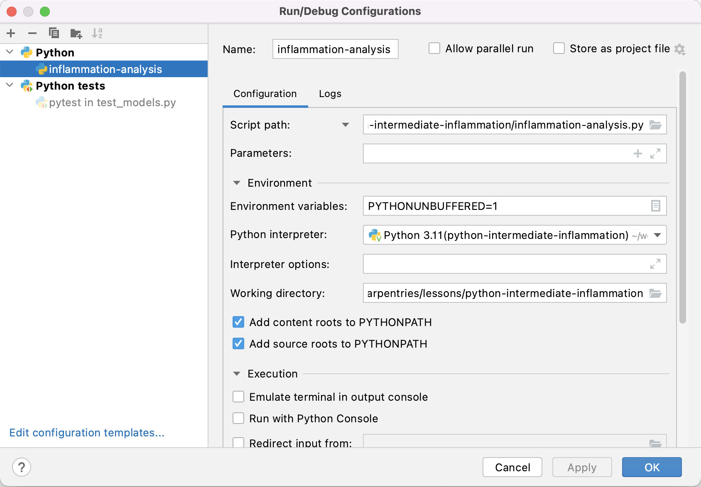

## Finding Faults in Software

Unit testing can tell us something is wrong in our code and give a rough idea of where the error is by which
test(s) are failing. But it does not tell us exactly where the problem is (i.e. what line of code), or how it came about.
To give us a better idea of what is going on, we can:
 - output program state at various points, e.g. by using print statements to output the contents of
variables,
- use a logging capability to output the state of everything as the program progresses, or
- look at intermediately generated files.

But such approaches are often time consuming and sometimes not enough to fully pinpoint the issue.
In complex programs, like simulation codes, we often need to get inside the code while it is running and explore.
This is where using a **debugger** can be useful.

Let us add a new function called `patient_normalise()` to our inflammation example to normalise a
given inflammation data array so that all entries fall between 0 and 1. To normalise each patient's inflammation
data we need to divide it by the maximum inflammation experienced by that patient.

To do so, we can add the following code
to `inflammation/models.py`:

~~~
def patient_normalise(data):
    """Normalise patient data from a 2D inflammation data array."""
    max = np.max(data, axis=0)
    return data / max[:, np.newaxis]
~~~
{: .language-python}

In the code above, we first go row by row and find the maximum inflammation value for each patient and
store these values in a 1-dimensional NumPy array `max`. We then want to use
NumPy's element-wise division, to divide each value in every row of inflammation data (belonging to the same patient)
by the maximum value for that patient stored in the 1D array `max`.
However, we cannot do that division automatically as `data` is a 2D array (of shape `(n, m)`) and `max`
is a 1D array (of shape `(n, )`) meaning that their shapes are not compatible.

Hence, to make sure that we can perform this division and get the expected result, we need to convert `max` to be a 2D array by using the `newaxis` index operator to
insert a new axis into `max`, making it a 2D array of shape `(n, 1)`.

Now the division will give us the expected result. Even though the shapes are not identical,
NumPy's automatic `broadcasting` (adjustment of shapes) will make sure that the shape of the 2D `max` array is now
"stretched" ("broadcast") to match that of `data` - i.e. `(n, m)`, and element-wise division can be performed.

>## Broadcasting
>The term broadcasting describes how NumPy treats arrays with different shapes during arithmetic operations.
>Subject to certain constraints, the smaller array is “broadcast” across the larger array so that they have
>compatible shapes. Be careful, though, to understand how the arrays get stretched to avoid getting unexpected results.
{: .callout}

Note there is an
assumption in this calculation that the minimum value we want is always zero. This is a sensible assumption for
this particular application, since the zero value is a special case indicating that a patient experienced no
inflammation on a particular day.

Let us now add a new test in `tests/test_models.py` to check that the normalisation function is correct for some test data.

~~~
@pytest.mark.parametrize(
    "test, expected",
    [
        ([[1, 2, 3], [4, 5, 6], [7, 8, 9]], [[0.33, 0.66, 1], [0.66, 0.83, 1], [0.77, 0.88, 1]])
    ])
def test_patient_normalise(test, expected):
    """Test normalisation works for arrays of one and positive integers."""
    from inflammation.models import patient_normalise
    npt.assert_almost_equal(np.array(expected), patient_normalise(np.array(test)), decimal=2)
~~~
{: .language-python}

Note another assumption made here that a test accuracy of two decimal places is sufficient!

Run the tests again using `pytest tests/test_model.py` and you will note that the new
test is failing, with an error message that does not give many clues as to what went wrong.

~~~
E       AssertionError:
E       Arrays are not almost equal to 2 decimals
E
E       Mismatched elements: 6 / 9 (66.7%)
E       Max absolute difference: 0.57142857
E       Max relative difference: 1.33333333
E        x: array([[0.33, 0.66, 1.  ],
E              [0.66, 0.83, 1.  ],
E              [0.77, 0.88, 1.  ]])
E        y: array([[0.14, 0.29, 0.43],
E              [0.5 , 0.62, 0.75],
E              [0.78, 0.89, 1.  ]])

tests/test_models.py:53: AssertionError
~~~
{: .output}

Let us use a debugger at this point to see what is going on and why the function failed.

## Debugging in PyCharm

FIXME: convert to PyCharm

Think of debugging like performing exploratory surgery - on code! Debuggers allow us to peer at the internal workings
of a program, such as variables and other state, as it performs its functions.

### Running tests within PyCharm

First to make this a little easier to track what's going on we can set up PyCharm to run and debug our tests, as instead of running them from the command line. If you have not done so already, you will first need to
enable the PyTest framework in PyCharm. You can do this by:

1. Select either `PyCharm` > `Preferences` (Mac) or `File` > `Settings` (Linux, Windows).
2. Then, in the preferences window that appears, select `Tools` -> `Python integrated tools` >
   from the left.
3. Under `Testing`, for `Default test runner` select `pytest`.
4. Select `OK`.

We can now run `pytest` over our tests in PyCharm, similarly to how we ran our `patientdb.py` file before. Right-click the `test_models.py` file under the `tests` directory in the file navigation window on the left, and select `Run 'pytest in test_model...'`. You'll see the results of the tests appear in PyCharm in a bottom panel. If you scroll down in that panel you should see the failed `test_patient_normalise()` test result looking something like the following:

We can also run our test functions individually. First, let's check that our PyCharm running and testing configurations are correct. Select `Run` > `Edit Configurations...` from the PyCharm menu, and you should see something like the following:

PyCharm allows us to configure multiple ways of running our code. Looking at the figure above, the first of these - `patientdb` under `Python` - was configured when we set up how to run our script from within PyCharm. The second - `pytest in test_models.py` under `Python tests` - is our recent test configuration. If you see just these, you're good to go. We don't need any others, so select any others you see and click the `-` button at the top to remove them. This will avoid any confusion when running our tests separately. Click `OK` when done.

Now, if you select the green arrow next to a test function in our `test_models.py` script in PyCharm, and select `Run 'pytest in test_model...'`, we can run just that test:

Click on the "run" button next to `test_patient_normalise`, and you will be able to see that PyCharm runs just that test function, and we see the same `AssertionError` that we saw before.

### Running the Debugger

Now we want to use the debugger to investigate what is happening inside the `patient_normalise` function. To do this we will add a *breakpoint* in the code. A breakpoint will pause execution at that point allowing us to explore the state of the program.

To set a breakpoint, navigate to the `models.py` file and move your mouse to the return statement of the `patient_normalise` function. Click to just to the right of the line number for that line and a small red dot will appear, indicating that you have placed a breakpoint on that line.

Now if you select the green arrow next to the `test_patient_normalise` function and select `Debug 'pytest in test_model...'` instead, you will notice that execution will be paused at the return statement of `patient_normalise`. In the debug panel that appears below, we can now investigate the exact state of the program prior to it executing this line of code.

In the debug panel below, in the `Debugger` tab you will be able to see two sections that looks something like the following:

- The `Frames` section, which shows the **call stack**, which is the chain of functions that have been executed to lead to this point. We can traverse this chain of functions if we wish, to observe the state of each function.
- The `Variables` section, which displays the local and global variables currently in memory. You will be able to see the `data` array that is input to the `patient_normalise` function, as well as the `max` local array that was created to hold the maximum inflammation values for each patient.

We also have the ability run any Python code we wish at this point to explore the state of the program even further! This is useful if you want to view a particular combination of variables, or perhaps a single element or slice of an array to see what went wrong. Select the `Console` tab in the panel (next to the `Debugger` tab), and you'll be presented with a Python prompt. Try putting in the expression `max[:, np.newaxis]` into the console, and you will be able to see the column vector that we are dividing `data` by in the return line of the function.

Now, looking at the `max` variable, we can see that something looks wrong, as the maximum values for each patient do not correspond to the `data` array. Recall that the input `data` array we are using for the function is

~~~
  [[1, 2, 3], [4, 5, 6], [7, 8, 9]]
~~~
{: .language-python}

So the maximum inflammation for each patient should be `[3, 6, 9]`, whereas the debugger shows `[7, 8, 9]`. You can see that the latter corresponds exactly to the last column of `data`, and we can immediately conclude that we took the maximum along the wrong axis of `data`. So to fix the `patient_normalise` function we can change `axis=0` in the first line to `axis=1`. With this fix in place, running all the tests again should result in all tests passing. Navigate back to `test_models.py` in PyCharm, right click `test_models.py` and select `Run 'pytest in test_model...'`. You should be rewarded with:

## Corner or Edge Cases

The test case that we have currently written for `patient_normalise` is parameterised with a fairly standard data
array. However, when writing your test cases, it is important to consider parametrising them by unusual or extreme
values, in order to test all the edge or corner cases that your code could be exposed to in practice.
Generally speaking, it is at these extrema cases that you will find your code failing, so it beneficial to test them beforehand.

What is considered an "edge case" for a given component depends on what that component is meant to do.
In the case of `patient_normalise` function, the goal is to normalise a numeric array of numbers.
For numerical values, extreme cases could be zeros, very large or small values, not-a-number (`NaN`) or infinity values.
Since we are specifically considering an *array* of values, an edge case could be that all the numbers of the array are equal.

For all the given edge cases you might come up with, you should also consider their likelihood of occurrence.
It is often too much effort to exhaustively test a given function against every possible input, so you should prioritise edge cases that are likely to occur. For our `patient_normalise` function, some common edge cases might be the occurrence of zeros,
and the case where all the values of the array are the same.

When you are considering edge cases to test for, try also to think about what might break your code.
For `patient_normalise` we can see that there is a division by the maximum inflammation value for each patient,
so this will clearly break if we are dividing by zero here, resulting in `NaN` values in the normalised array.

With all this in mind, let us add a few edge cases to our parametrisation of `test_patient_normalise`.
We will add two extra tests, corresponding to an input array of all 0, and an input array of all 1.

~~~
@pytest.mark.parametrize(
    "test, expected",
    [
        ([[0, 0, 0], [0, 0, 0], [0, 0, 0]], [[0, 0, 0], [0, 0, 0], [0, 0, 0]]),
        ([[1, 1, 1], [1, 1, 1], [1, 1, 1]], [[1, 1, 1], [1, 1, 1], [1, 1, 1]]),
        ([[1, 2, 3], [4, 5, 6], [7, 8, 9]], [[0.33, 0.66, 1], [0.66, 0.83, 1], [0.77, 0.88, 1]]),
    ])
~~~
{: .language-python}

Running the tests now results in the following assertion error, due to the division by zero as we predicted.

~~~
E           AssertionError:
E           Arrays are not almost equal to 2 decimals
E
E           x and y nan location mismatch:
E            x: array([[0, 0, 0],
E                  [0, 0, 0],
E                  [0, 0, 0]])
E            y: array([[nan, nan, nan],
E                  [nan, nan, nan],
E                  [nan, nan, nan]])

env/lib/python3.6/site-packages/numpy/testing/_private/utils.py:740: AssertionError
~~~
{: .output}

Helpfully, you will also notice that NumPy also provides a run-time warning for division by zero, reproduced below.

~~~
  RuntimeWarning: invalid value encountered in true_divide
    return data / max[:, np.newaxis]
~~~
{: .output}

How can we fix this? Luckily, there is a NumPy function that is useful here, [`np.isnan()`](https://numpy.org/doc/stable/reference/generated/numpy.isnan.html), which we can use to replace all the NaN's with our desired result, which is 0. We can also silence the run-time warning using
[`np.errstate`](https://numpy.org/doc/stable/reference/generated/numpy.errstate.html).

> ## Exploring Tests for Edge Cases
>
> Fix the failing `test_patient_normalise` test, and think of some more suitable edge cases to test our `patient_normalise()` function and add them to the parametrised tests. After you have finished remember to commit your changes.
>
> > ## Possible Solution
> > ~~~
> > ...
> >
> > def patient_normalise(data):
> >     """
> >     Normalise patient data from a 2D inflammation data array.
> >
> >     NaN values are ignored, and normalised to 0.
> >
> >     Negative values are rounded to 0.
> >     """
> >     max = np.nanmax(data, axis=1)
> >     with np.errstate(invalid='ignore', divide='ignore'):
> >         normalised = data / max[:, np.newaxis]
> >     normalised[np.isnan(normalised)] = 0
> >     normalised[normalised < 0] = 0
> >     return normalised
> >
> > ...
> >
> > @pytest.mark.parametrize(
> >     "test, expected",
> >     [
> >         (
> >             [[0, 0, 0], [0, 0, 0], [0, 0, 0]],
> >             [[0, 0, 0], [0, 0, 0], [0, 0, 0]],
> >         ),
> >         (
> >             [[1, 1, 1], [1, 1, 1], [1, 1, 1]],
> >             [[1, 1, 1], [1, 1, 1], [1, 1, 1]],
> >         ),
> >         (
> >             [[float('nan'), 1, 1], [1, 1, 1], [1, 1, 1]],
> >             [[0, 1, 1], [1, 1, 1], [1, 1, 1]],
> >         ),
> >         (
> >             [[1, 2, 3], [4, 5, float('nan')], [7, 8, 9]],
> >             [[0.33, 0.66, 1], [0.8, 1, 0], [0.77, 0.88, 1]],
> >         ),
> >         (
> >             [[-1, 2, 3], [4, 5, 6], [7, 8, 9]],
> >             [[0, 0.66, 1], [0.66, 0.83, 1], [0.77, 0.88, 1]],
> >         ),
> >         (
> >             [[1, 2, 3], [4, 5, 6], [7, 8, 9]],
> >             [[0.33, 0.66, 1], [0.66, 0.83, 1], [0.77, 0.88, 1]],
> >         )
> >     ])
> > def test_patient_normalise(test, expected):
> >     """Test normalisation works for arrays of one and positive integers."""
> >     from inflammation.models import patient_normalise
> >     npt.assert_almost_equal(np.array(expected), patient_normalise(np.array(test)), decimal=2)
> > ...
> > ~~~
> > {: .language-python}
> >
> > You could also test, and handle, the case of a whole row of NaNs...
> {: .solution}
>
{: .challenge}

## Defensive Programming

In the previous section, we made a few design choices for our `patient_normalise` function:

1. we are implicitly converting any `NaN` and negative values to 0,
2. normalising a constant 0 array of inflammation results in an identical array of 0s,
3. we do not want to warn the user of any of these situations.

This could have be handled differently. We might decide that we do not want to silently make
these changes to the data, but instead to explicitly check that the input data satisfies a given set of
assumptions (e.g. no negative values) and raise an error if this is not the case.
Then we can proceed with the normalisation, confident that our normalisation function will work correctly.

Checking that input to a function is valid via a set of preconditions is one of the simplest forms of
**defensive programming** which is used as a way of avoiding potential errors.
Preconditions are checked at the beginning of the function to make sure that all assumptions are satisfied.
These assumptions are often based on the *value* of the arguments, like we have already discussed.
However, in a dynamic language like Python one of the more common preconditions is to check that the arguments of a
function are of the correct *type*. Currently there is nothing stopping someone from calling `patient_normalise`
with a string, a dictionary, or another object that is not an `ndarray`.

As an example, let us change the behaviour of the `patient_normalise` function to raise an error on negative
inflammation values. We can add a precondition check to the beginning of our function like so:

~~~
...
    if np.any(data < 0):
        raise ValueError('Inflammation values should not be negative')
...
~~~
{: .language-python}

We can then modify our test function to check that the function raises the correct exception - a `ValueError`.
The [`ValueError`](https://docs.python.org/3/library/exceptions.html#ValueError) exception is part of the standard Python
library and is used to indicate that the function received an argument of the right type, but of an inappropriate value.

~~~
@pytest.mark.parametrize(
    "test, expected, raises",
    [
        ... # other test cases here, with None for raises
        (
            [[-1, 2, 3], [4, 5, 6], [7, 8, 9]],
            [[0, 0.66, 1], [0.66, 0.83, 1], [0.77, 0.88, 1]],
            ValueError,
        ),
        (
            [[1, 2, 3], [4, 5, 6], [7, 8, 9]],
            [[0.33, 0.66, 1], [0.66, 0.83, 1], [0.77, 0.88, 1]],
            None,
        ),
    ])
def test_patient_normalise(test, expected, raises):
    """Test normalisation works for arrays of one and positive integers."""
    from inflammation.models import patient_normalise
    if raises:
        with pytest.raises(raises):
            npt.assert_almost_equal(np.array(expected), patient_normalise(np.array(test)), decimal=2)
    else:
        npt.assert_almost_equal(np.array(expected), patient_normalise(np.array(test)), decimal=2)
~~~
{: .language-python}

> ## Add a Precondition to Check the Correct Type and Shape of Data
>
> Add preconditions to check that data is an `ndarray` object and that it is of the correct shape.
> Add corresponding tests to check that the function raises the correct exception.
> You will find the Python function [`isinstance`](https://docs.python.org/3/library/functions.html#isinstance)
> useful here, as well as the Python exception [`TypeError`](https://docs.python.org/3/library/exceptions.html#TypeError).
> Once you are done, commit your new files, and push the new commits to your remote repository on GitHub.
>
> > ## Solution
> > ~~~
> > ...
> >
> > def patient_normalise(data):
> >     """
> >     Normalise patient data between 0 and 1 of a 2D inflammation data array.
> >
> >     Any NaN values are ignored, and normalised to 0
> >
> >     :param data: 2d array of inflammation data
> >     :type data: ndarray
> >
> >     """
> >     if not isinstance(data, np.ndarray):
> >         raise TypeError('data input should be ndarray')
> >     if len(data.shape) != 2:
> >         raise ValueError('inflammation array should be 2-dimensional')
> >     if np.any(data < 0):
> >         raise ValueError('inflammation values should be non-negative')
> >     max = np.nanmax(data, axis=1)
> >     with np.errstate(invalid='ignore', divide='ignore'):
> >         normalised = data / max[:, np.newaxis]
> >     normalised[np.isnan(normalised)] = 0
> >     return normalised
> > ...
> >
> > @pytest.mark.parametrize(
> >     "test, expected, raises",
> >     [
> >         ...
> >         (
> >             'hello',
> >             None,
> >             TypeError,
> >         ),
> >         (
> >             3,
> >             None,
> >             TypeError,
> >         ),
> >         (
> >             [[1, 2, 3], [4, 5, 6], [7, 8, 9]],
> >             [[0.33, 0.66, 1], [0.66, 0.83, 1], [0.77, 0.88, 1]],
> >             None,
> >         )
> >     ])
> > def test_patient_normalise(test, expected, raises):
> >     """Test normalisation works for arrays of one and positive integers."""
> >     from inflammation.models import patient_normalise
> >     if isinstance(test, list):
> >         test = np.array(test)
> >     if raises:
> >         with pytest.raises(raises):
> >             npt.assert_almost_equal(np.array(expected), patient_normalise(test), decimal=2)
> >     else:
> >         npt.assert_almost_equal(np.array(expected), patient_normalise(test), decimal=2)
> > ...
> > ~~~
> > {: .language-python}
> {: .solution}
>
{: .challenge}

You should not take it too far by trying to code preconditions for every conceivable eventuality.
You should aim to strike a balance between making sure you secure your function against incorrect use,
and writing an overly complicated and expensive function that handles cases that are likely never going to occur.
For example, it would be sensible to validate the shape of your inflammation data array when it is actually read
from the csv file (in `load_csv`), and therefore there is no reason to test this again in `patient_normalise`.
You can also decide against adding explicit preconditions in your code, and instead state the assumptions and
limitations of your code for users of your code in the docstring and rely on them to invoke your code correctly.
This approach is useful when explicitly checking the precondition is too costly.


