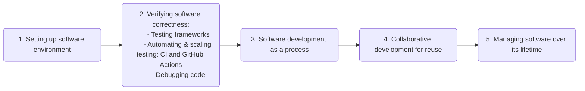

::::::::::::::::::::::::::::::::::::::: objectives

- Introduce the testing tools, techniques, and infrastructure that will be used in this section.

::::::::::::::::::::::::::::::::::::::::::::::::::

:::::::::::::::::::::::::::::::::::::::: questions

- What should we do to ensure our code is correct?

::::::::::::::::::::::::::::::::::::::::::::::::::

We have just set up a suitable environment for the development of our software project
and are ready to start coding.
However, we want to make sure that the new code we contribute to the project
is actually correct and is not breaking any of the existing code.
So, in this section,
we will look at testing approaches that can help us ensure
that the software we write is behaving as intended,
and how we can diagnose and fix issues once faults are found.
Using such approaches requires us to change our practice of development.
This can take time, but potentially saves us considerable time
in the medium to long term
by allowing us to more comprehensively and rapidly find such faults,
as well as giving us greater confidence in the correctness of our code -
so we should try and employ such practices early on.
We will also make use of techniques and infrastructure that allow us to do this
in a scalable, automated and more performant way as our codebase grows.

<--
alt="Topics on verifying software correctness covered in the current section: testing frameworks, automating and scaling up testing, and code debugging"
-->

In this section we will:

- Make use of a **test framework** called Pytest,
  a free and open source Python library to help us structure and run automated tests.
- Design, write and run **unit tests** using Pytest
  to verify the correct behaviour of code and identify faults,
  making use of test **parameterisation**
  to increase the number of different test cases we can run.
- Automatically run a set of unit tests using **GitHub Actions** -
  a **Continuous Integration** infrastructure that allows us to
  automate tasks when things happen to our code,
  such as running those tests when a new commit is made to a code repository.
- Use a **debugger** integrated into our IDE to help us locate a fault in our code while it is running, and then fix it.

:::::::::::::::::::::::::::::::::::::::: keypoints

- Using testing requires us to change our practice of code development, but saves time in the long run by allowing us to more comprehensively and rapidly find faults in code, as well as giving us greater confidence in the correctness of our code.
- The use of test techniques and infrastructures such as **parameterisation** and **Continuous Integration** can help scale and further automate our testing process.

::::::::::::::::::::::::::::::::::::::::::::::::::

