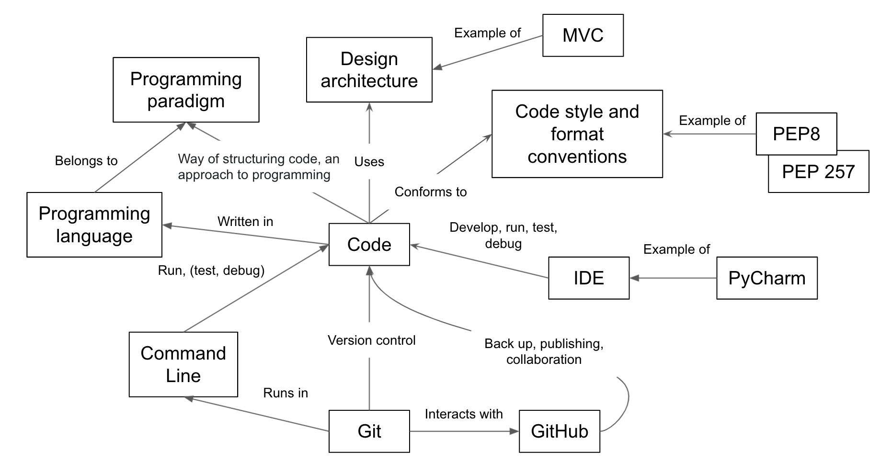

Diagram below depicts a concept map of tools and techniques we used throughout this workshop and a high-level overview
of how they fit together.

{: .image-with-shadow width="700px"}

As part of this course we have looked at a core set of established, intermediate-level software development skills and best practices for working as part of a team in a research environment. This is not a comprehensive, all-encompassing set of every skill you might need, but a selected set of skills that have been tried and tested in collaborative research software development environments:

- Collaborative techniques and tools play an important part of research software development in teams, but also have benefits in solo development. We've looked at the benefits of a well-considered development environment, using practices, tools and infrastructure to help us write code more effectively with others.
- We've gone beyond procedural programming and explored different paradigms, such as object oriented and functional styles of programming. We've contrasted their pros, cons, and the situations in which they work best, and how separation of concerns through modularity and architectural design can help shape good software.
- We've looked at the importance of being able to verify the correctness of software and automation, and how we can leverage techniques and infrastructure to automate and scale tasks such as testing to save us time - but automation has a role beyond simply testing: what else can you automate that would save you even more time? Once found, we've also examined how to locate faults in our software.
- As an intermediate developer, aspects other than technical skills become important, particularly in development teams. We've looked at the importance of good, consistent practices for team working, and the importance of having a self-critical mindset when developing software,  and ways to manage feedback effectively and efficiently.

## Further Resources
Below are some additional resources to help you continue learning:

- [Additional episode on databases](../databases)
- [Additional episode verifying code style using linters](../verifying-code-style-linters)


