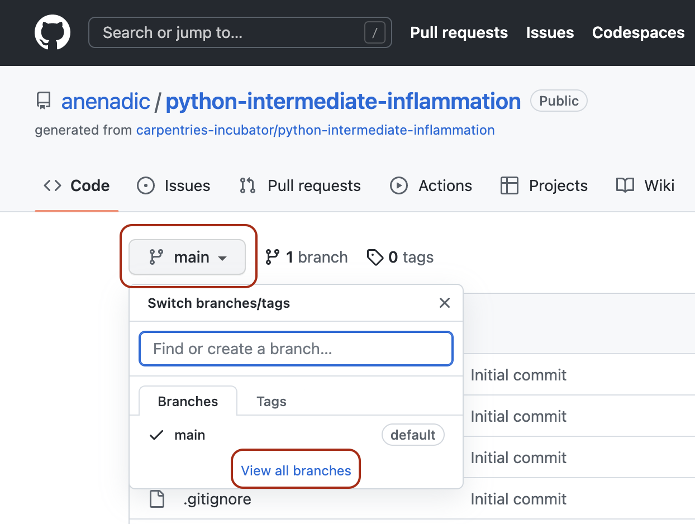

## Introduction

So far in this course we’ve focused on learning software design
and (some) technical practices, tools and infrastructure that
help the development of software in a team environment, but in an individual setting.
Despite developing tests to check our code - no one else from the team had a look at our code
before we merged it into the main development stream.
Software is often designed and built as part of a team,
so in this episode we'll be looking at how to manage the process of team software development
and improve our code by engaging in code review process with other team members.

> ## Collaborative Code Development Models
> The way your team provides contributions to the shared codebase depends on
> the type of development model you use in your project.
> Two commonly used models are:
>
> - **fork and pull model** -
>   where anyone can **fork** an existing repository
>   (to create their copy of the project linked to the source)
>   and push changes to their personal fork.
>   A contributor can work independently on their own fork as they do not need
>   permissions on the source repository to push modifications to a fork they own.
>   The changes from contributors can then be **pulled** into the source repository
>   by the project maintainer on request and after a code review process.
>   This model is popular with open source projects as it
>   reduces the start up costs for new contributors
>   and allows them to work independently without upfront coordination
>   with source project maintainers.
>   So, for example, you may use this model when you are an external collaborator on a project
>   rather than a core team member.
> - **shared repository model** -
>   where collaborators are granted push access to a single shared code repository.
>   Even though collaborators have write access to the main development and production branches,
>   the best practice of creating feature branches for new developments
>   and when changes need to be made is still followed.
>   This is to enable easier testing of the new code
>   and initiate code review and general discussion about a set of changes
>   before they are merged into the development branch.
>   This model is more prevalent with teams and organisations collaborating on private projects.
{: .callout}

Regardless of the collaborative code development model you and your collaborators use -
code reviews are one of the widely accepted best practices for software development in teams
and something you should adopt in your development process too.

## Code Review

[Code review][code-review] is a software quality assurance practice
where one or several people from the team (different from the code's author)
check the software by viewing parts of its source code.

Code review is one of the most useful team code development practices -
someone checks your design or code for errors, they get to learn from your solution,
having to explain code to someone else clarifies
your rationale and design decisions in your mind too,
and collaboration helps to improve the overall team software development process.
It is universally applicable throughout the software development cycle -
from design to development to maintenance.
According to Michael Fagan, the author of the
[code inspection technique](https://en.wikipedia.org/wiki/Fagan_inspection),
rigorous inspections can remove 60-90% of errors from the code
even before the first tests are run ([Fagan, 1976](https://doi.org/10.1147%2Fsj.153.0182)).
Furthermore, according to Fagan,
the cost to remedy a defect in the early (design) stage is 10 to 100 times less compared to
fixing the same defect in the development and maintenance stages, respectively.
Since the cost of bug fixes grows in orders of magnitude throughout the software lifecycle,
it is far more efficient to find and fix defects
as close as possible to the point where they were introduced.

We will have a look at the **tool-assisted code review process**
using GitHub's built-in code review tool - **pull requests**.
It is a lightweight tool, included with GitHub's core service for free
and has gained popularity within the software development community in recent years.

## Code Reviews via GitHub's Pull Requests

Pull requests are fundamental to how teams review and improve code
on GitHub (and similar code sharing platforms) -
they let you tell others about changes you've pushed to a branch in a repository on GitHub
and that your code is ready for review.
Once a pull request is opened,
you can discuss and review the potential changes with others on the team
and add follow-up commits based on the feedback
before your changes are merged from your feature branch into the `develop` branch.
The name 'pull request' suggests you are **requesting** the codebase moderators
to **pull** your changes into the codebase.

Such changes are normally done on a feature branch,
to ensure that they are separate and self-contained,
that the main branch only contains "production-ready" work,
and that the `develop` branch contains code that has already been extensively tested.
You create a branch for your work based on one of the existing branches
(typically the `develop` branch but can be any other branch),
do some commits on that branch,
and, once you are ready to merge your changes,
create a pull request to bring the changes back to the branch that you started from.
In this context, the branch from which you branched off to do your work
and where the changes should be applied back to
is called the **base branch**,
while the feature branch that contains changes you would like to be applied is the **head branch**.

How you create your feature branches and open pull requests in GitHub will depend on
your collaborative code development model:

- In the shared repository model,
  in order to create a feature branch and open a pull request based on it
  you must have write access to the source repository or,
  for organisation-owned repositories,
  you must be a member of the organisation that owns the repository.
  Once you have access to the repository,
  you proceed to create a feature branch on that repository directly.
- In the fork and pull model,
  where you do not have write permissions to the source repository,
  you need to fork the repository first
  before you create a feature branch (in your fork) to base your pull request on.

In both development models,
it is recommended to create a feature branch for your work and the subsequent pull request,
even though you can submit pull requests from any branch or commit.
This is because, with a feature branch,
you can push follow-up commits as a response to feedback
and update your proposed changes within a self-contained bundle.
The only difference in creating a pull request between the two models is
how you create the feature branch.
In either model, once you are ready to merge your changes in -
you will need to specify the base branch and the head branch.

## Code Review and Pull Requests In Action

Let's see this in action -
you and your fellow learners are going to be organised in small teams
and assume to be collaborating in the shared repository model.
You will be added as a collaborator to another team member's repository
(which becomes the shared repository in this context)
and, likewise, you will add other team members as collaborators on your repository.
You can form teams of two and work on each other's repositories.
If there are 3 members in your group you can go in a round robin fashion
(the first team member does a pull request on the second member's repository
and receives a pull request on their repository from the third team member).
If you are going through the material on your own and do not have a collaborator,
you can do pull requests on your own repository from one to another branch.

Recall [solution requirements SR1.1.1 and SR1.2.1](../31-software-requirements/index.html#solution-requirements)
from an earlier episode.
Your team member has implemented one of them according to the specification
(let's call it `feature-x`)
but tests are still missing.
You are now tasked with implementing tests on top of that existing implementation
to make sure the new feature indeed satisfies the requirements.
You will propose changes to their repository
(the shared repository in this context)
via pull request (acting as the code author)
and engage in code review with your team member (acting as a code reviewer).
Similarly, you will receive a pull request on your repository from another team member,
in which case the roles will be reversed.
The following diagram depicts the branches that you should have in the repository.

{: .image-with-shadow width="800px"}

Adapted from <a href="https://sillevl.gitbooks.io/git/content/collaboration/workflows/gitflow/" target="_blank">Git Tutorial by sillevl</a> (Creative Commons Attribution 4.0 International License)

### Raising a pull request

When you have finished adding your tests
and committed the changes to your local `feature-x-tests`,
and are ready for the others in the team to review them,
you have to do the following:

1. Push your local feature branch `feature-x-tests` remotely to the shared repository.
   ~~~
   $ git push -u origin feature-x-tests
   ~~~
   {: .language-bash}
2. Head over to the remote repository in GitHub
   and locate your new (`feature-x-tests`) branch from the dropdown box on the Code tab
   (you can search for your branch or use the "View all branches" option).
   {: .image-with-shadow width="600px"}
3. Open a pull request by clicking "Compare & pull request" button.
   {: .image-with-shadow width="900px"}
4. Select the base and the head branch, e.g. `feature-x` and `feature-x-tests`, respectively.
   Recall that the base branch is where you want your changes to be merged
   and the head branch contains your changes.
5. Add a comment describing the nature of the changes,
   and then submit the pull request.
6. Repository moderator and other collaborators on the repository (code reviewers)
   will be notified of your pull request by GitHub.
7. At this point, the code review process is initiated.

You should receive a similar pull request from other team members on your repository.

### Things to look for in a code review

Reviewing code effectively takes practise. However, here is some guidance on the
kinds of things you should be looking for when reviewing a piece of code.

Start by understanding what the code _should_ do, by reading the specification/user requriement,
the pull request description and talking to the developer.

Once you're happy, start reading the code (skip any tests for now). You're
going to be assessing the code in 4 key areas:

* Is the code readable
* Is the code a minimal change
* Is the structure of the code clear
* Is there appropriate and up-to-date documentation

#### Is the code readable

Think about do the names of the variables, do they [follow guidelines for good
names?](../15-coding-conventions/index.html#l#naming-conventions)

Do you understand what conditions in if statements are for?

#### Is the code a minimal change

Does the code reimplement anything that already exists, either
elsewhere in the codebase or in a library you know about?

Does the code implement something that isn't on the ticket?

#### Is the structure of the code clear

Do functions do just one thing? Have appropriate design
patterns been used (e.g. separating out the model logic from
any view considerations)?

#### Is there appropriate and up-to-date documentation

If functionality has changed, has corresponding documentation been
updated. If new functions have been added, do they have appropriate
levels of documentation. Does the documentation make sense?

Are there clear and useful comments that explain complex designs
and focus on the "why/because" rather than the "what/how"?

### Effective comments

Make sure your comments are specific and actionable.

Try to be as specific as you can, rather than "this code is unclear"
prefer, "I don't understand what values this variable can hold".

Make it clear in the comment if you want something to change as part
of this PR. Ideally provide an idea (e.g. better variable name).

> ## Exercise: review some code
>
> Pick someone else in the group and go to the pull request they created.
> Review the code, looking for the kinds of problems that we have just discussed.
> There are examples of all the 4 main areas in the pull request,
> so try to make at least one suggestion for each area.
>
>> ## Solution
>>
>> Here are some of the things you might have found were wrong with the code:
>>
>> **Is the code readable**
>>
>> * Unclear function name `s_dev` - uses an uncommon abbreviation increasing mental load
>>    when reading code that calls this function, prefer `standard_deviation`.
>> * Variable `number` not clear what it contains - prefer buiness name like `mean` or `mean_of_data`
>>
>> **Is the code minimal**
>>
>> * Could have used `np.std` to compute standard deviation of data without having to reimplement
>>   from scratch.
>>
>> **Does the code have a clean structure**
>>
>> * Have the function return the data, rather than having the graph name (a view layer consideration)
>>    leak into the model code.
>>
>> **Is the documentation up to date and correct**
>>
>> * The docs say it returns the standard deviation, but it actually returns a dictionary containing
>>    the standard deviation.
> {: .solution}
{: .challenge}

### Making sure code is valid

The other key thing you want to verify in code review is that the code is correct and
well tested. One approach to do this is to build up a list of tests you expect to see
(and the results you'd expect them to have), and then verify that all these tests are
present and correct.

Start by listing out all the tests you'd expect to see based on the specification.

As you are going through the code, add to this list with any more tests you think
of, making sure to add tests for:

* All paths through the code.
* Making each if statement be evaluated as `True` and `False`.
* All loops are exercised with empty, single and multi-element sequences.
* Edge cases that you spot.
* Any code that you're not sure how it behaves under certain circumstances.

Once you have built the list, go through the tests in the PR. Make sure
the tests test what you expect (so inspect them closely!). Add a comment
to the PR for any tests that are on your list that you can't find a suitable
test in the PR for.

> ## Exercise: review the code for suitable tests
>
> Remind yourself of the specification of UR1.1.1 and write a list of
> tests you'd expect to see for this feature. Review the code again and
> expand this list to include any other edge cases the code makes you think
> of. Finally, go through the tests in the PR and work out which tests are present.
> Request changes for any tests that you think are missing.
>
>> ## Solution
>>
>> Your list might include the following:
>>
>> 1. Standard deviation for one patient with multiple observations.
>> 2. Standard deviation for two patients.
>> 3. Graph includes a standard deviation graph.
>> 4. Standard deviation function should raise an error if given empty data.
>> 5. Computing standard deviation where deviation is different from variance.
>> 6. Standard deviation function should give correct result given negative inputs.
>> 7. Function should work with numpy arrays
>>
>> Looking at the tests in the PR, you might be content that tests for 1, 4 and 7 are present
>> so you would request changes to add tests 2, 3, 5 and 6.
>>
>> In looking at the test you hopefully noticed that the test for numpy arrays is currently
>> spuriously passing as it does not use the return value from the function in the assert.
>>
>> You may have spotted that the function actually computes the variance rather than
>> the standard deviation. Perhaps that is even what made you think to add the test
>> for some data where the variance and standard deviation are different.
>> In more complex examples, it is often easier to spot code that looks like it could  be wrong
>> and think of a test that will exercise it. This saves embarrassment if the code turns out
>> to be right, means you have the missing test written if it is wrong, and is often quicker
>> than trying to execute the code in your head to find out if it is correct.
>>
> {: .solution}
{: .challenge}

### What not to look for

The overriding priority for reviewing code should be making sure progress is being made -
don't let perfect be the enemy of good here. Further, research has shown that the first hour
of reviewing code is the most effective, with diminishing returns after that.

To that end, here are a few things you shouldn't be trying to spot when reviewing:

#### Linting issues, or anything else that an automated tool can spot

Get the CI to do this - this will save the reviewer time, be more accurate
and avoid needless conflict.

#### Bugs

It is easier to make sure there are sufficient tests - you are not an accurate
computer simulator anyway.

#### Issues that pre-date the change

You may spot something that the reviewer didn't introduce and think they could
fix it while in the area, but this can be a rabbit hole. A better approach would be to
raise a PR after this one has been merged fixing the thing you spotted.

### Responding to review comments

When you receive comments on your review, there are a few different things that you will want
to do.

With some, you will understand and agree with what the reviewer is saying. With these comments,
you should make the change to your code on your branch. Once you've made the change you can
commit it. It might be helpful to add a thumbs up reaction to the comment, so the reviewer knows
you have addressed it.

TODO: screenshot of adding a emoji reaction.

With some, the comment might not make total sense. You can reply to comments for clarification.

TODO: screenshot of adding a comment.

However, if you disagree, or are really lost on what they are driving it, it will be best to
talk to them in person. Discussions done on code reviews can often feel quite adversarial -
discussing what the best solution is in person can often defuse this.

> ## Exercise: responding and addressing comments
>
> Look at the PR that you created on your repo, that should now have someone elses comments
> on it.
> For each comment, either reply explaining why you don't think the change is necessary
> or make the change and push a commit fixing it. You can reply to the comment indicating you
> have done it.
>
> At the same time, people will be addressing your comments. If you're happy that your
> comment has been suitably addressed, you can mark it as resolved. Once you're happy they
> have all been addressed, you can approve the PR.
{: .challenge}

#### Step 6: Closing a Pull Request

1. Once the moderator approves your changes, either one of you can merge onto the base branch.
   Typically, it is the responsibility of the code's author to do the merge
   but this may differ from team to team.
   {: .image-with-shadow width="900px"}
2. Delete the merged branch to reduce the clutter in the repository.

Repeat the above actions for the pull request you received.

If the work on the feature branch is completed and it is sufficiently tested,
the feature branch can now be merged into the `develop` branch.

## Best Practice for Code Review

There are multiple perspectives to a code review process -
from general practices to technical details relating to different roles involved in the process.
It is critical for the code's quality, stability and maintainability
that the team decides on this process and sticks to it.
Here are some examples of best practices for you to consider
(also check these useful code review blogs from [
Swarmia](https://www.swarmia.com/blog/a-complete-guide-to-code-reviews/?utm_term=code%20review&utm_campaign=Code+review+best+practices&utm_source=adwords&utm_medium=ppc&hsa_acc=6644081770&hsa_cam=14940336179&hsa_grp=131344939434&hsa_ad=552679672005&hsa_src=g&hsa_tgt=kwd-17740433&hsa_kw=code%20review&hsa_mt=b&hsa_net=adwords&hsa_ver=3&gclid=Cj0KCQiAw9qOBhC-ARIsAG-rdn7_nhMMyE7aeSzosRRqZ52vafBOyMrpL4Ypru0PHWK4Rl8QLIhkeA0aAsxqEALw_wcB)
and [Smartbear](https://smartbear.com/learn/code-review/best-practices-for-peer-code-review/)):

2. Do not review code too quickly and do not review for too long in one sitting.
   According to
   [“Best Kept Secrets of Peer Code Review” (Cohen, 2006)](https://www.amazon.co.uk/Best-Kept-Secrets-Peer-Review/dp/1599160676) -
   the first hour of review matters the most as
   detection of defects significantly drops after this period.
   [Studies into code review](https://smartbear.com/resources/ebooks/the-state-of-code-review-2020-report/)
   also show that you should not review more than 400 lines of code at a time.
   Conducting more frequent shorter reviews seems to be more effective.
3. Decide on the level of depth for code reviews
   to maintain the balance between the creation time and time spent reviewing code -
   e.g. reserve them for critical portions of code and avoid nit-picking on small details.
   Try using automated checks and linters when possible,
   e.g. for consistent usage of certain terminology across the code and code styles.
7. Utilise multiple code review techniques -
   use email,
   pair programming,
   over-the-shoulder,
   team discussions and
   tool-assisted or
   any combination that works for your team.
   However, for the most effective and efficient code reviews,
   tool-assisted process is recommended.
9. From a more technical perspective:
   - use a feature branch for pull requests as you can push follow-up commits
     if you need to update your proposed changes
   - avoid large pull requests as they are more difficult to review.
     You can refer to some [studies](https://jserd.springeropen.com/articles/10.1186/s40411-018-0058-0)
     and [Google recommendations](https://google.github.io/eng-practices/review/developer/small-cls.html)
     as to what a "large pull request" is but be aware that it is not exact science.
   - don't force push to a pull request as it changes the repository history
     and can corrupt your pull request for other collaborators
   - use pull request states in GitHub effectively (based on your team's code review process) -
     e.g. in GitHub you can open a pull request in a `DRAFT` state
     to show progress or request early feedback;
     `READY FOR REVIEW` when you are ready for feedback;
     `CHANGES REQUESTED` to let the author know
     they need to fix the requested changes or discuss more;
     `APPROVED` to let the author they can merge their pull request.

## Making code easy to review

There are a few things you can do when raising a pull request to make it
as easy as possible for the reviewer to review your code:

The most important thing to keep in mind is how long your pull request is. Smaller
changes, that just make one small improvement, will be much quicker and easier to
review. There is no golden rule, but 100 - 500 lines is a good size. More than
1000 lines is almost certainly too big.

Even within a single review, try to keep each commit to be making one logical change.
This can help if your review would otherwise be too large. In particular, if you've
reformatted, refactored and changed the behavior of the code make sure each of these
is in a separate commit (i.e reformat the code, commit, refactor the code, commit, alter
the behavior of the code, commit).

Make sure you write a clear description of the content and purpose of the change.
This should be provided as the pull request description.
This should provide the context that reading the code will make more sense.

It is also a good idea to review your code yourself. In doing this you will spot
the more obvious issues with your code, allowing your reviewer to focus on the
things you cannot spot.

## Empathy in review comments

Code is written by humans (mostly!), and code review is a form of communication. As such
empathy is really important for effective reviewing.

When reviewing code, it can be sometimes frustrating when code is confusing, particularly
as it will be implemented differently to how you would have done it. However, it is important
as a reviewer to be compassionate to the person whose code you are reviewing. Specifically:

* Identify positives in code as and when you find them (particularly if it is an improvement on
something you've previously fed back on in a previous review).
* Remember different doesn't mean better - only request changes if the code is wrong or hard to understand.
* Limit the number of non-critical suggestions to a few - you are aiming for better rather than perfect.
* Ask questions to understand why something has been done a certain way rather than assuming you
know a better way.
* If a conversation is taking place on a review and hasn't been resolved by a
single back-and-forth exchange, then schedule a conversation to discuss instead
(recording the result on the PR).

## Designing a review process

Considerations on how to design an effective code review process for your team.

> ## Exercise: Code Review in Your Own Working Environment
>
> At the start of this episode we briefly looked at a number of techniques for doing code review,
> and as an example,
> went on to see how we can use GitHub Pull Requests to review team member code changes.
> Finally, we also looked at some best practices for doing code reviews in general.
>
> Now think about how you typically develop code,
> and how you might institute code review practices within your own working environment.
> Write down briefly for your own reference (perhaps using bullet points)
> some answers to the following questions:
>
> - Which 2 or 3 key circumstances would code review be most useful for you and your colleagues?
> - Referring to the first section of this episode above,
>   which type of code review would be most useful for each circumstance
>   (and would work best within your own working environment)?
> - Taking one of these circumstances where code review would be most beneficial,
>   how would you organise such a code review, e.g.:
>   - Which aspects of the codebase would be the most useful to cover?
>   - How often would you do them?
>   - How long would the activity take?
>   - Who would ideally be involved?
>   - Any particular practices you would use?
{: .challenge}


