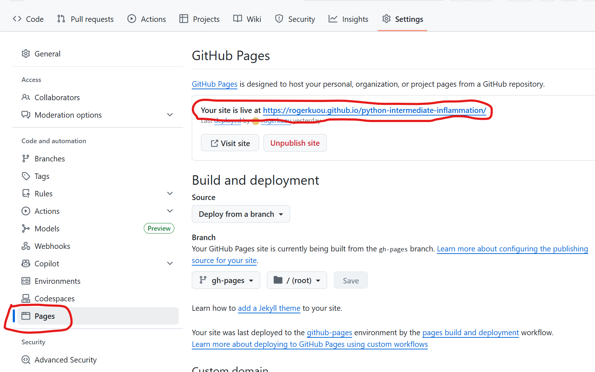
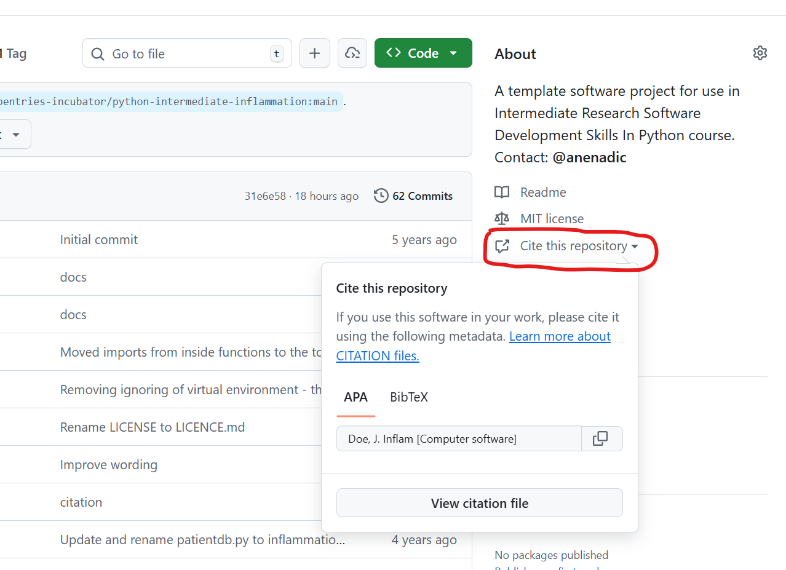

::::::::::::::::::::::::::::::::::::::: objectives

- Describe the different levels of software reusability
- Explain why documentation is important
- Describe the minimum components of software documentation to aid reuse
- Create a repository README file to guide others to successfully reuse a program
- Understand other documentation components and where they are useful
- Describe the basic types of open source software licence
- Explain the importance of conforming to data policy and regulation

::::::::::::::::::::::::::::::::::::::::::::::::::

:::::::::::::::::::::::::::::::::::::::: questions

- What can we do to make our programs reusable by others?
- How should we document our code?
- How to make our code citable?
- How to centralize the configuration of our Python project?
- How to add a proper licence to our code? 

::::::::::::::::::::::::::::::::::::::::::::::::::

## Introduction

In previous episodes we have looked at skills, practices, and tools to help us
design and develop software in a collaborative environment.
In this lesson we will be looking at
a critical piece of the development puzzle that builds on what we have learnt so far -
sharing our software with others.

## The Levels of Software Reusability - Good Practice Revisited

Let us begin by taking a closer look at software reusability and what we want from it.

Firstly, whilst we want to ensure our software is reusable by others, as well as ourselves,
we should be clear what we mean by 'reusable'.
There are a number of definitions out there,
but a helpful one written by [Benureau and Rougler in 2017](https://dx.doi.org/10.3389/fninf.2017.00069)
offers the following levels by which software can be characterised:

1. Re-runnable: the code is simply executable
  and can be run again (but there are no guarantees beyond that)
2. Repeatable: the software will produce the same result more than once
3. Reproducible: published research results generated from the same version of the software
  can be generated again from the same input data
4. Reusable: easy to use, understand, and modify
5. Replicable: the software can act as an available reference
  for any ambiguity in the algorithmic descriptions made in the published article.
  That is, a new implementation can be created from the descriptions in the article
  that provide the same results as the original implementation,
  and that the original - or reference - implementation,
  can be used to clarify any ambiguity in those descriptions for the purposes of reimplementation

Later levels imply the earlier ones.
So what should we aim for?
As researchers who develop software - or developers who write research software -
we should be aiming for at least the fourth one: reusability.
Reproducibility is required if we are to successfully claim that
what we are doing when we write software fits within acceptable scientific practice,
but it is also crucial that we can write software that can be *understood*
and ideally *modified* by others.
If others are unable to verify that a piece of software follows published algorithms,
how can they be certain it is producing correct results?
Where 'others', of course, can include a future version of ourselves.

::::::::::::::::::::::::::::::::::::::::: callout

**Work on a branch**

In the previous episode, we updated the `develop` branch with a new feature.
In this episode we will continue working on the reusability of our code.
To do this, we will create a branch called `improve-reusability` from the `develop` branch:

```bash
$ git switch develop
$ git switch -c improve-reusability
```

At the end of this episode, we will merge this branch back into `develop`.

:::::::::::::::::::::::::::::::::::::::::

## Documenting Code to Improve Reusability

Reproducibility is a cornerstone of science,
and scientists who work in many disciplines are expected to document
the processes by which they have conducted their research so it can be reproduced by others.
In medicinal, pharmacological, and similar research fields for example,
researchers use logbooks which are then used to write up protocols and methods for publication.

Many things we have covered so far contribute directly to making our software
reproducible - and indeed reusable - by others.
A key part of this we will cover now is software documentation,
which is ironically very often given short shrift in academia.
This is often the case even in fields where
the documentation and publication of research method is otherwise taken very seriously.

A few reasons for this are that writing documentation is often considered:

- A low priority compared to actual research (if it is even considered at all)
- Expensive in terms of effort, with little reward
- Writing documentation is boring!

A very useful form of documentation for understanding our code is code commenting,
and is most effective when used to explain complex interfaces or behaviour,
or the reasoning behind why something is coded a certain way.
But code comments only go so far.

Whilst it is certainly arguable that writing documentation is not as exciting as writing code,
it does not have to be expensive and brings many benefits.
In addition to enabling general reproducibility by others, documentation...

- Helps bring new staff researchers and developers up to speed quickly with using the software
- Functions as a great aid to research collaborations involving software,
  where those from other teams need to use it
- When well written, can act as a basis for detailing
  algorithms and other mechanisms in research papers,
  such that the software's functionality can be *replicated* and re-implemented elsewhere
- Provides a descriptive link back to the science that underlies it.
  As a reference, it makes it far easier to know how to
  update the software as the scientific theory changes (and potentially vice versa)
- Importantly, it can enable others to understand the software sufficiently to
  *modify and reuse* it to do different things

In the next section we will see that writing
a sensible minimum set of documentation in a single document does not have to be expensive,
and can greatly aid reproducibility.

### Writing a README

A README file is the first piece of documentation
(perhaps other than publications that refer to it)
that people should read to acquaint themselves with the software.
It concisely explains what the software is about and what it is for,
and covers the steps necessary to obtain and install the software
and use it to accomplish basic tasks.
Think of it not as a comprehensive reference of all functionality,
but more a short tutorial with links to further information -
hence it should contain brief explanations and be focused on instructional steps.

Our repository already has a README that describes the purpose of the repository for this workshop,
but let us replace it with a new one that describes the software itself.
First let us delete the old one:

```bash
$ rm README.md
```

In the root of your repository create a replacement `README.md` file.
The `.md` indicates this is a **Markdown** file,
a lightweight markup language which is basically a text file with
some extra syntax to provide ways of formatting them.
A big advantage of them is that they can be read as plain-text files
or as source files for rendering them with formatting structures,
and are very quick to write.
GitHub provides a very useful [guide to writing Markdown][github-markdown] for its repositories.

Let us start writing `README.md` using a text editor of your choice and add the following line.

```markdown
# Inflam
```

So here, we are giving our software a name.
Ideally something unique, short, snappy, and perhaps to some degree an indicator of what it does.
We would ideally rename the repository to reflect the new name, but let us leave that for now.
In Markdown, the `#` designates a heading, two `##` are used for a subheading, and so on.
The Software Sustainability Institute's
[guide on naming projects][ssi-choosing-name]
and products provides some helpful pointers.

We should also add a short description underneath the title.

```markdown
# Inflam
Inflam is a data management system written in Python that manages trial data used in clinical inflammation studies.
```

To give readers an idea of the software's capabilities, let us add some key features next:

```markdown
# Inflam
Inflam is a data management system written in Python that manages trial data used in clinical inflammation studies.

## Main features
Here are some key features of Inflam:

- Provide basic statistical analyses over clinical trial data
- Ability to work on trial data in Comma-Separated Value (CSV) format
- Generate plots of trial data
- Analytical functions and views can be easily extended based on its Model-View-Controller architecture
```

As well as knowing what the software aims to do and its key features,
it is very important to specify what other software and related dependencies
are needed to use the software (typically called `dependencies` or `prerequisites`):

```markdown
# Inflam
Inflam is a data management system written in Python that manages trial data used in clinical inflammation studies.

## Main features
Here are some key features of Inflam:

- Provide basic statistical analyses over clinical trial data
- Ability to work on trial data in Comma-Separated Value (CSV) format
- Generate plots of trial data
- Analytical functions and views can be easily extended based on its Model-View-Controller architecture

## Prerequisites
Inflam requires the following Python packages:

- [NumPy](https://www.numpy.org/) - makes use of NumPy's statistical functions
- [Matplotlib](https://matplotlib.org/stable/index.html) - uses Matplotlib to generate statistical plots

The following optional packages are required to run Inflam's unit tests:

- [pytest](https://docs.pytest.org/en/stable/) - Inflam's unit tests are written using pytest
- [pytest-cov](https://pypi.org/project/pytest-cov/) - Adds test coverage stats to unit testing
```

Here we are making use of Markdown links,
with some text describing the link within `[]` followed by the link itself within `()`.

One really neat feature - and a common practice - of using many CI infrastructures is that
we can include the status of running recent tests within our README file.
Just below the `# Inflam` title on our README.md file,
add the following (replacing `<your_github_username>` with your own:

```markdown
# Inflam

...
```

This will embed a *badge* (icon) at the top of our page that
reflects the most recent GitHub Actions build status of your software repository,
essentially showing whether the tests that were run
when the last change was made to the `main` branch succeeded or failed.

That's got us started with documenting our code,
but there are other aspects we should also cover:

- *Installation/deployment:* step-by-step instructions for setting up the software so it can be used
- *Basic usage:* step-by-step instructions that cover using the software to accomplish basic tasks
- *Contributing:* for those wishing to contribute to the software's development,
  this is an opportunity to detail what kinds of contribution are sought and how to get involved
- *Contact information/getting help:* which may include things like key author email addresses,
  and links to mailing lists and other resources
- *Credits/acknowledgements:* where appropriate, be sure to credit those who
  have helped in the software's development or inspired it
- *Citation:* particularly for academic software,
  it is a very good idea to specify a reference to an appropriate academic publication
  so other academics can cite use of the software in their own publications and media.
  You can do this within a separate
  [CITATION text file](https://github.com/citation-file-format/citation-file-format)
  within the repository's root directory and link to it from the Markdown
- *Licence:* a short description of and link to the software's licence

For more verbose sections,
there are usually just highlights in the README with links to further information,
which may be held within other Markdown files within the repository or elsewhere.

We will finish these off later.
See [Matias Singer's curated list of awesome READMEs](https://github.com/matiassingers/awesome-readme) for inspiration.

### Generating and deploying documentation using MKDocs

[MKDocs](https://www.mkdocs.org/) generates project documentation as a static website from Markdown files. The website can then be hosted on GitHub Pages or other static site hosting services, providing a user-friendly interface for accessing the documentation.

We can install MKDocs package using `pip`. Here we also install a plugin `mkdocstrings`, which will be used later.
We advise you to do this within a virtual environment you created before:

```bash
python3 -m pip install mkdocs mkdocstrings[python]
```

By default, `mkdocstrings` does not provide support for a specific language. Therefore, we specify `[python]` to install extra dependencies of `mkdocstrings` for Python language support.

After installation, you can intialize a new MKDocs project in our Python project:

```bash
python3 -m mkdocs new .
```

This will create two files in your project: `mkdocs.yml` and `docs/index.md`. The first file `mkdocs.yml` is the configuration file for your documentation site. It serves as the central configuration hub for your MKDocs documentation. It tells MKDocs how to structure your documentation site, which plugins and themes to use,
how to organize navigation, etc.

`docs/index.md` is the main page of your documentation. It is usually the landing page of your documentation site.

Let's first look at the `mkdocs.yml` file. It is almost empty now. We can edit it with the following basic configurations:

```yaml
site_name: Inflam

nav:
  - Overview: index.md

plugins:
  - search
  - mkdocstrings
```

Here we give a name to our documentation site, `Inflam`. We set up the navigation menu with one item `Overview` that links to `index.md`. We also enable two plugins, `search` to provide search functionality in the documentation site, and `mkdocstrings` to automatically generate API reference documentation from Python docstrings, which we will see later.

We can try to render the documentation site locally and see how it looks like:

```bash
python3 -m mkdocs serve
```

This will start to build a local static documentation site and serve it at a local web server. 
By default, it will be available at `http://127.0.0.1:8000/`, which will also show in the terminal output.
You can open this URL in your web browser to view the documentation site.

The documentation site now consists of some default content about MKDocs. It is rendered from the `docs/index.md` file. Let's edit this file to add some relevant content about our project. For simplicity, we can borrow the content from our `README.md` file.

::::::::::::::::::::::::::::::::: challenge

### Exercise: Update Documentation Content

Modify `docs/index.md` with the same content as your `README.md` file.
Render the documentation site locally again with `mkdocs serve`.
Check how it looks like in your web browser.

:::::::::::::::::::::::::::::::::

You can also add more pages to your documentation site by creating more Markdown files in the `docs/` directory, and update the `nav` section in `mkdocs.yml` to include these new pages. For example, we can create a new page for API (Application Programming Interface) reference documentation.

An API reference documents the functions, classes, and methods provided by your software, along with their parameters, return values, and usage examples. This is particularly useful for understanding how to interact with your code programmatically. With `mkdocs` and `mkdocstrings` plugin, we can automatically generate API reference documentation from the docstrings in our Python code.

Let's first create `docs/API.md` with the following content:

```markdown
# API Reference

:::inflammation.models
```

Apart from the title, there is only one line `:::inflammation.models` in this file. This is a special syntax provided by the `mkdocstrings` plugin to indicate that we want to generate API documentation for the `inflammation.models` module. The plugin will parse the docstrings in this module and generate the corresponding documentation.

Now we can call `mkdocs serve` again to render the documentation site locally and check how the API reference page looks like.

Now we can see that all the functions defined in the `inflammation.models` module are automatically documented with their docstrings.

One can make the rendered API documentation more informative by improving the docstrings in the code. For example, we can improve the docstring of the `load_csv` function by following the `numpy` style docstring format. Let's update the doctring of `load_csv` as below:

```python
def load_csv(filename: str) -> np.ndarray:
"""Load a Numpy array from csv

    Parameters
    ----------
    filename : str
        path to the csv file

    Returns
    -------
    np.ndarray
        2D array of inflammation data
"""
```

And also configure `mkdocs.yml` to use `numpy` style docstring format for `mkdocstrings` plugin:

```yaml
site_name: Inflam

nav:
  - Overview: index.md
  - API Reference: api.md

plugins:
  - search
  - mkdocstrings:
      handlers:
        python:
          options:
            docstring_style: numpy
```

Then we can render the documentation site locally again with `mkdocs serve`, the input parameters and return values of the `load_csv` function are now nicely formatted in a table.


Once you are happy with the documentation site, you can deploy it to GitHub Pages so that others can access it online. First, let's commit the changes we made to the repository:

```bash
git add inflammation/models.py mkdocs.yml docs/
git commit -m "Add documentation with MKDocs"
```

To deploy the documentation to GitHub Pages, you can use the following command:
```bash
mkdocs gh-deploy
```

This command assumes you have access to the GitHub repository of the current project. It will automatically create a new branch called `gh-pages` in your repository, which will contain the static files of your documentation site, and push this branch to GitHub. 

{alt='GitHub Pages settings details' .image-with-shadow width="800px"}

Now go check your repository's GitHub Pages "Settings -> Pages", you should see the link to your documentation site, which should be like: `https://<github_user_id>.github.io/python-intermediate-inflammation/`. You can add this link to your GitHub repository landing page description.


::::::::::::::::::::::::::::::::::::::::: callout

**Deploy documentation with GitHub actions**

It is also possible to automate the deployment of documentation site using GitHub Actions. 

Below is an example of GitHub Actions workflow file to deploy the documentation site whenever there is a push to any branch in the repository. Note that a better practice is to only deploy the documentation when there is a update to the `main` branch, or when there is a new release.

```yaml
name: Deploy docs

on: [push]

jobs:
  build:
    name: Deploy docs
    runs-on: ubuntu-latest
    steps:
      - name: Checkout main
        uses: actions/checkout@v4
        with:
          fetch-depth: 0
      - name: Set up Python 3.9
        uses: actions/setup-python@v5
        with:
          python-version: "3.9"
      - name: Install dependencies
        run: |
          python -m pip install .[docs] 
      - name: Deploy docs
        run: mkdocs gh-deploy --force
```

:::::::::::::::::::::::::::::::::::::::::

### Thinking about the audience for your documentation

Besides the API documentation we added by MKDocs, there are many different types of documentation you should consider
writing and making available that's beyond the scope of this course.
The key is to consider which audiences you need to write for,
e.g. end users, developers, maintainers, etc.,
and what they need from the documentation.
There is a Software Sustainability Institute
[blog post on best practices for research software documentation](https://www.software.ac.uk/blog/2019-06-21-what-are-best-practices-research-software-documentation)
that helpfully covers the kinds of documentation to consider
and other effective ways to convey the same information.


## Configuring your code with `pyproject.toml`

[`pyproject.toml`](https://packaging.python.org/en/latest/guides/writing-pyproject-toml/) is a standardized configuration file, written in TOML format, used in Python projects to declare build system requirements, metadata, and tool configuration. It serves as a central place to manage various aspects of a Python project, making it easier to build, package, and distribute the project.

We can take a look at the current state of the `pyproject.toml` file in our project:

```toml
[build-system]
requires = ["setuptools"]
build-backend = "setuptools.build_meta"

[project]
name = "python-intermediate-inflammation"
version = "0.0.0"
requires-python = ">=3.9"

[tool.setuptools]
packages = ["inflammation"]
```

It defines three main sections of a Python project as three tables: 

- The `[build-system]` table allows you to declare which build backend you use and which other dependencies are needed to build your project.

- The `[project]` table, which specifies your project’s basic metadata, such as the project name, author name(s), dependencies, and more.

- The `[tool]` table has tool-specific subtables, e.g., `[tool.setuptools]`, the content of which is defined by each tool, allowing you to configure various aspects of the tool's behavior.

We can improve the `pyproject.toml` file by adding some metadata to our project. Let's update the `[project]` table as below:

```toml
[project]
name = "python-intermediate-inflammation"
version = "0.0.0"
requires-python = ">=3.9"
description = "A Python data management system that manages trial data used in clinical inflammation studies."
readme = "README.md"
```

Here we added a short description of our project and specified the README file. In practice, `pyproject.toml` can contain many other metadata fields as well as configuration for various tools. The [pyproject.toml documentation](https://packaging.python.org/en/latest/guides/writing-pyproject-toml/) provides more details. One advantage of using `pyproject.toml` is that it integrates with modern Python packaging tools like [`uv`](https://docs.astral.sh/uv/), which we will see in the next section about releasing our Python project.

Do not forget to commit the changes we made to `pyproject.toml` file.

```bash
git add pyproject.toml
git commit -m "Update pyproject.toml with dependencies"
```

## Make your code citable by adding a CITATION File

It is easy to correctly cite a paper: all the necessary information (metadata) can be found on the title page or the article website. 

Software and datasets have no title page, the relevant information is often less obvious. To get credit for your work, you should provide citation information for your software. 

A good way to add citation information is by including a [CITATION.cff](https://citation-file-format.github.io/) file (Citation File Format) in the root of your repository. This plain text file, written in YAML format, contains all the necessary citation details in a structured manner. 


{alt='CITATION.cff rendered on GitHub' .image-with-shadow width="600px"}

Platforms like GitHub, Zenodo, and Zotero reuse the citation metadata you provide. GitHub, for example, automatically renders the file on the repository landing page and provides a BibTeX snippet which users can simply copy! 

### Minimal example for a CITATION.cff file

```yaml
authors:
  - family-names: Doe
    given-names: John
cff-version: 1.2.0
message: "If you use this software, please cite it using the metadata from this file."
title: "Inflam"
```
We can also include other important information of software such as version, release date, DOI, license, keywords.

#### How to create a CITATION.cff file?

You can use the [cffinit](https://citation-file-format.github.io/cff-initializer-javascript/) tool to create a citation file. 

:::challenge
### Exercise: Create a CITATION.cff using cffinit
1. Follow [these steps to create a CITATION file with cffinit](https://book.the-turing-way.org/communication/citable/citable-cffinit).
1. Rename the created file to `CITATION.cff` and add it to the root folder of your repository.
1. Push your changes to feature branch and check your repository in GitHub. What has happened?
:::


## Choosing an Open Source Licence

Software licensing is a whole topic in itself, so we'll just summarise here.
Your institution's Intellectual Property (IP) team will be able to offer specific guidance that
fits the way your institution thinks about software.

In IP law, software is considered a creative work of literature,
so any code you write automatically has copyright protection applied.
This copyright will usually belong to the institution that employs you,
but this may be different for PhD students.
If you need to check,
this should be included in your employment/studentship contract
or talk to your university's IP team.

Since software is automatically under copyright, without a licence no one may:

- Copy it
- Distribute it
- Modify it
- Extend it
- Use it (actually unclear at present - this has not been properly tested in court yet)

Fundamentally there are two kinds of licence,
**Open Source licences** and **Proprietary licences**,
which serve slightly different purposes:

- *Proprietary licences* are designed to pass on limited rights to end users,
  and are most suitable if you want to commercialise your software.
  They tend to be customised to suit the requirements of the software
  and the institution to which it belongs -
  again your institutions IP team will be able to help here.
- *Open Source licences* are designed more to protect the rights of end users -
  they specifically grant permission to make modifications and redistribute the software to others.
  The [website Choose A License](https://choosealicense.com/) provides recommendations
  and a simple summary of some of the most common open source licences.

Within the open source licences, there are two categories, **copyleft** and **permissive**:

- The permissive licences such as MIT and the multiple variants of the BSD licence
  are designed to give maximum freedom to the end users of software.
  These licences allow the end user to do almost anything with the source code.
- The copyleft licences in the GPL still give a lot of freedom to the end users,
  but any code that they write based on GPLed code must also be licensed under the same licence.
  This gives the developer assurance that anyone building on their code is also
  contributing back to the community.
  It's actually a little more complicated than this,
  and the variants all have slightly different conditions and applicability,
  but this is the core of the licence.

Which of these types of licence you prefer is up to you and those you develop code with.
If you want more information, or help choosing a licence,
the [Choose An Open-Source Licence](https://choosealicense.com/)
or [tl;dr Legal](https://tldrlegal.com/) sites can help.


:::challenge
### Exercise: Add a Licence to Your Code
Select a licence for your code using the tool above. 
Replace the contents of the `LICENSE.md` file in your repository with the text of the licence you have chosen.
Push your changes to your feature branch and check your repository in GitHub. What has happened?
:::


## Conforming to Data Policy and Regulation

We may also wish to make data available to either
be used with the software or as generated results.
This may be via some means other than GitHub, such as Zenodo, Figshare, or an institutional repository.
An important aspect to remember with sharing data on such systems is that
they may reside in other countries,
and we must be careful depending on the nature of the data.

We need to ensure that we are still conforming to
the relevant policies and guidelines regarding how we manage research data,
which may include funding council,
institutional,
national,
and even international policies and laws.
Within Europe, for example, there is the need to conform to things like [GDPR][gdpr].
it is a very good idea to make yourself aware of these aspects.

## Merge your changes to the `main` branch

After completing all the changes to improve the reusability of your code, you can first merge your feature branch to the `devlop` branch. Then merge the `develop` branch to the `main` branch.

In the next Section, we will look at how to release your Python project from the `main` branch

:::::::::::::::::::::::::::::::::::::::: keypoints

- Add README file for general documentation about your software
- Use MKDocs to generate and deploy documentation site
- Use `pyproject.toml` to centralize configuration of your Python project
- Add `CITATION.cff` file to make your code citable
- Choose an `LICENSE` file to specify the open source licence of your code

::::::::::::::::::::::::::::::::::::::::::::::::::


