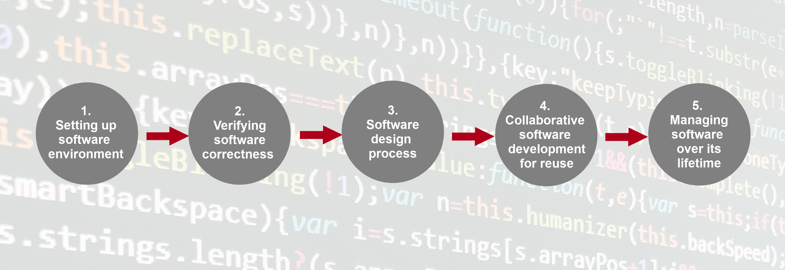
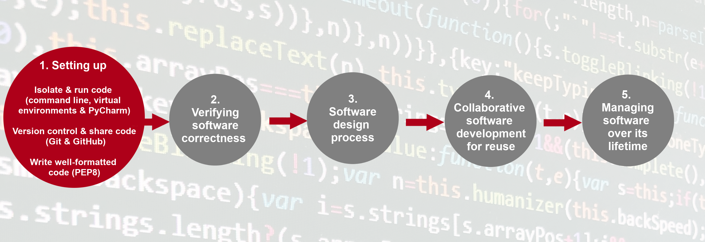
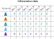
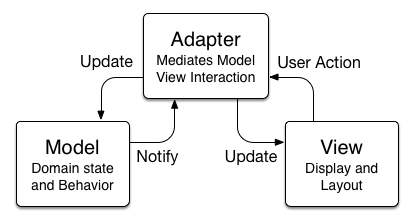
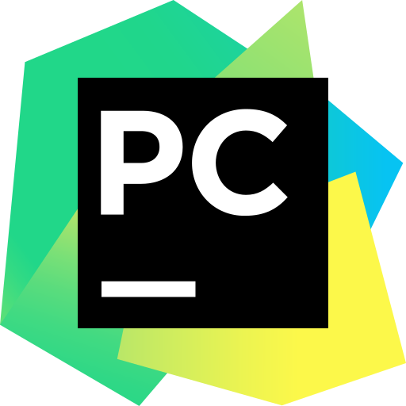

---
jupyter:
  celltoolbar: Slideshow
  jupytext:
    notebook_metadata_filter: -kernelspec,-jupytext.text_representation.jupytext_version,rise,celltoolbar
    text_representation:
      extension: .md
      format_name: markdown
      format_version: '1.3'
  rise:
    theme: solarized
---

<!-- #region slideshow={"slide_type": "slide"} -->
 
 # Intermediate Research Software Development in Python
<!-- #endregion -->

<!-- #region slideshow={"slide_type": "notes"} -->
## Setup

- As participants arrive, ask them about the installation of required software: Bash, Git, a GitHub account, Python with pip and venv
- Concurrently, send the link for the collaborative notes document and get them to sign the attendance list
- If you are recording the session, notify participants you will be doing so, and start recording
  - Breakout rooms are not recorded
<!-- #endregion -->

<!-- #region slideshow={"slide_type": "slide"} -->
## Setting the Scene

Why this course?

Have you ever thought:
- "there must be a better way to do this"
- "this software is getting in the way of my research"
- "why is it so difficult to get this program to run?"
- "this code is incomprehensible and really difficult to modify"
- "I screwed up my Python installation again and need to reinstall my OS"
<!-- #endregion -->

<!-- #region slideshow={"slide_type": "notes"} -->
- why this course and why are you here?
  - we have learned programming to do our research: it is a tool and a means to an end
  - likely we are mostly self-taught or have taken some intro courses
  - but we now find the techniques we have picked up to be inadequate for the software we need to write
  - single scripts no longer cut it and we are collaborating with more people, or have users for the software we are producing
  - you need some new skills and tools to tackle these problems
  
- You might have thought at some point (see questions on slide)

- If so, then you have come to the right place. The objective of this course is to deal with these struggles you might be facing by teaching some intermediate software engineering skills
  - just like maths, statistics, and physics theory, software engineering is a skill you need to continue to develop as a researcher
<!-- #endregion -->

<!-- #region slideshow={"slide_type": "subslide"} -->
### Intermediate Research Software Development

What you will be able to do at the end that should help your work:

- restructure existing code and design more robust software from scratch
- automate the process of testing and verifying software correctness 
- support collaborations with others in a way that mimics a typical collaborative software development process
- get you ready to distribute your code for use by others
<!-- #endregion -->

<!-- #region slideshow={"slide_type": "subslide"} -->
### PSA: This is a Collaborative Learning Session
<!-- #endregion -->

<!-- #region slideshow={"slide_type": "notes"} -->
- PSA: This is a Collaborative Learning Session
  - this is meant in two ways
  - I'll be doing a bit of instructing, but most of the learning will come from the many exercises and other activities that you will do in groups. This is the first aspect of collaboration.
  - Secondly, there will naturally be a variety of different backgrounds and levels of experience, and we the instructors and helpers should not be seen as the final authority on these matters. We have valuable experience to share, but so do you. Everyone here can and should contribute to this learning process, and this shouldn't be viewed as knowledge being imparted from your instructors on high; please speak up and get involved in the conversation.
<!-- #endregion -->

<!-- #region slideshow={"slide_type": "subslide"} -->
### Tools

- Python
- Integrated Development Environment: PyCharm or VS Code
- `pip` and `venv`
- GitHub
<!-- #endregion -->

<!-- #region slideshow={"slide_type": "notes"} -->
- This course has necessarily made some decisions about the tools used to demonstrate the concepts being taught
  - Python is used as a fairly ubiquitous and syntactically easy language; however, the point needs to be clear that this is not a course about Python; the course is about software engineering, and it is using Python as the playground to demonstrate the skills and concepts that should be valuable independent of the domain and language
  - to this end, I will be trying to draw connections with other languages and development scenarios when applicable since I know Python is not necessarily the main development language for everyone at UKAEA
  - Learners should have already been notified about the IDE selection and installation. If the instructor has decided to allow different editors, reiterate any caveats (e.g. happy for you to use these editors, but no guarantee that we can help you if you are stuck). At an intermediate level, it is likely learners already have exposure to a preferred IDE, so they can shoulder more of the responsibility for getting that to work.
  - GitHub is ubiquitous in software development, and a lot of research code ends up there. Other platforms are similar and so whatever is learnt here will be applicable.
- in the long run, you will encounter many more tools than those shown here, and you will form your own preferences; that is fine and we are in no way suggesting these are the definitive tools that should be used by any researcher who codes
<!-- #endregion -->

<!-- #region slideshow={"slide_type": "subslide"} -->
### Rules of Engagement

- Monitoring your status
  - self reporting
  - sporadic polls
- Questions at any time by raising hand ✋
- Some lecturing by instructor combined with independent study, exercises, and group activities
- Take a break whenever you need it ☕
<!-- #endregion -->

<!-- #region slideshow={"slide_type": "notes"} -->
- Rules of engagement
- Monitoring you status
  - We want to know how you are doing, and the more information we have about your progress, the better we can tailor the course to you and make it more valuable.
  - There are two main ways to do this.
  - Self reporting: Please use the green check mark and red 'x' in Zoom (or stickies if in person) to indicate your status with lessons or the current content; this is a more subtle way of indicating that you need help without interrupting the instructor. The helpers will be keeping an eye on the list of participants and their statuses. Can everyone please check now that they can put the green check mark up.
  - Polls within Zoom will also be used to check how you are getting on. Please fill these in and do not ignore them! In person, it is easier to see how people are getting on. 
- Throughout the course, please feel free to interrupt at any point with a question (preferably by raising hand if in person or using the raise hand feature in Zoom or relevant analogue).
- Many portions of the course will involve breaking into separate groups to do work. Most of this will be independent work, but there are a few group tasks. There will usually be a helper in your room if you need assistance, but again, they are not all-knowing, so please help other participants if you think you can help.
  - There will no doubt be a range of experiences and people moving at different paces in these groups. Please be mindful of that. If you find there is too much chatter and you cannot focus on getting things done, feel free to mute audio.
  - If you fall behind on the independent exercises, do not worry and prioritise any group work or discussion at the end of a breakout session. You can catch up between sessions.
<!-- #endregion -->

<!-- #region slideshow={"slide_type": "subslide"} -->
## Content Overview


<!-- #endregion -->

<!-- #region slideshow={"slide_type": "notes"} -->
There are five main sections of the course, each roughly to be covered in one of the 6 sessions.

1. Setting up Software Environment: **PyCharm or VSCode** for editing, testing and debugging, **GitHub** for collaborative development, **virtual environments** for dependency isolation, and **Python code style**.
2. Ensuring Software Correctness at Scale: how to set up a **test framework** and automate and scale testing with **Continuous Integration (CI)**
3. Software Development as a Process: an exploration of different **software design paradigms** and their advantages and disadvantages
4. Collaborative Software Development for Reuse: how do we start **collaborating** on a software project through processes like **code review**
5. Managing and Improving Software: move beyond the mechanics of _just_ collaborative software development and towards the maintenance and prioritisation of the evolution of our project through things like **issue tracking** and **software support**
<!-- #endregion -->

<!-- #region slideshow={"slide_type": "slide"} -->
## Section 1: Setting Up The Environment For Collaborative Code Development


<!-- #endregion -->

<!-- #region slideshow={"slide_type": "notes"} -->
- the overall objective for this section is to get set up with the _tools_ for collaborative code development, and of course there are lots of decisions to make
- the recommendations are opinionated but backed by experience

1. Command Line & Virtual Development Environment: use command line to run our code and then the Python tools `venv` and `pip` to manage dependencies and isolate our project
2. Integrated Development Environment (IDE): course content supports **PyCharm** directly, but there is now additional material to support use of **VSCode**
  - Show the "Extras" tab of the course material website and the VSCode information under that
3. GitHub and Git development workflows
4. Python coding style: PEP8

- But first, we will get an overview of the example project that we will be working on throughout the course and its structure.
<!-- #endregion -->

<!-- #region slideshow={"slide_type": "subslide"} -->
## Introduction to Our Project and Architecture

The "patient inflammation" example from the Novice Software Carpentry Python Lesson.

<center></center>
<!-- #endregion -->

<!-- #region slideshow={"slide_type": "notes"} -->
- Give an introduction to the "patient inflammation project"
  - the software project studies inflammation in patients who have been given a new treatment for arthritis and re-uses the inflammation dataset from the novice Software Carpentry Python lesson
  - The dataset contains information for 60 patients, who had their inflammation levels recorded for 40 days, so a 2D dataset like shown in the figure
- The analysis is incomplete and there are some errors that you will need to correct
- First, we need to get the project, so go to the course website and follow the instructions there for copying and then cloning the repository locally on your machine to work on
  - The link for this episode is in the shared document as the section header "Introduction to Our Project and Architecture"
  - Complete the lesson "Obtain the Software Project Locally" ~ 2-3 minutes
  - please let us know when you are done by taking off your status now and then setting it to the green check at the end
<!-- #endregion -->

<!-- #region slideshow={"slide_type": "subslide"} -->
### Exercise: 🖉 Obtain the Software Project Locally
<!-- #endregion -->

<!-- #region slideshow={"slide_type": "subslide"} -->
### Project Structure

<pre><font color="#268BD2"><b>.</b></font>
├── <font color="#268BD2"><b>data</b></font>/
│   └── inflammation-*.csv
├── <font color="#268BD2"><b>inflammation</b></font>/
│   ├── models.py
│   └── views.py
├── inflammation-analysis.py
├── README.md
└── <font color="#268BD2"><b>tests</b></font>/
    ├── test_models.py
    └── test_patient.py
</pre>
<!-- #endregion -->

<!-- #region slideshow={"slide_type": "notes"} -->
- Let us take a look at the project structure
  - I like to use `tree` (on Ubuntu installable through apt-get, not sure if it comes with Git for Windows)
  - With this we see:
  - README file (that typically describes the project, its usage, installation, authors and how to contribute),
  - Python script `inflammation-analysis.py` provides the main entry point into the application
  - three directories - inflammation, data and tests
  - inflammation directory has two other Python scripts that we will look at more later
  - data directory has the data we will be analysing in csv files
  - tests directory has tests for our Python programs that we will be adding to and correcting
  - **Important Point**: the structure of this project is not arbitrary
    - a difference between novice and intermediate softare development is that at the intermediate level the structure of the project should be planned in advance, and this includes the structure of abstract entities like software components and how they interact
    - in contrast, a novice will make this structure up as they go along (nothing wrong with that, it is part of learning, but at some point you need to stop doing that and have a think about these things in advance before you start a project).
    - this is probably an appropriate point to link to the Python Cookiecutter project template: https://github.com/ukaea/scientific-python-cookiecutter (navigate to this page in shared browser screen)
<!-- #endregion -->

<!-- #region slideshow={"slide_type": "subslide"} -->
### Exercise: 🖉 Have a Peak at the Data

Please post your answers in the shared document.
<!-- #endregion -->

<!-- #region slideshow={"slide_type": "notes"} -->
- This should be quick, 1-2 minutes, no need to check on status.
- Demonstrate answer from command line using preferred command: `head -n 5 data/inflammation-01.csv`
- Explain that each line (row) is indexed by patient, and each comma delimited field (i.e. column) is indexed by the day
<!-- #endregion -->

<!-- #region slideshow={"slide_type": "subslide"} -->
### Software Architecture

**Theory covered later in Section 3: Software Architecture and Design**
<!-- #endregion -->

<!-- #region slideshow={"slide_type": "notes"} -->
- _Skip over the higher-level discussion of architecture because it is a bit out of place here; it is covered anyway in the later Section 3: Software Design_
<!-- #endregion -->

<!-- #region slideshow={"slide_type": "subslide"} -->
### Model-View-Adapter (MVA)

<center></center>

By Soroush Khanlou, https://khanlou.com/2014/03/model-view-whatever/
<!-- #endregion -->

<!-- #region slideshow={"slide_type": "notes"} -->
- Model represents the data used by a program and also contains operations/rules for manipulating and changing the data in the model. This may be a database, a file, a single data object or a series of objects. For our example project, the Model is embodied in the `inflammation/model.py` module, which contains the patient data in appropriate data structures along with the methods to manipulate that patient data to get useful statistics. Show this file from command line using `tree -L 2`.

- View is the means of displaying data to users/clients within an application (i.e. provides visualisation of the state of the model) **and** collecting user input in the case of a Graphical User Interface (GUI). However, sometimes the line can get a bit blurred, and the Adapter might collect user input directly (which is actually the case for our example project). For our example project, the View is represented by the module `inflammation/view.py` and it contains the routines to produce graphs of our patient data and the results from analysis. Show this file from command line.

- Adapter manipulates both the Model and the View. Usually, it accepts input from the View and performs the corresponding action on the Model (changing the state of the model) and then updates the View accordingly. In our simple example project, the file `inflammation-analysis.py` is the Adapter, and it actually does handle user input so it not quite fully abiding by MVA, and actually shares features with another architectural pattern called Model-View-Controller

- Some final words on architecture and these particular patterns:
  - do not get too caught up determining exactly what functionality should be the responsibility of each component
  - the act of splitting things up and thinking about how they will interact through interfaces is where you get the most value
  - it is likely you were already doing this in an informal fashion, but good to think about it more explicitly **and try to record your design in some appropriate format**
<!-- #endregion -->

<!-- #region slideshow={"slide_type": "slide"} -->
## ☕ 5 Minute Break ☕
<!-- #endregion -->

<!-- #region slideshow={"slide_type": "slide"} -->
## Virtual Environments For Software Development

<!-- #endregion -->

<!-- #region slideshow={"slide_type": "notes"} -->
- Switch to terminal and the directory of the example project at its initial commit
  - Make sure you do not have a virtual environment activated, and preferably no numpy or matplotlib in your system python installation. If you do, create a fresh virtual environment that does not have these packages.
- Try to run the analysis script from the command line: `python3 inflammation-analysis.py`
  - If you are in a clean Python installation, this should throw a `ModuleNotFoundError` which proves we have some external dependencies that are not installed and we need to get through a package manager
  - Depending on what learners have in their `PYTHONPATH` and site packages for their current default environment, they may or may not have success with this command
  - Take a look at the top of the views file to see the other dependencies: `head inflammation/views.py`
- Before jumping to install matplotlib and numpy, it is worth a thought about other projects we might be currently be working on or in the future
  - what if they have a requirement for a different version of numpy or matplotlib? or a different python version? how are you going to share your project with collaborators and make sure they have the correct dependencies?
  - in general, each project is going to have its own unique configuration and set of dependencies
  - to solve this in python, we set up a virtual environment for each project, containing a set of libraries that Will not interact with others on the system
  - it can be thought of like an isolated partial installation of Python specifically for your project
<!-- #endregion -->

<!-- #region slideshow={"slide_type": "subslide"} -->
### Tools for Dependency Management

- For creating and managing virtual environments: `venv`
- For installing dependencies in those environments: `pip`
<!-- #endregion -->

<!-- #region slideshow={"slide_type": "notes"} -->
- `venv` comes standard in `Python 3.3+` and is the main advantage for its use
  - however, important thing to note with `venv` is that you can only ever use the system version of python with it (e.g. if you have Python 3.8 on your system, you can only ever create an virtual environment with Python 3.8). Most of the time this is not a problem, but if you are in dire need of a particular Python version, then there are other tools that can do that job (next slide).
  - Another consequence is that if there is an update of your system installation then your virtual environment will stop working, and you will need to get rid of it and create a new one (more on that later)
- `pip` stands for "Pip Installs Packages" and it queries the Python Package Index (PyPI) to install dependencies
  - it is ubiquitous and compatible with all Python distributions
<!-- #endregion -->

<!-- #region slideshow={"slide_type": "subslide"} -->
### Lots of other tools...

<center></center>
<!-- #endregion -->

<!-- #region slideshow={"slide_type": "notes"} -->
- there are plenty of other tools out there that manage Python environments, and it can become messy
- worth a note is Anaconda which supplies `conda`
  - `conda` is both a package manager and virtual environment manager, and it can install non-Python packages
  - this has made it popular in a number of scientific settings; however, due to licensing ambiguity, we advise against the Anaconda distributed version
  - there is an open source fork called `miniforge` that you might consider if your project has a lot of non-Python dependencies
<!-- #endregion -->

<!-- #region slideshow={"slide_type": "subslide"} -->
### Breakout Exercise: Creating a `venv` Environment

Read through and follow along until the end of the episode page.
<!-- #endregion -->

<!-- #region slideshow={"slide_type": "notes"} -->
- send into breakout rooms to do work and read for about 15 minutes
- remember they should clear their status and use the green check when they are done
- Checks at the end of the breakout
  1. Did everyone get the error when trying to run the `inflammation-analysis.py` script?
  1. Consider running some quizzes (i.e. formative assessment). Question suggestions:
     - Which statements are true?
       1. Virtual environments created by `venv` are a completely new and distinct entire Python installation (i.e. the interpreter, standard library, and third party dependencies all installed in an isolated folder)
       1. Virtual environments help keep dependencies required by different projects separate
       1. A `requirements.txt` file is used by `venv` as a list of the dependencies that it will install
       1. `pip` is a tool to download and install Python packages in whatever your current environment is
       1. all of the above
       1. a and c
       1. b and d (correct answer)
  1. A comment about exporting/importing an environment
      - I think there are actually two scenarios here:
      1. If you are providing a python application (i.e. building and deploying something) or doing a project that is a scientific analysis, then it is fine to pin your dependencies as detailed here in a `requirements.txt`
      2. If you are providing a reusable library (i.e. one that might be called from someone else's code or another library) then pinning can be overly restrictive and cause issues for package managers, and it is considered bad practice to pin your dependencies like this
        - Instead, you should specify loose dependency requirements in the `install_requires=[...]` metadata of `setup.py`. A full setup.py project is outside the scope of this course, but there are many good resources on this.
        - There are some links in the shared document that discuss this further
        - <https://packaging.python.org/en/latest/discussions/install-requires-vs-requirements/>
        - <https://caremad.io/posts/2013/07/setup-vs-requirement/>
        - and if you want a template for Python projects that keeps `requirements.txt` and `install_requires` synced: <https://github.com/ukaea/scientific-python-cookiecutter>
      - In general, I would recommend against pinning unless necessary
<!-- #endregion -->

<!-- #region slideshow={"slide_type": "subslide"} -->
### Need to recreate your virtual environment?

```bash
rm -r venv/
python3 -m venv venv
source venv/bin/activate
pip install <list_your_dependencies>
# or
pip install -r requirements.txt # great reason to have this file

```
<!-- #endregion -->

<!-- #region slideshow={"slide_type": "notes"} -->
- this should be in the shared document as well
<!-- #endregion -->

<!-- #region slideshow={"slide_type": "subslide"} -->
### Dependency Management in Other Languages

- Each language will have its own way of handling this, and it will also depend on _where_ you are doing your development
- The _coverall_ option these days is to develop in a Docker container (or relevant analogue)
  - The `Dockerfile` codifies the dependencies and setup for your project
- If you are on a cluster, then you might be familiar with the `module` command
  - This allows you to get different versions of libraries without installing them yourself (and indeed, because you do not have permission to install them)
  - Spack and Easy Build are also quite popular package management tools for HPC; Spack has virtual environments!
- C++
  - CMake is an ubiquitous build tool and overlaps with dependency management
  - Conan is a specific package manager for C++
  - Spack also a good option
- Fortran
  - Very nascent creation of the Fortran package manager (fpm) and probably more for modern Fortran
  - Spack again
<!-- #endregion -->

<!-- #region slideshow={"slide_type": "slide"} -->
## Integrated Development Environments

<table><tr>
    <td>
        
    </td>
    <td>
        
    </td>
</tr></table>
<!-- #endregion -->

<!-- #region slideshow={"slide_type": "notes"} -->
- Most of us probably started out programming with a simple text editor and ran our programs from the command line with a compiler or interpreter
  - This is fine to start off, but as our projects become more complex with more files and configurations, it natural that the tools we use to develop need to evolve as well
  - Enter the Integrated Development Environment (IDE)
- Preference for Code Editors and IDEs is one of the more contentious and strongly felt topics among software developers, but the bottom line is that if a tool works for you and helps you be productive, then it is absolutely fine to use that tool
  - But again, for the practicalities of this course, the decision to support two editors, PyCharm and VSCode, has been made
  - If you are comfortable enough in another IDE or code editor to get the functionality demonstrated in the content below, then please feel free to use that tool here, but this is a disclaimer that we cannot promise to resolve any issues you have, and if these issues are holding the group up then we will need to move on
<!-- #endregion -->

<!-- #region slideshow={"slide_type": "subslide"} -->
### Breakout Exercise: Using the PyCharm IDE

Start from this heading and continue to the end of the page.
<!-- #endregion -->

<!-- #region slideshow={"slide_type": "notes"} -->
- Before launching into this exercise, you should poll how many students are using each editor
  - If the majority are using VS Code, consider doing a demo of all the features listed for PyCharm
    using your own VS Code editor
  - Otherwise, send learners off to read through and try out content from "Using the PyCharm IDE" (~ 30mins, but could be less, so poll after 20 minutes to get a status check, or ask directly if in person)
    - For VSCode users, remind them to consult the "Extras" content of the course web page and find the analogous functionality described there; if you are having trouble getting something to work, please ask for help!
    - Remind to use status green check when done (or red x if having trouble)
    - Encourage learners to try out the features that are being discussed and don't worry about making modifications to their code since it is under version control it will be easy to reset any changes
    - Reinforce that we won't be using the version control interface of PyCharm, but it is a perfectly useable feature, and again this comes down to preference
<!-- #endregion -->

<!-- #region slideshow={"slide_type": "slide"} -->
## ☕ 15 Minute Break ☕
<!-- #endregion -->

<!-- #region slideshow={"slide_type": "slide"} -->
## Collaborative Software Development Using Git and GitHub

</br>
</br>
<center></center>

<!-- #endregion -->

<!-- #region slideshow={"slide_type": "notes"} -->
- Git is the de facto tool for version control in software development
  - we should all be familiar with the time machine magic of git
  - however, to call it just a version control tool misses the fact that what git really does is facilitate non-linear and distributed development collaboration on software projects
- Walk through this image as a Git refresher
- Do a poll to see if everyone is comfortable with all of the operations and terminology in that diagram
  - Ask any uncertain terms to be put into the chat or shared document
  - Go into more depth on the terms that come up
<!-- #endregion -->

<!-- #region slideshow={"slide_type": "subslide"} -->
### Breakout Exercise: Checking in Changes to Our Project

Start from this heading and go until the "Git Branches" heading.
<!-- #endregion -->

<!-- #region slideshow={"slide_type": "notes"} -->
- Get learners to independently go through the section "Checking-in Changes to Our Project" (~ 10 minutes)
  - stop before the "Git Branches" Section
  - note that SSH keys are now the recommended form of authentication with GitHub for this course, as explained in the Setup section
  - if someone decides they want to do token authentication, this seems to be the only resource that is actually needed: https://www.edgoad.com/2021/02/using-personal-access-tokens-with-git-and-github.html (put this in shared document)
  - Remind learners that they will need to copy the access token somewhere on their computer; if they use a password manager, consider making a new entry for this token; also, there are instructions to cache their token with the git cli, and that will make this more convenient since they will not need to enter the token with every git operation that communicates with GitHub
<!-- #endregion -->

<!-- #region slideshow={"slide_type": "subslide"} -->
### Git Branches

<center></center>
<!-- #endregion -->

<!-- #region slideshow={"slide_type": "notes"} -->
- Git branches
  - branches are actually just a pointer to a commit, and that commit _can_ (but does not have to) define a distinct or divergent commit history of our main branch
  - this allows developers to take "copies" of the code and make their own modifications without making changes to original nor affecting the commit history of the main branch (so others Will not see the changes there until they are merged)
  - this is the main aspect of git that facilitates collaboration
  - talk through the image
  - the best practice is to use a new branch for each separate and self-contained unit/piece of work you want to add to the project. This unit of work is also often called a feature and the branch where you develop it is called a feature branch. Each feature branch should have its own meaningful name - indicating its purpose (e.g. “issue23-fix”). If we keep making changes and pushing them directly to main branch on GitHub, then anyone who downloads our software from there will get all of our work in progress - whether or not it’s ready to use! So, working on a separate branch for each feature you are adding is good for several reasons:
    - it enables the main branch to remain stable while you and the team explore and test the new code on a feature branch,
    - it enables you to keep the untested and not-yet-functional feature branch code under version control and backed up,
    - you and other team members may work on several features at the same time independently from one another,
    - if you decide that the feature is not working or is no longer needed - you can easily and safely discard that branch without affecting the rest of the code.
- Something missing from this section is a mention that a multi-person project, even if not external facing or with no users other than the developers, should have some record or agreement of how branching will work, and some document telling potential contributors how they can submit contributions through pull requests, usually in a `CONTRIBUTING.md` file.
  - e.g. contributors fork you project, then work in their own feature branch, and when tested, they submit a PR to the *develop* branch of the upstream project
<!-- #endregion -->

<!-- #region slideshow={"slide_type": "subslide"} -->
### Breakout Exercise: 🖉 Creating Branches

Continue from this heading to the end of the page.
<!-- #endregion -->

<!-- #region slideshow={"slide_type": "notes"} -->
- Get learners to go through the remainder of the content from "Creating Branches" onwards (~ 15 minutes)
- Once everyone is complete, consider running a quiz.
  - You are working on a software project that has a main and develop branch. Feature branches are supposed to be created off of the develop branch, but you mistakenly create your feature branch off of the main branch. You do not realise this until you have already committed some changes, and now you are freaking out because you think you might have affected the code on the main branch. Is this worry valid?
    1. yes
    1. no (correct answer)
<!-- #endregion -->

<!-- #region slideshow={"slide_type": "slide"} -->
## ☕ 5 Minute Break ☕
<!-- #endregion -->

<!-- #region slideshow={"slide_type": "slide"} -->
## Python Code Style Conventions

> "Any fool can write code that a computer can understand. Good programmers write code that humans can understand.” — Martin Fowler

- Coding _style_ is one factor that makes our code more understandable
- Consistency is key
<!-- #endregion -->

<!-- #region slideshow={"slide_type": "notes"} -->
- one of the main features of whether code is understandable is whether it follows a consistent *style*
- *style* encompasses but is not limited to
  - cleanly and consistently formatted
  - descriptive comments and docstrings
  - descriptive names for variables, functions, classes, and modules
- the style you use for your code will vary depending on the language and what your team has agreed upon
  - in order to help with implementing a consistent style, style guides or sets of conventions are used
  - these can be agreed upon by colleagues or communities
  - the important point is this: make sure whatever sytle you choose that it is consistent **within** a project, and if possible also across related projects
<!-- #endregion -->

<!-- #region slideshow={"slide_type": "subslide"} -->
### Style in Different Languages and Tools

- Python: PEP8
  - `black`, `flake8`, `pylint`, etc...
- C++: no language-wide consensus
  - `clang-format` is widely used for enforcing formatting, and there are built-in presets for existing conventions followed by Google, LLVM, etc. Project specific settings made in a `.clang-format` file.
  - `cpplint` is another option
- Fortran: no language-wide consensus
  - some tools for VSCode
  - recent revival and there is a push towards modernising (best practices on new website)
<!-- #endregion -->

<!-- #region slideshow={"slide_type": "notes"} -->
- Unless you have particular requirements, it is best to go with a sytle guide that has the majority consensus for a particular language (albeit sometimes this Will not exist, so choose what seems best)
  - In Python, this is PEP8
    - In PyCharm, adherance to PEP8 will automatically be checked and violations flagged for fixing (demonstrate this live)
    - VSCode can do the same thing with an extension. See the "Extras" section.
  - It is worth mentioning that at a project level, not everyone will be using the same IDE, so it is better to use an independent tool called a linter that will enforce these style requirements
    - `black` is a popular but harsh and opinionated tool that can take some getting used to
    - `flake8` and `pylint` a bit more conventional -> PyCharm can be modified to use one of these directly (outside of the scope of this course)
  - C++ does not have a language-wide convention for style
    - [`clang-format`](https://clang.llvm.org/docs/ClangFormat.html) is widely used for enforcing formatting, and there are [built-in presets](https://clang.llvm.org/docs/ClangFormatStyleOptions.html#configurable-format-style-options) for existing conventions followed by Google, LLVM, etc. Project specific settings made in a `.clang-format` file.
    - our guide on C++ for VSCode recommends cpplint: https://intranet.ccfe.ac.uk/software/guides/vscode-cpp.html
    - Some other useful resources that cover a broader scope than just style and formatting are [Google's C++ Style Guide](https://google.github.io/styleguide/cppguide.html#Formatting) and the [C++ Core Guidelines by Bjarne Stroustrup (the creator of C++)](https://github.com/isocpp/CppCoreGuidelines/blob/master/CppCoreGuidelines.md)
  - Fortran also does not have a language-wide convention
    - we have a great guide on tooling in VSCode: https://intranet.ccfe.ac.uk/software/guides/vscode-fortran.html
    - this is a good online resource: https://fortran-lang.org/learn/best_practices
<!-- #endregion -->

<!-- #region slideshow={"slide_type": "subslide"} -->
### Breakout Exercise: 🖉 Indentation

Start from this section heading and go to the end of the page.
<!-- #endregion -->

<!-- #region slideshow={"slide_type": "notes"} -->
- Split learners into breakout rooms and get them to work through content starting from "Indentation" section (~ 30 minutes) going to the end of the page
  - A lot of these checks for formatting can now be done automatically with your IDE or linters, so do not spend too long absorbing them. It is good to be aware why rules are being applied, but the details of implementation are less important.
  - poll/status check at the end
- Some comments after the exercises
  - There are many different docstring formats, and I tend to not like the Sphynx default very much. Google or Numpy style docstrings much more readable.
  - For the exercise to improve the docstrings, no mention is made of the fact that the module docstring should include a list of the functions in the module. This is another valid improvement. (Advance to next slide to see this)
<!-- #endregion -->

<!-- #region slideshow={"slide_type": "fragment"} -->
```python
"""
Functions:
    load_csv - Load a Numpy array from a CSV file
    daily_mean - Calculate the daily mean of a 2D inflammation data array
    daily_max - Calculate the daily max of a 2D inflammation data array
    daily_min - Calculate the daily min of a 2D inflammation data array
"""
```
<!-- #endregion -->

<!-- #region slideshow={"slide_type": "slide"} -->
## Verifying Code Style Using Linters

- A direct continuation of the previous lesson about coding conventions and style.
- Linters help us enforce some aspects of these.
<!-- #endregion -->

<!-- #region slideshow={"slide_type": "subslide"} -->
### Linting vs Formatting

- In Python, formatting is effectively reduced to how the whitespace and newlines are arranged around the actual text of your source code
  - It is much easier to automate and enforce complete consistency for this subset of style. One could say "black or white", hence where the formatting tool `black` gets its name.
- But there are other aspects of _style_ that are not formatting, e.g. naming of variables from the previous section
  - This is where linting comes in
<!-- #endregion -->

<!-- #region slideshow={"slide_type": "subslide"} -->
### Breakout Exercise

Read from the top of the page to the bottom, completing exercises as you go.
<!-- #endregion -->

<!-- #region slideshow={"slide_type": "notes"} -->
- Check in on students' status to see how they are making progress.
- A quick quiz idea:
  - Your IDE is telling you that your Python source file has a number of issues with indentation and line length. These problems fall under:
    1. linting
    1. formatting
    1. style
    1. all of the above
    1. a and c (correct answer)
<!-- #endregion -->

<!-- #region slideshow={"slide_type": "slide"} -->
## 🕓 End of Section 1 🕓
<!-- #endregion -->
