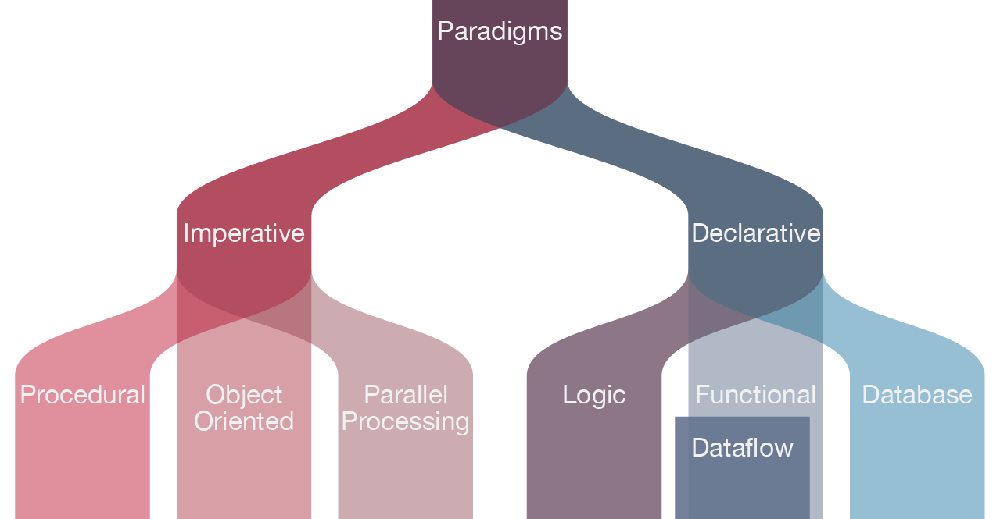

---
jupyter:
  celltoolbar: Slideshow
  jupytext:
    formats: ipynb,md
    notebook_metadata_filter: rise,celltoolbar
    text_representation:
      extension: .md
      format_name: markdown
      format_version: '1.3'
      jupytext_version: 1.14.6
  kernelspec:
    display_name: Python 3 (ipykernel)
    language: python
    name: python3
  rise:
    theme: solarized
---

<!-- #region slideshow={"slide_type": "slide"} -->
# Section 3: Software Development as a Process

</br>
</br>
<center></center>
<!-- #endregion -->

<!-- #region slideshow={"slide_type": "notes"} -->
- There is a lot bundled in here! Make it clear this will be a challenging section
- We are going to step up a level and look at the overall process of developing software
<!-- #endregion -->

<!-- #region slideshow={"slide_type": "subslide"} -->
## Writing Code versus Engineering Software

- Software is _not_ just a tool for answering a research question
- Writing code is only concerned with the implementation of software
- Sofware Engineering views software in a holistic manner
  - Software has a _lifecycle_ ♻
  - Software has stakeholders 👥
  - Software is an asset with its own inherent value 💵
  - Software can be reused 🔁
<!-- #endregion -->

<!-- #region slideshow={"slide_type": "notes"} -->
- Software is _not_ just a tool for answering a research question
  - Software is shared frequently between researchers and _reused_ after publication
  - Therefore, we need to be concerned with more than just the implementation, i.e. "writing code"
- Sofware Engineering views software in a holistic manner
  - Software has a _lifecycle_: more on the next slide
  - Software has stakeholders: it might just be you the researcher now, but invariably other people will be involved in using or developing the code eventually
  - Software is an asset with its own inherent value: algorithms it contains and what those can do, encoded knowledge of lessons learned along the way, etc.
  - Software can be reused: like with stakeholders, it is hard to predict how the software will be used in the future, and we want to make it easy for reuse to happen
<!-- #endregion -->

<!-- #region slideshow={"slide_type": "subslide"} -->
## Software Development Lifecycle

<center></center>

<a href="https://commons.wikimedia.org/wiki/File:SDLC_-_Software_Development_Life_Cycle.jpg">Cliffydcw</a>, <a href="https://creativecommons.org/licenses/by-sa/3.0">CC BY-SA 3.0</a>, via Wikimedia Commons
<!-- #endregion -->

<!-- #region slideshow={"slide_type": "notes"} -->
The typical stages of a software development process can be categorised as follows:

- Requirements gathering (coming up next): the process of identifying and recording the exact requirements for a software project before it begins. This helps maintain a clear direction throughout development, and sets clear targets for what the software needs to do.
- Design (later in this section): where the requirements are translated into an overall design for the software. It covers what will be the basic software ‘components’ and how they’ll fit together, as well as the tools and technologies that will be used, which will together address the requirements identified in the first stage. Designs are quite dependent on what programming paradigm is used, something we will explore also in a later section.
- Implementation (throughout this course): the software is developed according to the design, implementing the solution that meets the requirements set out in the requirements gathering stage.
- Testing (done in section 2): the software is tested with the intent to discover and rectify any defects, and also to ensure that the software meets its defined requirements, i.e. does it actually do what it should do reliably?
- Deployment (not shown on this figure): where the software is deployed or in some way released, and used for its intended purpose within its intended environment.
- Maintenance/evolution: where updates are made to the software to ensure it remains fit for purpose, which typically involves fixing any further discovered issues and evolving it to meet new or changing requirements.

The process of following these stages, particularly when undertaken in this order, is referred to as the waterfall model of software development.
Each stage’s outputs flow into the next stage sequentially.
As the cyclic nature of the image suggests, this linear process is not the only, nor necessarily the best,
way to think about the SDLC.

There is value we get from following some sort of process:

- Stage gating: a quality gate at the end of each stage, where stakeholders review the stage’s outcomes to decide if that stage has completed successfully before proceeding to the next one, or if the next stage is not warranted at all. For example, it may be discovered during requirements collection, design, or implementation that development of the software isn’t practical or even required.
- Predictability: each stage is given attention in a logical sequence; the next stage should not begin until prior stages have completed. Returning to a prior stage is possible and may be needed, but may prove expensive, particularly if an implementation has already been attempted. However, at least this is an explicit and planned action.
- Transparency: essentially, each stage generates output(s) into subsequent stages, which presents opportunities for them to be published as part of an open development process.
- It saves time: a well-known result from empirical software engineering studies is that it becomes exponentially more expensive to fix mistakes in future stages. For example, if a mistake takes 1 hour to fix in requirements, it may take 5 times that during design, and perhaps as much as 20 times that to fix if discovered during testing.

<!-- #endregion -->

<!-- #region slideshow={"slide_type": "slide"} -->
## Software Requirements

- How can we capture and organise what is required for software to function as intended?
  - With software requirements of course!
  - They are the linchpin of ensuring our software does what it is supposed to do
- We will look at 3 types:
  1. business requirements: the why
  2. user requirements: the who and what
  3. solution requirements: the how
<!-- #endregion -->

<!-- #region slideshow={"slide_type": "subslide"} -->
### Breakout: Reading and Exercises

Read from the top of the "Software Requirements" page and do the exercises as you go.
<!-- #endregion -->

<!-- #region slideshow={"slide_type": "notes"} -->
If you are using a shared document, you could have sections for each of the
requirement types and get learners to write their suggestions in their.
Afterwards, you could go through some of the suggestions and see whether there
is agreement about whether they have been categorised correctly.
<!-- #endregion -->

<!-- #region slideshow={"slide_type": "slide"} -->
## ☕ 5 Minute Break ☕
<!-- #endregion -->

<!-- #region slideshow={"slide_type": "slide"} -->
## Software Architecture and Design

... or _Understanding what architecture and design mean for software,_ \
_and how to incorporate requirements into an existing design/architecture_
<!-- #endregion -->

<!-- #region slideshow={"slide_type": "notes"} -->
The extended subtitle is necessary to make it clear that this section is both explaining what architecture and design are and how requirements feed into the process of designing and architecting our software.
<!-- #endregion -->

<!-- #region slideshow={"slide_type": "subslide"} -->
> **Software design** is the process by which an agent creates a specification of a software artifact intended to accomplish goals, using a set of primitive components and subject to constraints. Software design may refer to either "all the activity involved in conceptualizing, framing, implementing, commissioning, and ultimately modifying complex systems" or "the activity following requirements specification and before programming, as ... [in] a stylized software engineering process." 
<!-- #endregion -->

<!-- #region slideshow={"slide_type": "fragment"} -->
- Part of the software development process
- Be careful: the _process_ of designing software **VERSUS** _a design_ of some software (sometimes called a _design model_)
<!-- #endregion -->

<!-- #region slideshow={"slide_type": "notes"} -->
- We don't want to get bogged down in definitions, but it is good to know the difference between software design and software architecture
- Read definition of software design and subsequent points
<!-- #endregion -->

<!-- #region slideshow={"slide_type": "subslide"} -->
> **Software architecture** refers to the fundamental structures of a software system and the discipline of creating such structures and systems. Each structure comprises software elements, relations among them, and properties of both elements and relations. The architecture of a software system is a metaphor, analogous to the architecture of a building. It functions as a blueprint for the system and the developing project, laying out the tasks necessary to be executed by the design teams.

- This can be thought of as a particular sub-category of the design model that becomes more important the larger your software project gets
<!-- #endregion -->

<!-- #region slideshow={"slide_type": "notes"} -->
- Software architecture tends to be a much higher level view with little detail about specific implementation, focussing rather on abstrated components and how they will interact
  - a software degin model will be much lower level and refer to particular modules and classes
<!-- #endregion -->

<!-- #region slideshow={"slide_type": "subslide"} -->
### Some Thoughts about Software Design

- Requirements collections is the important prerequisite since they determine some of your design constraints; other design constraints will exist, however.
- Draw it out!
    - Use diagrams and schematics to try and visualise what a software programme/system will look like
    - It doesn't have to be fancy; just having something is far better than nothing
    - Seeing the connections between software components can usually help you further refine the design
- Design it twice
    - The more designs you consider, the higher the chance you will move towards a better one
<!-- #endregion -->

<!-- #region slideshow={"slide_type": "notes"} -->
- Also, emphasise the point from the course content: it is good to not get too caught up in the details of whether you are implementing an MVC architecture
  - this is probably not an architecture that most would see or implement in research software
  - but the point of separating the "model" from the "view" (i.e. plotting) is definitely something worthwhile
<!-- #endregion -->

<!-- #region slideshow={"slide_type": "subslide"} -->
### Breakout: Reading and Exercises

Read from the heading "Software Architecture" near the top of the "Software Architecture and Design" page.

For the "Exercise: Implementing Requirements", \
🚨 **make sure you read the notes at the bottom in bold font** 🚨
<!-- #endregion -->

<!-- #region slideshow={"slide_type": "slide"} -->
## Programming Paradigms

<center></center>

> Modified from _Davis, Daniel. 2013. “Modelled on Software Engineering: Flexible Parametric Models in the Practice of Architecture.” PhD dissertation, RMIT University._
<!-- #endregion -->

<!-- #region slideshow={"slide_type": "notes"} -->
- This section is going to be a bit of theory before we get back to more concrete programming, but it is important to have a conceptual view of the options available to us when solving problems, because the language we choose will have an influence upon this.
- Different languages apply different programming paradigms, which give us different tools for how we can structure and design our code.
- The primary divide is between _Imperative_ and _Declarative_ languages
- Poll the learners with stickies or Zoom reactions with the question: "Have you heard the terms _paradigm_, _declarative_, and _imperative_ before in relation to programming?"
  - If a large number have, then ask the follow up: "Do you have a good grasp of the meaning of these terms and the practical differences between imperative and declarative programming?"
  - If the majority answer in the affirmative, it is fine to skip to the FizzBuzz exercise
  - Otherwise, give a brief description of imperative vs declarative, and then get the group to read through the section.
- Imperative: grammatically, an imperative statement is an order or instruction
  - e.g. "get me a soda", "got to the shop", "do this important task"
  - this can readily be applied to our relationship to a computer through a programming language, in which we give it instructions
  - e.g. "for all the elements in this list, add the value of each to this sum", "if the value is greater than 10, add it to the sum", etc.
  - This is likely the paradigm of programming we are all most familiar with
- Declarative: grammatically, a declarative sentence is a statement of fact or opinion. It is a description.
  - e.g. "the quick brown fox jumps over the lazy dog", "I don't understand functional programming"
  - it is less obvious how this can be used when interacting with computers
  - The idea of applying a declarative paradigm in programming is that we describe _what_ we want the program to do, rather than _how_ it should do it
  - implementation details (i.e. the _how_) are left to lower level features of the language
  - if anyone has every used a query language like SQL before, this will make a lot more sense
- It is worth a note that Python is a multi-paradigm language
  - it borrows elements from OO, functional, and procedural paradigms
  - you can write programs that are a mix of these paradigms, or more strictly stick to one, it is up to you (which can be both a good and bad thing)
  - more likely, you will write something where Python objects (so OO) are treated like data which is processed in a functional style
  - we will see how to use Python in these different styles in the next two sections
<!-- #endregion -->

<!-- #region slideshow={"slide_type": "slide"} -->
## Functional Programming
<!-- #endregion -->

<!-- #region slideshow={"slide_type": "notes"} -->
- We have undoubtedly all written functions during our time programming, but this doesn't mean we have done "functional" style programming, so let's look at what that involves
- The functional style will probably seem quite foreign, and it might not be obvious why it is useful initially
  - This is just a taster, but I encourage you to stick with it and read further into the functional style if you are interested

<!-- #endregion -->

<!-- #region slideshow={"slide_type": "subslide"} -->
### Breakout: Start from the Top

Start from the top of this page and read through, completing any exercises along the way. It is recommended to put your new code that is unrelated to the inflammation project into separate files/modules.
<!-- #endregion -->

<!-- #region slideshow={"slide_type": "notes"} -->
- Send learners into breakout rooms for about 40 minutes
- Post-exercise comments
- Testability is a huge point that should be emphasised. Even if you aren't following a strict functional style, it is likely that incorporating parts of this style into your code will make it more testable.
- Next slide for comment about the `reduce` function
<!-- #endregion -->

<!-- #region slideshow={"slide_type": "subslide"} -->
#### The `reduce` function

A `for` loop under the hood: https://github.com/python/cpython/blob/3.10/Lib/functools.py#L237

```python
def reduce(function, sequence):
    # some argument checking
    # ...
    it = iterator(sequence)
    for element in it:
        value = function(value, element)
    return value
```

<!-- #endregion -->

<!-- #region slideshow={"slide_type": "notes"} -->
- In Python's case, there is very literally a procedural underpinning to some of its functional attributes
  - but this is not the case for all languages
<!-- #endregion -->

<!-- #region slideshow={"slide_type": "subslide"} -->
### Alternate Sum of Squares

```python
from functools import reduce


def sum_of_squares(sequence):
    squares = [x * x for x in sequence]
    return reduce(lambda a, b: a + b, squares)


def to_integer(sequence):
    return [int(x) for x in sequence]


def remove_comments(sequence):
    return [x for x in sequence if x[0] != "#"]

sequence = ['#100', '1', '2', '4']
sum_of_squares(to_integer(remove_comments(sequence)))
```
<!-- #endregion -->

<!-- #region slideshow={"slide_type": "notes"} -->
- This is closer to what actual purely function languages do: they chain together a sequence of function calls
- And example of what this looks like in another language can be seen here: https://bielsnohr.github.io/2023/02/18/elm-advent-of-code-2022.html#array-handling
<!-- #endregion -->

<!-- #region slideshow={"slide_type": "slide"} -->
## Object Oriented Programming
<!-- #endregion -->

<!-- #region slideshow={"slide_type": "notes"} -->
- the idea behind object-oriented programming to bundle data and methods together to represent objects
  - this can be very intuitive, because we are used to working with objects in real life, and sometimes our software objects correspond quite closely to a real world object
- the more technical term for this is encapsulation, but not overly important to know that
- at the end of the day, we are again trying to create a well-defined _interface_ for how to interact with these objects / software components
<!-- #endregion -->

<!-- #region slideshow={"slide_type": "subslide"} -->
### Decorators

Decorators are _syntactic sugar_ for the case where we want to wrap a function with another function:

```python
def my_decorator(func):
    def wrapper():
        print("Before wrapped function")
        func()
        print("After wrapped function")
    return wrapper

# we can replace this
def my_function():
    print("Whee!")
    
my_function = my_decorator(my_function)
my_function()

# with this
@my_decorator
def my_function():
    print("Whee!")
```
<!-- #endregion -->

<!-- #region slideshow={"slide_type": "subslide"} -->
### Breakout: Start from the Top

Start reading from the top of this page all the way to the end. Complete exercises as you go.

- It is fine to skip the **🖉 Structuring Data** exercise and just read it. Bottom line is that you can achieve a lot with built in data types, so don't jump to more advanced techniques if they aren't needed.
- A note about the Book/Library exercises: create separate files from the existing ones
  1. put a `library.py` under `models/`, and a `test_library.py` under `tests/`
  2. or put both of these files under a separate directory `library/` at the top level of the repo
<!-- #endregion -->

<!-- #region slideshow={"slide_type": "notes"} -->
- Set learners into breakout rooms for 45 minutes with instructions on slide
- Please take the note about Test Driven Development on board as much as possible: write a test for the feature before implementing the feature.
<!-- TODO this doesn't seem to be the right place to have a discussion about TDD, but it is where the course brings it up. Think about where to put this in the future. -->
- Invariably, the question will come up of when to use functional vs OO programming, and are the two mutually exclusive (i.e. do you have to use one or the other)
  - as mentioned previously, it is unlikely you will do purely OO or functional programming, especially if you are using Python
  - the two are certainly not mutually exclusive
- Post-exercise comment: there will probably be the temptation to inherit from the builtin `list` class when implementing `Library`. 
  - Subclassing from builtin types is generally a bad idea for a host of complex reasons. 
  - The most easily comprehensible is that by inheriting a builtin type, you inherit a lot of behaviour that you might not intend to have for your new class. 
  - On the flip side, it is also quite restrictive. Is a Library really just a list? We might decide to add other functionality, like opening hours, later on. How does that data fit into the definition of a list? Well, it doesn't. 
  - If you really want to inherit from something here, then the better approach is to use the `collections.abc` (abstract base class) module in Python and pick something from there that gets you closer to your desired functionality.
- A note about inheritance vs composition is probably worthwhile
  - Inheritance tends to be quite abused and IMO should not be used as often as it is; it leads to very complex hierarchies of classes that make it difficult to determine where something is actually defined
  - Composition tends to lead to better outcomes in my experience
- If anyone asks about Doctor OO implementation, some additional feature ideas
  - using the `dataclass` decorator offers a lot of advantages for these classes
  - adding an age to patients could be helpful (fairly simple)
  - a date range (or start date) for a patient's observations
  - a Study class that is a list of Doctors (perhaps too much)
  - a CSV reader of patient data (and preferably groups of patients data)
<!-- #endregion -->

<!-- #region slideshow={"slide_type": "subslide"} -->
### Class vs Static Methods

One common use case for class methods is to create alternate _constructors_ for a class:

```python
class Circle:
    def __init__(self, radius):
        self.radius = radius

    @classmethod
    def from_diameter(cls, diameter):
        return cls(radius=diameter / 2)
```

Then, we can create `Circle` objects using either the radius or diameter:

```python
circle_1 = Circle(radius=1)
circle_2 = Circle.from_diameter(diameter=2)
```
<!-- #endregion -->

<!-- #region slideshow={"slide_type": "slide"} -->
## ☕ 5 Minute Break ☕
<!-- #endregion -->

<!-- #region slideshow={"slide_type": "slide"} -->
## ☕ 10 Minute Break ☕
<!-- #endregion -->

<!-- #region slideshow={"slide_type": "slide"} -->
## Persistence
<!-- #endregion -->

<!-- #region slideshow={"slide_type": "notes"} -->
- not much intro needed, other than the fact that reading and writing data is an important step for your code (even if not the most exciting)
<!-- #endregion -->

```python slideshow={"slide_type": "subslide"}
import json

patient = {"name": "Alice", "observations": [1, 6, 8, 0, 5]}
with open("patient_serialized.json", "w") as fp:
    json.dump(patient, fp)
```

```python slideshow={"slide_type": "fragment"}
! cat patient_serialized.json
```

```python slideshow={"slide_type": "fragment"}
with open("patient_serialized.json", "r") as fp:
    patient_deserialized = json.load(fp)
print(patient_deserialized)
```

<!-- #region slideshow={"slide_type": "subslide"} -->
### Breakout: Start from the Top

Start reading from the top of this page all the way to the end. Complete exercises as you go.
<!-- #endregion -->

<!-- #region slideshow={"slide_type": "slide"} -->
## 🕓 End of Section 3 🕓

Please fill out the end-of-section survey!
<!-- #endregion -->
