---
jupyter:
  celltoolbar: Slideshow
  jupytext:
    main_language: python
    notebook_metadata_filter: -kernelspec,-jupytext.text_representation.jupytext_version,rise,celltoolbar
    text_representation:
      extension: .md
      format_name: markdown
      format_version: '1.3'
  rise:
    theme: solarized
---

<!-- #region slideshow={"slide_type": "slide"} editable=true -->
# Section 3: Software Development as a Process

</br>
</br>
<center></center>
<!-- #endregion -->

<!-- #region slideshow={"slide_type": "notes"} -->
- There is a lot bundled in here! Make it clear this will be a challenging section
- We are going to step up a level and look at the overall process of developing software
<!-- #endregion -->

<!-- #region slideshow={"slide_type": "subslide"} editable=true -->
## Writing Code versus Engineering Software

- Software is _not_ just a tool for answering a research question
- Writing code is only concerned with the implementation of software
- Sofware Engineering views software in a holistic manner
  - Software has a _lifecycle_ ♻
  - Software has stakeholders 👥
  - Software is an asset with its own inherent value 💵
  - Software can be reused 🔁
<!-- #endregion -->

<!-- #region slideshow={"slide_type": "notes"} editable=true -->
- Software is _not_ just a tool for answering a research question
  - Software is shared frequently between researchers and _reused_ after publication
  - Therefore, we need to be concerned with more than just the implementation, i.e. "writing code"
- Sofware Engineering views software in a holistic manner
  - Software has a _lifecycle_: more on the next slide
  - Software has stakeholders: it might just be you the researcher now, but invariably other people will be involved in using or developing the code eventually
  - Software is an asset with its own inherent value: algorithms it contains and what those can do, encoded knowledge of lessons learned along the way, etc.
  - Software can be reused: like with stakeholders, it is hard to predict how the software will be used in the future, and we want to make it easy for reuse to happen
<!-- #endregion -->

<!-- #region slideshow={"slide_type": "subslide"} editable=true -->
## Software Development Lifecycle

<center></center>

<a href="https://commons.wikimedia.org/wiki/File:SDLC_-_Software_Development_Life_Cycle.jpg">Cliffydcw</a>, <a href="https://creativecommons.org/licenses/by-sa/3.0">CC BY-SA 3.0</a>, via Wikimedia Commons
<!-- #endregion -->

<!-- #region slideshow={"slide_type": "notes"} -->
The typical stages of a software development process can be categorised as follows:

- Requirements gathering (coming up next): the process of identifying and recording the exact requirements for a software project before it begins. This helps maintain a clear direction throughout development, and sets clear targets for what the software needs to do.
- Design (later in this section): where the requirements are translated into an overall design for the software. It covers what will be the basic software ‘components’ and how they’ll fit together, as well as the tools and technologies that will be used, which will together address the requirements identified in the first stage. Designs are quite dependent on what programming paradigm is used, something we will explore also in a later section.
- Implementation (throughout this course): the software is developed according to the design, implementing the solution that meets the requirements set out in the requirements gathering stage.
- Testing (done in section 2): the software is tested with the intent to discover and rectify any defects, and also to ensure that the software meets its defined requirements, i.e. does it actually do what it should do reliably?
- Deployment (not shown on this figure): where the software is deployed or in some way released, and used for its intended purpose within its intended environment.
- Maintenance/evolution: where updates are made to the software to ensure it remains fit for purpose, which typically involves fixing any further discovered issues and evolving it to meet new or changing requirements.

The process of following these stages, particularly when undertaken in this order, is referred to as the waterfall model of software development.
Each stage’s outputs flow into the next stage sequentially.
As the cyclic nature of the image suggests, this linear process is not the only, nor necessarily the best,
way to think about the SDLC.

There is value we get from following some sort of process:

- Stage gating: a quality gate at the end of each stage, where stakeholders review the stage’s outcomes to decide if that stage has completed successfully before proceeding to the next one, or if the next stage is not warranted at all. For example, it may be discovered during requirements collection, design, or implementation that development of the software isn’t practical or even required.
- Predictability: each stage is given attention in a logical sequence; the next stage should not begin until prior stages have completed. Returning to a prior stage is possible and may be needed, but may prove expensive, particularly if an implementation has already been attempted. However, at least this is an explicit and planned action.
- Transparency: essentially, each stage generates output(s) into subsequent stages, which presents opportunities for them to be published as part of an open development process.
- It saves time: a well-known result from empirical software engineering studies is that it becomes exponentially more expensive to fix mistakes in future stages. For example, if a mistake takes 1 hour to fix in requirements, it may take 5 times that during design, and perhaps as much as 20 times that to fix if discovered during testing.

<!-- #endregion -->

<!-- #region slideshow={"slide_type": "slide"} -->
## Software Requirements

- How can we capture and organise what is required for software to function as intended?
  - With software requirements of course!
  - They are the linchpin of ensuring our software does what it is supposed to do
- We will look at 3 types:
  1. business requirements: the why
  2. user requirements: the who and what
  3. solution requirements: the how
<!-- #endregion -->

<!-- #region slideshow={"slide_type": "subslide"} -->
### Breakout: Reading and Exercises

Read from the top of the "Software Requirements" page and do the exercises as you go.
<!-- #endregion -->

<!-- #region slideshow={"slide_type": "notes"} -->
If you are using a shared document, you could have sections for each of the
requirement types and get learners to write their suggestions in there.
Afterwards, you could go through some of the suggestions and see whether there
is agreement about whether they have been categorised correctly.
<!-- #endregion -->

<!-- #region slideshow={"slide_type": "slide"} -->
## ☕ 5 Minute Break ☕
<!-- #endregion -->

<!-- #region slideshow={"slide_type": "slide"} -->
## Software Architecture and Design
<!-- #endregion -->

<!-- #region slideshow={"slide_type": "subslide"} -->
### Poor Design and Technical Debt

- It is always tempting to dive straight to implementation once we have an idea of our requirements
- However, this short-sightedness often has a cost: technical debt

> **Technical debt:** cost of additional rework caused by choosing an easy (limited) solution now instead of using a better approach that would take longer

- There is a balance: some technical debt will always be necessary, and you need to balance that with getting things done to meet deadlines
- Becoming an *intermediate* or even *senior* developer is about choosing the amount of design techniques that are *good enough* for the current situation
<!-- #endregion -->

<!-- #region slideshow={"slide_type": "subslide"} -->
### Software Design Goals

Software Architecture and Design is about writing *maintainable code*.

Maintainable code is:

 * Understandable
 * Adaptable
 * Testable

<!-- #endregion -->

<!-- #region slideshow={"slide_type": "subslide"} -->
### Maintainable Code

Maintainable code is vital as projects grow

 * More people being involved
 * Adding new features

<!-- #endregion -->

<!-- #region slideshow={"slide_type": "subslide"} -->
### ✏️ Exercise: why isn't this code maintainable?

Switch to the `full-data-analysis` branch in your repo. Take a look at the file `inflammation/compute_data.py`.
How is this code hard to maintain?

Reminder that maintainable code should be:

 * Easy to read
 * Easy to test
 * Easy to extend or modify

Time: 5min
<!-- #endregion -->

<!-- #region slideshow={"slide_type": "notes"} -->
- Use the course material to get the answers
<!-- #endregion -->

<!-- #region slideshow={"slide_type": "notes"} -->
After 5 min spend 5-15 min discussing examples the group has come up with
<!-- #endregion -->

<!-- #region slideshow={"slide_type": "subslide"} -->
### Software Architecture

* One abstraction level up from "design"
* Concerned with the *components* of our software system and how they connect (i.e. their interfaces)
  * Design is more about concrete aspects of the code itself
* Helpful to draw these sorts of diagrams before diving in so we can avoid major issues
  * Also, architecture tends to be hard to change once we create it
* Even if you don't explicitly specify your architecture, your code still has an architecture (but likely not a good one)

<!-- #endregion -->

<!-- #region slideshow={"slide_type": "subslide"} -->
### ✏️ Exercise: Design a High-Level Architecture for a New Requirement

Get your diagramming on!

Time: 10 min
<!-- #endregion -->

<!-- #region slideshow={"slide_type": "notes"} -->
Get learners to share their diagrams if possible. Go through the solution in the course material.
<!-- #endregion -->

<!-- #region slideshow={"slide_type": "subslide"} -->
### Model-View-Controller (MVC) Architecture

<center></center>

<!-- #endregion -->

<!-- #region slideshow={"slide_type": "notes"} -->
Walk throught the main components of this architecture and how it relates to the current project.

Mermaid diagram source:

```
graph LR
    User("User")
    View["View"]
    Controller["Controller"]
    Model["Model"]
    User -->|User Input| Controller
    Controller -->|Process Data| Model
    Model -->|Update Data| View
    View -->|Display Data| User

    style User fill:#4CAF50,stroke:#333,stroke-width:2px,stroke-dasharray:5,5
```
<!-- #endregion -->

<!-- #region slideshow={"slide_type": "subslide"} -->
### 📖 Reading Time

Have a read through "Limitations to Architectural Design" to the end of the page.
<!-- #endregion -->

<!-- #region slideshow={"slide_type": "notes"} -->
Ask if anyone has questions and discuss any unclear portions of the text.
<!-- #endregion -->

<!-- #region slideshow={"slide_type": "slide"} -->
## ☕ 5 Minute Break ☕
<!-- #endregion -->

<!-- #region slideshow={"slide_type": "slide"} -->
## Code Decoupling & Abstractions

What are these and why do we need them? Let's look at the concept of *cognitive load* to find out.
<!-- #endregion -->

<!-- #region slideshow={"slide_type": "subslide"} -->

### Cognitive Load

For code to be readable, readers have to be able to understand what the code does.

Cognitive load - the amount a reader has to remember at once

There is a limit (and it is low!)

<!-- #endregion -->

<!-- #region slideshow={"slide_type": "subslide"} -->

### Cognitive Load

Reduce cognitive load for a bit of code by:

 * Good variable names: `toroidal_magnetic_field` much better than `btor`
 * Simple control flow
 * Functions doing one thing
 * Good abstractions (next slide!)

<!-- #endregion -->

<!-- #region slideshow={"slide_type": "notes"} -->
Good variable names - we not longer have punch card restrictions, so use more descriptive names!

Simple control flow - explain means not lots of nesting if statement or for loops
<!-- #endregion -->

<!-- #region slideshow={"slide_type": "subslide"} -->
### Reducing Cognitive Load at a Higher Level

1. Decoupling
2. Abstractions
<!-- #endregion -->

<!-- #region slideshow={"slide_type": "subslide"} -->
### Decoupled Code

When thinking about code, we tend to think of it in distinct parts or **units**.

Two units are **decoupled** if changes in one can be made independently of the other.

Therefore, we only need to keep the current component in our mind at any time, reducing cognitive load.
<!-- #endregion -->

<!-- #region slideshow={"slide_type": "notes"} -->
E.g we have the part that loads a file and the part that draws a graph

Or the part that the user interacts with and the part that does the calculations
<!-- #endregion -->

<!-- #region slideshow={"slide_type": "subslide"} -->

## Abstractions

An **abstraction** hides the details of one part of a system from another.

This allows for the units or parts of the system to be *decoupled*.

We only need to know how to use the *interface* of the abstraction to interact with it, reducing cognitive load.

<!-- #endregion -->

<!-- #region slideshow={"slide_type": "notes"} -->
When we have a suitable abstraction, we do not need to worry about the inner workings of the other part.

Give some examples of abstractions, or maybe ask for people to think of ideas of abstractions in the real world?

Examples:

- A brake pedal in a car: we don't need to know the exact mechanism by which the car slows down, so that implementation has been "abstracted" away from the car user; when we change how breaking works, we do not need to retrain the driver.
- Similarly, a light switch is an abstraction: we don't need to know what happens with the wiring and flow of electricity in order to understand that one side means the light will be on and vice versa
- human society is full of things like these...
<!-- #endregion -->

<!-- #region slideshow={"slide_type": "subslide"} -->
### ✏️ Exercise: Decouple Data Loading from Data Analysis

Currently the function is hard coded to load all the files in a directory.

Decouple this into a separate function that returns all the files to load

Time: 10min
<!-- #endregion -->

<!-- #region slideshow={"slide_type": "subslide"} -->
### Decoupled... but not completely

Although we have separated out the data loading, there is still an assumption and therefore coupling in terms of the format of that data (in this case CSV).

Is there a way we could make this more flexible?
<!-- #endregion -->

<!-- #region slideshow={"slide_type": "notes"} -->
- The format of the data stored is a practical detail which we don't want to limit the use of our `analyse_data()` function
- We could add an argument to our function to specify the format, but then we might have quite a long conditional list of all the different possible formats, and the user would need to request changes to `analyse_data()` any time they want to add a new format
- Is there a way we can let the user more flexibly specify the way in which their data gets read?
<!-- #endregion -->

<!-- #region slideshow={"slide_type": "fragment"} -->
One way is with **classes**!
<!-- #endregion -->

<!-- #region slideshow={"slide_type": "subslide"} -->
### Python Classes

A **class** is a Python feature that allows grouping methods (i.e. functions) with some data.

<!-- #endregion -->

<!-- #region slideshow={"slide_type": "notes"} -->
Do some live coding, ending with:

```python
import math

class Circle:
  def __init__(self, radius):
    self.radius = radius

  def get_area(self):
    return math.pi * self.radius * self.radius

my_circle = Circle(10)
print(my_circle.get_area())
```

<!-- #endregion -->

<!-- #region slideshow={"slide_type": "subslide"} -->
### Exercise: Use a Class to Configure Loading

Put the `load_inflammation_data` function we wrote in the last exercise as a member method of a new class called `CSVDataSource`.

Put the configuration of where to load the files in the class' initialiser.

Once this is done, you can construct this class outside the the statistical analysis and pass the instance in to analyse_data.

Time: 10min

<!-- #endregion -->

<!-- #region slideshow={"slide_type": "subslide"} -->
### Interfaces

**Interfaces** describe how different parts of the code interact with each other.

<!-- #endregion -->

<!-- #region slideshow={"slide_type": "notes"} -->
For example, the interface of the breaking system in a car, is the break pedal.
The user can push the pedal harder or softer to get more or less breaking.
The interface of our circle class is the user can call get_area to get the 2D area of the circle
as a number.
<!-- #endregion -->

<!-- #region slideshow={"slide_type": "subslide"} -->
### Interfaces

Question: what is the interface for CSVDataSource

```python
class CSVDataSource:
  """
  Loads all the inflammation csvs within a specified folder.
  """
  def __init__(self, dir_path):
    self.dir_path = dir_path

  def load_inflammation_data(self):
    data_file_paths = glob.glob(os.path.join(self.dir_path, 'inflammation*.csv'))
    if len(data_file_paths) == 0:
      raise ValueError(f"No inflammation csv's found in path {self.dir_path}")
    data = map(models.load_csv, data_file_paths)
    return list(data)
```

<!-- #endregion -->

<!-- #region slideshow={"slide_type": "notes"} -->
Suggest discuss in groups for 1min.

Answer: the interface is the signature of the `load_inflammation_data()` method, i.e. what arguments it takes and what it returns.
<!-- #endregion -->

<!-- #region slideshow={"slide_type": "subslide"} -->
### Common Interfaces

If we have two classes that share the same interface, we can use the interface without knowing which class we have

<!-- #endregion -->

<!-- #region slideshow={"slide_type": "notes"} -->
Easiest shown with an example, lets do more live coding:

```python
class Rectangle(Shape):
  def __init__(self, width, height):
    self.width = width
    self.height = height
  def get_area(self):
    return self.width * self.height

my_circle = Circle(radius=10)
my_rectangle = Rectangle(width=5, height=3)
my_shapes = [my_circle, my_rectangle]
total_area = sum(shape.get_area() for shape in my_shapes)
```

<!-- #endregion -->

<!-- #region slideshow={"slide_type": "subslide"} -->
### Polymorphism

Using an interface to call different methods is a technique known as **polymorphism**.

A form of abstraction - we have abstracted what kind of shape we have.

<!-- #endregion -->

<!-- #region slideshow={"slide_type": "subslide"} -->
### Exercise: Introduce an alternative implementation of DataSource

Polymorphism is very useful - suppose we want to read a JSON (JavaScript Object Notation) file.

Write a class that has the same interface as `CSVDataSource` that
loads from JSON.

There is a function in `models.py` that loads from JSON.

Time: 15min

<!-- #endregion -->

<!-- #region slideshow={"slide_type": "notes"} -->
Remind learners to check the course webpage for further details and some important hints.
<!-- #endregion -->

<!-- #region slideshow={"slide_type": "subslide"} -->
### Mocks

Another use of polymorphism is **mocking** in tests.

<!-- #endregion -->

<!-- #region slideshow={"slide_type": "notes"} -->

Lets live code a mock shape:

```python
from unittest.mock import Mock

def test_sum_shapes():

  mock_shape1 = Mock()
  mock_shape1.get_area().return_value = 10

  mock_shape2 = Mock()
  mock_shape2.get_area().return_value = 13
  my_shapes = [mock_shape1, mock_shape2]
  total_area = sum(shape.get_area() for shape in my_shapes)

  assert total_area = 23
```

Easier to read this test as do not need to understand how
get_area might work for a real shape.

Focus on testing behaviour rather than implementation.

<!-- #endregion -->

<!-- #region slideshow={"slide_type": "subslide"} -->
## Exercise: Test Using a Mock Implementation

Complete the exercise to write a mock data source for `analyse_data`.

Time: 15min

<!-- #endregion -->

<!-- #region slideshow={"slide_type": "subslide"} -->

## Object Oriented Programming

These are techniques from **object oriented programming**.

There is a lot more that we will not go into:

* Inheritance
* Information hiding

<!-- #endregion -->

<!-- #region slideshow={"slide_type": "subslide"} -->

## A note on Data Classes

Regardless of doing Object Oriented Programming or Functional Programming

**Grouping data into logical classes is vital for writing maintainable code.**

<!-- #endregion -->

<!-- #region slideshow={"slide_type": "slide"} editable=true -->
## ☕ 10 Minute Break ☕
<!-- #endregion -->

<!-- #region slideshow={"slide_type": "slide"} editable=true -->

## Refactoring

**Refactoring** is modifying code, such that:

 * external behaviour is unchanged,
 * code itself is easier to read / test / extend.

<!-- #endregion -->

<!-- #region slideshow={"slide_type": "subslide"} editable=true -->

### Refactoring

Refactoring is vital for improving code quality. It might include things such as:
* Code decoupling and abstractions
* Renaming variables
* Reorganising functions to avoid code duplication
* Simplifying conditional statements to improve readability
<!-- #endregion -->

<!-- #region slideshow={"slide_type": "notes"} editable=true -->
Often working on existing software - refactoring is how we improve it
<!-- #endregion -->

<!-- #region slideshow={"slide_type": "subslide"} editable=true -->
### Refactoring Loop

When refactoring a piece of software, a good process to follow is:

* Make sure you have tests that verify the current behaviour
* Refactor the code
* Re-run tests to verify the behavour of the code is unchanged

<!-- #endregion -->

<!-- #region slideshow={"slide_type": "subslide"} editable=true -->
### Refactoring

In the rest of section we will learn how to refactor an existing piece of code. We need to:

* Add more tests so we can be more confident that future changes will not break the existing code.
* Further split analyse_data() function into a number of smaller and more decoupled functions
<!-- #endregion -->


<!-- #region slideshow={"slide_type": "notes"} editable=true -->
When refactoring, first we need to make sure there are tests in place that can verify the code behaviour as it is now (or write them if they are missing), then refactor the code and, finally, check that the original tests still pass.

In the process of refactoring, we will try to target some of the "good practices" we just talked about, like making good abstractions and reducing cognitive load.
<!-- #endregion -->

<!-- #region slideshow={"slide_type": "subslide"} editable=true -->

### Writing Regression Tests Before Refactoring

Look at the `analyse_data` function within `inflammation/compute_data.py`:

```python
def analyse_data(data_dir):
    data_file_paths = glob.glob(os.path.join(data_dir, 'inflammation*.csv'))
    if len(data_file_paths) == 0:
        raise ValueError(f"No inflammation data CSV files found in path {data_dir}")
    data = map(models.load_csv, data_file_paths)


    means_by_day = map(models.daily_mean, data)
    means_by_day_matrix = np.stack(list(means_by_day))

    daily_standard_deviation = np.std(means_by_day_matrix, axis=0)

    graph_data = {
        'standard deviation by day': daily_standard_deviation,
    }
    views.visualize(graph_data)
```
<!-- #endregion -->
<!-- #region slideshow={"slide_type": "notes"} editable=true -->
Bring up the code

Explain the feature:
When using inflammation-analysis.py if the user adds `--full-data-analysis` then the program will scan the directory of one of the provided files, compare standard deviations across the data by day and plot a graph.

The main body of it exists in inflammation/compute_data.py in a function called analyse_data.

We want to add extra regression tests to this function. Firstly, modify the function to return the data instead of visualise it so that it is easier to automatically test. Next, we will add assert statements that verify that the current outcome always remains the same, rather than checking if it is *correct* or not. These are called regression tests.
<!-- #endregion -->

<!-- #region slideshow={"slide_type": "subslide"} editable=true -->

### Exercise: Writing Regression Tests

Add a new test file called `test_compute_data.py` in the `tests` folder and add a regression test to verify the current output of `analyse_data()`.

Remember that this is a *regression test* to check that we don't break our code during refactoring, and so ensure that this result remains unchanged. It does *not* necessarily check that the result is correct.

```python
from inflammation.compute_data import analyse_data

def test_analyse_data():
    path = Path.cwd() / "../data"
    data_source = CSVDataSource(path)
    result = analyse_data(data_source)

    # TODO: add assert statement(s) to test the result value is as expected
```
<!-- #endregion -->

<!-- #region slideshow={"slide_type": "notes"} editable=true -->
Hint: You might find it helpful to assert the results equal some made up array, observe the test failing and copy and paste the correct result into the test.

When talking about the solution:

 * We will have to remove it as we modified the code to get it working
 * Is not a good test - not obvious it is correct
 * Brittle - changing the files will break the tests
<!-- #endregion -->

<!-- #region slideshow={"slide_type": "subslide"} editable=true -->
### Refactoring Functions to only do One Thing

Functions which just do one thing are:

* Easier to test
* Easier to read
* Easier to re-use

We can take this further by making our single-purpose functions **pure**.

<!-- #endregion -->

<!-- #region slideshow={"slide_type": "subslide"} editable=true -->
### Pure Functions

A **pure function** is effectively what we think of as a mathematical function:

- they take some input, and produce an output
- they do not rely on any information other than the inputs provided
- they do not cause any side effects.

As a result, the output of a **pure function** does not depend on externalities or program sate, such as global variables.

Moreover, there will be no side effects from running the function, e.g. it wont edit any files or modify global variables such that behaviour in other parts of our code are unaffected.

<!-- #endregion -->

<!-- #region slideshow={"slide_type": "subslide"} editable=true -->
### Pure Functions

Pure functions have a number of advantages for maintainable code:

 * Easier to read as do not need to know calling context
 * Easier to reuse as do not need to worry about invisible dependencies

<!-- #endregion -->

<!-- #region slideshow={"slide_type": "subslide"} editable=true -->
### Exercise: Refactor Code into a Pure Function

Refactor the analyse_data function into a pure function with the logic, and an impure function that handles the input and output. The pure function should take in the data, and return the analysis results:

```python
def compute_standard_deviation_by_day(data):
  # TODO
  return daily_standard_deviation
```

Time: 10min

<!-- #endregion -->

<!-- #region slideshow={"slide_type": "subslide"} editable=true -->
### Testing Pure Functions

Pure functions are also easier to test

 * Easier to write as can create the input as we need it
 * Easier to read as do not need to read any external files
 * Easier to maintain - tests will not need to change if the file format changes

<!-- #endregion -->

<!-- #region slideshow={"slide_type": "notes"} editable=true -->
Can focus on making sure we get all edge cases without real world considerations
<!-- #endregion -->

<!-- #region slideshow={"slide_type": "subslide"} editable=true -->
### Exercise: Write Test Cases for the Pure Function

Now we have refactored our a pure function, we can more easily write comprehensive tests. Add tests that check for when there is only one file with multiple rows, multiple files with one row and any other cases you can think of that should be tested.

Time: 10min

<!-- #endregion -->

<!-- #region editable=true slideshow={"slide_type": "fragment"} -->
```python
from inflammation.compute_data import compute_standard_deviation_by_data

@pytest.mark.parametrize('data,expected_output', [
    ([[[0, 1, 0], [0, 2, 0]]], [0, 0, 0]),
    ([[[0, 2, 0]], [[0, 1, 0]]], [0, math.sqrt(0.25), 0]),
    ([[[0, 1, 0], [0, 2, 0]], [[0, 1, 0], [0, 2, 0]]], [0, 0, 0])
],
ids=['Two patients in same file', 'Two patients in different files', 'Two identical patients in two different files'])
def test_compute_standard_deviation_by_day(data, expected_output):


    result = compute_standard_deviation_by_data(data)
    npt.assert_array_almost_equal(result, expected_output)
```
<!-- #endregion -->

<!-- #region slideshow={"slide_type": "subslide"} editable=true -->
### Functional Programming

Pure functions are a concept from an approach to programming called **functional programming**, where programs are constructed by chaining together these pure functions.

Writing code in this way is particularly useful for data processing and analysis, or translating data from one format to another.

We have so far mostly focussed on Procedural Programming, where a series of sequential steps are performed in a specific order. Different programming paradigms have different strengths and weaknesses, and are useful to solve different types of problems.

<!-- #endregion -->

<!-- #region slideshow={"slide_type": "notes"} editable=true -->
If there is time - do some live coding to show imperative code, then transform into a pipeline:

 * Sequence of numbers
 * Remove all the odd numbers
 * Square all the numbers
 * Add them together


```python
# Imperative
numbers = range(1, 100)
total = 0
for number in numbers:
  if is_even(number):
    squared = number ** 2
    total += squared


# Functional
def is_even(number):
    return number % 2 == 0


def squared(number):
  return number**2


total = sum(map(squared, filter(is_even, numbers)))
```

<!-- #endregion -->

<!-- #region slideshow={"slide_type": "slide"} -->
## ☕ 10 Minute Break ☕
<!-- #endregion -->

<!-- #region slideshow={"slide_type": "slide"} editable=true -->
## Architecting Code to Separate Responsibilities
<!-- #endregion -->

<!-- #region slideshow={"slide_type": "subslide"} editable=true -->
Recall that we are using a Model-View-Controller architecture in our project, which are located in:

* **Model**: `inflammation/models.py`
* **View**: `inflammation/views.py`
* **Controller**: `inflammation-analysis.py`

But the code we were previously analysing was added in a separate script `inflammation/compute_data.py` and contains a mix of all three.
<!-- #endregion -->

<!-- #region slideshow={"slide_type": "subslide"} editable=true -->
### Exercise: Identify Model, View and Controller

Looking at the code inside `compute_data.py`, what parts could be considered Model, View and Controller code?

Time: 5min

<!-- #endregion -->

<!-- #region slideshow={"slide_type": "notes"} editable=true -->
Computing the standard deviation belongs to Model.
Reading the data from CSV files also belongs to Model.
Displaying of the output as a graph is View.
The logic that processes the supplied files is Controller.
<!-- #endregion -->


<!-- #region slideshow={"slide_type": "subslide"} editable=true -->
### Exercise: Split Out Model, View and Controller

Refactor analyse_data() function so that the Model, View and Controller code we identified in the previous exercise is moved to appropriate modules.

Time: 10min

<!-- #endregion -->

<!-- #region slideshow={"slide_type": "subslide"} editable=true -->
### Merge the Feature In

Hopefully you have now refactored the feature to conform to our MVC structure, and ran our regression tests to check that the outputs rermain the same.

We can commit this to our branch, and then switch to the `develop` branch and merge it in.

```bash
$ git switch develop
$ git merge full-data-analysis
```

<!-- #endregion -->

<!-- #region slideshow={"slide_type": "subslide"} editable=true -->
### Controller Structure

The structure of our controller is as follows:

```python
# import modules

def main(args):
    # perform some actions

if __name__ == "__main__":
    # perform some actions before main()
    main(args)
```

This is a common pattern for entry points to Python packages. Actions performed by the script are contained within the `main` function. The main function is run automatically if the `__name__` variable (a special veriable set by the Python interpreter) is `"__main__"`.  So if our file is run by the Python interpreter on the command line, this condition will be satisfied, and our script gets run as expected.

However, if our Python module is imported from another, instead `__name__ = "inflammation_analysis"` will be defined, and the `main()` function will not automatically be run.
<!-- #endregion -->

<!-- #region editable=true slideshow={"slide_type": "notes"} -->
It is useful to have this dual behaviour for our entry point scripts so that functions defined within them can be used by other modules without the main function being run on import, while still making it clear how the core functionality is run. Moreover, this pattern makes it possible to test the functions within our script because everything is put inside more easily callable functions.
<!-- #endregion -->

<!-- #region slideshow={"slide_type": "subslide"} editable=true -->
### Passing Command-Line Options to Controller

To read command line arguments passed into a script, we use `argparse`. To use this, we import it in our controller script, initialise a parser class, and then add arguments which we want to look out for:

```python
import argparse

parser = argparse.ArgumentParser(
    description='A basic patient inflammation data management system')

parser.add_argument(
    'infiles',
    nargs='+',
    help='Input CSV(s) containing inflammation series for each patient')

args = parser.parse_args()
```
<!-- #endregion -->

<!-- #region slideshow={"slide_type": "notes"} editable=true -->
Take people through each of these parts:

Import the library

Initialise the parser class

Define an argument called 'infiles' which will hold a list of input CSV file(s) to read inflammation data from. The user can specify 1 or more of these files, so we define the number of args as '+'. It also contains a help string for the user, which will be displayed if they use `--help` on the command line.

You then parse the arguments, which returns an object we called `args` which contains all of the arguments requested. These can be accessed by their name, eg `args.infiles`.
<!-- #endregion -->

<!-- #region slideshow={"slide_type": "subslide"} editable=true -->
### Positional and Optional Arguments
Positional arguments are required arguments which must be provided all together and in the proper order when calling the script. Optional arguments are indicated by a `-` or `--` prefix, and these do not have to be provided to run the script. For example we can see the help string:

```bash
$ python3 inflammation-analysis.py --help
```

```bash
usage: inflammation-analysis.py [-h] infiles [infiles ...]

A basic patient inflammation data management system

positional arguments:
  infiles     Input CSV(s) containing inflammation series for each patient

optional arguments:
  -h, --help  show this help message and exit
```
<!-- #endregion -->

<!-- #region slideshow={"slide_type": "subslide"} editable=true -->
## Conclusion

Good software architecture and design is a **huge** topic.

Practise makes perfect:

 * Spot signs things could be improved - like duplication
 * Think about why things are working or not working
 * Do not design for an imagined future
 * Keep refactoring as you go

<!-- #endregion -->


<!-- #region slideshow={"slide_type": "slide"} editable=true -->
## 🕓 End of Section 3 🕓
<!-- #endregion -->
