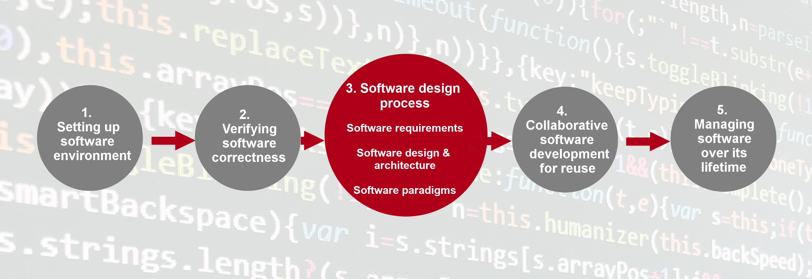
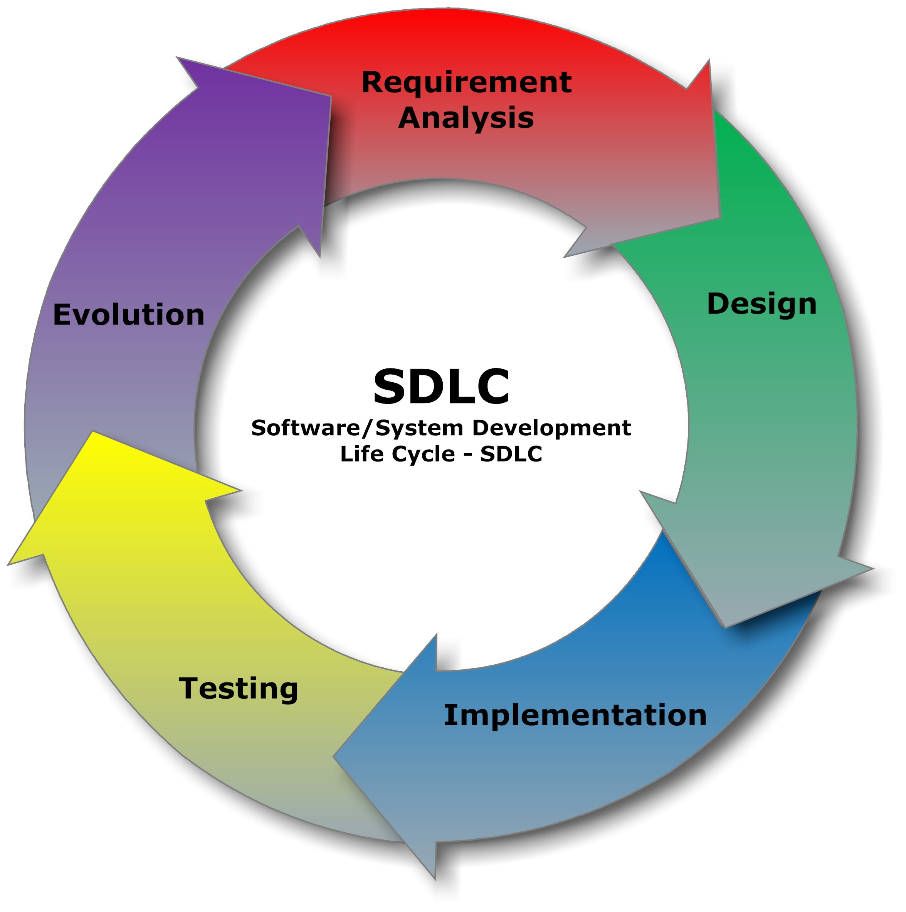

---
jupyter:
  celltoolbar: Slideshow
  jupytext:
    notebook_metadata_filter: -kernelspec,-jupytext.text_representation.jupytext_version,rise,celltoolbar
    text_representation:
      extension: .md
      format_name: markdown
      format_version: '1.3'
  rise:
    theme: solarized
---

<!-- #region slideshow={"slide_type": "slide"} editable=true -->
# Section 3: Software Development as a Process

</br>
</br>
<center></center>
<!-- #endregion -->

<!-- #region slideshow={"slide_type": "notes"} -->
- There is a lot bundled in here! Make it clear this will be a challenging section
- We are going to step up a level and look at the overall process of developing software
<!-- #endregion -->

<!-- #region slideshow={"slide_type": "subslide"} editable=true -->
## Writing Code versus Engineering Software

- Software is _not_ just a tool for answering a research question
- Writing code is only concerned with the implementation of software
- Sofware Engineering views software in a holistic manner
  - Software has a _lifecycle_ ♻
  - Software has stakeholders 👥
  - Software is an asset with its own inherent value 💵
  - Software can be reused 🔁
<!-- #endregion -->

<!-- #region slideshow={"slide_type": "notes"} editable=true -->
- Software is _not_ just a tool for answering a research question
  - Software is shared frequently between researchers and _reused_ after publication
  - Therefore, we need to be concerned with more than just the implementation, i.e. "writing code"
- Sofware Engineering views software in a holistic manner
  - Software has a _lifecycle_: more on the next slide
  - Software has stakeholders: it might just be you the researcher now, but invariably other people will be involved in using or developing the code eventually
  - Software is an asset with its own inherent value: algorithms it contains and what those can do, encoded knowledge of lessons learned along the way, etc.
  - Software can be reused: like with stakeholders, it is hard to predict how the software will be used in the future, and we want to make it easy for reuse to happen
<!-- #endregion -->

<!-- #region slideshow={"slide_type": "subslide"} editable=true -->
## Software Development Lifecycle

<center></center>

<a href="https://commons.wikimedia.org/wiki/File:SDLC_-_Software_Development_Life_Cycle.jpg">Cliffydcw</a>, <a href="https://creativecommons.org/licenses/by-sa/3.0">CC BY-SA 3.0</a>, via Wikimedia Commons
<!-- #endregion -->

<!-- #region slideshow={"slide_type": "notes"} editable=true -->
The typical stages of a software development process can be categorised as follows:

- Requirements gathering (coming up next): the process of identifying and recording the exact requirements for a software project before it begins. This helps maintain a clear direction throughout development, and sets clear targets for what the software needs to do.
- Design (later in this section): where the requirements are translated into an overall design for the software. It covers what will be the basic software ‘components’ and how they’ll fit together, as well as the tools and technologies that will be used, which will together address the requirements identified in the first stage. Designs are quite dependent on what programming paradigm is used, something we will explore also in a later section.
- Implementation (throughout this course): the software is developed according to the design, implementing the solution that meets the requirements set out in the requirements gathering stage.
- Testing (done in section 2): the software is tested with the intent to discover and rectify any defects, and also to ensure that the software meets its defined requirements, i.e. does it actually do what it should do reliably?
- Deployment (not shown on this figure): where the software is deployed or in some way released, and used for its intended purpose within its intended environment.
- Maintenance/evolution: where updates are made to the software to ensure it remains fit for purpose, which typically involves fixing any further discovered issues and evolving it to meet new or changing requirements.

The process of following these stages, particularly when undertaken in this order, is referred to as the waterfall model of software development.
Each stage’s outputs flow into the next stage sequentially.
As the cyclic nature of the image suggests, this linear process is not the only, nor necessarily the best,
way to think about the SDLC.

There is value we get from following some sort of process:

- Stage gating: a quality gate at the end of each stage, where stakeholders review the stage’s outcomes to decide if that stage has completed successfully before proceeding to the next one, or if the next stage is not warranted at all. For example, it may be discovered during requirements collection, design, or implementation that development of the software isn’t practical or even required.
- Predictability: each stage is given attention in a logical sequence; the next stage should not begin until prior stages have completed. Returning to a prior stage is possible and may be needed, but may prove expensive, particularly if an implementation has already been attempted. However, at least this is an explicit and planned action.
- Transparency: essentially, each stage generates output(s) into subsequent stages, which presents opportunities for them to be published as part of an open development process.
- It saves time: a well-known result from empirical software engineering studies is that it becomes exponentially more expensive to fix mistakes in future stages. For example, if a mistake takes 1 hour to fix in requirements, it may take 5 times that during design, and perhaps as much as 20 times that to fix if discovered during testing.

<!-- #endregion -->

<!-- #region slideshow={"slide_type": "slide"} -->
## Software Requirements

- How can we capture and organise what is required for software to function as intended?
  - With software requirements of course!
  - They are the linchpin of ensuring our software does what it is supposed to do
- We will look at 3 types:
  1. business requirements: the why
  2. user requirements: the who and what
  3. solution requirements: the how
<!-- #endregion -->

<!-- #region slideshow={"slide_type": "subslide"} editable=true -->
### Breakout: Reading and Exercises

Read from the top of the "Software Requirements" page and do the exercises as you go.
<!-- #endregion -->

<!-- #region slideshow={"slide_type": "notes"} editable=true -->
If you are using a shared document, you could have sections for each of the
requirement types and get learners to write their suggestions in there.
Afterwards, you could go through some of the suggestions and see whether there
is agreement about whether they have been categorised correctly.
<!-- #endregion -->

<!-- #region slideshow={"slide_type": "slide"} -->
## ☕ 5 Minute Break ☕
<!-- #endregion -->

<!-- #region slideshow={"slide_type": "slide"} -->
## Software Architecture and Design
<!-- #endregion -->

<!-- #region slideshow={"slide_type": "subslide"} -->
## Maintainable Code

Software Architecture and Design is about writing *maintainable code*.

 * Easy to read
 * Testable
 * Adaptable

<!-- #endregion -->

<!-- #region slideshow={"slide_type": "subslide"} -->
## Maintainable Code

Maintainable code is vital as projects grow

 * More people being involved
 * Adding new features

<!-- #endregion -->

<!-- #region slideshow={"slide_type": "subslide"} -->

## Exercise:

Try to come up with examples of code that has been hard to understand - why?

Try to come up with examples of code that was easy to understand and modify - why?

Time: 5min

<!-- #endregion -->

<!-- #region slideshow={"slide_type": "notes"} -->
After 5 min spend 5-15 min discussing examples the group has come up with
<!-- #endregion -->

<!-- #region slideshow={"slide_type": "subslide"} -->

## Cognitive Load

For code to be readable, readers have to be able to understand what the code does.

Cognitive load - the amount a reader has to remember at once

There is a limit (and it is low!)

<!-- #endregion -->

<!-- #region slideshow={"slide_type": "subslide"} -->

## Cognitive Load

Reduce cognitive load for a bit of code by:

 * Good variable names: `toroidal_magnetic_field` much better than `btor`
 * Simple control flow
 * Functions doing one thing
 * Good abstractions (next slide!)

<!-- #endregion -->

<!-- #region slideshow={"slide_type": "notes"} -->
Good variable names - we not longer have punch card restrictions, so use more descriptive names!

Simple control flow - explain means not lots of nesting if statement or for loops
<!-- #endregion -->

<!-- #region slideshow={"slide_type": "subslide"} -->

## Abstractions

An **abstraction** hides the details of one part of a system from another.

<!-- #endregion -->

<!-- #region slideshow={"slide_type": "notes"} -->
Give some examples of abstractions, or maybe ask for people to think of ideas of abstractions in the real world?

Examples:

- A brake pedal in a car: we don't need to know the exact mechanism by which the car slows down, so that implementation has been "abstracted" away from the car user
- Similarly, a light switch is an abstraction: we don't need to know what happens with the wiring and flow of electricity in order to understand that one side means the light will be on and vice versa
- human society is full of things like these...
<!-- #endregion -->

<!-- #region slideshow={"slide_type": "subslide"} -->

## Abstractions

Help to make code easier - as do not have to understand details all at once.

Lowers cognitive load for each part.

<!-- #endregion -->

<!-- #region slideshow={"slide_type": "subslide"} -->

## Refactoring

**Refactoring** is modifying code, such that:

 * external behaviour unchanged,
 * code itself is easier to read / test / extend.

<!-- #endregion -->

<!-- #region slideshow={"slide_type": "subslide"} -->

## Refactoring

Refactoring is vital for improving code quality.
<!-- #endregion -->

<!-- #region slideshow={"slide_type": "notes"} -->
Often working on existing software - refactoring is how we improve it
<!-- #endregion -->

<!-- #region slideshow={"slide_type": "subslide"} -->

## Refactoring Loop

When making a change to a piece of software, do the following:

* Automated tests verify current behaviour
* Refactor code (so new change slots in cleanly)
* Re-run tests to ensure nothing is broken
* Make the desired change, which now fits in easily.

<!-- #endregion -->

<!-- #region slideshow={"slide_type": "subslide"} -->

## Refactoring

Rest of section we will learn how to refactor an existing piece of code
<!-- #endregion -->

<!-- #region editable=true slideshow={"slide_type": "notes"} -->
In the process of refactoring, we will try to target some of the "good practices" we just talked about, like making good abstractions and reducing cognitive load.
<!-- #endregion -->

<!-- #region slideshow={"slide_type": "subslide"} -->

## Refactoring Exercise

Look at `inflammation/compute_data.py`
<!-- #endregion -->

<!-- #region slideshow={"slide_type": "notes"} editable=true -->
Bring up the code

Explain the feature:
In it, if the user adds --full-data-analysis then the program will scan the directory of one of the provided files, compare standard deviations across the data by day and plot a graph.

The main body of it exists in inflammation/compute_data.py in a function called analyse_data.
<!-- #endregion -->

<!-- #region slideshow={"slide_type": "subslide"} editable=true -->

## Exercise: why is not this code maintainable?

How is this code hard to maintain?

Maintainable code should be:

 * Easy to read
 * Easy to test
 * Easy to extend or modify

Time: 5min
<!-- #endregion -->

<!-- #region slideshow={"slide_type": "notes"} editable=true -->
Solution:

Hard to read: Everything is in a single function - reading it you have to understand how the file loading works at the same time as the analysis itself.

Hard to modify: If you want to use the data without using the graph you’d have to change it

Hard to modify or test: It is always analysing a fixed set of data stored on the disk

Hard to modify: It doesn’t have any tests meaning changes might break something
<!-- #endregion -->

<!-- #region slideshow={"slide_type": "subslide"} -->

## Key Points

> "Good code is written so that is readable, understandable, covered by automated tests, not over complicated and does well what is intended to do."

<!-- #endregion -->

<!-- #region slideshow={"slide_type": "slide"} -->
## ☕ 5 Minute Break ☕
<!-- #endregion -->

<!-- #region slideshow={"slide_type": "slide"} -->
## Refactoring Functions to do Just One Thing
<!-- #endregion -->

<!-- #region slideshow={"slide_type": "subslide"} -->
## Introduction

Functions that just do one thing are:

* Easier to test
* Easier to read
* Easier to re-use

<!-- #endregion -->

<!-- #region slideshow={"slide_type": "notes"} editable=true -->
We identified last episode that the code has a function that does many more than one thing

Hard to understand - high cognitive load

Hard to test as mixed lots of different things together

Hard to reuse as was very fixed in its behaviour.
<!-- #endregion -->

<!-- #region slideshow={"slide_type": "subslide"} -->
## Test Before Refactoring

* Write tests *before* refactoring to ensure we do not change behaviour.

<!-- #endregion -->

<!-- #region slideshow={"slide_type": "subslide"} -->
## Writing Tests for Code that is Hard to Test

What can we do?

* Test at a higher level, with coarser accuracy
* Write "hacky" temporary tests

<!-- #endregion -->

<!-- #region slideshow={"slide_type": "notes"} -->
Think of hacky tests like scaffolding - we will use them to ensure we can do the work safely,
but we will remove them in the end.
<!-- #endregion -->

<!-- #region slideshow={"slide_type": "subslide"} -->
## Exercise: Write a Regression Test for Analyse Data Before Refactoring

Add a new test file called `test_compute_data.py` in the tests folder. There is more information on the relevant web page.
Complete the regression test to verify the current output of analyse_data is unchanged by the refactorings we are going to do.

Time: 10min
<!-- #endregion -->

<!-- #region slideshow={"slide_type": "notes"} -->
Hint: You might find it helpful to assert the results equal some made up array, observe the test failing and copy and paste the correct result into the test.

When talking about the solution:

 * We will have to remove it as we modified the code to get it working
 * Is not a good test - not obvious it is correct
 * Brittle - changing the files will break the tests
<!-- #endregion -->


<!-- #region slideshow={"slide_type": "subslide"} -->
## Pure Functions

A **pure function** takes in some inputs as parameters, and it produces a consistent output.

That is, just like a mathematical function.

The output does not depend on externalities.

There will be no side effects from running the function

<!-- #endregion -->

<!-- #region slideshow={"slide_type": "notes"} editable=true -->
Externalities like what is in a database or the time of day

Side effects like modifying a global variable or writing a file
<!-- #endregion -->

<!-- #region slideshow={"slide_type": "subslide"} editable=true -->
## Pure Functions

Pure functions have a number of advantages for maintainable code:

 * Easier to read as do not need to know calling context
 * Easier to reuse as do not need to worry about invisible dependencies

<!-- #endregion -->

<!-- #region slideshow={"slide_type": "subslide"} editable=true -->
## Refactor Code into a Pure Function

Refactor the analyse_data function into a pure function with the logic, and an impure function that handles the input and output. The pure function should take in the data, and return the analysis results:

```python
def compute_standard_deviation_by_day(data):
  # TODO
  return daily_standard_deviation
```

Time: 10min

<!-- #endregion -->

<!-- #region slideshow={"slide_type": "subslide"} editable=true -->
## Testing Pure Functions

Pure functions are also easier to test

 * Easier to write as can create the input as we need it
 * Easier to read as do not need to read any external files
 * Easier to maintain - tests will not need to change if the file format changes

<!-- #endregion -->

<!-- #region slideshow={"slide_type": "notes"} -->
Can focus on making sure we get all edge cases without real world considerations
<!-- #endregion -->

<!-- #region slideshow={"slide_type": "subslide"} -->
## Write Test Cases for the Pure Function

Now we have refactored our a pure function, we can more easily write comprehensive tests. Add tests that check for when there is only one file with multiple rows, multiple files with one row and any other cases you can think of that should be tested.

Time: 10min

<!-- #endregion -->

<!-- #region slideshow={"slide_type": "subslide"} -->
## Functional Programming

Pure functions are a concept from an approach to programming called **functional programming**.

Python, and other languages, provide features that make it easier to write "functional" code:

 * `map` / `filter` / `reduce` can be used to chain pure functions together into pipelines

<!-- #endregion -->

<!-- #region slideshow={"slide_type": "notes"} editable=true -->
If there is time - do some live coding to show imperative code, then transform into a pipeline:

 * Sequence of numbers
 * Remove all the odd numbers
 * Square all the numbers
 * Add them together


```python
# Imperative
numbers = range(1, 100)
total = 0
for number in numbers:
    if number % 2 == 0:
        squared = number**2
        total += squared


# Functional
def is_even(number):
    return number % 2 == 0


def squared(number):
    return number**2


total = sum(map(squared, filter(is_even, numbers)))
```

<!-- #endregion -->

<!-- #region slideshow={"slide_type": "slide"} editable=true -->
## ☕ 10 Minute Break ☕
<!-- #endregion -->

<!-- #region slideshow={"slide_type": "slide"} editable=true -->
## Using Classes to Decouple Code
<!-- #endregion -->

<!-- #region slideshow={"slide_type": "subslide"} editable=true -->
### Decoupled Code

When thinking about code, we tend to think of it in distinct parts or **units**.

Two units are **decoupled** if changes in one can be made independently of the other

<!-- #endregion -->

<!-- #region slideshow={"slide_type": "notes"} editable=true -->
E.g we have the part that loads a file and the part that draws a graph

Or the part that the user interacts with and the part that does the calculations
<!-- #endregion -->

<!-- #region slideshow={"slide_type": "subslide"} editable=true -->
### Decoupled Code

Abstractions allow decoupling code

<!-- #endregion -->

<!-- #region slideshow={"slide_type": "notes"} editable=true -->
When we have a suitable abstraction, we do not need to worry about the inner workings of the other part.

For example break of a car, the details of how to slow down are abstracted, so when we change how
breaking works, we do not need to retrain the driver.
<!-- #endregion -->

<!-- #region slideshow={"slide_type": "subslide"} editable=true -->
### Exercise: Decouple the File Loading from the Computation

Currently the function is hard coded to load all the files in a directory.

Decouple this into a separate function that returns all the files to load

Time: 10min

<!-- #endregion -->

<!-- #region slideshow={"slide_type": "subslide"} editable=true -->
### Decoupled... but not completely

Although we have separated out the data loading, there is still an assumption and therefore coupling in terms of the format of that data (in this case CSV).

Is there a way we could make this more flexible?
<!-- #endregion -->

<!-- #region editable=true slideshow={"slide_type": "notes"} -->
- The format of the data stored is a practical detail which we don't want to limit the use of our `analyse_data()` function
- We could add an argument to our function to specify the format, but then we might have quite a long conditional list of all the different possible formats, and the user would need to request changes to `analyse_data()` any time they want to add a new format
- Is there a way we can let the user more flexibly specify the way in which their data gets read?
<!-- #endregion -->

<!-- #region editable=true slideshow={"slide_type": "fragment"} -->
One way is with **classes**!
<!-- #endregion -->

<!-- #region slideshow={"slide_type": "subslide"} editable=true -->
### Python Classes

A **class** is a Python feature that allows grouping methods (i.e. functions) with some data.

<!-- #endregion -->

<!-- #region slideshow={"slide_type": "notes"} editable=true -->
Do some live coding, ending with:

```python
import math

class Circle:
  def __init__(self, radius):
    self.radius = radius

  def get_area(self):
    return math.pi * self.radius * self.radius

my_circle = Circle(10)
print(my_circle.get_area())
```

<!-- #endregion -->

<!-- #region slideshow={"slide_type": "subslide"} editable=true -->
### Exercise: Use a Class to Configure Loading

Put the `load_inflammation_data` function we wrote in the last exercise as a member method of a new class called `CSVDataSource`.

Put the configuration of where to load the files in the class' initialiser.

Once this is done, you can construct this class outside the the statistical analysis and pass the instance in to analyse_data.

Time: 10min

<!-- #endregion -->

<!-- #region slideshow={"slide_type": "subslide"} editable=true -->
### Interfaces

**Interfaces** describe how different parts of the code interact with each other.

<!-- #endregion -->

<!-- #region slideshow={"slide_type": "notes"} editable=true -->
For example, the interface of the breaking system in a car, is the break pedal.
The user can push the pedal harder or softer to get more or less breaking.
The interface of our circle class is the user can call get_area to get the 2D area of the circle
as a number.
<!-- #endregion -->

<!-- #region slideshow={"slide_type": "subslide"} editable=true -->
### Interfaces

Question: what is the interface for CSVDataSource

```python
class CSVDataSource:
  """
  Loads all the inflammation csvs within a specified folder.
  """
  def __init__(self, dir_path):
    self.dir_path = dir_path

  def load_inflammation_data(self):
    data_file_paths = glob.glob(os.path.join(self.dir_path, 'inflammation*.csv'))
    if len(data_file_paths) == 0:
      raise ValueError(f"No inflammation csv's found in path {self.dir_path}")
    data = map(models.load_csv, data_file_paths)
    return list(data)
```

<!-- #endregion -->

<!-- #region slideshow={"slide_type": "notes"} editable=true -->
Suggest discuss in groups for 1min.

Answer: the interface is the signature of the `load_inflammation_data()` method, i.e. what arguments it takes and what it returns.
<!-- #endregion -->

<!-- #region slideshow={"slide_type": "subslide"} editable=true -->
### Common Interfaces

If we have two classes that share the same interface, we can use the interface without knowing which class we have

<!-- #endregion -->

<!-- #region slideshow={"slide_type": "notes"} editable=true -->
Easiest shown with an example, lets do more live coding:

```python
class Rectangle(Shape):
  def __init__(self, width, height):
    self.width = width
    self.height = height
  def get_area(self):
    return self.width * self.height

my_circle = Circle(radius=10)
my_rectangle = Rectangle(width=5, height=3)
my_shapes = [my_circle, my_rectangle]
total_area = sum(shape.get_area() for shape in my_shapes)
```

<!-- #endregion -->

<!-- #region slideshow={"slide_type": "subslide"} editable=true -->
### Polymorphism

Using an interface to call different methods is a technique known as **polymorphism**.

A form of abstraction - we have abstracted what kind of shape we have.

<!-- #endregion -->

<!-- #region slideshow={"slide_type": "subslide"} editable=true -->
### Exercise: Introduce an alternative implementation of DataSource

Polymorphism is very useful - suppose we want to read a JSON (JavaScript Object Notation) file.

Write a class that has the same interface as `CSVDataSource` that
loads from JSON.

There is a function in `models.py` that loads from JSON.

Time: 15min

<!-- #endregion -->

<!-- #region editable=true slideshow={"slide_type": "notes"} -->
Remind learners to check the course webpage for further details and some important hints.
<!-- #endregion -->

<!-- #region slideshow={"slide_type": "subslide"} -->
### Mocks

Another use of polymorphism is **mocking** in tests.

<!-- #endregion -->

<!-- #region slideshow={"slide_type": "notes"} editable=true -->

Lets live code a mock shape:

```python
from unittest.mock import Mock

def test_sum_shapes():

  mock_shape1 = Mock()
  mock_shape1.get_area().return_value = 10

  mock_shape2 = Mock()
  mock_shape2.get_area().return_value = 13
  my_shapes = [mock_shape1, mock_shape2]
  total_area = sum(shape.get_area() for shape in my_shapes)

  assert total_area = 23
```

Easier to read this test as do not need to understand how
get_area might work for a real shape.

Focus on testing behaviour rather than implementation.

<!-- #endregion -->

<!-- #region slideshow={"slide_type": "subslide"} editable=true -->
## Exercise: Test Using a Mock Implementation

Complete the exercise to write a mock data source for `analyse_data`.

Time: 15min

<!-- #endregion -->

<!-- #region slideshow={"slide_type": "subslide"} editable=true -->

## Object Oriented Programming

These are techniques from **object oriented programming**.

There is a lot more that we will not go into:

* Inheritance
* Information hiding

<!-- #endregion -->

<!-- #region slideshow={"slide_type": "subslide"} -->

## A note on Data Classes

Regardless of doing Object Oriented Programming or Functional Programming

**Grouping data into logical classes is vital for writing maintainable code.**

<!-- #endregion -->

<!-- #region slideshow={"slide_type": "slide"} -->
## ☕ 10 Minute Break ☕
<!-- #endregion -->

<!-- #region slideshow={"slide_type": "slide"} -->
## Architecting Code to Separate Responsibilities
<!-- #endregion -->

<!-- #region slideshow={"slide_type": "subslide"} -->
## Model-View-Controller

Reminder - this program is using the MVC Architecture:

* Model - Internal data of the program, and operations that can be performed on it
* View - How the data is presented to the user
* Controller - Responsible for how the user interacts with the system

<!-- #endregion -->

<!-- #region slideshow={"slide_type": "subslide"} -->
### Breakout: Read and do the exercise

Read the section **Separating Out Responsibilities**.

Complete the exercise.

Time: 10min

<!-- #endregion -->

<!-- #region slideshow={"slide_type": "notes"} -->
Suggest discussing answer to the exercise as a table.
Once time is up, ask one table to share their answer and any questions
Then do the other exercise
<!-- #endregion -->

<!-- #region slideshow={"slide_type": "subslide"} -->
### Breakout Exercise:  Split out the model code from the view code

Refactor `analyse_data` such the view code we identified in the last exercise is removed from the function, so the function contains only model code, and the view code is moved elsewhere.

Time: 10min

<!-- #endregion -->

<!-- #region slideshow={"slide_type": "subslide"} -->

## Programming Patterns

* MVC is a programming pattern
* Others exist - like the visitor pattern
* Useful for discussion and ideas - not a complete solution

<!-- #endregion -->

<!-- #region slideshow={"slide_type": "notes"} -->

Next slide if it feels like we have got loads of time.

<!-- #endregion -->

<!-- #region slideshow={"slide_type": "subslide"} -->
### Breakout Exercise:  Read about a random pattern on the website and share it with the group

Go to the website linked and pick a random pattern, see if you can understand what it is doing
and why you'd want to use it.

Time: 15min

<!-- #endregion -->

<!-- #region slideshow={"slide_type": "subslide"} -->

## Architecting larger changes

* Use diagrams of boxes and lines to sketch out how code will be structured
* Useful for larger changes, new code, or even understanding complex projects

<!-- #endregion -->

<!-- #region slideshow={"slide_type": "subslide"} -->

## Exercise: Design a high-level architecture

Sketch out a design for something you have come up with or the current project.


Time: 10min

<!-- #endregion -->

<!-- #region slideshow={"slide_type": "notes"} -->

At end of time, share diagrams, discussion.

<!-- #endregion -->

<!-- #region slideshow={"slide_type": "subslide"} -->

## Breakout: Read to end of page

Read til the end, including the exercise on real world examples

Time: 15min

<!-- #endregion -->

<!-- #region slideshow={"slide_type": "notes"} -->

At end of time, reconvene to discuss real world examples as a group.

<!-- #endregion -->

<!-- #region slideshow={"slide_type": "subslide"} -->

## Conclusion

Good software architecture and design is a **huge** topic.

Practise makes perfect:

 * Spot signs things could be improved - like duplication
 * Think about why things are working or not working
 * Do not design for an imagined future
 * Keep refactoring as you go

<!-- #endregion -->


<!-- #region slideshow={"slide_type": "slide"} -->
## 🕓 End of Section 3 🕓
<!-- #endregion -->
