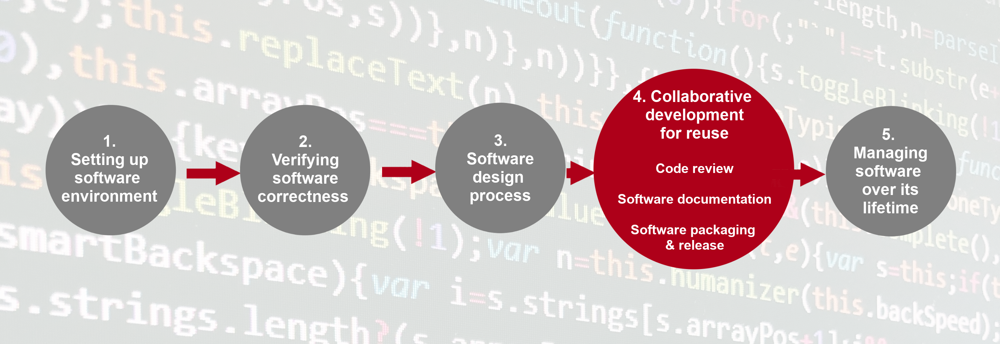

---
jupyter:
  celltoolbar: Slideshow
  jupytext:
    notebook_metadata_filter: -kernelspec,-jupytext.text_representation.jupytext_version,rise,celltoolbar
    text_representation:
      extension: .md
      format_name: markdown
      format_version: '1.3'
  rise:
    theme: solarized
---

<!-- #region slideshow={"slide_type": "slide"} -->
# Section 4: Collaborative Software Development for Reuse

</br>
</br>
<center></center>
<!-- #endregion -->

<!-- #region slideshow={"slide_type": "notes"} -->
- up until this point, the course has been primarily focussed on technical practices, tools, and infrastructure, and primarily from the perspective of a single developer/researcher, albeit within a team environment
- in this section, we are going to start broadening our attention to the collaborative side of software development
  - there are primarily two practices that facilitate collaboration: code review and package release
- code review has many benefits, but top among them is that it provides a gate check on software quality, 
  - it is also a way to share knowledge within a team, improving the redundancy of that team (which is actually a good thing regardless of what corporate types might say!)
  - getting another set of eyes on your code also means you are less likely to flout coding standards and convention
  - there are many different types of code review, and we will explore the most common in this section
- the other collaborative practice is packaging our software for release
  - it will be very difficult to collaborate if no one else is able to install our software
  - we have used a very rudimentary technique for distributing our project up until now, and it has some key limitations
  - to overcome these, we will look at a tool called Poetry and use it to help make our Python package more distributable
  - we will also talk about some more general points around software maintainability and sustainability that should be done before distributing our software
<!-- #endregion -->

<!-- #region slideshow={"slide_type": "slide"} -->
## Quick Check: Who Has All the Branches!

Check if you have a branch named `remote/origin/feature-std-dev` or `feature-std-dev` after running:

```bash
git branch --all
```

If not, please run these commands:

```bash
git remote add upstream git@github.com:ukaea-rse-training/python-intermediate-inflammation.git
git fetch upstream
git checkout upstream/feature-std-dev
git switch --create feature-std-dev
git push --set-upstream origin feature-std-dev
```
<!-- #endregion -->

<!-- #region slideshow={"slide_type": "slide"} -->
## Developing Software in a Team: Code Review

Two main ways to collaborate with git:

1. Fork and Pull Model
2. Shared Repository Model

<!-- #endregion -->

<!-- #region slideshow={"slide_type": "notes"} -->
TODO make a nice mermaid diagram for this

- In the absence of a nice diagram, draw something on the whiteboard for the above
<!-- #endregion -->

<!-- #region slideshow={"slide_type": "subslide"} -->
### Code Review

> Code review (n.): a software quality assurance practice where one or several people from the team, different from the code’s author, check the software by viewing parts of its source code, making comments, and rejecting or approving those changes
<!-- #endregion -->

<!-- #region slideshow={"slide_type": "notes"} -->
- Up until now, we have been merging code into our main branches individually
  - This is generally not how things are done in teams
  - Instead, there is a gate check before anything gets merged into the main or develop branch of a repo
<!-- #endregion -->

<!-- #region slideshow={"slide_type": "fragment"} -->
Lots of benefits:

1. 👥 Knowledge sharing: improve redundancy in the team.
2. 🧠 Explanation improves understanding and rationale. Better decisions are made.
3. ❌ Reduce errors in code. Between 60 and 90% of errors can be caught by rigourous code review (Fagan, 1979).
   - Errors caught earlier are 10 to 100 times less expensive or time-consuming to fix.
<!-- #endregion -->

<!-- #region slideshow={"slide_type": "subslide"} -->
### Types of Code Review

1. Over-the-shoulder review
2. Pair programming
3. Formal code inspection
4. **Asynchronous, tool-assisted review ⬅️**
<!-- #endregion -->

<!-- #region slideshow={"slide_type": "notes"} -->
- There are a variety of different code review techniques
  - Briefly explain each
- We will be using **asynchronous, tool-assisted review** because it is currently the most common form in software development, especially with the rise of interfaces like GitHub and GitLab
<!-- #endregion -->

<!-- #region slideshow={"slide_type": "subslide"} -->
### Code Review Exercise Steps

<center></center>

<!-- #endregion -->

<!-- #region slideshow={"slide_type": "notes"} -->
TODO the source of the png is online from mermaid.ink editor. We should figure a way to incorporate mermaid into these slides directly.

- Walk through the steps of the code review process
<!-- #endregion -->

<!-- #region slideshow={"slide_type": "subslide"} -->
### Exercise: Raising a pull request for your fictional colleague

Go through the steps described under heading. Stop when you reach **Reviewing a pull request**
<!-- #endregion -->

<!-- #region slideshow={"slide_type": "notes"} -->
- Should be pretty quick, 5 minutes max.
- Status check then move on.
<!-- #endregion -->

<!-- #region slideshow={"slide_type": "subslide"} -->
### Exercise: review some code

Pair up with someone else in your group and exchange repository links. You will be taking on the role of _Reviewer_ on your partner's repository. Before leaving review comments, read the content under the heading **Reviewing a pull request**. Try to make a comment from each of the main areas identified.

**Do not submit your review just yet!!!**
<!-- #endregion -->

<!-- #region slideshow={"slide_type": "notes"} -->
- 10-15 minutes
- Status check then move on.
<!-- #endregion -->

<!-- #region slideshow={"slide_type": "subslide"} -->
### Exercise: review the code for suitable tests

Add a list of expected tests to the comment box after clicking `Finish your review` near the top right of the `Files changed` tab. Use the content under **Making sure code is valid** to come up with these tests, and think back to the requirement SR1.1.1.

When done, select `Request changes` from the list of toggles, then `Submit review`.
<!-- #endregion -->

<!-- #region slideshow={"slide_type": "notes"} -->
- 10-15 minutes
- Status check then move on.
<!-- #endregion -->

<!-- #region slideshow={"slide_type": "subslide"} -->
### Exercise: responding and addressing comments

Respond to the _Reviewers_ comments on the PR in _your_ repository. Use the information in **Responding to review comments** to guide your responses. And remember that you can talk to your _Reviewer_ for clarification, just make sure you record that in a comment on the PR.

Do not implement changes that will take more than 5 minutes. Instead, raise them as an issue on your repo for future work, and link to that issue in a comment on the PR.
<!-- #endregion -->

<!-- #region slideshow={"slide_type": "notes"} -->
- 10-15 minutes
  - tell learners not to worry too much about implementing all of the changes requested by reviewers. If it looks like a requested change will take longer than 5 mintues, open a new issue on your repository to address it in the future.
- Status check then move on.
<!-- #endregion -->

<!-- #region slideshow={"slide_type": "subslide"} -->
### Making code easy to review

- 🤏 Keep the changes small.
- 1️⃣ Keep each commit as one logical change.
- 🪟 Provide a clear description of the change.
- 🕵️ Review your code yourself, before requesting a review.

<!-- #endregion -->

<!-- #region slideshow={"slide_type": "subslide"} -->
### Empathy in review comments

* Identify positives in code as and when you find them
* Remember different does not mean better
* Only provide a few non-critical suggestions - you are aiming for better rather than perfect
* Ask questions to understand why something has been done a certain way rather than assuming you
  know a better way
* If a conversation is taking place on a review and hasn't been resolved by a
  single back-and-forth exchange, then schedule a conversation to discuss instead
  (recording the results of the discussion in the PR)
<!-- #endregion -->

<!-- #region slideshow={"slide_type": "subslide"} -->
### Exercise: Code Review in Your Own Working Environment

Follow the instructions under this exercise heading. Read the content above the exercise to figure out what is involved in a code review process for a team. After about 5 minutes, have a small conversation in your group about what your code review process would look like.
<!-- #endregion -->

<!-- #region slideshow={"slide_type": "slide"} -->
## Preparing Software for Reuse and Release
<!-- #endregion -->

<!-- #region slideshow={"slide_type": "subslide"} -->
- 🔁 We want our code to be somewhere on the "reusablility" spectrum
- 📝 Documentation is an important part of our code being reusable
<!-- #endregion -->

<!-- #region slideshow={"slide_type": "notes"} -->
- We want our code to be somewhere on the "reusablility" spectrum
  - but where exactly? this will depend on the maturity of your code and how widely it will be used (similar to testing)
  - at a minimum, we want to aim for reproducibility if we are publishing: someone else should be able to take our code and data and run it themselves and get the same result
  - however, for big library packages, we probably want to bump that up to reusable, where our code is easy to use, understand, and modify
- Documentation is an important part of our code being reusable
  - Even if you write incredibly expressive code, it will not be enough for someone new to start using and modifying your code base
  - How do they install it? Are there any development tools they need? What is the scientific context and limitations of the code?
  - We need to answer all of these questions and more if we want our code to be approachable and reusable
  
TODO would be nice to modify the image from <https://the-turing-way.netlify.app/_images/reproducible-definition-grid.svg> so that it better reflects the ACM definition of reproducibility/replicability
<!-- #endregion -->

<!-- #region slideshow={"slide_type": "subslide"} -->
### Breakout: Start from the Top

Start from the top of this episode page and go to the end.
<!-- #endregion -->

<!-- #region slideshow={"slide_type": "notes"} -->
- Learners can skim the first two sections if you have talked about them in the previous slide
- Split into breakout rooms for about 50 minutes
- A preface note: if you have been using codimd or hackmd for the shared document, then learners will have already been exposed to Markdown, so this section will not contain much new for them
- Post episode comments
  - A README is a great place to start your documentation, but at some point it will outgrow that, and you will need a bigger documentation system. The most popular in Python is Sphinx, which can be used with Markdown or another markup language called ReStructuredText (`.rst` files)
  - For writing documentation, this is another great link that can be added to the shared document: https://documentation.divio.com/
  - For licensing software, make some notes in the shared document about the policy of your institution
<!-- #endregion -->

<!-- #region slideshow={"slide_type": "slide"} -->
## ☕ Break Time ☕
<!-- #endregion -->

<!-- #region slideshow={"slide_type": "slide"} -->
## Packaging Code for Release and Distribution
<!-- #endregion -->

<!-- #region slideshow={"slide_type": "slide"} -->
### Why Package Our Software?

- ⏬ It reduces "the complexity of fetching, installing, and integrating it [our code] for the end-users"
- 📦 Packaging combines the relevant source files and necessary metadata to achieve the above
- 😕 Confusing term, _package_
  - module _package_ : a directory containing Python files and an `__init__.py` file
  - distributable _package_ : a way of structuring and bundling a Python project for easier distribution and installation
<!-- #endregion -->

<!-- #region slideshow={"slide_type": "subslide"} -->
### Packaging Our Software with Poetry

- 📌 Pinning dependencies in a `requirements.txt` has some limitations
- 📜 Poetry is a tool that helps overcome some of these deficiencies
<!-- #endregion -->

<!-- #region slideshow={"slide_type": "notes"} -->
- 📌 Pinning dependencies in a `requirements.txt` has some serious limitations
  - It does not differentiate between production dependencies (i.e. what our package needs to be used in a standalone manner) and library dependencies (i.e. what our package needs to be used as part of another application, which itself has dependencies)
  - It reduces the portability of our code across Python versions: some learners may have encountered this when setting up the CI matrices in GitHub Actions. e.g. Pinning dependencies at Python 3.10 could (and does!) cause issues if those same dependencies need to be installed in a Python 3.8 environment.
  - It is prone to error: what if we forget to add a dependency to requirements.txt? We could happily use pip to install something into our environment and the code will work, but when someone tries to use it themselves, they will be missing a dependency and the code will error out. In other words, we have two disconnected steps we need to perform when installing a dependency.
  - Distributing Python packages to popular repositories like PyPI requires more metadata than having a simple `requirements.txt` and we would need to manually create this
- 📜 Poetry is a tool that helps overcome some of these deficiencies
  - It separates production and library dependencies between `poetry.lock` and `pyproject.toml`
  - It provides a unified interface for adding dependencies to our project so that this is immediately recorded upon installation
  - It partially automates the process of creating a distributable package
<!-- #endregion -->

<!-- #region slideshow={"slide_type": "subslide"} -->
### Installing Poetry

| ⚠️ Warning ⚠️ |
|:--------------|
| The documentation for Poetry explicitly discourages installing Poetry into your current virtual environment. Therefore, please use the installation instructions from their website. |

Since we are all on Linux, it should roughly be:

```bash
curl -sSL https://install.python-poetry.org | python3 -
ls $HOME/.local/bin  # make sure poetry executable is listed there
which poetry  # if no output, then poetry not in your path
poetry --version  # check we have access to the poetry executable
```
<!-- #endregion -->

<!-- #region slideshow={"slide_type": "notes"} -->
- Important warning: Poetry explicitly recommends that you shouldn't install Poetry within the virtual environment of a specific project. Rather, it should have its own isolated environment, which the official download script or `pipx` ensures. This is in direct contradiction to what the course material currently recommends.
  - So, unless it really is not possible, encourage learners to follow the link to Poetry's install website and follow instructions there
- Give learners about 5 mins to complete this and status check at the end
<!-- #endregion -->

<!-- #region slideshow={"slide_type": "subslide"} -->
### Setting up Our Poetry Config

- The current way of sharing our package is:
  ```bash
  git clone <our_repo>
  python -m venv venv
  . venv/bin/activate
  pip install -r requirements.txt --editable .
  python inflammation-analysis.py
  ...
  ```
  - and then there are a bunch of hoops to jump through to make sure import statements work when testing
- What if someone wants to just `pip install` our package?
- Poetry helps us with this
<!-- #endregion -->

<!-- #region slideshow={"slide_type": "notes"} -->
- The current way of sharing our package is... clunky!!!
  - and then there are a bunch of hoops to jump through to make sure import statements work when testing
- What if someone wants to just `pip install` our package?
- Poetry helps us with this
  - we need to define some metadata for our project so that poetry can properly install it in a Python environment
  - this is done in a `pyproject.toml` file that `poetry` can help us generate pretty quickly
  - send learners off to do this for about 5 minutes
<!-- #endregion -->

<!-- #region slideshow={"slide_type": "subslide"} -->
### Project Dependencies

We will look at two types of dependencies:

1. Runtime dependencies
3. Development dependencies
<!-- #endregion -->

<!-- #region slideshow={"slide_type": "fragment"} -->
Runtime dependencies can be further subdivided:

1. _Pinned_ runtime dependencies when our package is used as a standalone application
2. _Looser_ runtime dependencies when our package is used as a library
<!-- #endregion -->

<!-- #region slideshow={"slide_type": "subslide"} -->
### Exercise: Project Dependencies

Commit your initial `pyproject.toml` into git. Then, run the commands:

```bash
poetry add matplotlib numpy
poetry add --group dev pylint
poetry install
```

Inspect how `pyproject.toml` has changed. Look at what has gone into `poetry.lock`.
<!-- #endregion -->

<!-- #region slideshow={"slide_type": "notes"} -->
- Give learners a few minutes to do this
  - Then, quickly run through it and look at the changes in your own repo
- Explain when `poetry.lock` is used: if it is present in a repo when `poetry install` is called, the _exact_ versions of dependencies in `poetry.lock` will be used. Again, useful if we are distributing a standalone application.
  - Do not check in `poetry.lock` into version control if you want your package to be used as a library
- Note that the last command is quite important because it puts the current package we are developing into our environment
  - This means that some of those annoying `ModuleNotFound` errors will be eliminated
  - Generally, we want to install the package we are working on in our environment
<!-- #endregion -->

<!-- #region slideshow={"slide_type": "subslide"} -->
### Packaging Our Code

Now that we have a `pyproject.toml` file, building a distributable package is as easy as:

```bash
poetry build
```

🤯🤯🤯
<!-- #endregion -->

<!-- #region slideshow={"slide_type": "notes"} -->
- Live code what happens when you run `poetry build`
- Look at the two files in the `dist/` folder
  - The `.whl` one is what we are most interested in
  - We can send this single file directly to someone and they can `pip install` it!
  - Demo this quickly by creating a new venv, installing the `.whl` file, then run a Python interpreter and prove that we have access to our package, e.g. `from inflammation.models import daily_mean`
  - Then, show how we can more easily share this file by attaching it to a GitHub release (use the web UI)
- There are other ways to distribute your packages, notably to PyPI (which is where pip defaults to grab packages from) but we will leave that participants to figure out from the content at the bottom of the lesson
- Look at specific package registries for your institution if you have time
<!-- #endregion -->

<!-- #region slideshow={"slide_type": "slide"} -->
## 🕓 End of Section 4 🕓

☕ Break time ☕
<!-- #endregion -->
