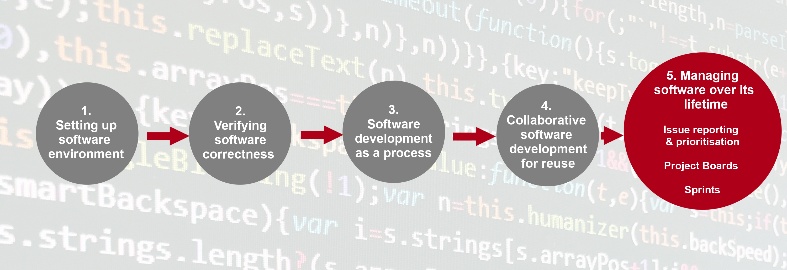

---
jupyter:
  celltoolbar: Slideshow
  jupytext:
    notebook_metadata_filter: -kernelspec,-jupytext.text_representation.jupytext_version,rise,celltoolbar
    text_representation:
      extension: .md
      format_name: markdown
      format_version: '1.3'
  rise:
    theme: solarized
---

<!-- #region slideshow={"slide_type": "slide"} -->
# Section 5: Managing and Improving Software Over Its Lifetime

 
 

<!-- #endregion -->

<!-- #region slideshow={"slide_type": "notes"} -->
- In this section of the course we look at managing the development and evolution of software - how to keep track of the tasks the team has to do, how to improve the quality and reusability of our software for others as well as ourselves, and how to assess other people’s software for reuse within our project.
- We are therefore moving into the realm of software management, not just software development; do not be scared off!
  - We all need to do a bit of project management from time to time
<!-- #endregion -->

<!-- #region slideshow={"slide_type": "subslide"} -->
## Assessing Software for Suitability and Improvement

### Breakout: Start from the Top

Start reading from the top of this episode page all the way to the end. Complete exercises as you go.

You will need to synchronise as a group at the **🖉 Decide on your Group’s Repository!** exercise. Please use a sticky/reaction to indicate when you have reached this exercise.

For the next exercise, you will then need to wait for the other group you are assessing to fill in their repo URL.
<!-- #endregion -->

<!-- #region slideshow={"slide_type": "notes"} -->
- Set learners into breakout rooms for 45 minutes with instructions on slide
<!-- #endregion -->

<!-- #region slideshow={"slide_type": "slide"} -->
## ☕ Break Time ☕
<!-- #endregion -->

<!-- #region slideshow={"slide_type": "subslide"} -->
## Improvement Through Feedback

### Breakout: Start from the Top

Start reading from the top of this episode page all the way to the end. Complete exercises as a group.

There is a separate shared documents specific to your group linked from the original shared document. This will give your group an uncrowded space to handle the issues that another group has submitted on your repo.
<!-- #endregion -->

<!-- #region slideshow={"slide_type": "slide"} -->
## 🕓 End of Section 5 🕓

Please fill out the end-of-course survey!
<!-- #endregion -->
