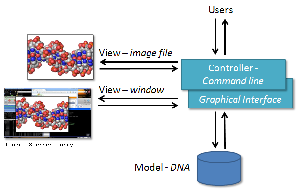

::: questions
- What should we consider when designing software?
:::

::: objectives
- Understand the components of multi-layer software architectures.
:::

**Software architecture** provides an answer to the question
"what components will the software have and how will they cooperate?".
Software engineering borrowed this term, and a few other terms,
from architects (of buildings) as many of the processes and techniques have some similarities.
One of the other important terms we borrowed is 'pattern',
such as in **design patterns** and **architecture patterns**.
This term is often attributed to the book
['A Pattern Language' by Christopher Alexander *et al.*](https://en.wikipedia.org/wiki/A_Pattern_Language)
published in 1977
and refers to a template solution to a problem commonly encountered when building a system.

Design patterns are relatively small-scale templates
which we can use to solve problems which affect a small part of our software.
For example, the **[adapter pattern](https://en.wikipedia.org/wiki/Adapter_pattern)**
(which allows a class that does not have the "right interface" to be reused)
may be useful if part of our software needs to consume data
from a number of different external data sources.
Using this pattern,
we can create a component whose responsibility is
transforming the calls for data to the expected format,
so the rest of our program does not have to worry about it.

Architecture patterns are similar,
but larger scale templates which operate at the level of whole programs,
or collections or programs.
Model-View-Controller (which we chose for our project) is one of the best known architecture
patterns.
Many patterns rely on concepts from [Object Oriented Programming](../learners/object-oriented-programming.md).

There are many online sources of information about design and architecture patterns,
often giving concrete examples of cases where they may be useful.
One particularly good source is [Refactoring Guru](https://refactoring.guru/design-patterns).

There are various software architectures around defining different ways of
dividing the code into smaller modules with well defined roles, for example:

- [Model–View–Controller (MVC) architecture](https://en.wikipedia.org/wiki/Model%E2%80%93view%E2%80%93controller),
  which separates the code into three distinct components - **Model** represents the data and
  contains operations/rules for manipulating and changing it; **View** is responsible for
  displaying data to users; **Controller** accepts input from the View and performs the
  corresponding action on the Model and then updates the View accordingly,
- [Service-oriented architecture (SOA)](https://en.wikipedia.org/wiki/Service-oriented_architecture),
  which separates code into distinct services,
  accessible over a network by consumers (users or other services)
  that communicate with each other by passing data in a well-defined, shared format (protocol),
- [Client-server architecture](https://en.wikipedia.org/wiki/Client%E2%80%93server_model),
  where clients request content or service from a server,
  initiating communication sessions with servers,
  which await incoming requests (e.g. email, network printing, the Internet),
- [Multilayer architecture](https://en.wikipedia.org/wiki/Multitier_architecture),
  is a type of architecture in which presentation,
  application processing
  and data management functions
  are split into distinct layers and may even be physically separated to run on separate machines.

### Multilayer Architecture

One common architectural pattern for larger software projects is **Multilayer Architecture**.
Software designed using this architecture pattern is split into layers,
each of which is responsible for a different part of the process of manipulating data.

Often, the software is split into three layers:

- **Presentation Layer**
  - This layer is responsible for managing the interaction between
    our software and the people using it
  - May include the **View** components if also using the MVC pattern
- **Application Layer / Business Logic Layer**
  - This layer performs most of the data processing required by the presentation layer
  - Likely to include the **Controller** components if also using an MVC pattern
  - May also include the **Model** components
- **Persistence Layer / Data Access Layer**
  - This layer handles data storage and provides data to the rest of the system
  - May include the **Model** components of an MVC pattern
    if they are not in the application layer

Although we have drawn similarities here between the layers of a system and the components of MVC,
they are actually solutions to different scales of problem.
In a small application, a multilayer architecture is unlikely to be necessary,
whereas in a very large application,
the MVC pattern may be used just within the presentation layer,
to handle getting data to and from the people using the software.

### Model-View-Controller (MVC) Architecture

MVC architecture can be applied in scientific applications in the following manner.
Model comprises those parts of the application that deal with
some type of scientific processing or manipulation of the data,
e.g. numerical algorithm, simulation, DNA.
View is a visualisation, or format, of the output,
e.g. graphical plot, diagram, chart, data table, file.
Controller is the part that ties the scientific processing and output parts together,
mediating input and passing it to the model or view,
e.g. command line options, mouse clicks, input files.
For example, the diagram below depicts the use of MVC architecture for the
[DNA Guide Graphical User Interface application](https://www.software.ac.uk/developing-scientific-applications-using-model-view-controller-approach).

{alt='MVC example of a DNA Guide Graphical User Interface application' .image-with-shadow width="400px" }
Image from <https://www.software.ac.uk/developing-scientific-applications-using-model-view-controller-approach

:::::::::::::::::::::::::::::::::::::::  challenge

## Exercise: MVC Application Examples From your Work

Think of some other examples from your work or life
where MVC architecture may be suitable
or have a discussion with your fellow learners.

:::::::::::::::  solution

## Solution

MVC architecture is a popular choice when designing web and mobile applications.
Users interact with a web/mobile application by sending various requests to it.
Forms to collect users inputs/requests
together with the info returned and displayed to the user as a result represent the View.
Requests are processed by the Controller,
which interacts with the Model to retrieve or update the underlying data.
For example, a user may request to view its profile.
The Controller retrieves the account information for the user from the Model
and passes it to the View for rendering.
The user may further interact with the application
by asking it to update its personal information.
Controller verifies the correctness of the information
(e.g. the password satisfies certain criteria,
postal address and phone number are in the correct format, etc.)
and passes it to the Model for permanent storage.
The View is then updated accordingly and the user sees its updated profile details.

Note that not everything fits into the MVC architecture
but it is still good to think about how things could be split into smaller units.
For a few more examples, have a look at this short
[article on MVC from CodeAcademy](https://www.codecademy.com/articles/mvc).

:::::::::::::::::::::::::

::::::::::::::::::::::::::::::::::::::::::::::::::

:::::::::::::::::::::::::::::::::::::::::  callout

## Separation of Concerns

Separation of concerns is important when designing software architectures
in order to reduce the code's complexity.
Note, however, there are limits to everything -
and MVC architecture is no exception.
Controller often transcends into Model and View
and a clear separation is sometimes difficult to maintain.
For example, the Command Line Interface provides both the View
(what user sees and how they interact with the command line)
and the Controller (invoking of a command) aspects of a CLI application.
In Web applications, Controller often manipulates the data (received from the Model)
before displaying it to the user or passing it from the user to the Model.

::::::::::::::::::::::::::::::::::::::::::::::::::

::: keypoints:
- Software architecture provides an answer to the question 'what components
  will the software have and how will they cooperate?'.
:::
